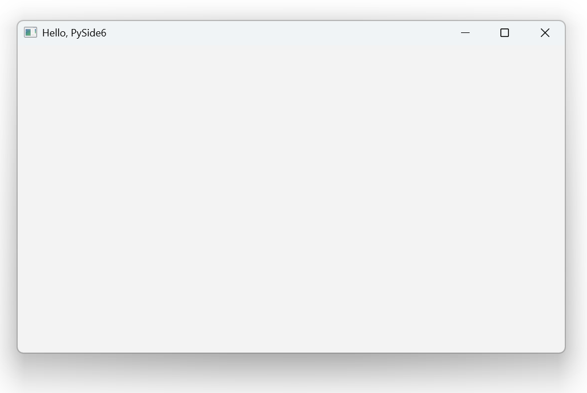

# 在 Windows 下搭建 PySide6 开发环境

## 使用 Github 和 uv 创建一个 Python 项目基础环境

1. 在 GitHub 上创建项目 ```{prj}```
2. 将项目拉取到本地目录 ```{root}```
3. 使用 uv 安装计划使用的 Python 版本
4. 在项目目录下使用 uv 初始化项目

   在命令行中运行以下命令：

    ```ps
    {root}: uv init
    Initialized project `{prj}`
    ```

   这将会创建一个新的虚拟环境，并在当前目录下生成 `pyproject.toml` 配置文件。
5. 使用 uv 测试运行 Python 项目,确定项目创建成功

    在命令行中运行以下命令：

    ```ps
    {project_dir}: uv run main.py
    Using CPython 3.13.3
    Creating virtual environment at: .venv
    Hello from {prj}!
    ```

    这将会运行项目中的 `main.py` 文件，确保项目环境已经正确设置。

6. 与 GitHub 同步代码

## 搭建 Pyside6 开发环境

1. 使用 uv 安装 PySide6

    在命令行中运行以下命令：

    ```ps
    {root}: uv add pyside6
    Resolved 5 packages in 50ms
    Installed 4 packages in 1.53s
    + pyside6==6.9.1
    + pyside6-addons==6.9.1
    + pyside6-essentials==6.9.1
    + shiboken6==6.9.1
    ```

    这将会安装 PySide6 包。

2. 创建 PySide6 代码文件 ```first.py```

    ```python
    import sys
    from PySide6 import QtWidgets

    app = QtWidgets.QApplication(sys.argv)
    widget = QtWidgets.QWidget()
    widget.resize(640, 360)
    widget.setWindowTitle("Hello, PySide6")
    widget.show()
    sys.exit(app.exec())
    ```

3. 运行 PySide6 代码

    在命令行中运行以下命令：

    ```ps
    {root}: uv run src/first.py
    ```

    如果一切正常，你应该会看到一个窗口，标题为 "Hello, PySide6"。

    

## VSCode 配置 Windows 下 PySide6 开发环境

打开 VSCode, 安装以下扩展:

- Python 扩展 <https://marketplace.visualstudio.com/items?itemName=ms-python.python>
- Qt 扩展(Qt for Python) <https://marketplace.visualstudio.com/items?itemName=seanwu.vscode-qt-for-python>
