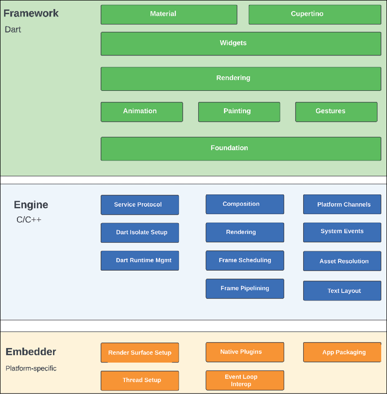

# [CHAPTER 1 Introduction to Flutter](contents.md#ch01a)

## [Introduction](contents.md#sc2_1a)

In this chapter, you  will learn about and install Flutter. You will also learn about the Movie application that you will be creating in this book.

## [Structure](contents.md#sc2_2a)

The chapter covers the following topics:

- Overview of Flutter

- Flutter architecture

- Benefits of Flutter

- Flutter’s language: Dart

- Installing Flutter SDK

- Development application

## [Objectives](contents.md#sc2_3a)

By the end of this chapter, you will have an understanding of what Flutter is and the incredible possibilities it unlocks.

## [Overview of Flutter](contents.md#sc2_4a)

Flutter is a UI toolkit developed by Google.

It has the ability to run on mobile (both Android and iOS), desktop (macOS, Windows, and Linux), and the web using almost the same code (some separate code needs to be written for platform-specific areas like menus).

The Flutter toolkit uses a declarative UI built of Widgets. In fact, Google likes to say that everything is a widget.

## [Flutter architecture](contents.md#sc2_6a)

The Flutter framework is made up of several layers. Each layer can be replaced if needed but does not have any special access to the layer below it. The top-level layer is the Framework. This is written in Dart. The entire Flutter framework looks like the following figure:



Figure 1.1: Flutter architecture

The Framework layer contains many different common widgets as well as the rendering code needed to display those widgets. The Material and Cupertino libraries are for Google and Apple’s UI look and feel. The Rendering, Animation, Painting, and Foundation are lower-level Dart codes that form the essential drawing framework.

The next layer is the Engine and is written in C/C++. This is not a layer you need to use.

The final layer is the Embedder and is different for each platform. One of the nice features of Flutter is that each application is compiled into native code just like any other application on that platform. This means that applications run as fast as native applications (or faster).

For the engine, Flutter was originally built using the Skia graphics drawing system. The Flutter team is moving this system to a newer version called Impeller. It has been written for both iOS and Android and will be coming to other platforms later.

## [Flutter’s language: Dart](contents.md#sc2_8a)

Flutter uses the Dart language which was developed by Google.

## [Installing Flutter SDK](contents.md#sc2_9a)

Go to <https://docs.flutter.dev/install/manual> and follow the instructions.

### [Flutter Doctor](contents.md#sc3_13a)

Flutter doctor is a tool that does a diagnostic on Flutter and will let you know if you need to install any additional tools or fix a problem. From a command line type:

```powershell
flutter doctor
```

You should see something like this (refer to the following figure):

.png)

Figure 1.2: Flutter doctor

for more detail, you can use:

```powershell
flutter doctor -v
```

If there are any errors, follow the directions for fixing them according to the target platform.

The instructions can be found in the Flutter documentation: <https://docs.flutter.dev/install/custom#target-platform>.

## [Development application](contents.md#sc2_14a)

### Visual Studio Code

Visual Studio Code is from Microsoft. This is a free IDE that is very lightweight. It has extensions for Flutter development.

1. Install Visual Studio Code on Windows by the ZIP file: <https://code.visualstudio.com/docs/setup/windows#_use-the-zip-file>.
2. Install the Flutter extension for Visual Studio Code: <https://marketplace.visualstudio.com/items?itemName=Dart-Code.flutter>.

## [Conclusion](contents.md#sc2_15a)

In this chapter, you have learned about Flutter. You have also installed the Flutter SDK with all its needed tools, as well as an IDE.

In the next chapter, you will learn more about the Dart language.

### Join our book’s Discord space

Join the book's Discord Workspace for Latest updates, Offers, Tech happenings around the world, New Release and Sessions with the Authors:

**[https://discord.bpbonline.com](https://discord.bpbonline.com)**


