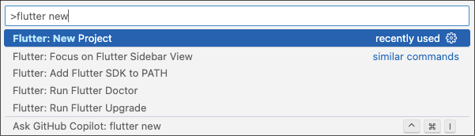
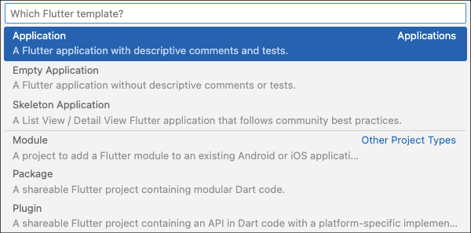
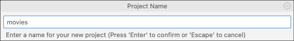
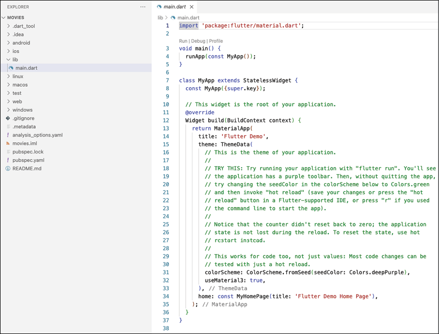
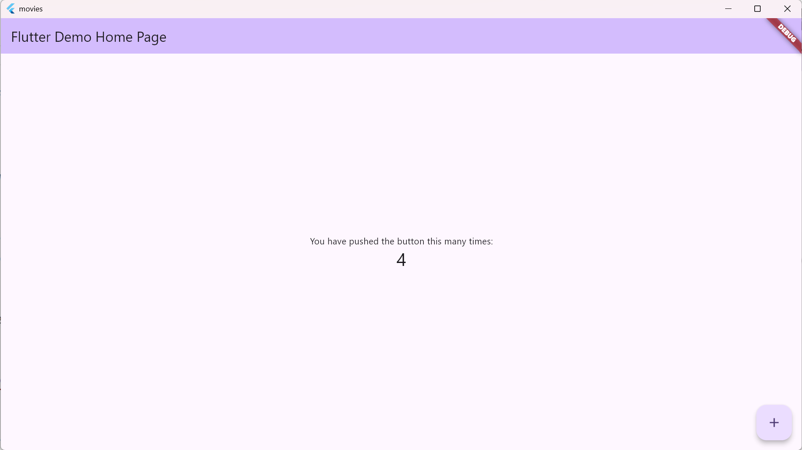
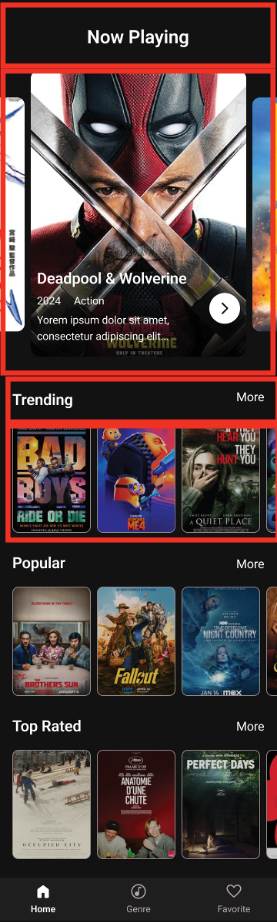
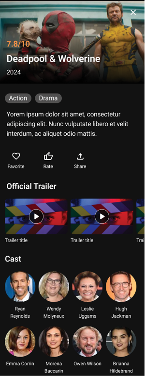
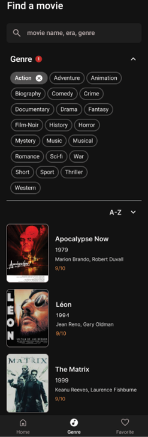
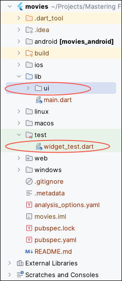
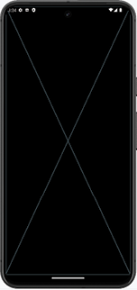

# [CHAPTER 3 Building the Movie App](contents.md#ch03a)

## [Introduction](contents.md#sc2_45a)

In this chapter, you will dive int- Flutter development by creating your first app.

## [Structure](contents.md#sc2_46a)

The chapter covers the following topics:

- Creating the movie app
- Widgets
- Stateless and stateful widgets
- Hot reload and debugging
- Movie app UI
- Movie architecture
- First steps of the movie app

## [Objectives](contents.md#sc2_47a)

By the end of this chapter, you will have a comprehensive understanding of how to create a Flutter app, what widgets are, and how to build and debug your app. You will als- have a good understanding of the movie app and what you will be building.

## [Creating the movie app](contents.md#sc2_48a)

There are several ways to create a Flutter project.

Flutter comes with its own command-line program called flutter. When you installed Flutter, a command-line program was installed in the directory where you installed Flutter. This command-line tool allows you to do many things. You can create, build, and run Flutter projects. There are als- several tools built int- the flutter tool. You als- use this tool to upgrade your version of Flutter. Here are a few popular commands:

- doctor: Check for any errors in the installation of Flutter.
- config: Configure Flutter settings.
- upgrade: Upgrade to the latest version of Flutter.
- build: Build a Flutter app.
- clean: Delete the build and .dart_tool directories.
- run: Run your Flutter app.
- devices: List of connected devices.
- install: Install the Flutter app on a device.
- create: Create a new Flutter project.

to create a new project, use the create command after typing in flutter. An example is as follows:

```PowerShell
flutter create --platforms=macos,windows,ios,android,web --org=com.bpb.movies .
```

There are additional options, such as specifying the language used to build Android or iOS apps, as shown:

```PowerShell
--ios-language= objc, swift
```

```PowerShell
--android-language= java, kotlin
```

You can even specify a template. The default template is app, but you can create all of the types as follows:

```PowerShell
--template=app, module, package, plugin, plugin_ffi, skeleton
```

While creating projects from the command line is straightforward, using an IDE like Visual Studio Code (VS Code) simplifies the process even further. You will see how to create a new project from VS Code.

### [Visual Studio Code](contents.md#sc3_49a)

This section gives a step-by-step explanation of how to create a new project in VS Code.

The steps are as follows:

1. Open up VS Code and then press `F1` or `Ctrl+Shift+P`.

2. You should see a text field. Type in `flutter new`. Select the first item, as shown in the following figure:

    

    Figure 3.1: New project

3. Next, choose the Application template, as shown in the following figure:

    

    Figure 3.2: Application template

4. Enter a Project Name. We will be using the name `movies` for this project. Refer to the following figure:

    

    Figure 3.3: Project name

5. This will create a new project and open the `main.dart` file, which contains the code for a sample counter app. The screen is as follows:

    

    Figure 3.4: VS Code files

This is just a sample app that allows you to increment a counter with a button on the screen.

Press the small run button (shown in Figure 3.5) to launch the app. The output is as follows:


Figure 3.5: Run buttons



Figure 3.6: First app

## [Widgets](contents.md#sc2_51a)

Flutter is a declarative UI that uses widgets. Widgets are UI classes drawn to the screen and are meant to have one or more child widgets. This creates a tree of widgets to form your screen. You usually start with layout-type widgets like Column, Row, Container, or a higher-level widget like `Scaffold`. You then add child widgets until the screen is built out. First, decide how you want your screen to look, and then add widgets from the top down. Usually, you will start with a column and then put rows in the column. The rows can contain text, checkboxes, images, or any other widget. You do not have to follow the same procedure, but it is a good way to start. Besides these basic widgets, there are als- lists, grids, and some fancy widgets. Other developers have built their own widgets that you can use by importing their packages. to see all of Flutter’s widgets, g- to their widget catalog: <https://docs.flutter.dev/ui/widgets>.

## [Stateless and stateful widgets](contents.md#sc2_52a)

In addition to the widgets that are included with Flutter, when you create your app, you need to decide if you want to create either stateless or stateful widgets. Just as the name implies, one widget has a state that can be changed, and one does not. Stateless widgets are immutable. They can only show the information passed to them and cannot change these values. Stateful widgets are useful because they can hold state. For example, when you have a text field, you need to keep track of the text controller, which holds the text the user has entered. This requires your widget to be a stateful widget.

If you look at `main.dart` in your current project, you can see everything you need for a simple project. This project will run on all platforms and will work without any changes. You have the following:

- `main()`: Starting function of any app.
- `runApp()`: Starts Flutter.
- `MyApp`: An example of a stateless widget. You can name your widgets anything you want.
- `MaterialApp`: A starting point that allows you to use widgets with a Material Design.
- `ThemeData`: Set up your color scheme.
- `MyHomePage`: An example of a stateful widget.
- `Scaffold`: Holder for drawers, bottom sheets, and app bars. Scaffold 是构建 Material Design 风格页面的核心组件，它提供了基础的页面结构框架，可以快速集成常见的 UI 元素（如 AppBar、抽屉菜单、悬浮按钮等）
- `App bar`: Top title section.
- `Center`: Center one child widget.
- `Column`: A vertical column of widgets.
- `Row`: A horizontal row of widgets.
- `Text`: Display non-editable text.

As you can see, the `MyHomePage` widget is a stateful widget because it has a `_counter` field that is used for updating. When the button is pushed, this value is incremented, and the widget is rebuilt. `MyApp` is stateless because it does not change.

我的理解是：子组件是 StatefulWidget，父组件可以是 StatelessWidget.

## [Hot reload and debugging](contents.md#sc2_53a)

One of the best features of Flutter is its ability to perform a hot reload or hot restart.This saves a lot of time.

The difference between the tw- is that hot reload keeps the screen where it is and just reloads any code that has changed, whereas hot restart restarts the app from the very beginning. This is useful if you have made major changes because, in that case, a hot reload will not work.

## [Movie app UI](contents.md#sc2_54a)

In this section, you will be developing a movie app. This app will use the popular The Movie Database (TMDB) API to get trending and popular movies. You will be able to see the cast, description, and trailers from the movie. In addition, beautiful movie poster images will be shown. The following are some of the Figma (a popular design app) designs, along with the steps:

1. The first section is the home screen, as shown in Figure 3.20. This shows a carousel of trending movies and has a list of trending, popular, and top-rated movies. The user can click on a movie, and they are taken to the details screen.

    

    Figure 3.20: Home screen

2. The details screen is next, as shown in Figure 3.21. This shows an image of the film, an overview, some buttons to favorite, rate, and share, a list of trailers, and a list of the cast.

    

    Figure 3.21: Details screen

3. The next section is the Genre screen, as shown in Figure 3.22. This screen allows you to search by name and genre.

    

    Figure 3.22: Genre screen

## [Movie architecture](contents.md#sc2_55a)

There are a lot of architectures out there, but the important thing to keep in mind when selecting an architecture is that you should create code that is simple to use, test, and update. Use libraries that you like and are easy to use. A typical architectural pattern is clean architecture.

### [Clean architecture](contents.md#sc3_56a)

Clean architecture is a software design philosophy that promotes the separation of concerns and prioritizes the independence of a system's core business logic from its external details (like frameworks, databases, and UI). It is a way of structuring your codebase to make it more testable, maintainable, and flexible over time. Try to make your classes as independent as possible. The following are some areas that clean architecture covers:

- Layering: Layer components into distinct layers. Common layers are:

    - Domain/Entities for core business logic and models
    - Use cases for application logic
    - Interface adapters: Controllers, gateways and presenters
    - Frameworks and drivers: UI, Database, devices

- Dependency rule: This rule states that higher-level components (domain/logic) should not depend on lower-level components like UI, frameworks, or databases.

- Abstraction: Create interfaces to be able to swap out components without affecting the whole application. This is very useful in testing.

- Testability: Writing single-responsibility components makes it easier to test.

### [SOLID](contents.md#sc3_57a)

SOLID stands for: (S) Single-Responsibility Principle, (O) Open-Closed Principle, (L) Liskov Substitution Principle, (I) Interface Segregation Principle, and (D) Dependency Inversion Principle. The explanation for each is:

- Single-Responsibility Principle: Each component should have a single, well-defined responsibility.

- Open-closed Principle: Software entities (classes, modules, functions, etc.) should be open for extension, but closed for modification.

    - Open for extension: This means that you should be able to add new features or behaviors to a software entity without changing its existing code. This is often achieved through inheritance, interfaces, or other extensibility mechanisms.
    - Closed for modification: The entity's core functionality should remain stable and unchanged. Modifying existing code can introduce bugs and break existing dependencies, so it should be avoided as much as possible.

- Liskov Substitution Principle: It states that objects of a superclass should be replaceable with objects of its subclasses without affecting the correctness of the program. In other words, if a program uses a superclass, it should be able to use objects of any subclasses without any unexpected behavior.

- Interface Segregation(分离) Principle: No client should be forced to depend on methods they do not use. Instead of having large, monolithic（庞大的） interfaces, create smaller, more focused interfaces that are specific to the classes needs.

- Dependency Inversion（依赖倒置） Principle:

    - High-level components (like business logic or policies) should not be directly tied to the specific implementation details of lower-level components (like utility functions or database access).

    - Both high-level and low-level components should depend on abstractions, such as interfaces or abstract classes. This is a bit complicated, but you should know the terminology(术语).

### [Folder structure](contents.md#sc3_58a)

In this section, we will use different folders to represent different areas of the app. The folder structure is as follows:

```powershell
data/
│── database/
│── models/
│── models/
│── repository/
│── sources/
network/
router/
ui/
│── screens/
│── themes/
│── widgets/
utils/
```

As you move through the chapters, you will create these sections. For example, when you are in the networking chapter, you will create the files to access the network. You will also need to create models for the networking portion.

## [First steps of the Movie app](contents.md#sc2_59a)

Now that you know more about architecture, it is time to clean up the app. Since you want a movie app and not the default counter app, you need to delete the code generated when you created the project. Open `main.dart` and delete the `MyApp` and `MyHomePage` widgets. Only the main method should be present. You will see an error in the main because `MyApp` does not exist. Add the following code:

```dart
class MainApp extends StatefulWidget {
  const MainApp({super.key});

  @override
  State<MainApp> createState() => _MainAppState();
}

class _MainAppState extends State<MainApp> {
  @override
  Widget build(BuildContext context) {
    return MaterialApp(
      title: 'Movies',
      debugShowCheckedModeBanner: false,
      home: MainScreen(),
    );
  }
}
```

Now, change `MyApp` to `MainApp`. You will notice that the main screen shows an error as you have not yet created the `MainScreen` widget. This code creates a stateful widget, starts with a `MaterialApp` widget, has a title of `Movies`, does not show the debug banner, and has a child of `MainScreen`. In the left-hand project window, create a new `ui` folder under `lib`, as shown in the following figure:



Figure 3.23: Project list

In the `ui` folder, create a new file called `main_screen.dart`. Delete the `widget_test.dart` file. Then add the following code to `main_screen.dart`:

```dart
import 'package:flutter/material.dart';

class MainScreen extends StatefulWidget {
  const MainScreen({super.key});

  @override
  State<MainScreen> createState() => _MainScreenState();
}

class _MainScreenState extends State<MainScreen> {
  @override
  Widget build(BuildContext context) {
    return const Placeholder();
  }
}
```

This code creates a stateful widget and returns a `Placeholder` widget. As its name implies, it is an excellent widget for filling the screen with a widget showing something that should go in that space. Return to `main.dart` and add the import for the main screen. Run your app, and you should see the following screen:



Figure 3.24: Main screen

In the next chapter, you will learn more about different widgets and start implementing some screens.

## [Conclusion](contents.md#sc2_60a)

In this chapter, you created your first app and are on your way to creating an excellent movie app. You also gained a solid understanding of widgets and the differences between stateless and stateful widgets. You learned about the advantages of hot reloading and learned a lot about different architectures.

In the next chapter, you will learn the basic widgets needed to build an app. You will learn about all the files created during the project creation. Then, you will learn in detail some of the important building blocks of a Flutter app. Finally, you will build the movie home screen.
