# [CHAPTER 4 Basic Widgets](contents.md#ch04a)

## [Structure](contents.md#sc2_62a)

The chapter covers the following topics:

- Flutter project structure
- Scaffold, AppBar, and NavigationBar
- Containers, rows, and columns
- Text, images, and icons
- Buttons and input fields
- Build the movie home screen

## [Flutter project structure](contents.md#sc2_64a)

In the previous chapter, you created your first app. Now it is time to learn what all the files and folders mean. One of the most important files is `pubspec.yaml`.

### [pubspec.yaml](contents.md#sc3_65a)

The `pubspec.yaml` file defines your project and all the packages and plugins you will need for your app.

Open up `pubspec.yaml`. YAML Ain't Markup Language (YAML) is an easy-to-read file that has a field, a colon, and then a value. One of the key aspects of YAML files is the indentation. You start at the left side, add a field name, and child elements are indented in two spaces. Ensure that it is **spaces and not tabs**. Not three spaces, but two. If you get it wrong, the build will not work.

#### [Pubspec fields](contents.md#sc4_66a)

The elements under the field are as follows:

- name: At the top is the name field. Here you can put the name of the project.
- description: This describes your app. Go ahead and change this to describe your app. I put in Select your favorite movies and watch them later, but you can use anything.
- publish_to: URL to publish. Currently, it is set to none. If you want to publish your project to pub.dev, you will need to remove this line.
- version: This is just the current version of your app. Update it every time you send out a new version.
- environment: Define the Dart SDK and Flutter version. This is very important. Normally you will not change this unless a major Flutter version comes out and you support it. Right now, it is set to: '>=3.3.4 <4.0.0'. This means that it supports Flutter versions 3.3.4 up to (but not including) 4.0.0. So, every time you run flutter upgrade, Flutter’s version increases and as long as the version number is between these two numbers, you can just rebuild and run your app. Note that this YAML file supports plain Dart projects as well. To tell the system that you are using Flutter, you need to add it as a dependency.
- dependencies: Define the packages and plugins to use in the app.

    The following:

    ```yaml
    dependencies:
        flutter:
            sdk: flutter
    ```

    tells the build system to include the Flutter SDK. Next are the packages and plugins that your app uses. Currently, only the `cupertino_icons` package is provided. This is a set of icons for use on the iOS platform. Try adding the material icons pages by adding the following below `cupertino_icons`:

    ```yaml
    dependencies:
        # ...
        material_symbols_icons: ^4.2719.3
    ```

    Make sure it is indented two spaces. Next, run `flutter pub get` in project folder. Now you can use the Material Design icons.

- dev_dependencies: These are used for builders and other libraries that are needed during the development phase of your project. For writing unit tests, use the following:

    ```yaml
    dev_dependencies:
        flutter_test:
            sdk: flutter
    ```

    For integration tests, use the following:

    ```yaml
    dev_dependencies:
        integration_test:
            sdk: flutter
    ```

- Flutter-specific area: You can set the flag to use Material Design, as follows:

    ```yaml
    flutter:
        uses-material-design: true
    ```

    After that, you would have an assets section where you would define the assets for your app.

    ```yaml
    flutter:
        assets:
            # ...
    ```

### [Lints](contents.md#sc3_67a)

Flutter uses the `flutter_lints` package to check for valid code. To add the `flutter_lint` package, open up `pubspec.yaml` and add the following under the `dev_dependencies` section below:

```yaml
dev_dependencies:
    flutter_test:
        sdk: flutter
    flutter_lints: ^2.0.0
```

Run `flutter pub get` in the terminal under project folder. Next, open up `analysis_options.yaml`. This file is where you put all of your lint settings. We have one lint we want to add, and that is to require the full package name for imports. There are several settings for this. Under the rules section add the following (make sure it is indented two spaces from the rules section):

```yaml
linter:
    rules:
        avoid_relative_lib_imports: true
        always_use_package_imports: true
        prefer_relative_imports: false
```
Now, whenever you add an import, lint will suggest adding the full package name.

### [lib folder](contents.md#sc3_68a)

This is where your dart files reside.

### [Folders](contents.md#sc3_69a)

There are several other folders at the top level. Most are platform-specific.

For example, the `android` folder contains all the files needed to run on an Android device. You will normally not need to change these files except to add things like Android icons.
`iOS` is for the iPhone, `macOS` is for the Mac, `windows` for Windows, etcetera.

For unit tests, use the `test` folder, and for integration tests, use `integration_test`.

There is no `assets` folder, but if you want to add files for your app, you must create this folder and add files you can load into your app in that directory.

## [Scaffold, AppBar, and NavigationBar](contents.md#sc2_70a)

### [Widgets](contents.md#sc4_71a)

The Flutter team likes to say that **everything is a widget**. That includes UI elements that do not draw anything independently but just lay out their child widgets. While all these widgets are just widgets, they have different purposes.

### [Scaffold](contents.md#sc4_72a)

Starting at the very top is the `Scaffold`. A Scaffold is a Material Design widget that lays out a full screen. It has the following parameters:

- `appBar`: A toolbar for a title, actions, and a navigation menu.
- `body`: This widget will be displayed in the middle, taking up the rest of the screen.
- `floatingActionButton`: A small button that floats at the bottom right of the screen.
- `bottomNavigationBar`: A bar at the bottom of the screen for navigating between screens.
- `drawer`: A side menu tied to the AppBar. A menu that slides in from the left or right.

All these items are optional except for the `body`, which is your content. A `Scaffold` is also needed to show `snackbars`, which are temporary floating message windows that display errors or messages.

### [AppBar](contents.md#sc3_73a)

The AppBar is useful for showing the page title, having a menu for options, and a back button.

> Note that the AppBar is useful for mobile devices and not as useful on the desktop or web.

The `FloatingActionButton` is mostly seen on Android platforms but can also be used on iOS. It is useful for creating new items but can be used for almost anything. Some nice packages do things like explode the button into more items.

### [BottomNavigationBar](contents.md#sc3_74a)

The BottomNavigationBar is very useful when your app has three or four screens. The navigation bar allows the user to switch between the screens by clicking a button at the bottom. You will be using this for the `movie` app. Note that this does not mean you cannot have more than four screens. You can easily go to other screens from those three or four screens, or you can have a final screen of options that shows a list of other screens.

### [Drawer](contents.md#sc3_75a)

Some apps use a `drawer` to display a menu of other options. Although its design has fallen out of favor among designers, some apps still use it.

### [Snackbar](contents.md#sc3_76a)

A `snackbar` is a small floating window that shows a message for a short time, usually for errors. You must have a `Scaffold` as a parent to show a snackbar.

## [Containers, rows, and columns](contents.md#sc2_77a)

Some layout widgets you can use are `containers`, `rows`, and `columns`. A container holds one child widget, which you can decorate with a background color, set a width and height, and other options.

### [Container](contents.md#sc3_78a)

A container allows you to surround your widget with the following:

- `color`: Provide a background color.
- `padding`: Pad the interior before showing the widget.
- `alignment`: Align widgets to different sides of the container.
- `decoration`: Add all kinds of decorations, like rounded borders.
- `width` and `height`: Set the size of the widget.
- `transform`: Transform the container with a matrix. This is a powerful way to rotate, translate, or scale the container.

The following is an example of a small circle with text inside of the middle:

```dart
Container(
  width: 16,
  height: 16,
  decoration: const BoxDecoration(
    shape: BoxShape.circle,
    color: Colors.red,
  ),
  child: Center(
    child: Text('1'),
  ),
)
```

As you can see, the Container is very powerful.

### [Column](contents.md#sc3_79a)

You will probably be using the Column widget frequently as it allows you to layout a list of items in a vertical format.

Looking at the design image of the home page of the movie app, you would start with a Column and then add different widgets to build the screen. The following is an example Column:

```dart
Column(
  mainAxisAlignment: MainAxisAlignment.start,
  crossAxisAlignment: CrossAxisAlignment.start,
  mainAxisSize: MainAxisSize.min,
  children: [
    Text('Hello')
  ]
)
```

A Column has four main components:

- `mainAxisAlignment`: How the widgets are aligned going down.
- `crossAxisAlignment`: How the widgets are aligned going across.
- `mainAxisSize`: Take up a minimum or maximum height. Fill the screen or not.
- `children`: Add a list of child widgets.

There are also a few lesser-used parameters like:

- `textDirection`: Direction of the text. This will be left to right or right to left.
- `verticalDirection`: Defaults to down.
- `textBaseline`: Align text based on alphabetic characters or ideographic characters.
- `clipBehavior`: Allows for clipping if content overflows.

It is important to set the `mainAxisSize`, as a `Column` defaults to max. The following are the `mainAxisAlignment` values:

- `start`: Left aligned.
- `end`: Right aligned.
- `center`: Center widgets.
- `spaceBetween`: Evenly add free space between the widgets. 头尾没有空隙
- `spaceAround`: Place the free space evenly between the children as well as half of that space before and after the first and last child. 首尾子控件间距为中间子控件间距的一半
- `spaceEvenly`: Place the free space evenly between the children as well as before and after the first and last child.

The crossAxisAlignment is similar but different. It has the following:

- `start`: Left aligned.
- `end`: Right aligned.
- `center`: Center widgets.
- `stretch`: Require widgets to fill the cross axis.
- `baseline`: Align along the baseline of widgets. Usually used with text.

### [Rows](contents.md#sc3_80a)

Rows lay their children horizontally. This is ideal for widgets that go across the screen. Rows have the same parameters as a Column but have a horizontal direction. The following is an example Row:

```dart
Row(
  mainAxisSize: MainAxisSize.max,
  children: [
    Text(text),
    const Spacer(),
    TextButton(
      onPressed: () {},
      child: Text(
        'More',
      ),
    ),
  ],
);
```

Here we have a Text widget, a Spacer (to fill up extra space and push the button to the right), and a TextButton. This makes up a row that fills up the width of the screen.

## [Text, images, and icons](contents.md#sc2_81a)

Text, images, and icons are a few of the most used widgets.

### [Text](contents.md#sc3_82a)

Text is for static text that is shown on the screen. The Text widget has many parameters:

- `data`: String value.
- `style`: TextStyle information on color, font, and size.
- `strutStyle`: Sets the minimum line height (not used much).
- `textAlign`: How the text is aligned horizontally.
- `textDirection`: Left to right (ltr), or right to left (rtl).
- `locale`: Set the user's language and country. Should be rarely used as there is a current global Locale.
- `softWrap`: If true, the text should break when needed in a space.
- `overflow`: If the text overflows its drawing area, what should happen? This will depend on the following command:
    - `clip`: Just cut off the text
    - `fade`: Fade the overflowing text to transparent
    - `ellipsis`(省略号): Use an ellipsis to indicate that the text has overflowed
    - `visible`: Render text outside of the box
- `textScaler`: How text should be scaled for better readability (not used much).
- `maxLines`: Useful for specifying whether the text should be a specific number of lines or if set to null, as many lines as needed.
- `semanticsLabel`: mostly used for accessibility purposes, but some testing systems use semantics to find text fields.
- `textWidthBasis`: A way of measuring the width of one or more lines.
- `textHeightBehavior`: How to apply a style’s height (not used much).
- `selectionColor`: Color of text when selected.

There are many fields, but you will probably only use the actual text and a style. There are times when `maxLines` come in handy, but in general, this is a pretty easy widget to use.

The following is a simple example:

```dart
Text('My Favorites', style: TextStyle(fontSize: 24, fontWeight: FontWeight.w600, color: Colors.white))
Text('My Favorites', style: TextStyle(
  fontSize: 24,
  fontWeight: FontWeight.w600,
  color: Colors.white,
))
```

### [Images](contents.md#sc3_83a)

Flutter uses the `Image` widget to display images. This widget can handle images from several sources:

- Local assets directory
- Internet
- File
- Memory
- `ImageProvider`: Class used to return an image

There are several parameters for creating an image. The most important ones are as follows:

- `width` and `height`: Define the size of the image
- `color`: color to be blended with each pixel
- `opacity`: Animation for handling opacity
- `fit`: Very important for sizing. Uses the `BoxFit` enum with (<https://api.flutter.dev/flutter/painting/BoxFit.html>):
    - `fill`: Fills the target but distorts(扭曲，变形) the aspect ratio
    - `contain`: As large as possible inside of the target
    - `cover`: As small as possible while covering the target
    - `fitWidth`: Full width (height is adjusted)
    - `fitHeight`: Full height (width is adjusted)
    - `none`: Center and not resized
    - `scaleDown`: Center and scale down if needed

You can use static constructors for the different types like: `Image.file`, `Image.network`, and `Image.asset`. The following is a simple asset image:

```dart
Image.asset('assets/cat.png')

For network images, you might have something as follows:

Image.network(
  'url',
  width: 120,
  height: 98,
  fit: BoxFit.fill,
)
```

### [Icons](contents.md#sc3_84a)

Icons are a way to show standard images without having to create them yourselves. There are the `cupertino_icons` or the material design icons. Inside the `material_symbols_icons` package is a file named `symbols.dart`. This has all the icons available. If you go to <https://fonts.google.com/icons>, you will see a page as follows:

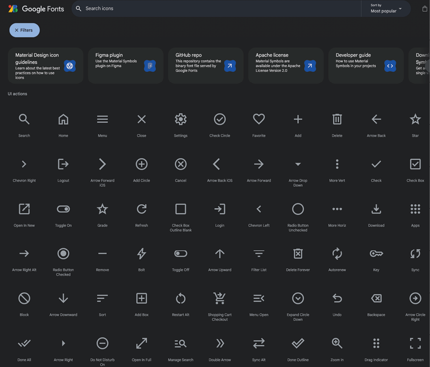

Figure 4.1: Material icons

Many common icons are needed for an app. `Close`, `Arrow Back` button icons, and more. On this page, you can easily search for an icon that will meet your needs. The following is an example of a search icon (the first icon in the list above):

```dart
const Icon(Icons.search, color: Colors.white,)
```

Many times, you will use these icons inside of an `IconButton` class. This provides a click listener for the icon. Also, notice the `const` before the `Icon`. Flutter lints will remind you to use `const` before any widget that does not use any dynamic content.

## [Buttons and more](contents.md#sc2_85a)

### [Buttons](contents.md#sc3_86a)

Buttons allow the user to select and perform an action. There are many types of buttons:

- `IconButton`: For showing an icon
- `TextButton`: A button with text, no decoration
- `ElevatedButton`: Adds dimension to a button
- `FilledButton`: Fill a button with a color
- `OutlinedButton`: Rounded corner outline
- `FloatingActionButton`: Floating button.
- `SegmentedButton`: Checkable sections

These are some of the more common buttons. There is now an `ExtendedFloatingActionButton` that allows you to have text along with the icon.

### [Selection](contents.md#sc3_87a)

In addition to buttons, there are other widgets that allow you to select. The most common is the `Checkbox`. **Note that this is just the box, not the text. Usually, you will have these two widgets together**.

### [Chips](contents.md#sc3_88a)

Chips are a newer widget and there are several different types:

- `InputChip`: For attribute information. Contains an icon, text, and close button
- `ChoiceChip`: Are selectable and have a checkmark when selected
- `FilterChip`: Represent filters have an icon and text
- `ActionChip`: Allow the user to start an action by clicking on the chip

You will be using the `FilterChip` class to select genres when searching for movies.

### [DatePicker](contents.md#sc3_89a)

This widget allows you to create a popup window for selecting a date. A sample popup is as follows:

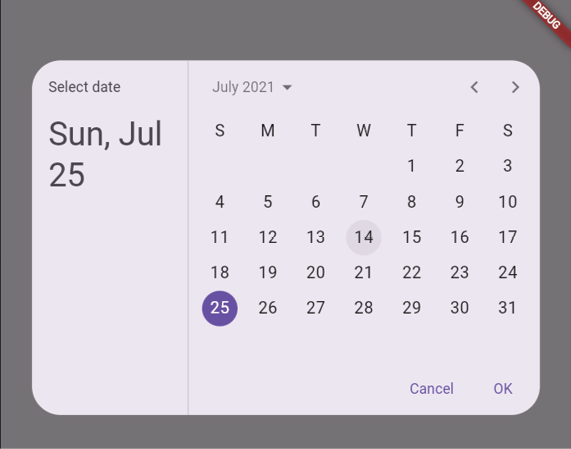

Figure 4.2: DatePicker

An example is as follows:

```dart
DatePickerDialog(
  restorationId: 'date_picker_dialog',
  initialEntryMode: DatePickerEntryMode.calendarOnly,
  initialDate: DateTime.fromMillisecondsSinceEpoch(arguments! as int),
  firstDate: DateTime(2021),
  lastDate: DateTime(2022),
);
```

### [PopupMenuButton](contents.md#sc3_90a)

A menu that is usually tied to a button and shown when the user selects it. An example is as follows:

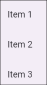

Figure 4.3: PopupMenuButton

The following is an example:

```dart
PopupMenuButton<String>(
  initialValue: 'Item 1',
  onSelected: (String item) {
    setState(() {
      selectedItem = item;
    });
  },
  itemBuilder: (BuildContext context) => <PopupMenuEntry<String>>[
    const PopupMenuItem<String>(
      value: 'Item 1',
      child: Text('Item 1'),
    ),
    const PopupMenuItem<String>(
      value: 'Item 2',
      child: Text('Item 2'),
    ),
    const PopupMenuItem<String>(
      value: 'Item 3',
      child: Text('Item 3'),
    ),
  ],
)
```

### [Radio button](contents.md#sc3_91a)

Another common widget is the radio button. It will look like something as follows:

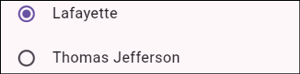

Figure 4.4: Radio buttons

### [Slider](contents.md#sc3_92a)

This widget is less common but useful for allowing the user to visually pick values. It has minimum and maximum values. It will look as follows:

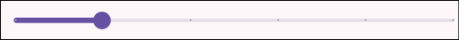

Figure 4.5: Slider

### [Switch](contents.md#sc3_93a)

A visual way to turn something on or off. It has two states, on and off, and will look like this:

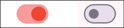

Figure 4.6: Switch

### [TimePicker](contents.md#sc3_94a)

Like the DatePicker, the TimePicker allows the user to choose a specific time, as shown in the following figure:

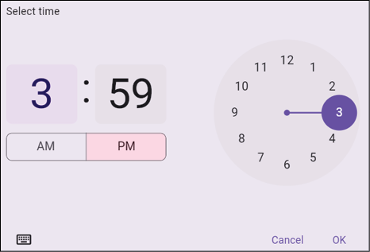

Figure 4.7: TimePicker

To allow the user to enter text, you can use the `TextField` widget. A `TextField` requires a `TextEditingController`, which means it needs to be inside of a `StatefulWidget`. A `TextEditingController` holds the value of the text the user entered. To update the text in the field, you need to update the controller's text value. If you do not supply a controller, one will be created for you. The easiest way to create and destroy a controller is in the initState and destroy methods of a `State` class. The code is as follows:

```dart
class LoginDialog extends StatefulWidget {
  const LoginDialog({super.key});

  @override
  State<LoginDialog> createState() => _LoginDialogState();
}

class _LoginDialogState extends State<LoginDialog> {
  late TextEditingController emailTextController;

  @override
  void initState() {
    super.initState();
    emailTextController = TextEditingController(text: '');
  }

  @override
  void dispose() {
    emailTextController.dispose();
    super.dispose();
  }
}
```
Then, to use a `TextField`, you would do something as follows:

```dart
TextField(
  keyboardType: TextInputType.emailAddress,
  onSubmitted: (value) {},
  controller: emailTextController,
)
```

There are several options for `TextFields`, as follows:

- `controller`: Holds the text value.
- `focusNode`: Used to focus or unfocused where the user is adding text.
- `undoController`: Keeps track of the changes. Allows listening to changes and undoing/redoing those changes.
- `decoration—inputDecoration`: Lots of options for changing the border, labels, icons, styles etcetera.
- `keyboardType`: Useful for email, number, dates, password, and phone.
- `textCapitalization`: Can automatically capitalize words, sentences, or characters.
- `style`: Input text style.
- `textAlign`: Align text to different sides of the container.
- `maxLines`, `minLines`: Min/max lines.
- `maxLength`: Maximum number of characters.
- `onChanged`: Listener for every time a user updates the text.
- `onSubmitted`: Listener for the final entry.

There are many more fields that can be used, but these are the main ones that you will generally use.

## [Build movie app screens](contents.md#sc2_96a)

In the previous chapter, you saw a design for the home screen. The following is that figure with sections drawn in red:

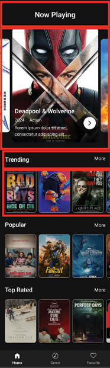

Figure 4.8: Home screen

If you look at the overall design, you can see that there is a column of rows. The column goes down while the rows go across. Inside your lib folder, create two new folders. Inside the `ui` folder, create `screens`, and then inside of that folder, create a `home`. Next, create the `home_screen`.dart file inside of that folder. Next, add the following:

```dart
import 'package:flutter/material.dart';

class HomeScreen extends StatefulWidget {
  const HomeScreen({super.key});

  @override
  State<HomeScreen> createState() => _HomeScreenState();
}

class _HomeScreenState extends State<HomeScreen> {
  @override
  Widget build(BuildContext context) {
    return const Placeholder();
  }
}
```

This adds a screen with another `Placeholder`. Return to `main_screen.dart` and change `Placeholder()` with `HomeScreen()`. Import the home screen, then hot reload the app, and you should see the same thing as before. Next, add the `Now Playing` headline. Inside of `HomeScreen`, replace `Placeholder()` with the following:

```dart
return Scaffold(
  body: Column(
    children: [
      Text('Now Playing'),
    ],
  ),
);
```

Press hot reload. You will see:

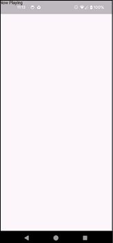

Figure 4.9: Title

As you can see, the title is in the status area. By default, Flutter draws to the whole screen. To avoid this, you must ensure you draw in a safe area. In VS Code, right click the widget `Scaffold`, choose the `refactor` and then `Wrap with widget ...`, then type `SafeArea` to replace `widget`. This will bring up a menu, as shown in the following figure:

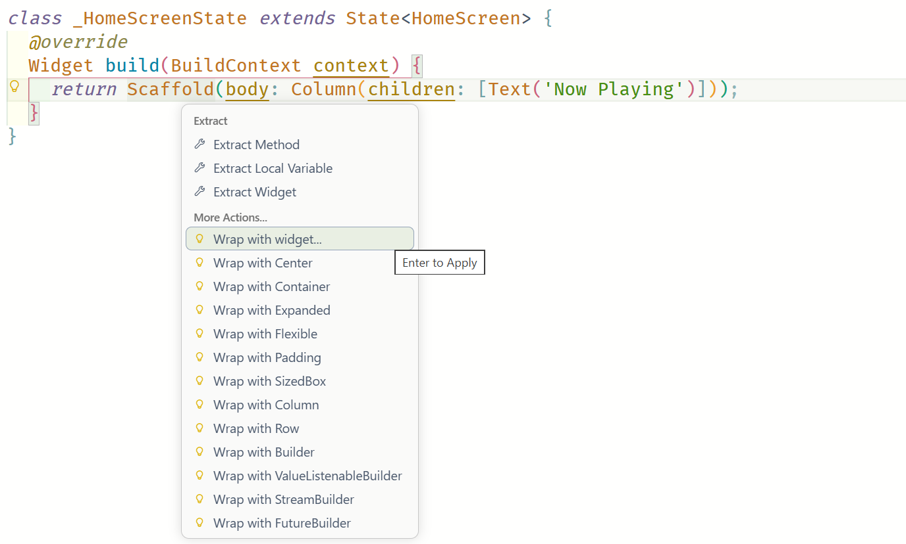

Figure 4.10: Wrap menu

You should see the following:

```dart
return SafeArea(
  child: Scaffold(
    body: Column(
      children: [
        Text('Now Playing'),
      ],
    ),
  ),
);
```

Hot reload. Now it looks as follows:

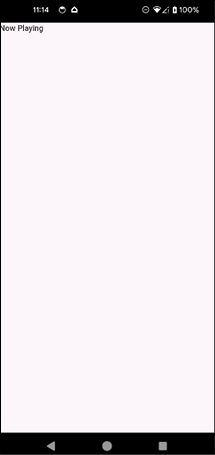

Figure 4.11: SafeArea

To make the text bigger, you need to change the text style. We also want to center it. How would you do that? One very convenient widget is the Align widget. Right click `Text` -> `refactor` -> `Wrap with widget ...`, type `Align` and add `alignment` property as the following:

```dart
const Align(
  alignment: Alignment.center,
  child: Text('Now Playing'),
)
```

Hot reload, and you should see it in the center. It looks too close to the top. Maybe add some padding?

Right click `Align` -> `refactor` -> `Wrap with widget ...`, type `Padding` (or choose `Wrap with Padding` directly). It will default to 8 pixel margins. We want to have some vertical spacing. Specifically, 16 pixels on the top and 24 at the bottom. Change the padding to the following:

```dart
const EdgeInsets.fromLTRB(0, 16.0, 0, 24)
```

The left, top, right, bottom (LTRB) is the order that the values are in. Hot reload, and it should look better.

Now for the style. The screenshot is from the Figma app, which is a design tool that designers use. When we click on the Now Playing title, we see that it is Roboto semibold 24. We will cover fonts in a different chapter, but for now, we want the font to be bold and 24 pixels tall. After the Now Playing text, add the following:

```dart
child: Text(
    'Now Playing',
    style: TextStyle(fontSize: 24, fontWeight: FontWeight.w600),
),
```

The weights for fonts range from 100 to 900. The higher the number, the bolder the text. Hot reload. The screen will be as follows:

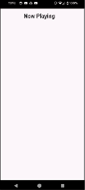

Figure 4.12: Centered title

You have a title, but if you compare it to the design, the background is black, and the text is white. To get a background color, you can use a Container. Surround the column with a Container and set the color to 0xFF111111 like this:

```dart hl_lines="2"
child: Container(
  color: Color(0xFF111111),
  //...
)
```

Now, the title is not visible. Change the color of the text style as follows:

```dart hl_lines="5"
child: Text(
  // ... other properties
  style: TextStyle(
    // ... other properties
    color: Colors.white,
  ),
),
```

Hot reload. You should see the following:

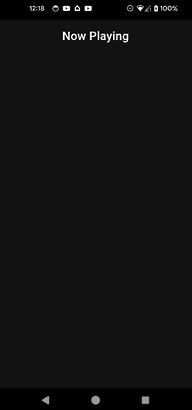

Figure 4.13: Colors

Next, you will add some libraries to help with the carousel at the top. Open up `pubspec.yaml`, and after `material_symbols_icons` add:

```yaml
card_swiper: ^3.0.0
cached_network_image: ^3.3.1
```

The first package adds a carousel, and the second is for caching network images. Run `flutter pub get` in the terminal. Next, in the `home` folder, create a new file named `home_screen_image.dart`.

Add the following:

```dart
import 'package:cached_network_image/cached_network_image.dart';
import 'package:card_swiper/card_swiper.dart';
import 'package:flutter/material.dart';

const delayTime = 1000 * 10;
const animationTime = 1000;

const images = [
  'http://image.tmdb.org/t/p/w780/z1p34vh7dEOnLDmyCrlUVLuoDzd.jpg',
  'http://image.tmdb.org/t/p/w780/gKkl37BQuKTanygYQG1pyYgLVgf.jpg',
  'http://image.tmdb.org/t/p/w780/4xJd3uwtL1vCuZgEfEc8JXI9Uyx.jpg',
  'http://image.tmdb.org/t/p/w780/uuA01PTtPombRPvL9dvsBqOBJWm.jpg',
  'http://image.tmdb.org/t/p/w780/H6vke7zGiuLsz4v4RPeReb9rsv.jpg',
  'http://image.tmdb.org/t/p/w780/e1J2oNzSBdou01sUvriVuoYp0pJ.jpg',
  'http://image.tmdb.org/t/p/w780/hu40Uxp9WtpL34jv3zyWLb5zEVY.jpg',
  'http://image.tmdb.org/t/p/w780/pKaA8VvfkNfEMUPMiiuL5qSPQYy.jpg',
  'http://image.tmdb.org/t/p/w780/zK2sFxZcelHJRPVr242rxy5VK4T.jpg',
  'http://image.tmdb.org/t/p/w780/7qxG0zyt29BI0IzFDfsps62kbQi.jpg',
  'http://image.tmdb.org/t/p/w780/8Gxv8gSFCU0XGDykEGv7zR1n2ua.jpg',
  'http://image.tmdb.org/t/p/w780/zDi2U7WYkdIoGYHcYbM9X5yReVD.jpg',
  'http://image.tmdb.org/t/p/w780/cxevDYdeFkiixRShbObdwAHBZry.jpg',
  'http://image.tmdb.org/t/p/w780/uXUs1fwSuE06LgYETw2mi4JxQvc.jpg',
  'http://image.tmdb.org/t/p/w780/fdZpvODTX5wwkD0ikZNaClE4AoW.jpg',
  'http://image.tmdb.org/t/p/w780/d5NXSklXo0qyIYkgV94XAgMIckC.jpg',
  'http://image.tmdb.org/t/p/w780/sh7Rg8Er3tFcN9BpKIPOMvALgZd.jpg',
  'http://image.tmdb.org/t/p/w780/sHJ2OIgpcpSmhqXkuSWxZ3nwg1S.jpg',
  'http://image.tmdb.org/t/p/w780/upKD8UbH8vQ798aMWgwMxV8t4yk.jpg',
  'http://image.tmdb.org/t/p/w780/vfrQk5IPloGg1v9Rzbh2Eg3VGyM.jpg',
];
```

This sets some constants for the swiper animation and an array of images. Note that we are hard-coding the images that we will be using later in the book. When we get to the networking section, you will get these images directly from the network.

Next, add the widget:

```dart
class HomeScreenImage extends StatelessWidget {
  const HomeScreenImage({super.key});
  
  @override
  Widget build(BuildContext context) {
    // 1
    final screenWidth = MediaQuery.of(context).size.width - 32;
    // 2
    return SizedBox(
      height: 374,
      // 3
      child: Swiper(
        autoplayDelay: delayTime,
        duration: animationTime,
        itemWidth: screenWidth,
        autoplay: true,
        // 4
        itemCount: images.length,
        itemBuilder: (BuildContext context, int index) {
          // 5
          return CachedNetworkImage(
            imageUrl: images[index],
            alignment: Alignment.topCenter,
            fit: BoxFit.fitHeight,
            height: 374,
            width: screenWidth,
          );
        },
      ),
    );
  }
}
```

This code will show a carousel of images. The steps are as follows:

1. Get the width of the screen.
2. Create a fixed height box of 374 pixels.
3. Use the Swiper widget for the carousel and set animation parameters.
4. Set the itemCount to the length of the array.
5. Use the CachedNetworkImage widget to show the image.

Back in the home screen, add `HomeScreenImage()`, after the `Padding` widget, and import the `home_screen_image.dart` file. You must stop and restart the app after adding a new plugin. You should see an automated carousel of images:

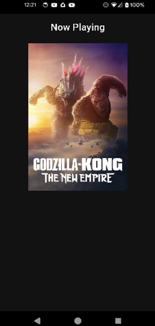

Figure 4.14: Carousel

The designs show a bottom navigation section that shows home, genre, and favorites buttons. These buttons will take the user to the three different screens that you will be creating. To create these, go into `main_screen.dart`. We need to replace the single call to the home screen with a `BottomNavigationBar`. This class handles the selection of screens and shows the proper one. Before the build method, add some new variables:

```dart
var index = 0;
final List<Widget> screens = <Widget>[];
```

This will keep track of the current index and the screens list will hold the three screens. Now add the initState method:

```dart
@override
void initState() {
  super.initState();
  screens.add(const HomeScreen());
  screens.add(const Placeholder());
  screens.add(const Placeholder());
}
```

Now change the build method to:

```dart
@override
Widget build(BuildContext context) {
  return Scaffold(
    body: screens[index],
    bottomNavigationBar: BottomNavigationBar(
      items: const [
        BottomNavigationBarItem(icon: Icon(Icons.home), label: 'Home'),
        BottomNavigationBarItem(icon: Icon(Symbols.genres), label: 'Genre'),
        BottomNavigationBarItem(icon: Icon(Icons.favorite), label: 'Favorites'),
      ],
      currentIndex: index,
      onTap: (navIndex) {
        setState(() {
          index = navIndex;
        });
      },
    ),
  );
}
```

The `Scaffold` will show the current screen based on the current index. The `BottomNavigationBar` holds `BottomNavigationBarItem` items that just show the icons and text. The `currentIndex` is for the screen index currently selected, and the `onTap` call will set that index only when the user selects it. You will notice that the `Symbols.genres` cannot be found. This is an icon found in the `material_symbols` library. Add the following to `pubspec.yaml`:

```yaml
material_symbols_icons: ^4.2719.3
```

Run `flutter pub get` to install the package. Import the symbols package.

Looking back at the design, you will see three sections named trending, popular, and top-rated movies. They all look the same, which means they are good candidates for custom widgets. Start by creating a title row. In the `home` folder, create a new file named `title_row.dart`. Add the following:

```dart
import 'package:flutter/material.dart';

typedef OnMoreClicked = void Function();

class TitleRow extends StatelessWidget {
  final String text;
  final OnMoreClicked onMoreClicked;

  const TitleRow({super.key, required this.text, required this.onMoreClicked});

  @override
  Widget build(BuildContext context) {
    return Row(
      mainAxisSize: MainAxisSize.max,
      children: [
        Padding(
          padding: const EdgeInsets.fromLTRB(16, 16.0, 0.0, 8.0),
          child: Text(text, style: const TextStyle(fontSize: 20, fontWeight: FontWeight.w600, color: Colors.white)),
        ),
        const Spacer(),
        Padding(
          padding: const EdgeInsets.fromLTRB(16, 16.0, 8.0, 0.0),
          child: TextButton(
            onPressed: onMoreClicked,
            child: const Text(
              'More',
              style: TextStyle(fontSize: 16, fontWeight: FontWeight.w400, color: Colors.white),
            ),
          ),
        ),
      ],
    );
  }
}
```

This code shows a row with the passed in text on the left and a More button on the far right. The steps are as follows:

1. Define a function that will be run when the `more` button is clicked.
2. Create a row with several children.
3. Have the row take up the full width.
4. Show the passed-in title.
5. Use a `Spacer` widget to push the button to the right.
6. Use a `TextButton` to show `more` text.

Back in home screen, after `HomeScreenImage()` add the following:

```dart
TitleRow(
  text: 'Trending',
  onMoreClicked: () {},
),
```

Hot reload. You should now see the Trending row. Copy and paste the `TitleRow` two times and change the text to popular and top-rated. Hot reload, and you should see three titles in a row.

### [Movie row](contents.md#sc3_97a)

Now, add the scrollable horizontal row for each type of movie. Create a new .dart file in the home folder named `horiz_movies.dart`. Add the following:

```Dart
import 'package:cached_network_image/cached_network_image.dart';
import 'package:flutter/material.dart';

class HorizontalMovies extends StatelessWidget {
  final List<String> movies;

  const HorizontalMovies({required this.movies, super.key});

  @override
  Widget build(BuildContext context) {
    return SizedBox(
      height: 142,
      child: ListView.builder(
        scrollDirection: Axis.horizontal,
        itemCount: movies.length,
        itemBuilder: (context, index) {
          return GestureDetector(
            onTap: () {},
            child: SizedBox(
              width: 100,
              height: 142,
              child: CachedNetworkImage(
                imageUrl: movies[index],
                alignment: Alignment.topCenter,
                fit: BoxFit.fitHeight,
                height: 100,
                width: 142,
              ),
            ),
          );
        },
      ),
    );
  }
}
```

This code will display a horizontal list of images and allow the user to click on individual images. The steps are as follows:

1. Pass in a list of movie URLs.
2. Each movie will only be 142 pixels high by using `SizedBox`.
3. Use a `ListView` to show a horizontal list (`ListView` will be covered in more detail in another chapter).
4. Use a `GestureDetector` to capture a click (`GestureDetector` will be covered in more detail in another chapter).
5. Show the image.

Back in the home screen, add the following after the first `TitleRow`:

```dart
const HorizontalMovies(movies: images,),
```

Hot reload. You should see at least a part of the images, but what are the yellow and black striped lines? What are the error messages in the console? Now, you will be learning some of the hard parts about Flutter. If you read the error message in the console, you will see the following:

```PowerShell
A RenderFlex overflowed by 87 pixels on the bottom.

The relevant error-causing widget was:
Column
Column:file:///.../Mastering%20Flutter/git/Mastering-Flutter/Chapter4/final/movies/lib/ui/screens/home/home_screen.dart:21:16

# ...
```

This is saying that the last item in the column went 87 pixels beyond the area on the screen. To fix this, you need some sort of scrollable widget. There is an easy fix for this issue. Simply wrap the top Container with the following:

```dart
SingleChildScrollView(
  child: Container(
    // ... existing content
  ),
)
```

Hot reload, and the error should be gone. You will encounter several of these types of errors as your Flutter career progresses. The following is what your screen should look like:

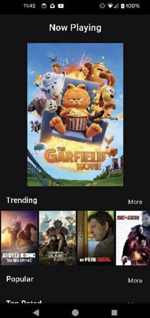

Figure 4.15: Scrolling lists

The project is starting to look like an actual program. Copy the `HorizontalMovies` widget after each `TitleRow` and hot reload. You should be able to scroll down and see the three lists. You can even scroll right on the list. That is it for the home screen for now. In upcoming chapters, we will clean up the screen and get actual data from the network.

[Conclusion](contents.md#sc2_98a)

In this chapter, you learned about the structure of a Flutter app and most of Flutter’s basic widgets. Although it was a lot of information, you now have a handle on the basics of Flutter. We will continue to learn more about themes and advanced widgets.

In the next chapter, you will learn about colors, typography, and material design. You will use these to create a theme that sets the color and typography for the whole app at once.
