# [CHAPTER 5 Themes, Colors and Fonts](contents.md#ch05a)

## [Introduction](contents.md#sc2_99a)

In this chapter, we will cover all the design elements that make up your app. You will learn about Material Design, Google’s open-source design system, which makes it easy to create a great-looking app. Finally, you will create your own theme that incorporates all these elements.

## [Structure](contents.md#sc2_100a)

The chapter covers the following topics:

- Colors
- Typography
- Material Design
- Google Fonts
- Themes

## [Colors](contents.md#sc2_102a)

In Flutter, a color is represented as a hexadecimal number made up of the red, green, blue, and alpha values of a color. Alpha is a number for setting the opacity of the color. 0xFF means it is completely opaque(不透明), and the full color is shown. 0x00 means that it is fully transparent. You can set the opacity with the `withOpacity` method on a color:

```dart
var grey = Colors.grey.withOpacity(0.5);
```

This creates a grey color at a 50% transparent level. There are many predefined colors in Flutter. Not only are there traditional colors like red, blue, green, purple, etc., but there are values with different opacity levels. For example, Color.white70 is a white with 70% opacity. You can use these colors in your app or create your own. To create your own, you can either create a new Color class with a hex value as follows:

```dart
const primaryRed = Color(0xFFC13437);
```

You could also use `Color` methods. These are extension methods:

- fromARGB: alpha, red, green, blue
- fromRGBO: red, green, blue, opacity

Red, green and blue use values from 0 to 255, while opacity is 0.0 to 1.0. Alpha is from 0 to 255. A lot of widgets can take a color parameter. The `Container` widget has a `color` parameter and looks as follows:

```dart
Container(
  color: Color(0xFF111111),
)
```

For Text, you need to set the color in the `TextStyle` class, and use the following code:

```dart
Text(
  'Now Playing', 
  style: TextStyle(
    fontSize: 24, 
    fontWeight: FontWeight.w600, 
    color: Colors.white
  )
)
```

## [Typography](contents.md#sc2_103a)

Typography(排版样式) is the technique of arranging text on the screen using different fonts, font sizes, colors, line spacing, and letter spacing. Normally, you use typography in `Text` widgets with a `TextStyle` class. This class defines the different attributes that will be used to display the text. You can set the font size, font weight (bold), font, letter spacing, colors, and more. While you can set each text’s style manually, it is usually easier to define it once and reuse it. You can create variables for those or set them in a theme (discussed below).

## [Material Design](contents.md#sc2_104a)

Material Design is a design system by Google created to help developers and designers build beautiful, usable, and consistent digital experiences across various platforms.

While the material design was originally designed for Android, it can be used on many other platforms as well. Google uses it for its Android and web products. You can still use the Material Design system on iOS, but it will not have the iOS look and feel. However, designers today usually create designs made for the app and company and not tied to a particular platform. This way, they can design the app once and use it on multiple platforms. This could use the company’s colors and a specific design for their app. Material Design is customizable, so you do not have to use the default colors and styles. Material Design is built into the Flutter framework and can be customized by providing a theme with all the colors, fonts, and styles needed for your app. This system has custom-built elements such as buttons, cards, dialogs, and other widgets that use this system.

To use Material Design, you will start your app using the MaterialApp widget. This allows you to provide a theme (for colors, fonts, and other styles) and a router (for page navigation). Many Material Design widgets require a parent Material widget like `MaterialApp`. If there is no Material parent, you can use the Material widget to wrap your widget.

## [Google Fonts](contents.md#sc2_105a)

Google Fonts for Flutter is a package that simplifies the process of using Google Fonts in your Flutter applications. It allows you to easily access a vast collection of free, open-source fonts from Google and integrate them seamlessly into your app's text elements. To see all the fonts provided by Google, go to <https://fonts.google.com/>. The fonts page would be displayed as follows:

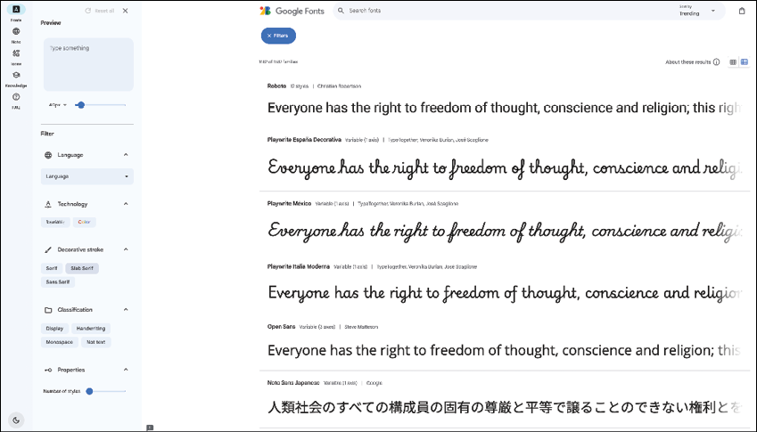

Figure 5.1: Google Fonts

Currently, this page lists 1,644 font families. Many of these are for different languages. This page also allows you to filter the fonts to find the one that works for you. Google also has a special font family called `Noto` that has all the current languages available. For the movie app, we are going to be using the `Roboto` font.

The steps to add Google Fonts are as follows:

1. You can add the `google_fonts` package by using the following command line:

    ```bash
    flutter pub add google_fonts
    ```

    It can also be added by opening up `pubspec.yaml` in your project and adding the following:

    ```yaml
    google_fonts: ^8.0.2
    ```

2. Now, create a new folder for your theme. Inside of the lib/ui folder, create a folder named `theme`. Now, create a new file named `theme.dart`. Add the following:

    ```dart
    import 'package:flutter/material.dart';
    import 'package:google_fonts/google_fonts.dart';

    var roboto = GoogleFonts.roboto();
    ```

    This imports the `material.dart` and `google_font` packages.

3. Using the `GoogleFonts` class, use the `roboto` function to retrieve an instance of the `Roboto TextStyle`. Now, let us create some textStyles needed for the movie app. Add the following:

    ```dart
    var largeTitle = roboto.copyWith(
      fontSize: 24,
      fontWeight: FontWeight.w600,
      color: Colors.white,
    );
    ```

    This creates a variable named `largeTitle` that uses `roboto`, a font size of 24, a weight of 600 (which is semibold 半粗体), and a color of white. Font weights go from w100 (thin) to w900 (thick). Bold is considered a w700 weight, and normal is a w400 weight.

4. Now add the rest of your styles, using the following code:

    ```dart
    var heading1 = roboto.copyWith(
      fontSize: 20,
      fontWeight: FontWeight.w600,
      color: Colors.white,
    );
    var heading2 = roboto.copyWith(
      fontSize: 18,
      fontWeight: FontWeight.w600,
      color: Colors.white,
    );
    var body1Regular = roboto.copyWith(
      fontSize: 16,
      fontWeight: FontWeight.w400,
      color: Colors.white,
    );
    var body1Bold = roboto.copyWith(
      fontSize: 16,
      fontWeight: FontWeight.w700,
      color: Colors.white,
    );
    var body2Regular = roboto.copyWith(
      fontSize: 14,
      fontWeight: FontWeight.w400,
      color: Colors.white,
    );
    var body2Bold = roboto.copyWith(
      fontSize: 14,
      fontWeight: FontWeight.w700,
      color: Colors.white,
    );
    var caption = roboto.copyWith(
      fontSize: 12,
      fontWeight: FontWeight.w400,
      color: Colors.white,
    );
    var body3Regular = roboto.copyWith(
      fontSize: 12,
      fontWeight: FontWeight.w400,
      color: Colors.white,
    );
    var body3Bold = roboto.copyWith(
      fontSize: 12,
      fontWeight: FontWeight.w700,
      color: Colors.white,
    );
    var verySmallText = roboto.copyWith(
      fontSize: 10,
      fontWeight: FontWeight.w400,
      color: Colors.white,
    );
    ```

    There are many fonts here, but these are the styles that the app's designer provided. There are large fonts for titles and smaller ones for movie cast members' names. Usually, font sizes do not go below 10 pixels, as they become very hard to read.

5. To use these fonts, you would replace the hard-coded styles used with these variables. Open up `home_screen.dart` and find the `Now Playing` text field. Replace the style with `largeTitle`. You will have to add the following import:

    ```dart
    import 'package:movies/ui/theme/theme.dart';
    ```

    This looks a lot cleaner. Having to constantly type large `TextStyle`s can waste a lot of time.

6. What about colors? If you look above the `Now Playing` text, you will see Color(0xFF111111). We can replace this with variables as well. In `theme.dart`, add the following colors to the top:

    ```dart
    // Colors
    const screenBackground = Color(0xFF111111);
    const searchBarBackground = Color(0xFF1E1E1E);
    const primaryButton = Color(0xFFD9D9D9);
    const posterBorder = Color(0xFFB5A9A9);
    const buttonGrey = Color(0xFF504F4F);
    ```

    These are some named variables that you will be using in the app.

7. Now replace that color with `screenBackground`. The rest of the colors will be used in the app when you start building the different screens.

## [Themes](contents.md#sc2_106a)

When a visual or UI designer starts to design an app, they start with a set of colors, fonts, shapes, and icons. This makes up the theme of the app. With a theme, every screen should follow that design, making screens consistent for a beautiful app. Flutter provides a way to use those colors, fonts, shapes, and icons by providing a `theme` parameter for the `MaterialApp` widget. That parameter is a `ThemeData` class. This class holds all the information needed to define the elements of your app. When using widgets in your Flutter app, if you specify any formatting for that widget, it will override the system styling. If you do not specify any formatting, Flutter will use the current theme’s settings.

There are many ways to create a `ThemeData` class. The easiest is to use `ThemeData.light(useMaterial3: true)` or `ThemeData.dark(useMaterial3: true)`. This will use either the light or dark theme defined by Flutter. This sets the theme's brightness level and uses the other defaults. If you know the main color you want to use for your app, like blue, then you can use the following command:

```dart
ThemeData(
  useMaterial3: true,
  // Define the default brightness and colors.
  colorScheme: ColorScheme.fromSeed(
    seedColor: Colors.blue,
    brightness: Brightness.dark,
  ),
);
```

Here, you specify a `seedColor` and Flutter creates a color scheme for you. You can set the brightness as well to either dark or light.

### [Fully customized theme](contents.md#sc3_107a)

If you want to customize your theme fully, you will set the following parameters:

- `colorScheme`: Colors for the theme.
- `textTheme`: Text styles.
- `appBarTheme`: Theme for the AppBar.
- `bottomNavigationBarTheme`: Theme for the bottom navigation bar.
- `snackBarTheme`: Theme for snackbars.
- `tabBarTheme`: Theme for tabs.
- `actionIconTheme`: The action icons like back, close and drawer icons.
- `textButtonTheme`: Theme for text buttons.
- `useMaterial3`: Flag for using the newer Material 3 design system. This is true by default.

### [ColorScheme](contents.md#sc3_108a)

As mentioned above, the easiest way to create a `ColorScheme` is to use the `fromSeed` method. In addition to the `seedColor`, you can set other colors. You can set the primary, `onPrimary` (the color drawn on top of primary), secondary, and others. We will create a color scheme later in the chapter. To learn more about `ColorScheme`s and create your own, visit the Material 3 website: <https://m3.material.io/styles/color/roles/color-roles>. There are two different types of color schemes: Static and dynamic. Static just means you set the color once and do not change it. Dynamic is when you want your screens to match a color from that screen.

### [Material Theme Builder](contents.md#sc3_109a)

To help with dynamic colors, use the Material Theme Builder. The steps to launch Material Theme Builder are as follows:

1. If you go to <https://www.figma.com/community/plugin/1034969338659738588/material-theme-builder>, you can launch Figma’s Material Theme Builder. This allows you to set your colors and text fonts. The screen will be as follows:

    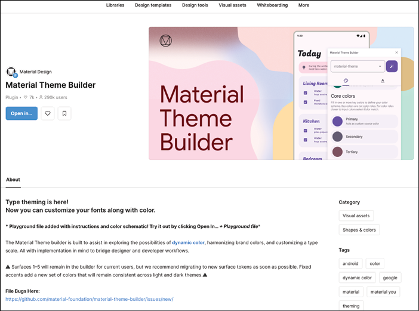

    Figure 5.2: Material Theme Builder

1. Click on the `Open in…` button, and you will see the following:

    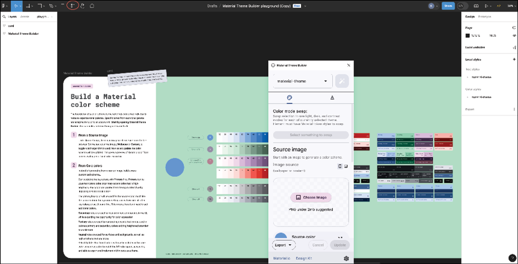

    Figure 5.3: Color scheme

1. Click on the `resources` button, which is circled in red in Figure 5.3. This will bring up the Material Theme Builder dialog. Here, you can choose a color scheme in several different ways. If you select an image, it will create a color scheme based on that image. Or you can select your Primary colors, as shown in the following figure:

    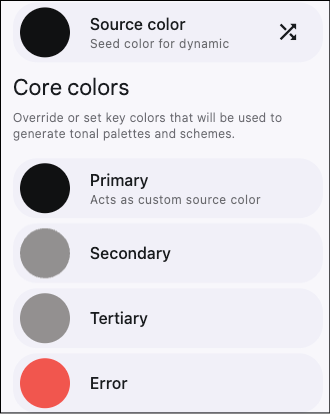

    Figure 5.4: Core colors

1. Selecting any of the color rows will bring up the color picker, as follows:

    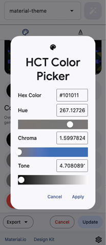

    Figure 5.5: Color picker

1. Change the `Hue`色相 to set the color, and then adjust the `Chroma`色度 and `Tone`色调 to get the exact color you want. To set a blue color, move the `Chroma` to the right and adjust the `Hue` towards blue, as shown in the following figure:

    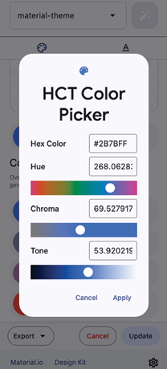

    Figure 5.6: Blue color picker

1. Once you have finished, click `Apply`. You can then export the design to Flutter by choosing the `Export` button as follows:

    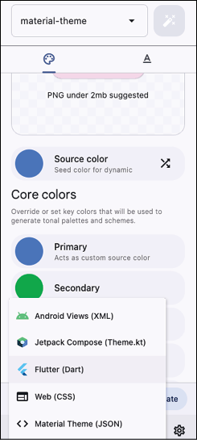

    Figure 5.7: Exporting

1. This will download a `material-theme.zip` file. Unzip the file, and you will find a lib directory with several files, as follows:
    - `util.dart`: Creates the `TextTheme`.
    - `theme.dart`: Creates some custom classes to store Figma’s scheme colors.
    - `main.dart`: Example usage of the theme.

While this is a nice tool for designing a color scheme, in this book, we will create our theme by hand so you can see all the different options available.

### [Light vs dark](contents.md#sc3_110a)

In `main.dart`, an interesting line of code, that gets the device’s brightness, is as follows:

```dart
final brightness = View.of(context).platformDispatcher.platformBrightness;
```

You can then use a light or dark theme based on that brightness:

```dart
theme: brightness == Brightness.light ? theme.light() : theme.dark(),
```

This is a good way to change your theme based on the device's current brightness level.

Note: That this does not listen for changes in the brightness and will not change until the app is relaunched.

### [Creating a theme](contents.md#sc3_111a)

The steps to create a theme are as follows:

1. Inside of theme.dart, create a new method using the following command:

    ```dart
    ThemeData createTheme() {
      return ThemeData();
    }
    ```

1. The movie app does not use many colors, but if you wanted to set a color scheme, you would add it to the `colorScheme` parameter as follows:

    ```dart
    colorScheme: ColorScheme.fromSeed(
        seedColor: const Color(0xFF2196F3), // Base blue color
        primary: const Color(0xFF2196F3), // Primary color (can be same as seed)
        onPrimary: Colors.white, // Text/icon color on primary background
        secondary: const Color(0xFF90CAF9), // Secondary color (lighter blue)
        onSecondary: Colors.black, // Background color (very light blue)
        surfaceContainerHighest: Colors.black, // Text/icon color on background
        surface: const Color(0xFFBBDEFB), // Surface color (cards, menus, etc.)
        onSurface: Colors.black, // Text/icon color on surface
        error: const Color(0xFFB00020), // Error color (red)
        onError: Colors.white, // Text/icon color on error background
        brightness: Brightness.light, // Overall brightness (light or dark)
    ),
    ```

1. Here, we provide a seed color and a few other basic colors. Next, you will define the `textTheme` using the variables you created earlier. Add the following command:

    ```dart
    textTheme: Typography.material2021().englishLike.copyWith(
        headlineLarge: heading1,
        headlineMedium: heading2,
        headlineSmall: body2Regular,
        titleLarge: largeTitle,
        titleMedium: heading2,
        titleSmall: body2Bold,
        bodyLarge: body1Regular,
        bodyMedium: body2Regular,
        bodySmall: body3Regular,
        labelLarge: body1Bold,
        labelMedium: body2Bold,
        labelSmall: caption,
    ),
    ```

1. This starts by copying the Material 2021 theme (remember that Material 3 was introduced in 2021) and then adds all the styles we defined earlier.

    There are many more themes you can set. We will go over a few of the common themes. The first one is for the `AppBar`. The `AppBar` is the title section of an app. You can change the theme using the following:

    ```dart
    appBarTheme: const AppBarTheme(
      backgroundColor: Colors.white, // App bar background color
      foregroundColor: Colors.black, // Text/icon color on app bar
    ),
    ```

    You can also set the elevation高度, shadow color, surface tint color, shape, height, and many more. Next, set the theme for the bottom navigation bar. Add the following code:

    ```dart
    bottomNavigationBarTheme: const BottomNavigationBarThemeData(
      backgroundColor: searchBarBackground, // Bottom nav background color
      selectedItemColor: Colors.white, // Selected item color
      unselectedLabelStyle: TextStyle(color: Colors.black),
      showUnselectedLabels: true,
      unselectedItemColor: posterBorder, // Unselected item color
    ),
    ```

    Here, we set the background color to a dark color and set the selected color to white. There are a few other themes you can set that are not needed for the app, but you may find them useful in yours. There is a theme for the `snackbar`. You can customize it with the `SnackBarThemeData` class. For text buttons, there is the `TextButtonThemeData`, and for tab bars there is `TabBarTheme`.

Now that you have your theme set up, it is time to add it to your app. Open up `main.dart` and add the following:

```dart
theme: createTheme(),
```

The code should be added after `home: MainScreen()`.

### [iOS](contents.md#sc3_112a)

So far, we have only talked about running the app on Android. Now, we will try this on an iOS simulator. If you do not have a Mac, you can skip this section and just continue to test on your device.

#### [Xcode](contents.md#sc4_113a)

The steps are as follows:

1. Open up Xcode. The first thing you want to do is make sure you have a simulator. From the Window menu, select Devices and Simulators, as shown in the following figure:

    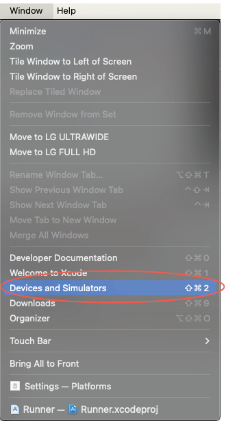

    Figure 5.8: Window menu

1. You should see the following screen:

    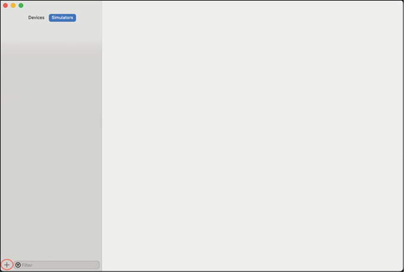

    Figure 5.9: Simulators

1. Click on the plus button in the bottom left. Enter a name and select a device. Press Create. The create screen is as follows:

    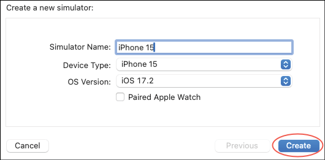

    Figure 5.10: Create simulator

1. You should now see the following screen:

    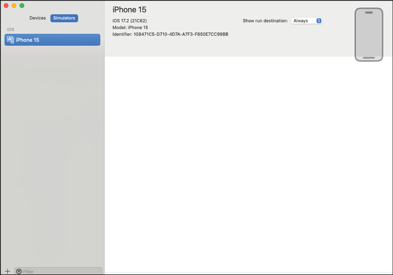

    Figure 5.11: Simulators

1. Next, open the Simulator tool, as shown in the following figure:

    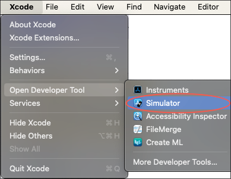

    Figure 5.12: Simulator tool

1. The simulator will be generated as follows:

    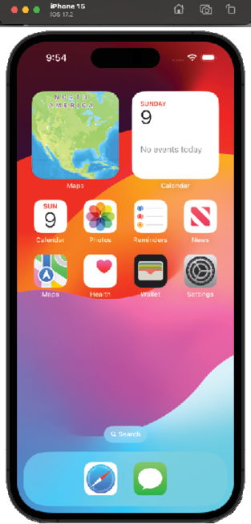

    Figure 5.13: iOS simulator

1. In Android Studio, select the device drop-down and select Open iOS Simulator, as shown in the following figure:

    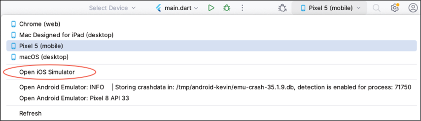

    Figure 5.14: Device picker

    If everything is set up properly, your simulator should show up.

    Press the green run button. You should now see the following:

    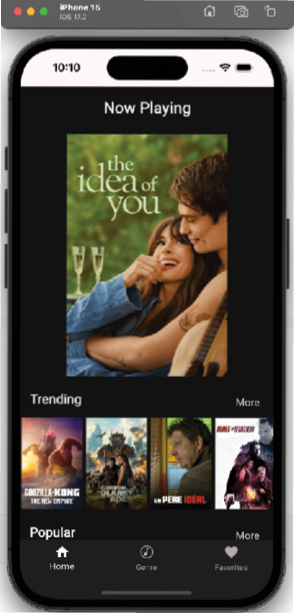

    Figure 5.15: App on iOS simulator

If you do not like that simulator, you can choose another. The steps to do so are as follows:

1. In the simulator, select Open Simulator from the File menu, as shown in the following figure:

    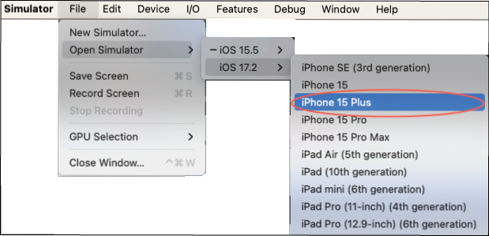

    Figure 5.16: Changing devices

1. Your simulator list may be different. Stop the current build in Android Studio, select the new device, and run again.

Running on iOS can often have issues and being able to solve these issues is important.

Open up Xcode and your project. You can find your project in the `ios` folder, as shown in the following figure:

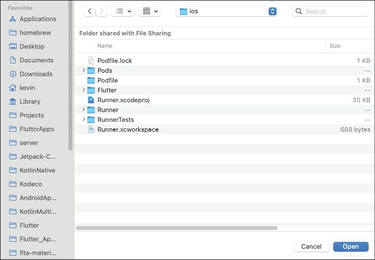

Figure 5.17: Project chooser

Click on Open. This will open the Runner.xcodeproj file. Once the project is open, select the Runner folder on the left, as selected in the following figure:

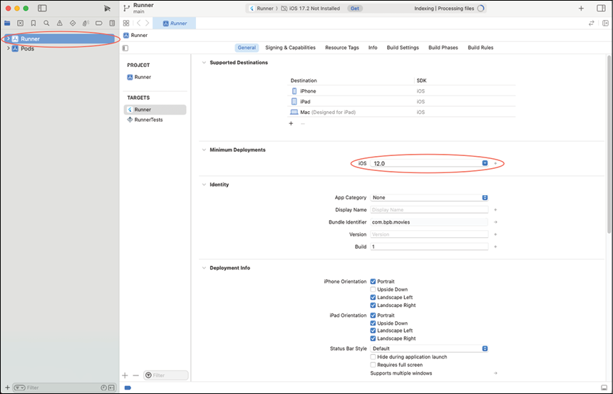

Figure 5.18: Xcode project

Notice that the Minimum Deployments are set to 12. This is one of the main areas for setting up your iOS or macOS app. Notice that the App Category is set to None. You could set this to Entertainment for the movie app. You can usually run everything from the Android Studio, but some things are easier to see in Xcode. Explore the different tabs. Some are harder to understand than others but luckily you do not need to change most of them.

## [Conclusion](contents.md#sc2_114a)

In this chapter, you learned about what makes up the design of an app: Colors and typography. You use those to create a theme throughout your app for a consistent UI. You can also access tools like the Google Fonts page and the Material Theme builder, which will help design your app.

In the next chapter, you will learn about state management, a key aspect of building Flutter apps. You will also learn about some very nice packages for handling state. The genre screen will also be created, completing your second screen.
