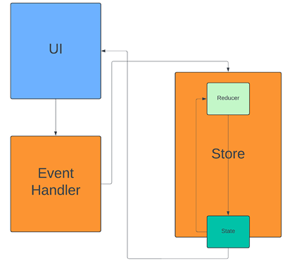
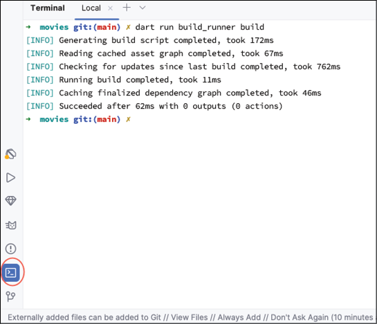
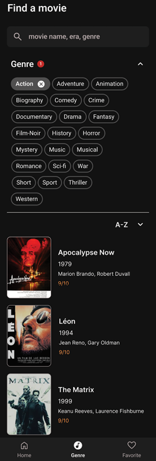
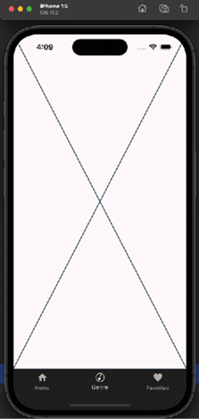
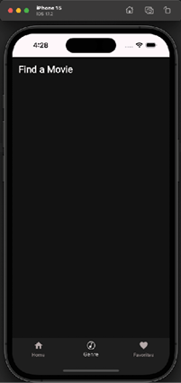
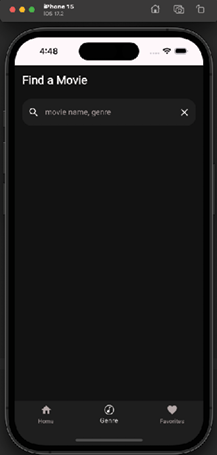
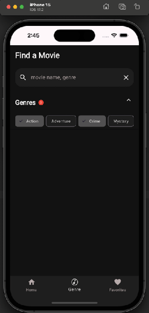
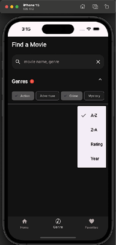
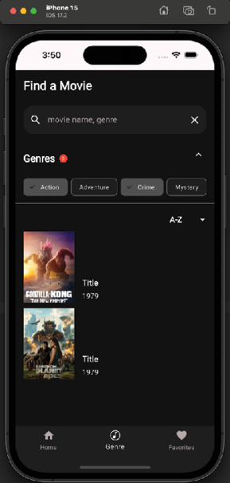

# [CHAPTER 6 State Management Fundamentals](contents.md#ch06a)

## [Introduction](contents.md#sc2_115a)

In this chapter, you will learn all about state management in Flutter. State management is an important topic in Flutter and must be understood to write Flutter apps properly. You will learn about the built-in state management of Flutter as well as how to use third-party packages for handling global states.

## [Structure](contents.md#sc2_116a)

The chapter covers the following topics:

- Understanding state in Flutter
- Local versus app state
- Built-in state
- State management with packages
- Immutable state
- Riverpod
- Genre screen

## [Understanding state in Flutter](contents.md#sc2_118a)

State is any data used in an app that can change over time and update the UI of the app. In Flutter, the UI is designed to update whenever any state changes.

Remember that there are two types of widgets: Stateless and stateful.

Stateless widgets are given data to display but do not change themselves, while stateful widgets contain their own state and can update it to update the widget. Stateful widgets use the `setState` method to signal the Flutter system that it needs to be redrawn. **Use the `setState` method as low as possible in the widget tree; otherwise, the whole screen will be redrawn.** In other words, if you have a widget in the middle of the screen, if that widget is stateful, it can just redraw itself when its state changes. This is also an example of why you want to put your widgets into their own classes. This will allow the Flutter system to only draw those items that have changed.

## [Local versus app state](contents.md#sc2_119a)

Local state is data specific to a single widget and typically managed within that widget's class. That class is a type of `StatefulWidget`. For example, if you use a `FilterChip` widget, you will need to save the selection state of the widget. This needs to be saved in a `StatefulWidget`.

App state is data that is shared between multiple parts of your app, like user preferences, authentication status, or shopping cart contents. Various state management techniques are available for handling app state. We will use the `Riverpod` package to allow the app-wide state to be shared among all of the screens. If you have a networking package, you do not want to re-create it on every screen. Using a package to create the library once and share it among screens is very helpful.

## [Built-in State](contents.md#sc2_120a)

If you look at `MainApp` in `main.dart`, you can see that it is made up of a `StatefulWidget` and a state. The `State` class is where you will store your data and build your UI. When the widget needs to be rebuilt, Flutter will create a new widget but keep a copy of the state so that your data is not lost. The `State` class has a `widget` parameter that lets you access its parent widget. It also keeps track of its lifecycle. The state class has a few important methods: `initState` (called once to initialize data), `destroy` (free up resources when done), `setState` (notify the system that the widget needs to be rebuilt), and `build` (return a widget to display).

### [InheritedWidget](contents.md#sc3_121a)

`InheritedWidget` is a Flutter widget that passes state down the widget tree without sending it through parameters. It stores the state in the `BuildContext`. Typical subclasses of this class have a static of method, that when passed in a context, will return that value. The following is an example of a widget that implements the `InheritedWidget` method:

```dart
static InheritedWidgetSubclass of(BuildContext context) {
  final result = context.dependOnInheritedWidgetOfExactType<InheritedWidgetSubclass>();
  return result!;
}
```

The `dependOnInheritedWidgetOfExactType` method retrieves the stored value. This widget is not used much.

## [State management with packages](contents.md#sc2_122a)

In Flutter, you can just use stateful widgets to manage the state, but there are many packages out there that provide a lot of functionality. The following are a few that will be covered:

- Provider
- Riverpod
- Business Logic Component (BLoC)
- GetIt
- Redux
- MobX

Why would you want to use another package? If you have data that you want to share among all the widgets below the main widget, you would normally have to pass that data down the tree via parameters. This is known as lifting the state. A design pattern for moving the ownership of state as high as possible. This can be difficult if you have more than one parameter. These packages provide a way to set data in one location and retrieve it anywhere in a widget tree. No more parameters.

### [Provider](contents.md#sc3_123a)

`Provider` is a third-party package from Google but is in maintenance mode. It was originally developed by the author of `Riverpod` (who recommends using `Riverpod`). It is described as a wrapper around `InheritedWidget`. `InheritedWidget` is a Flutter widget that is useful for allowing child widgets to access state that has been defined higher up, without passing that state down via parameters. It uses the `BuildContext` `dependOnInheritedWidgetOfExactType` method to find instances.

The `Provider` package has several classes that provide classes that can be used by widgets lower down in the tree. The basic class is the `Provider` class. This class has a `create` parameter where you would create your class once and a `child` parameter for your child widget. An example is:

```dart
Provider(
  create: (_) => MyModel(),
  child: ...,
)
```

This creates the `MyModel` class once and returns a widget in the `child` parameter.

Another provider is called `ChangeNotifierProvider` and is useful for updating the widget when its value changes. This class has a `value` parameter instead of a `create` parameter. It uses the built-in Flutter `ChangeNotifier` class. An example would be:

```dart
class Counter extends ChangeNotifier {
  int _counter = 0;
  
  int get counter => _counter;
  
  void increment() {
    _counter++;
    notifyListeners();
  }
  
  void decrement() {
    _counter--;
    notifyListeners();
  }
}
```

This takes the sample Flutter apps `counter` variable and puts it in a class that holds that state. Whenever the increment or decrement methods are called, the counter gets modified and listeners are notified of the change. You would use the `ChangeNotifierProvider` as follows:

```dart
ChangeNotifierProvider(
  create: (context) => Counter(),
  child: const MyApp(),
),
```

If you have multiple providers, the provider has the `MultiProvider` widget, which takes an array of providers.

### [BloC](contents.md#sc3_124a)

`BLoC` is a package designed to make it easy to implement this design pattern. The idea behind this pattern is to separate the UI from the business logic. The UI takes actions from a user that are sent to a cubit (a class that stores state). This cubit takes that action, converts it to a new state, and then sends that state out for the UI to consume. BloC is a nice pattern but requires a lot of code to implement. You can find more information about BloC at <https://pub.dev/packages/bloc>.

### [GetIt](contents.md#sc3_125a)

GetIt is a service locator package (that is, dependency injection). While GetIt is not a state management solution, it provides dependency injection functionality like other packages. You would use it as follows:

```Dart
final getIt = GetIt.instance;
getIt.registerSingleton<AppModel>(AppModel());
```

Then, to use it in the UI, apply the following code:

```dart
MaterialButton(
  child: Text("Update"),
  onPressed: getIt<AppModel>().update // given that your AppModel has a method update
),
```

You can find GetIt at <https://pub.dev/packages/get_it>.

### [Redux](contents.md#sc3_126a)

Redux comes in two packages: `Redux` for Dart and `flutter_redux` for Flutter (that uses Redux).

Redux has three principles:

- Single source of truth: Your state is stored in an object tree in one place.
- State is read-only: State objects are immutable and can only be changed by actions that create a new state.
- Changes are made with pure reducers: These functions take a state and an action and produce a new state.

In the `flutter_redux` package, there is a `StoreProvider` that takes a store you have created and a child widget. There is a `StoreConnector` that provides a converter function and a builder that has a callback. That callback will dispatch an action to the store. The flow is as follows:



Figure 6.1: Redux data flow

### [MobX](contents.md#sc3_127a)

`MobX` is a state management library that uses the concepts of observables, actions, and reactions. It is like Redux. Actions are like the reducer, and observable is where you store your data. It has a code generator that can create some of the boilerplate code for you. You can find `MobX` at <https://pub.dev/packages/mobx>. You would mark a value with the `@observable` annotation and an action with `@action` on a function. A class would use the store mixin, and the generator would create the store class needed in your widget tree. You can use the `Observer` widget to listen to changes in your store.

## [Immutable state](contents.md#sc2_128a)

Many libraries talk about the importance of immutability. The reason is that if you have state that can be changed by any class, you will eventually encounter bugs where one class changes the state and another class has a different instance of that state. Which one is correct? Will different parts of your app behave differently, or will it just crash? One of the downsides of a class that cannot have its data changed is that you have to create a new copy each time to update its state. There is a library that helps with that, and we will cover that library in a later chapter.

## [Riverpod](contents.md#sc2_129a)

`Riverpod` is another third-party package written by the same author as `Provider`. `Riverpod` is an anagram of `provider`. The author has learned from his experience with the `provider` and has created an excellent package. You can find more information about `Riverpod` at <https://riverpod.dev/>. We will be using this package for the movies app. It is like `Provider` but also has a generator so that you can use its annotation capabilities to generate code. `Riverpod` has several custom widgets that you will subclass to give you access to the provided data. These classes provide easy access to all the shared resources you have created. Another advantage is that you do not have to define your resources in the same file as your UI. `Riverpod` also handles asynchronous requests and can cache the result.

`Riverpod` is defined as a reactive caching framework for `Flutter`/`Dart`. It can handle asynchronous calling with error handling. `Riverpod` uses reference classes that allow you to listen for changes in data. The main reference class is `WidgetRef`. This class has several important methods:

- watch(provider): Given a provider, update the widget when the provider changes.
- listen(provider): Listen to changes in a provider and perform an action.
- read(provider): Used to get the value of the provider and not listen to changes.

**Both the watch and listen methods should be used inside of the build method**. Read is usually used for other methods when you need to get the value of the provider and perform some action.

We will use the `Riverpod` package for dependency injection and, in part, for state management. To add `Riverpod`, you need to add several packages. Open `pubspec.yaml` and add the following:

```yaml
flutter_riverpod: ^3.2.1
# the annotation package containing @riverpod
riverpod_annotation: ^4.0.2
```

Next, add two packages under the dev_dependencies section:

```yaml
build_runner: ^2.11.1
riverpod_generator: ^4.0.3
riverpod_lint: ^3.1.3
```

Comment out the overrides:

```yaml
#dependency_overrides:
# analyzer: 5.13.0
```

Run `flutter pub get`.

Here are what the packages are for:

- `flutter_riverpod`: Main Riverpod package.
- `riverpod_annotation`: Provides annotation used by the code generator.
- `build_runner`: This is a Flutter package used by other packages to create source code for you. Riverpod generator uses this to create Riverpod files.
- `riverpod_generator`: Package used to generate Riverpod code.
- `riverpod_lint`: Linter that checks for Riverpod issues.

In order to use `Riverpod`, you will need to wrap the `MainApp` in a `ProviderScope`. The `ProviderScope` stores the state of all providers. Open up `main.dart` and change `runApp` to:

```dart
runApp(const ProviderScope(child: MainApp()));
```

Then, import the `Riverpod` package. To use `Riverpod`, you need to define some providers. Inside the lib directory, create a new file named `providers.dart`. We will be moving the images list into the `providers.dart` file. Add:

```dart
import 'package:riverpod_annotation/riverpod_annotation.dart';
part 'providers.g.dart';

@riverpod
List<String> movieImages(Ref ref) => [
  // TODO add Images
];
```

This imports the `riverpod_anotation` file and uses the `part` keyword. This keyword will import the `providers.g.dart` file. This does not exist yet and will be generated by `Riverpod`. Next replace the `TODO` with:

```dart
  'http://image.tmdb.org/t/p/w780/z1p34vh7dEOnLDmyCrlUVLuoDzd.jpg',
  'http://image.tmdb.org/t/p/w780/gKkl37BQuKTanygYQG1pyYgLVgf.jpg',
  'http://image.tmdb.org/t/p/w780/4xJd3uwtL1vCuZgEfEc8JXI9Uyx.jpg',
  'http://image.tmdb.org/t/p/w780/uuA01PTtPombRPvL9dvsBqOBJWm.jpg',
  'http://image.tmdb.org/t/p/w780/H6vke7zGiuLsz4v4RPeReb9rsv.jpg',
  'http://image.tmdb.org/t/p/w780/e1J2oNzSBdou01sUvriVuoYp0pJ.jpg',
  'http://image.tmdb.org/t/p/w780/hu40Uxp9WtpL34jv3zyWLb5zEVY.jpg',
  'http://image.tmdb.org/t/p/w780/pKaA8VvfkNfEMUPMiiuL5qSPQYy.jpg',
  'http://image.tmdb.org/t/p/w780/zK2sFxZcelHJRPVr242rxy5VK4T.jpg',
  'http://image.tmdb.org/t/p/w780/7qxG0zyt29BI0IzFDfsps62kbQi.jpg',
  'http://image.tmdb.org/t/p/w780/8Gxv8gSFCU0XGDykEGv7zR1n2ua.jpg',
  'http://image.tmdb.org/t/p/w780/zDi2U7WYkdIoGYHcYbM9X5yReVD.jpg',
  'http://image.tmdb.org/t/p/w780/cxevDYdeFkiixRShbObdwAHBZry.jpg',
  'http://image.tmdb.org/t/p/w780/uXUs1fwSuE06LgYETw2mi4JxQvc.jpg',
  'http://image.tmdb.org/t/p/w780/fdZpvODTX5wwkD0ikZNaClE4AoW.jpg',
  'http://image.tmdb.org/t/p/w780/d5NXSklXo0qyIYkgV94XAgMIckC.jpg',
  'http://image.tmdb.org/t/p/w780/sh7Rg8Er3tFcN9BpKIPOMvALgZd.jpg',
  'http://image.tmdb.org/t/p/w780/sHJ2OIgpcpSmhqXkuSWxZ3nwg1S.jpg',
  'http://image.tmdb.org/t/p/w780/upKD8UbH8vQ798aMWgwMxV8t4yk.jpg',
  'http://image.tmdb.org/t/p/w780/vfrQk5IPloGg1v9Rzbh2Eg3VGyM.jpg',
```

This is the list of all movie images. Now remove the list from `home_screen_image.dart`. In order to generate the `providers.g.dart` file, you will use Flutter's `build_runner` app. Open the terminal in Android Studio and run:

```bash
dart run build_runner build
```

Your output will look like this:



Figure 6.2: build_runner

Now that the provider file is ready, it is time to fix the errors that show up. Inside of `home_screen_image.dart`, add the `flutter_riverpod` import:

```dart
import 'package:flutter_riverpod/flutter_riverpod.dart';
```

and then change the type of `HomeScreenImage` from `StatelessWidget` to `ConsumerWidget`. This is a `Riverpod` stateless widget. Next change the build method to:

```dart
Widget build(BuildContext context, WidgetRef ref) {
```

This adds the `WidgetRef` parameter. Right after this add:

```dart
final images = ref.watch(movieImagesProvider);
```

This uses the `WidgetRef` to read the provider created by `Riverpod` and return the list of movie strings. Do the same thing with the home screen and `VerticalMovieList`. You should not see any errors. Hot reload and make sure everything works.

## [Genre screen](contents.md#sc2_130a)

It is time to create the Genre screen. This screen will allow users to search for a movie by genre or title. Here is the design of the screen:



Figure 6.3: Genre design

Start by creating a new folder in the `ui/screens` directory, named `genres`. Inside that folder, create a new dart file named `genre_screen.dart`. Add the following:

```dart
import 'package:flutter/material.dart';
import 'package:flutter_riverpod/flutter_riverpod.dart';

class GenreScreen extends ConsumerStatefulWidget {
  const GenreScreen({super.key});

  @override
  ConsumerState<GenreScreen> createState() => _GenreScreenState();
}

class _GenreScreenState extends ConsumerState<GenreScreen> {
  @override
  Widget build(BuildContext context) {
    return Placeholder();
  }
}
```

Notice that this class uses a new `ConsumerStatefulWidget` class from the `Riverpod` package. This widget gives us access to provider references that allow us to retrieve our shared classes. `_GenreScreenState` extends `ConsumerState`, which is another Riverpod class. Open the `main_screen` and replace the second placeholder with the `GenreScreen`. Now run the app and click on the Genre screen. It will look the same, but you can now work on it while it shows the following:



Figure 6.4: Genre screen

Inside of `GenreScreen`, replace the `Placerholder()` with the following:

```dart
// 1
return SafeArea(
  // 2
  child: Container(
    color: screenBackground,
    // 3
    child: Column(
      mainAxisSize: MainAxisSize.max,
      mainAxisAlignment: MainAxisAlignment.start,
      crossAxisAlignment: CrossAxisAlignment.start,
      children: [
        // 4
        Row(
          mainAxisSize: MainAxisSize.max,
          children: [
            Padding(
              padding: const EdgeInsets.fromLTRB(16, 16.0, 0.0, 24.0),
              child: Text(
                'Find a Movie',
                style: Theme.of(context).textTheme.titleLarge
              ),
            ),
          ],
        ),
      ]
    ),
  ),
);
```

Here is an explanation of the code:

1. Use SafeArea to draw below the status area.
2. Use a Container to show our background color.
3. Use a Column set at max height to show a list of items.
4. Use a Row to display items across the screen.

As we build this screen, we will create code that will change later as we add more items. Hot reload (or hot restart if that does not work), and you should see the following:



Figure 6.5: Genre with title

This is a good way to build a screen. Slowly add one item at a time to make sure it works by performing a hot reload. If you try to build the whole thing at once and it does not work, you cannot be sure what is causing the problem.

Next, we need a search text field. Add a new file called `genre_search_row.dart` in the genres folder. Start with the following:

```dart
import 'package:flutter/material.dart';
import 'package:flutter_riverpod/flutter_riverpod.dart';
import 'package:movies/ui/theme/theme.dart';

typedef OnSearch = void Function(String searchString);

class GenreSearchRow extends ConsumerStatefulWidget {
  final OnSearch onSearch;
  const GenreSearchRow(this.onSearch, {super.key});
  @override
  ConsumerState<GenreSearchRow> createState() => _GenreSearchRowState();
}

class _GenreSearchRowState extends ConsumerState<GenreSearchRow> {
  // TODO: Add variables
  // TODO: Add init and dispose
  @override
  Widget build(BuildContext context) {
    return Row(mainAxisSize: MainAxisSize.max, children: [
      // TODO: Add TextField
    ]);
  }
}
```

The only unique item here is the `OnSearch` typedef. This defines a function that will receive a `searchString`.

1. When the user clicks on the search icon or hits the done button on the keyboard, a `searchString` will be sent to the owner of the `onSearch` function. Replace the first `TODO` with the following:

    ```dart
    late TextEditingController movieTextController;
    final FocusNode textFocusNode = FocusNode();
    ```

    This creates a `TextEditingController` for controlling the text the user inputs. You can learn more about it in the [Flutter documentation](https://docs.flutter.dev/cookbook/forms/text-field-changes).

    The `FocusNode` is an easy way for the user to start typing in the text field. You can learn more about it in the [Flutter documentation](https://docs.flutter.dev/cookbook/forms/focus).

1. Next, create the `initState` and `dispose` methods. These are needed as a one-time initialization and disposal. Replace the second `TODO` with the following:

    ```dart
    @override
    void initState() {
      super.initState();
      movieTextController = TextEditingController(text: '');
    }

    @override
    void dispose() {
      movieTextController.dispose();
      super.dispose();
    }
    ```

    Whenever you use a text controller, you need to dispose of it in the dispose method.

1. The `TextField` widget has a lot of options, and this one will use lots, so we will add them slowly. Replace `// TODO: Add TextField` with:

    ```dart
    Expanded(
      child: Padding(
        padding: const EdgeInsets.only(left: 16.0, right: 16.0),
        child: TextField(
          style: const TextStyle(color: Colors.white),
          focusNode: textFocusNode,
          keyboardType: TextInputType.text,
          // TODO Add More
        ),
      ),
    )
    ```

    This just wraps the `TextField` widget with some padding and by using the `Expanded` widget, fill the row. The input type is text.

1. Replace the `TODO` with the following code:

    ```dart
    enableSuggestions: false,
    autofocus: false,
    // 1
    onSubmitted: (value) {
      widget.onSearch(value);
    },
    // 2
    controller: movieTextController,
    autocorrect: false,
    // 3
    decoration: InputDecoration(
      filled: true,
      focusColor: searchBarBackground,
      focusedBorder: null,
      enabledBorder: null,
      fillColor: searchBarBackground,
      border: OutlineInputBorder(
        borderRadius: BorderRadius.circular(20),
        borderSide: BorderSide.none,
      ),
      hintText: 'movie name, genre',
      hintStyle: body1Regular.copyWith(color: posterBorder),
      // 4
      suffixIcon: IconButton(
        onPressed: () {
          movieTextController.clear();
        },
        icon: const Icon(Icons.close, color: Colors.white), // Close icon
      ),
      // 5
      prefixIcon: IconButton(
        icon: const Icon(Icons.search, color: Colors.white),
        onPressed: () {
          widget.onSearch(movieTextController.text);
        },
      ),
    ),
    ```

1. The steps are as follows:

    - When the user hits the return key, call the onSearch method with the current search text.
    - Use the text controller we created earlier.
    - Create an InputDecoration that creates a nice rounded rectangle around the text field.
    - Create a clear icon at the end so that the text can be reset.
    - Create a search icon that will call the onSearch method.

1. Back in `genre_screen.dart`, add the following after the row:

    ```dart
    GenreSearchRow((searchString) {
    }),
    ```

Perform a hot reload. You should see the following screen:



Figure 6.6: Search Field

### [Genre section](contents.md#sc3_131a)

Now, we will examine one of the most complicated, but exciting sections. This section will show a list of genres for the user to choose when they search.

1. Create a new file named `genre_section.dart` in the `genres` folder. Add the following code:

    ```dart
    import 'package:collection/collection.dart';
    import 'package:flutter/material.dart';
    import 'package:flutter_riverpod/flutter_riverpod.dart';
    import 'package:movies/ui/theme/theme.dart';

    // 1
    class GenreState {
      final String genre;
      final bool isSelected;
      GenreState({required this.genre, required this.isSelected});
    }

    // 2
    typedef OnGenresSelected = void Function(List<GenreState>);
    typedef OnGenresExpanded = void Function(bool);

    // 3
    class GenreSection extends ConsumerStatefulWidget {
      final bool isExpanded;
      final List<GenreState> genreStates;
      final OnGenresExpanded onGenresExpanded;
      final OnGenresSelected onGenresSelected;
      const GenreSection({
        required this.genreStates,
        required this.isExpanded,
        required this.onGenresExpanded,
        required this.onGenresSelected,
        super.key
      });
      @override
      ConsumerState<GenreSection> createState() => _GenreSectionState();
    }

    class _GenreSectionState extends ConsumerState<GenreSection> {
      late List<GenreState> _genreStates;
      @override
      void initState() {
        super.initState();
        _genreStates = widget.genreStates;
      }
      @override
      Widget build(BuildContext context) {
        return Placeholder();
      }
    }
    ```

    - `GenreState` is a class that holds the name of the genre and whether it is selected.
    - These two functions are for when the genre is selected and the section is expanded.
    - `GenreSection` is the widget. It is passed in the fields needed to display itself.

1. Now add the following method below `build`:

    ```dart
    List<Widget> getGenreChips() {
      return _genreStates.mapIndexed((index, genreState) {
        return FilterChip(
          key: ValueKey(genreState.genre),
          backgroundColor: searchBarBackground,
          selectedColor: buttonGrey,
          label: AutoSizeText(
            genreState.genre,
            style: Theme.of(context).textTheme.labelSmall
          ),
          selected: genreState.isSelected,
          onSelected: (selected) {
            setState(
              () {
                _genreStates[index] = GenreState(
                  genre: genreState.genre,
                  isSelected: selected);
                widget.onGenresSelected(getSelectedGenres());
              },
            );
          },
        );
      }).toList();
    }
    ```

    This method will return a list of `FilterChip` (a Flutter widget). `FilterChip` has checkmarks next to them if they are selected.

1. Next, add the following:

    ```dart
    List<GenreState> getSelectedGenres() {
      return _genreStates.where((e) => e.isSelected).toList();
    }

    int totalSelected() {
      return getSelectedGenres().length;
    }
    ```

    The first method will return a list of genres that have been selected. The last method just returns a total of the selected genres lengths.

1. Now replace the `Placeholder` widget with:

    ```dart
    final genreChips = getGenreChips();
    return ExpansionPanelList(
      expandIconColor: Colors.white,
      expansionCallback: (int index, bool expanded) {
        setState(() {
          widget.onGenresExpanded(expanded);
        });
      },
      children: [
        ExpansionPanel(
          isExpanded: widget.isExpanded,
          backgroundColor: screenBackground,
          headerBuilder: (BuildContext context, bool isExpanded) {
            // TODO : Add Chips
          }
        )
      ],
    );
    ```

    This code will call the `getGenreChips` method to get a list of chips. The `ExpansionPanelList` widget will expand and contract when the user selects an arrow. The `expansionCallback` will be called, and we will call `onGenresExpanded` with the value to have the section updated.

1. The `ExpansionPanel` is where the chips will live. Replace the `TODO` with:

    ```dart
    headerBuilder: (BuildContext context, bool isExpanded) {
      return Padding(
        padding: const EdgeInsets.only(left: 16.0, top: 16),
        child: Row(
          children: [
            // 1
            Text('Genres',
              style: Theme.of(context).textTheme.headlineLarge),
            const SizedBox(width: 8),
            // 2
            Container(
              width: 16,
              height: 16,
              decoration: const BoxDecoration(
                shape: BoxShape.circle,
                color: Colors.red,
              ),
              child: Center(
                // Center the text
                child: Text(
                  totalSelected().toString(),
                  style: verySmallText,
                ),
              ),
            )
          ],
        ),
      );
    },
    body: Wrap(spacing: 16.0, runSpacing: 4.0, children: genreChips),
    ```

    This will show the list of Genre chips that the user can select to choose which genres they are interested in.

    1. Genre title: Create the Title for the screen.
    2. A small red circle with a number of selected genres. This will be the count of selected genres.
    3. Chips. This is the list of chips to display.

1. Back in `GenreScreen`, add the following after the genres list:

    ```dart
    final expandedNotifier = ValueNotifier<bool>(false);
    ```
1. Init the data, After 'expandedNotifier' add:

    ```dart
    @override
    void initState() {
      super.initState();
      genres = [
        GenreState(genre: 'Action', isSelected: false),
        GenreState(genre: 'Adventure', isSelected: false),
        GenreState(genre: 'Crime', isSelected: false),
        GenreState(genre: 'Mystery', isSelected: false),
      ];
    }
    ```

1. After `GenreSearchRow` add:

    ```dart
    ValueListenableBuilder<bool>(
      valueListenable: expandedNotifier,
      // bool value 监听 expandedNotifier.value 的变化
      builder: (BuildContext context, bool value, Widget? child) {
        return GenreSection(
          genreStates: genres,
          isExpanded: value,
          onGenresExpanded: (expanded) {
            expandedNotifier.value = expanded;
          },
          onGenresSelected: (List<GenreState> states) {},
        );
      }
    ),
    ```

1. `ValueListenableBuilder` is another Flutter widget that will rebuild just its child when its value changes. This will change when the user expands the `Genres` section. Do a hot restart (not reload). You should see the following screen:



Figure 6.7: Genres section

### [Sorting](contents.md#sc3_132a)

The next item is a divider and a sort drop-down. The steps to add it are as follows:

1. Inside of `GenreScreen`, add a divider after the `ValueListenableBuilder`:

    ```dart
    const Divider(),
    ```

1. Create a new folder under the `lib` folder named `utils`. Add a new file named `utils.dart` then add the following code:

    ```dart
    import 'package:flutter/material.dart';

    Widget addVerticalSpace(double amount) {
      return SizedBox(height: amount);
    }

    Widget addHorizontalSpace(double amount) {
      return SizedBox(width: amount);
    }

    enum Sorting {
      aToz(name: 'A-Z'),
      zToa(name: 'Z-A'),
      rating(name: 'Rating'),
      year(name: 'Year');

      const Sorting({required this.name});
      final String name;
    }
    ```

    This adds two methods that just return a `SizedBox` widget. This is a helper method. The sorting enum will display its name in a drop-down.

1. Now add a new file named `sort_picker.dart` in the `genres` folder. Add the following:

    ```dart
    import 'package:collection/collection.dart';
    import 'package:flutter/material.dart';
    import 'package:flutter_riverpod/flutter_riverpod.dart';
    import 'package:movies/utils/utils.dart';

    typedef OnSortSelected = void Function(Sorting);

    class SortPicker extends ConsumerStatefulWidget {
      final OnSortSelected onSortSelected;
      
      const SortPicker({required this.onSortSelected, super.key});

      @override
      ConsumerState<SortPicker> createState() => _SortPickerState();
    }

    class _SortPickerState extends ConsumerState<SortPicker> {
      Sorting selectedSort = Sorting.aToz;

      @override
      Widget build(BuildContext context) {
        return Placeholder();
      }
    }
    ```

    The `OnSortSelected` typedef is used to return to the caller the user selected sort value. This sets up the `SortPicker` class and has a variable for managing the selected sort. Now replace `Placeholder` with:

    ```dart
    return Row(
      children: [
        const Spacer(),
        Text(
          selectedSort.name,
          style: Theme.of(context).textTheme.labelLarge,
        ),
        // 1
        addHorizontalSpace(16),
        // 2
        PopupMenuButton<Sorting>(
          icon: const Icon(
            Icons.arrow_drop_down,
            color: Colors.white,
          ),
          // 3
          onSelected: (Sorting value) {
            widget.onSortSelected(value);
          },
          itemBuilder: (BuildContext context) {
            // 4
            return Sorting.values
                .mapIndexed<PopupMenuItem<Sorting>>((int index, Sorting sort) {
              // 5
              return CheckedPopupMenuItem<Sorting>(
                checked: selectedSort == sort,
                value: sort,
                onTap: () {
                  setState(() {
                    selectedSort = sort;
                  });
                },
                child: Text(sort.name),
              );
            }).toList();
          },
        ),
      ],
    );
    ```

    - add `HorizontalSpace` is a utility method for adding a bit of space.
    - `PopupMenuButton` is a Flutter widget for showing a popup menu.
    - When an item is selected, call the callback.
    - Use the `mapIndexed` collection method to return a widget for each sorting item.
    - `CheckedPopupMenuItem` is another Flutter widget that has a checkbox when selected.

    `mapIndexed` is a collection method that is a helpful way to iterate over all items in a list and provide an index. By going through the `Sorting` enum values, we create a checked popup for each item. When the user selects a sorting popup menu, the selected sort is set and the widget is rebuilt. Note that you need to call `toList` on `mapIndexed` in order for this to work.

1. Hot restart. The screen will be as follows:

    

    Figure 6.8: Sort picker

### [Movie list](contents.md#sc3_133a)

Now, we will add the section for the list of movies shown after a search. Note that we will not be using live data until the networking chapter.

The movie list will be a widget that can be reused. For reusable widgets, create a `widgets` folder under the `lib/ui` folder. Then, create a new file named `movie_row.dart`. This class will display a row with a movie image, title, and release date (The title and release date will be added when we have actual movie data in later chapters).

The steps are as follows:

1. Add the following code:

    ```dart
    import 'package:auto_size_text/auto_size_text.dart';
    import 'package:cached_network_image/cached_network_image.dart';
    import 'package:flutter/material.dart';
    import 'package:movies/utils/utils.dart';

    class MovieRow extends StatelessWidget {
      final String movie;

      const MovieRow({super.key, required this.movie});

      @override
      Widget build(BuildContext context) {
        // TODO
      }
    }
    ```

    We will use the `AutoSizeText` widget to have long titles fit properly. Now replace `TODO` with:

    ```dart
    if (movie.isNotEmpty) {
      // 1
      return GestureDetector(
        onTap: () => {},
        child: Padding(
          padding: const EdgeInsets.all(8.0),
          child: SizedBox(
            height: 140,
            // 2
            child: Row(
              mainAxisSize: MainAxisSize.max,
              children: [
                addHorizontalSpace(16),
                // 3
                SizedBox(
                  height: 142,
                  width: 100,
                  // 4
                  child: CachedNetworkImage(
                    imageUrl: movie,
                    alignment: Alignment.topCenter,
                    fit: BoxFit.cover,
                    height: 142,
                    width: 100,
                  ),
                ),
                addHorizontalSpace(16),
                // 5
                Column(
                  mainAxisSize: MainAxisSize.min,
                  mainAxisAlignment: MainAxisAlignment.end,
                  crossAxisAlignment: CrossAxisAlignment.start,
                  children: [
                    const Spacer(),
                    // 6
                    AutoSizeText(
                      'Title',
                      maxLines: 1,
                      minFontSize: 10,
                      style: Theme.of(context).textTheme.labelLarge,
                      overflow: TextOverflow.ellipsis,
                    ),
                    addVerticalSpace(4),
                    Text(
                      '1979',
                      style: Theme.of(context).textTheme.bodyMedium,
                    ),
                    addVerticalSpace(4),
                  ],
                ),
              ],
            ),
          ),
        ),
      );
    } else {
      return Container();
    }

    }
    ```

    - Use a `GestureDetector` for taps on the full row.
    - Create a `Row` that takes up the full width.
    - Create a box of a fixed size.
    - Use `CachedNetworkImage` to display the image.
    - Create a `Column` for the title and release date.
    - Use `AutoSizeText` to fit the text.

1. Now, create a new file named `vertical_movie_list.dart` in the `widgets` folder. For now, this file will only show a few movies, as anything more will cause errors. These errors will be addressed in the next chapter with more advanced widgets. Add the following code:

    ```dart
    import 'package:flutter/material.dart';  
    import 'package:movies/utils/utils.dart';
    import '../ui/screens/home/home_screen_image.dart';
    import 'movie_row.dart';

    typedef OnMovieTap = void Function(int movieId);

    class VerticalMovieList extends StatelessWidget {
      final List<String> movies;
      final OnMovieTap onMovieTap;

      const VerticalMovieList({
        super.key,
        required this.movies,
        required this.onMovieTap,
      });

      @override
      Widget build(BuildContext context) {
        return Column(
          children: [
            MovieRow(
              movie: images[0],
            ),
            addVerticalSpace(10),
            MovieRow(
              movie: images[1],
            ),
          ],
        );
      }
    }
    ```

1. The `OnMovieTap` typedef is used to notify the caller that the user tapped on this movie item. This just shows two images from our list of URLs. Now add the following in `GenreScreen` after `SortPicker`:

    ```dart
    VerticalMovieList(movies: [], onMovieTap: (movieId) {},),
    ```

1. For now, we are just passing in an empty list of movies as the `VerticalMovieList` class just has two hard-coded strings. Perform a hot reload. The screen would be as follows:



Figure 6.9: Vertical images

While this uses fixed data, later chapters will use live data from the internet.

## [Conclusion](contents.md#sc2_134a)

In this chapter, you learned about state management and some of the great packages available for helping maintain your state.

You should understand local and app states and how the built-in state handling works. You should also understand the importance of an immutable state.

You have built up the genre screen and learned more about some of the hidden widgets like `ValueListenableBuilder`, `PopupMenuButton`, and `CheckedPopupMenuItem`.

In the next chapter, you will learn some of the more advanced widgets that will overcome the limitations of row and column, like `ListView` and `GridView` which open up new possibilities for displaying information.
