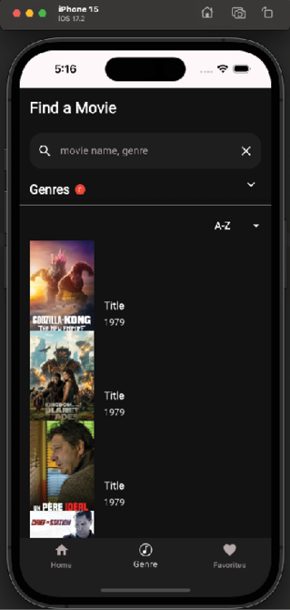
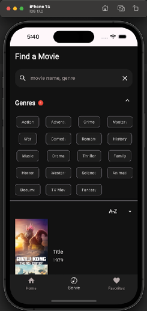
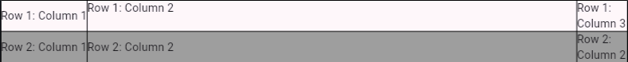
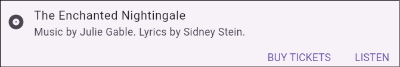
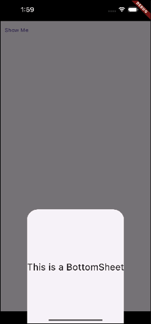
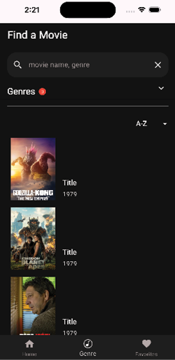
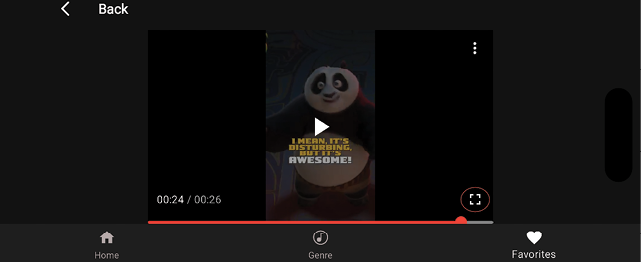

# [CHAPTER 7 Advanced Widgets](contents.md#ch07a)

## [Introduction](contents.md#sc2_135a)

In this chapter, you will learn about advanced Flutter widgets and how to use them in your movie app. This will allow you to show more information on the screen as well as show that data in different ways. These are essential widgets that are used in Flutter apps. Widgets for showing large numbers of other widgets are critical for most apps.

## [Structure](contents.md#sc2_136a)

The chapter covers the following topics:

- ListView
- Expanded
- Stack
- IndexedStack
- LayoutBuilder
- GridView
- Table
- Card
- BottomSheets
- Slivers
- Movie trailers

## [Objectives](contents.md#sc2_137a)

You will learn about the more advanced widgets that Flutter provides. These widgets require more setup but can do some amazing things. As you learn about these widgets, you will build out the movie app with them. By the end of the chapter, you will know how to show horizontal and vertical lists of data, grids of data, and how to stack widgets. You will also have a solid understanding of slivers.

## [ListView](contents.md#sc2_138a)

In the last chapter, you used a column to display some movie titles. If your screen was a bit smaller or you added one more item, you would have seen a striped line with the message about overflow. This happens when your widget overflows the area it can draw. To avoid that problem, you need a widget that can scroll. `ListView` is one of the main widgets that are used to display a list of items either horizontally or vertically. You will use the same class and just change the orientation field if you want to show them horizontally. `ListView` has several different constructors you can use to display your list, as follows:

- `ListView`: Default constructor. Uses a children parameter for a fixed list of widgets.

- `ListView.builder`: Uses two key fields `itemCount` (number of items) and `itemBuilder` (used to return an item for a specific index).

- `ListView.separated`: Like a builder but puts dividers between each row.

- `ListView.custom`: Uses a `childrenDelegate` that is like a builder, returning items for a given index. Delegates provide a lot more power than just using a builder.

You will probably use either the `builder` or the `separated` constructors the most. They are flexible and easy to use.

All these methods take a `ScrollController` as a parameter. You do not have to pass one in, but if you do not, one will be created for you. A scroll controller will allow you to jump or animate to a specific position in the list. Vertical lists are the default. If you want a horizontal list, you will pass the following:

```dart
scrollDirection: Axis.horizontal
```

The `builder` and `separated` constructors take a builder parameter that looks as follows:

```dart
builder: (BuildContext context, int index) {}
```

Here, the `index` is the index value in your list of items to show. To see how `ListView` works, we will convert the `VerticalMovieList` `Column` to use a `ListView` that can handle a scrolling list of movies. Open `vert_movie_list.dart` and replace the column in the build method with the following:

```dart
return ListView.builder(
  itemCount: movies.length,
  itemBuilder: (context, index) {
    return MovieRow(
        movie: movies[index],
    );
  },
);
```

Now, return to `genre_screen.dart` and update the call to:

```dart
VerticalMovieList(movies: images, onMovieTap: (movieId) {},),
```

This will send the whole list of movies to the widget. Hot reload. You will probably see a white screen with lots of errors in the console. You will see the following error message a lot:

```bash
Vertical viewport was given unbounded height.
```

This means that one or several widgets do not give a fixed height and try to take up an infinite height, which causes this error. How do we solve this? We will use the `Expanded` widget.

## [Expanded](contents.md#sc2_139a)

The `Expanded` widget tries to take up as much width or height as its row or column will allow. `Expanded` only works in these two widgets - `Row` and `Column`. Wrap the `ListView` call in an `Expanded` and hot reload. The following code uses an `Expanded` widget to fill the column and then a `ListView` with the list of movies:

```dart
return Expanded(
  child: ListView.builder(
    itemCount: movies.length,
    itemBuilder: (context, index) {
      return MovieRow(
        movie: movies[index],
      );
    },
  ),
);
```

Here is what we have so far. Notice that you can scroll the list of movies, as shown in the following figure:



Figure 7.1: ListView

Now, open `horiz_movies.dart`. In [Chapter 4](ch04.md), Basic Widgets (Adding a movie row), you added a `ListView` to this class. Here, you can see that it is a horizontal list and uses the movies list passed in. The code for this is as follows:

```dart 
// 1
return SizedBox(
  height: 142,
  child: ListView.builder(
    // 2
    scrollDirection: Axis.horizontal,
    // 3
    itemCount: movies.length,
    // 4
    itemBuilder: (context, index) {
      return GestureDetector(
        onTap: () {},
        child: SizedBox(
          width: 100,
          height: 142,
          child: CachedNetworkImage(
            imageUrl: movies[index],
            alignment: Alignment.topCenter,
            fit: BoxFit.fitHeight,
            height: 100,
            width: 142,
          ),
        ),
      );
    },
  ),
);
```

The description of the code is as follows:

1. This shows a horizontal list of movies at a fixed height of 142 pixels.
1. Make this a horizontal list.
1. Set the item count to the number of movies.
1. Use the `itemBuilder` to return a 100x142 movie image.

## [Stack](contents.md#sc2_140a)

A `Stack` widget displays its children, with the first one in the list displayed at the bottom. The advantage of this widget is you can use the `Positioned` widget to place items on top of each other or on different sides of the stack’s box. The `Positioned` widget takes the top, left, bottom, and right position parameters. These are pixels from the top and left. You can also use the `Align` widget, which has an `alignment` parameter that can be `topCenter`, `topLeft`, `topRight`, `centerXXX`, and `bottomXXX`. The detail page will use the stack to show text on top of an image. A `Stack` with an image would be created by using the following code:

```dart
return Stack(children: [
  Align(
    alignment: Alignment.topCenter,
    child: CachedNetworkImage(
      imageUrl: imageUrl,
      alignment: Alignment.topCenter,
      fit: BoxFit.fitWidth,
      height: 200,
      width: screenWidth,
    ),
  ),
]),
```

This will show an image in the top center of the stack. If you add additional images or text, they will lay on top of this image. This is useful for our detail page, where we want to display the movie details above the image.

## [IndexedStack](contents.md#sc2_141a)

A `IndexedStack` widget is like a stack but displays only one child at a time. It is useful as a paging widget that allows the user to display different pages when they click on a controlling widget. It would look as follows:

```dart
return IndexedStack(
  index: _selectedIndex,
  children: [widget1, widget2, widget3],
);
```

Another widget would change `_selectedIndex` to have the stack change.

## [LayoutBuilder](contents.md#sc2_142a)

If you ever need to know how big an area is to draw in, then `LayoutBuilder` is a great widget. It uses a `builder` parameter that passes in a `BoxConstraints`. Then, based on the constraints of `min` and `max`, `width`, and `height`, you decide whether to show different layouts or just size a widget to the max width or height. This is perfect for when you have a fixed size and want to put an image inside. Just use a `SizedBox` with the constraints, max width, or height. These constraints are the parent's constraints and are useful if you need to do any custom layouts. You could use one layout for tablets and another for phones using the `maxWidth` field. The following is a small example:

```dart
@override
Widget build(BuildContext context) {
  return MaterialApp(
    debugShowCheckedModeBanner: false,
    home: Scaffold(
      body: Center(
        child: LayoutBuilder(builder: (context, constraints) {
          if (constraints.maxWidth > 600) {
            return Row(children: [Text('Wide Screen')]);
          } else {
            return Column(children: [Text('Narrow Screen')]);
          }
        }),
      ),
    ),
  );
}
```

You can see that we check the `maxWidth` property of the `constraints` parameter, and if it is greater than 600 (which usually signifies a tablet), we show a different layout than if it is smaller than 600 (like on a phone).

## [GridView](contents.md#sc2_143a)

`GridView` takes lists to the next level. They allow you to display items both horizontally and vertically. There are also ways to display a fixed set of columns or to even stagger mixed widths and heights. Grids work a bit differently in that they take a delegate, which is of type `SliverGridDelegate` (Slivers will be talked about in upcoming sections), and describe how the rows and columns will be set. Like list views, grids have several constructors, as follows:

- `GridView`: Default constructor.
- `GridView.builder`: Use a builder to return a widget.
- `GridView.count`: Display items with a fixed count of cross-axis items.
- `GridView.extend`: Each item has a maximum cross-axis size.
- `GridView.custom`: Roll your own Grid. There are no defaults; you must provide all parameters.

Open up `genre_section.dart` and scroll to the last row. Here, we just showed a list of about four chips. To display more, we will be using a `GridView`. Replace the `Row` with the following:

```dart
child: GridView.builder(
  shrinkWrap: true,
  // 1
  itemCount: chips.length,
  // 2
  gridDelegate:
      // 3
      const SliverGridDelegateWithMaxCrossAxisExtent(
        maxCrossAxisExtent: 100,
        crossAxisSpacing: 16,
        childAspectRatio: 1.5,
        mainAxisSpacing: 0,
      ),
  // 4
  itemBuilder: (BuildContext context, int index) {
    return chips[index];
  },
),
```

This uses the `builder` constructor with several parameters, as follows:

1. `itemCount` is the total number of items.
1. `gridDelegate` describes how the grid will be laid out.
1. This delegate lays out its children with a width of 100, 16 pixels of vertical space, and an aspect ratio of 1.5 (set the cross-axis height as a ratio of the width).
1. Return an item at the given index.

Back in `genre_screen.dart`, update the list of genres to include the full list, as follows:

```dart
GenreState(genre: 'Action', isSelected: false),
GenreState(genre: 'Adventure', isSelected: false),
GenreState(genre: 'Crime', isSelected: false),
GenreState(genre: 'Mystery', isSelected: false),
GenreState(genre: 'War', isSelected: false),
GenreState(genre: 'Comedy', isSelected: false),
GenreState(genre: 'Romance', isSelected: false),
GenreState(genre: 'History', isSelected: false),
GenreState(genre: 'Music', isSelected: false),
GenreState(genre: 'Drama', isSelected: false),
GenreState(genre: 'Thriller', isSelected: false),
GenreState(genre: 'Family', isSelected: false),
GenreState(genre: 'Horror', isSelected: false),
GenreState(genre: 'Western', isSelected: false),
GenreState(genre: 'Science Fiction', isSelected: false),
GenreState(genre: 'Animation', isSelected: false),
GenreState(genre: 'Documentation', isSelected: false),
GenreState(genre: 'TV Movie', isSelected: false),
GenreState(genre: 'Fantasy', isSelected: false),
```

Do a hot restart as a reload will not re-run the `initState` method. The following figure shows a grid of columns and rows:



Figure 7.2: GridView

As you can see, there are four columns and five rows. If the screen changes sizes (like on the web), it will expand to fill the area.

## [Table](contents.md#sc2_144a)

`Table`s are great for data that needs to be displayed in columns and rows. You can set each column width, and have a border. A `Table`'s children are a list of `TableRow` widgets. Each row can contain a normal widget or a `TableCell` widget. `TableCell` can control the alignment of the widget it contains. One of the differences between a `GridView` and a `Table` is that a `GridView` tries to size its columns and rows based on its widgets, while a Table forces its widgets to fit into the size of the column. The following is an example:

```dart
@override
Widget build(BuildContext context) {
  return MaterialApp(
    debugShowCheckedModeBanner: false,
    home: Scaffold(
      // 1
      body: Table(
        // 2
        border: TableBorder.all(),
        // 3
        columnWidths: const <int, TableColumnWidth>{
          0: IntrinsicColumnWidth(),
          1: FlexColumnWidth(),
          2: FixedColumnWidth(64),
        },
        defaultVerticalAlignment: TableCellVerticalAlignment.middle,
        // 4
        children: <TableRow>[
          // 5
          TableRow(
            children: <Widget>[
              Text('Row 1: Column 1'),
              // 6
              TableCell(
                verticalAlignment: TableCellVerticalAlignment.top,
                child: Text('Row 1: Column 2'),
              ),
              Text('Row 1: Column 3'),
            ],
          ),
          TableRow(
            decoration: const BoxDecoration(
              color: Colors.grey,
            ),
            children: <Widget>[
              Text('Row 2: Column 1'),
              Text('Row 2: Column 2'),
              Center(
                child: Text('Row 2: Column 2'),
              ),
            ],
          ),
        ],
      ),
    ),
  );
}
```

This will be displayed as shown in the following figure:



Figure 7.3: Table

The code uses several widgets that are needed for a `Table`: `TableRow` for rows and `TableCells` or other widgets for the individual items. The code is described by the following:

1. Start with the `Table` widget.
1. You can specify a border if needed. This can specify the color, line width, and border radius.
1. You can specify different column widths. Either fixed or sized for the included widgets.
1. The children should have a list of `TableRow`.
1. Each `TableRow` can have a list of table columns. The number of widgets should match the number of columns.
1. Besides regular widgets, you can use a `TableCell` to add more formatting.

Of course, tables are great for data that you would use in a spreadsheet, but they can be used if you want fixed columns.

## [Card](contents.md#sc2_145a)

`Card`s have rounded borders with elevations. They are useful for having sections stand out from the rest of the layout. You can add a `child` widget that can also contain other widgets. For example:

```dart
Card(
  child: Column(
    children: [
      Text('Title of Object'),
      Text('Description of Object')
    ],
  ),
)
```

You can set the `color`, `shadowColor`, `surfaceTintColor`, `elevation`, and `shape`. The following is an example of a ticket card:



Figure 7.4: Card

Apart from the default constructor (which builds an elevated card), you can use `Card.filled` for a filled card and `Card.outlined` for an outline card.

## [BottomSheets](contents.md#sc2_146a)

As the name implies, `BottomSheets` are information items that are on the bottom of the screen. There are two kinds: Persistent and modal. Persistent sheets will stay in place, while modal sheets force the user to interact with the sheet until it is dismissed. These sheets can be animated and can have a drag handle. To show a bottom sheet, you would use the `showBottomSheet` method, and in the `builder` function, you would return a widget. You can change the background color using the `backgroundColor` parameter. A `BottomSheet` might look as follows:



Figure 7.5: BottomSheet

The code is as follows:

```dart
@override
Widget build(BuildContext context) {
  return MaterialApp(
    debugShowCheckedModeBanner: false,
    home: SafeArea(
      child: Scaffold(
        body: TextButton(
          child: Text('Show Me'),
          onPressed: () {
            // 1
            showModalBottomSheet(
              context: context,
              // 2
              builder: (BuildContext context) {
                return Container(
                  height: 300,
                  child: Column(
                    mainAxisAlignment: MainAxisAlignment.center,
                    children: [
                      Text(
                        'This is a BottomSheet',
                        style: TextStyle(fontSize: 24),
                      ),
                    ],
                  ),
                );
              },
            );
          },
        ),
      ),
    ),
  );
}
```

This code shows a modal bottom sheet when the user presses the text button.

## [Slivers](contents.md#sc2_147a)

`Slivers` are scrollable widgets and can be used in lists of slivers. You need to use a `CustomScrollView` as a parent widget and then add slivers to the `slivers` list parameter. There are many different types of slivers, as follows:

- `SliverList`: Displays a linear list of items.
- `SliverGrid`: Displays a 2D array of children.
- `SliverAppBar`: A material design app bar that integrates with a `CustomScrollView` and allows the bar to change while scrolling other items.
- `SliverToBoxAdapter`: A sliver that contains a single box widget. Useful for converting slivers to a widget that conforms to a regular type of widget.
- `SliverPadding`: Adds padding around another sliver.

> 通常可滚动组件的子组件可能会非常多、占用的总高度也会非常大；如果要一次性将子组件全部构建出将会非常昂贵！为此，Flutter中提出一个Sliver（中文为“薄片”的意思）概念，Sliver 可以包含一个或多个子组件。Sliver 的主要作用是配合：加载子组件并确定每一个子组件的布局和绘制信息，如果 Sliver 可以包含多个子组件时，通常会实现按需加载模型。
>
> 只有当 Sliver 出现在视口中时才会去构建它，这种模型也称为“基于Sliver的列表按需加载模型”。可滚动组件中有很多都支持基于Sliver的按需加载模型，如ListView、GridView，但是也有不支持该模型的，如SingleChildScrollView。

The first sliver you will use is `SliverPadding`. You will create your own sliver widget to create a divider. In the widgets folder, create a new file named `sliver_divider.dart`. Add the following:

```dart
import 'package:flutter/material.dart';
import 'package:movies/ui/theme/theme.dart';

class SliverDivider extends StatelessWidget {
  const SliverDivider({super.key});

  @override
  Widget build(BuildContext context) {
    return const SliverPadding(
      padding: EdgeInsets.only(left: 16, top: 8, right: 16, bottom: 8),
      sliver: SliverToBoxAdapter(
        child: Divider(
          color: primaryButton,
          thickness: 1.0,
        ),
      ),
    );
  }
}
```

Since this widget returns a `SliverPadding`, it is itself a sliver. The `SliverToBoxAdapter` class converts the widgets below to `sliver` (in this case, just a regular divider).

Open up `genre_screen.dart`. We are going to convert some of the items into slivers. Find the first `Row`. Remove the `Row` and `GenreSearchRow` and replace it with the following:

```dart
Expanded(
  child: CustomScrollView(
    slivers: [
      SliverList(
        delegate: SliverChildListDelegate(
          [
            Padding(
              padding: const EdgeInsets.fromLTRB(16, 16.0, 0.0, 24.0),
              child: Text(
                'Find a Movie',
                style: Theme.of(context).textTheme.titleLarge
              ),
            ),

            GenreSearchRow((searchString) {}),
          ],
        ),
      ),
    ],
  ),
),
```

Change the `Divider` to `SliverDivider` and import the widget. You will next need to fix the number of parentheses and brackets at the end. This is good practice as you will do this many times. The following is what the ending of the widget looks like:

```dart
          ],
        ),
      ),
    );
  }
}
```

Dealing with parentheses is one area that gets messy with widgets. However, the more you break your widgets up into their own classes, the smaller each class will be and the easier it will be to read. Hot reload your app to make sure it still works. You should get an error, and it should look as follows:

```dash
A RenderViewport expected a child of type RenderSliver but received a child of type _RenderMergeableMaterialListBody.
```

Any idea what this means? If you have a list of slivers and one of them is not one, you will get this message. That means one of the widgets is not a sliver. It looks like `VerticalMovieList` uses an `Expanded` (which can only be in a row or column) and a `ListView`. Let us change that. Open up `vert_movie_list.dart` and change `Expanded` and the `ListView.builder` (up to the `itemBuilder`) to the following:

```dart
return SliverList(
  delegate: SliverChildBuilderDelegate(
    childCount: movies.length,
    (BuildContext context, int index) { 
```

Open `genre_section.dart` and add the following before the `ExpansionPanelList`:

```dart
return SliverList(
  delegate: SliverChildListDelegate([
```

Remove the return before the `ExpansionPanelList`. Fix the ending parentheses. Next, open up `sort_picker.dart`. Add a new parameter, as follows: 

```dart
final bool useSliver;
```

Replace the constructor with the following:

```dart
const SortPicker({required this.useSliver, required this.onSortSelected, super.key});
```

Replace the line: `Widget build(BuildContext context) {` with the following:

```dart
Widget build(BuildContext context) {
  if (widget.useSliver) {
    return SliverToBoxAdapter(
      child: buildRow(),
    );
  } else {
    return buildRow();
  }
}

Widget buildRow() {
```

Back in `genre_screen.dart`, add the following:

```dart
useSliver: true,
```

The code provides the parameter to the `SortPicker`. Perform a hot restart, and the code should work. The following shows the Genres screen with the list of movies and the new `SliverList`:



Figure 7.6: Genre screen

You can now scroll through the list of movies and see all the movies on the list.

## [Movie trailers](contents.md#sc2_148a)

One area that needs work is the ability to show videos. In the case of the movie app, the ability to show movie trailers. These are short videos that showcase the movie. To show a video from YouTube, we will use a plugin called `pod_player`. Open up `pubspec.yaml` and add the following:

```yaml
pod_player: ^0.2.2
```

Run `flutter pub get`. In the `ui/screens` folder, create a new folder named `videos`. Then, create a new dart file named `video_page.dart`. Then add the following:

```dart
import 'package:flutter/material.dart';
import 'package:flutter_riverpod/flutter_riverpod.dart';
import 'package:pod_player/pod_player.dart';

class VideoPage extends ConsumerStatefulWidget {
  final String movieVideo;

  const VideoPage(this.movieVideo, {super.key});

  @override
  ConsumerState<VideoPage> createState() => _VideoPageState();
}

class _VideoPageState extends ConsumerState<VideoPage> {
  late final PodPlayerController podPlayerController;

  @override
  Widget build(BuildContext context) {
    return Placeholder();
  }
}
```

Here, the only new code is the `PodPlayerController`. This class is a controller for the `PodVideoPlayer` widget from the `pod_player` plugin. Since this variable is defined as a late variable, we need to initialize it using the `initState` method. First, we need to create a utility method for building a YouTube video URL. Open up `utils.dart` and add the following:

```dart
String youtubeUrlFromId(String videoId) {
  return 'https://www.youtube.com/watch?v=$videoId';
}
```

This is a simple method that just concatenates the video id to the URL. Back in `video_page.dart`, add the following before the build method:

```dart
@override
void initState() {
  super.initState();
  // 1
  final playVideoFrom = PlayVideoFrom.youtube(
    youtubeUrlFromId(widget.movieVideo),
  );
  // 2
  podPlayerController = PodPlayerController(
    playVideoFrom: playVideoFrom,
    podPlayerConfig: const PodPlayerConfig(autoPlay: false),
  )..initialise();
}

@override
void dispose() {
  // 3
  podPlayerController.dispose();
  super.dispose();
}
```

These two methods, `initState` and `dispose`, set up and dispose of the video controller:

1. Use the new utility method to get the URL and create a `PlayVideoFrom` class to pass to the controller.

2. Create the controller passing in the video URL class and config.

3. Dispose of the controller when done.

Next, add a method to get the video player. Use the following code:

```dart
Widget getVideoPlayer(BuildContext context) {
  return Scaffold(
    appBar: AppBar(
      backgroundColor: screenBackground,
      leading: BackButton(
        color: Colors.white,
        onPressed: () {},
      ),
      centerTitle: false,
      title: Text('Back', style: Theme.of(context).textTheme.headlineMedium),
    ),
    body: Container(
      width: double.infinity,
      height: double.infinity,
      color: screenBackground,
      child: Column(
        mainAxisSize: MainAxisSize.max,
        crossAxisAlignment: CrossAxisAlignment.center,
        children: [
          Expanded(
            child: PodVideoPlayer(
              controller: podPlayerController,
              matchVideoAspectRatioToFrame: true,
            ),
          ),
        ],
      ),
    ),
  );
}
```

At the bottom of the method is the `PodVideoPlayer`, use the controller and a flag to match the video's aspect ratio to the screen. Now replace the build method with the following:

```dart
@override
Widget build(BuildContext context) {
  SystemChrome.setPreferredOrientations([
    DeviceOrientation.portraitUp,
    DeviceOrientation.portraitDown,
    DeviceOrientation.landscapeLeft,
    DeviceOrientation.landscapeRight,
  ]);
  return getVideoPlayer(context);
}
```

The `SystemChrome` class is useful for changing the orientation of the device. Here, we change the device orientation to allow landscape and then return the video player. Return to `main_screen.dart` and change the last `Placerholder` with the following:

```dart
screens.add(VideoPage('QwW5RD02uJo'));
```

This calls the video page with a YouTube key that is a trailer for a Kung Fu Panda movie. Stop the app (When you have plugins that have device-specific code, you must rebuild your app and you cannot hot reload). Restart the app and click on the Favorites button.

>Note: That we are just using this page to show the video but will be replacing it with favorites later.

The device will turn to landscape, as shown in the following figure:



Figure 7.7: Video screen

If you press the expand button, you will see the window expand to full screen. However, this depends on the video that you are playing. This specific video was built for phones in portrait mode, as shown in [Figure 7.8](#fig7-8):


Figure 7.8: Fullscreen video

In the chapter on the web and desktop, we will use a different package to show videos for the web.

## [Conclusion](contents.md#sc2_149a)

In this chapter, you learned a lot about the more advanced widgets like `ListView`, `GridView`, `Table`, `BottomSheets`, and `Slivers`. You were able to update the app to use these advanced widgets to show more items. You also created a video page and were able to show a video trailer for a movie.

In the next chapter, you will learn about navigation and routing. This is a very important topic that will allow you to switch between different screens. You will use a specific package to push screens on a stack and pop them off when returning.
