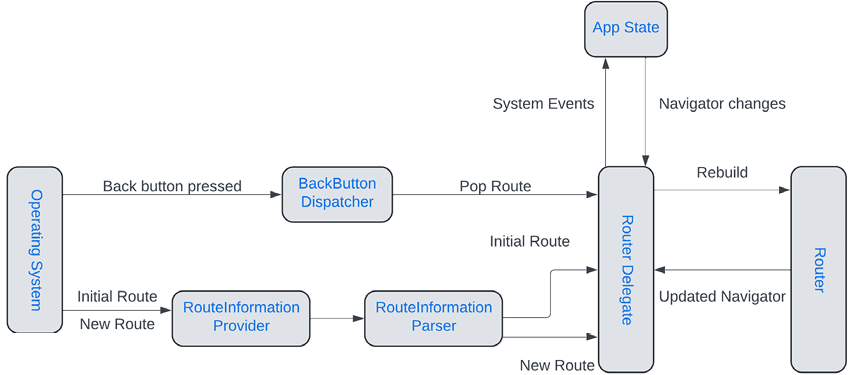
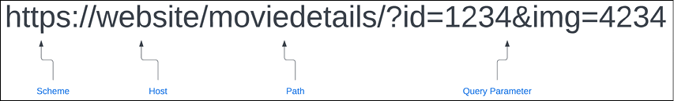
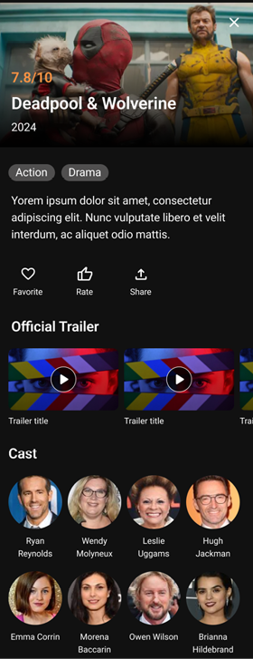
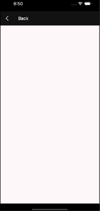
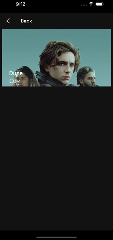
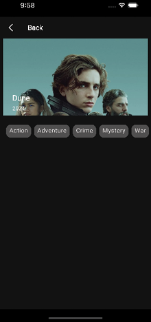
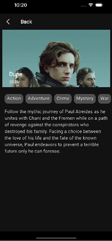
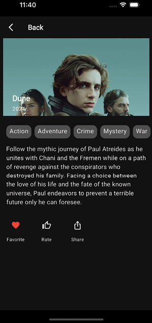
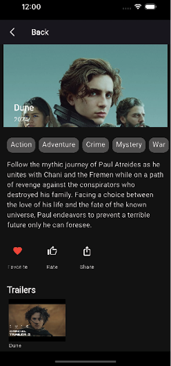

# [CHAPTER 8Navigation and Routing](contents.md#ch08a)

## [Introduction](contents.md#sc2_150a)

In this chapter, you will learn about how Flutter apps navigate between pages. You will also learn about the built-in `Navigator` widget in Flutter and a newer way to handle navigation with `Navigator` 2.0. In addition, you will learn about packages that make navigation easier, and use one of the packages to hook up the movie app to allow the user to move among the pages of the app.

## [Structure](contents.md#sc2_151a)

The chapter covers the following topics:

- `Navigator` widget
- Named routes
- Deep linking
- Bottom navigation
- GoRouter and AutoRoute
- Connecting the movie app

## [Objectives](contents.md#sc2_152a)

By the end of this chapter, you will understand how the old `Navigator` and the new `Navigator` work. You will also have an understanding of deep linking and several navigation packages. You will set up `AutoRoute` as the navigation package and start creating routes. Finally, you will build up the movie details page, learn how to create a route and use navigation to go there.

## [Navigator widget](contents.md#sc2_153a)

`Navigation` is the ability to go from one screen to another. **In Flutter, the system uses a stack to push screens to the front and to pop them when the user is done with that screen.** It is important to understand how the system works before using some of the packages that will make the process even easier.

Any app needs the ability to transition from one page to another and then back. Flutter uses the `Navigator` widget. These pages are called `routes` in Flutter. Routing consists of just pushing and popping pages.

In Flutter, the `Router` API (or Navigator >=2.0) was introduced. The advantages of the Router API are as follows:

- Exposes the Navigator’s page stack.
- Handles the back button on Android devices.
- Allows nested Navigators.
- Deep linking and web URLs are handled.

### [Navigator](contents.md#sc3_154a)

The `Navigator` widget has an array of pages. A Page is an abstract class that has a name and argument. The most common page subclass used is `MaterialPage`. The `pages` field is the list of pages that can be shown in an application. You can change the items in the page list when your app changes so that different pages are shown. There are a few important methods, as follows:

- `push(context, route)`: Push a new route/page to the stack.
- `pop(context)`: Pop the current, top-level page off the stack, showing the next page on the stack.

There is an example at [Navigate to a new screen and back](https://docs.flutter.dev/cookbook/navigation/navigation-basics)

You could put some logic to return different pages, but that is messy and does not work well for large amounts of screens and complex logic.

> 路由入栈（push）操作对应打开一个新页面，路由出栈（pop）操作对应页面关闭操作，而路由管理主要是指如何来管理路由栈。

### [Router](contents.md#sc3_155a)

The `Router` widget is a page dispatcher that wraps a `Navigator` class. To use deep linking, you will need to use the `Router` widget. Here is what the flow looks like for the Router API (Figure 8.1):



Figure 8.1: Router API

This shows some of the important classes involved with navigation. We will be using a package to handle this and make it easier, but it is important to understand how the Flutter system works.

#### [RouterDelegate](contents.md#sc3_156a)

The `RouterDelegate` responds to app state and route changes and builds a new `Navigator` with an updated list of pages.

The `RouterDelegate` class has a few methods, listed as follows:

- `setInitialRoutePath`: Given a class with the route, configure the router.
- `setRestoredRoutePath`: Given a class, restore the route state.
- `setNewRoutePath`: Set a new route path given the data class.
- `popRoute`: Remove the current page from the stack.

#### [RouterInformationParser](contents.md#sc3_157a)

The `RouterInformationParser` is an abstract class that acts as a delegate between the router widget and the route information provided by the system. It is responsible for parsing the route information into a configuration object that can be understood by the `RouterDelegate`. The `RouterInformationParser` transforms `RouteInformation` values into a user-defined class.

The `RouterInformationParser` class has three methods, as follows:

- `parseRouteInformation`: Parse a `RouteInformation` parameter and return a data class.
- `parseRouteInformationWithDependencies`: Has an extra `BuildContext` parameter.
- `restoreRouteInformation`: Given the data class, return a `RouteInformation` instance.

#### [RouteInformationProvider](contents.md#sc3_158a)

The `RouteInformationProvider` provides the app's current route and notifies listeners of any changes. It will be used by the `Router` widget to determine which screen to display. It is also used to monitor changes in the route and notify listeners.

The `RouteInformationProvider` class has just one method:

- `routerReportsNewRouteInformation`: As this class is a `ValueListenable`, you can take this new information and notify users of the change.

### [MaterialApp](contents.md#sc3_159a)

The `MaterialApp` class can either be provided as a router class or individual parameters. Here are some parameters associated with navigation:

- `navigatorKey`: Global Key tied to the `Navigator`.
- `initialRoute`: Starting route (String-based).
- `navigatorObservers`: List of listeners to navigation events.
- `onUnknownRoute`: Uses a function that takes a `RouteSettings` instance and returns a `Route` to handle unknown routes.
- `onNavigationNotification`: Notification callback listener.
- `routes`: Map of route names and `WidgetBuilders`.

One of the nice features about a global `Navigator` key is that you can use it anywhere to navigate to other pages. However, you can also just use `Navigator.of(context)` to get the current `Navigator`. You could use the key if you had multiple `Navigator`s. To use a global key, you would define it as:

```dart
final navigatorKey = GlobalKey<NavigatorState>();
```

You would then add it to the `MaterialApp` and other pages could push a page as follows:

```dart
navigatorKey.currentState?.push(MaterialPageRoute(builder: (context) => NewRoute()));
```

The second method is to use the `MaterialApp.router` method. It takes the following parameters:

- `routeInformationProvider`: Provides route information for the router widget.
- `routeInformationParser`: Parses route information into a class.
- `routerDelegate`: Main class for handling routing.
- `routerConfig`: This can be used in place of the other parameters. Contains all the above elements.
- `backButtonDispatcher`: Handles back button actions. There are two provided classes you can use (or create your own): `ChildBackButtonDispatcher` and `RootBackButtonDispatcher`. The root dispatcher is the default. The child dispatcher is for handling back button presses from a parent.

You will normally use the router method with packages as they have a config class you can use which makes it easier to set up.

## [Deep linking](contents.md#sc2_161a)

Another way to use routes is through deep linking. A deep link is a URL that points to a specific page in an app. Just like on a web page, clicking on a URL in an email or webpage can take the user to a page in an app if the app is installed on their phone. Once the app receives the deep link, the router needs to figure out which page to go to. A URL looks as shown in Figure 8.2:



Figure 8.2: URLs

A URL is made up of a scheme (usually https), a host name (a specific website), a path to the page, and a set of query parameters (after a ?).

### [Custom schemes](contents.md#sc3_162a)

In addition to the https scheme, on mobile, you can create your own scheme. For example, we could create a scheme called `movieapp`. This would look as follows:

```dart
movieapp://moviedetails/?id=1234
```

This only works on mobiles. On Android, this is called a deep link while on iOS, it is called a custom URL. This scheme needs to be defined in Android’s `AndroidManifest.xml` and iOS’s `info.plist` files. This is an easy way to set up a link but comes with some downsides(缺点):

- Anyone can use the same scheme.
- You have to have the app installed for this to work.

If you want to use an https scheme for deep linking, you need to own the host site. These links are called `App Links` on Android and `Universal Links` on iOS. There is also host verification that is performed by Android and iOS devices.

### [Android deep links](contents.md#sc3_163a)

To handle deep links on Android, you will need to add an intent filter to the `activity` tag (named `.MainActivity`) in the `android/app/src/main/AndroidManifest.xml` file. The entry code is as follows:

```xml
<intent-filter android:autoVerify="true">
  <action android:name="android.intent.action.VIEW" />
  <category android:name="android.intent.category.DEFAULT" />
  <category android:name="android.intent.category.BROWSABLE" />

  <data android:scheme="https" />
  <data android:host="yourDomain.com" />
</intent-filter>
```

For custom schemes, add the following code:

```xml
<meta-data android:name="flutter_deeplinking_enabled" android:value="true" />
<intent-filter android:autoVerify="true">
  <action android:name="android.intent.action.VIEW" />
  <category android:name="android.intent.category.DEFAULT" />
  <category android:name="android.intent.category.BROWSABLE" />

  <data android:scheme="yourScheme" />
  <data android:host="yourDomain.com" />
</intent-filter>
```

> `<meta-data ..>` 部分, 在 Flutter 的版本低于 3.27 时才需要手动添加.

You would add this intent filter to an Activity that would handle the https scheme. For Flutter, it would go to the Flutter `MainActivity` (a subclass of FlutterActivity) that is created for you. You can also set a path if you want your app to handle just a specific area of a URL. To find out more about the possible data values you can visit: <https://developer.android.com/guide/topics/manifest/data-element>

#### [Verifying a domain](contents.md#sc4_164a)

Now that the app knows what kind of URLs it should handle, you must ensure your domain recognizes your app as a trusted URL handler.

> 注意: 这一步骤仅适用于 HTTP/HTTPS links, 不适用 custom schemes.

To use URLs with your own domain, you need to create a file named `assetlinks.json`. This file will contain the digital asset links that associate your site with your app. The file will look as follows:

```json
[{
  "relation": ["delegate_permission/common.handle_all_urls"],
  "target": {
    "namespace": "android_app",
    "package_name": "com.bpb.movieapp",
    "sha256_cert_fingerprints": ["FF:2A:CF:7B:DD:CC:F1:03:3E:E8:B2:27:7C:A2:E3:3C:DE:13:DB:AC:8E:EB:3A:B9:72:A1:0E:26:8A:F5:EC:AF"]
  }
}]
```

You will need to use your own `package_name` and `sha256_cert_fingerprints` value. You can create the sha value by using:

```bash
keytool -list -v -keystore <path-to-keystore> -alias <key alias> -storepass <store password> -keypass <key password>
```

You then need to store this file at:

```bash
<webdomain>/.well-known/assetlinks.json
```

When you have everything setup on your website, to check if the `assetlinks.json` file is correctly set up, use the statement list tester tool provided by Google at <https://developers.google.com/digital-asset-links/tools/generator>.

Or, if you sign your production app via Google Play Store, you can find it in the `Developer Console` at `Setup` > `App Integrity` > `App Signing`.

#### [Testing Android](contents.md#sc4_165a)

To test links on Android you will need to test from the command line. You will use the adb command that is located in `android/platform-tools/` folder. Make sure your path is set or just type in the full path.

For https links, you would use:

```bash
adb shell am start -a android.intent.action.VIEW \
  -c android.intent.category.BROWSABLE \
  -d https://yourDomain.com \
  <package name>
```

For custom schemes use:

```bash
adb shell am start -a android.intent.action.VIEW \
  -c android.intent.category.BROWSABLE \
  -d yourScheme://yourDomain.com \
  <package name>
```

> If you're running on Windows, use `^` rather than `\` to break your command into multiple lines. Alternatively, write your command in a single line.

You can also email yourself the link on the phone and test that way. For https links, you will get a dialog on Android asking if you want to show the link with a web browser or your app. This is normal and will go away if you have the `android:autoVerify="true"` setting in your manifest and your website is set up properly.

> If tapping the URL opens your app **inside** the source app (like Gmail or WhatsApp), rather than its own window, add `android:launchMode="singleTask"` inside your `<activity>` tag.

### [iOS deep links](contents.md#sc3_166a)

For iOS, the process is different and requires you to modify the `info.plist` file. You can do this in Xcode, Android Studio, or a text editor.

> You can learn it from [Set up universal links for iOS](https://docs.flutter.dev/cookbook/navigation/set-up-universal-links) or [Set up deep links for iOS](https://codewithandrea.com/articles/flutter-deep-links/#setting-up-deep-links-on-ios)
>

上述内容参考了 [Flutter Deep Linking: The Ultimate Guide](https://codewithandrea.com/articles/flutter-deep-links/)

## [Bottom navigation](contents.md#sc2_169a)

One of the simplest ways to navigate is with the bottom navigation widget. You saw this in main_screen.dart. Add the following:

```dart

The formatted version (lines 255–274, removing blank lines and applying Dart 2-space indentation) should be:

```dart
@override
Widget build(BuildContext context) {
  return Scaffold(
    body: screens[index],
    bottomNavigationBar: BottomNavigationBar(
      items: const [
        BottomNavigationBarItem(icon: Icon(Icons.home), label: 'Home'),
        BottomNavigationBarItem(icon: Icon(Symbols.genres), label: 'Genre'),
        BottomNavigationBarItem(icon: Icon(Icons.favorite), label: 'Favorites'),
      ],
      currentIndex: index,
      onTap: (navIndex) {
        setState(() {
          index = navIndex;
        });
      },
    ),
  );
}
```

This is a widget that is at the bottom of the screen and contains three to five items. You use the `BottomNavigationBarItem` class to define an icon and label. When a button is selected, the `onTap` method is called. Usually, you need to change the current index, but you can perform additional actions if needed.

A newer Material 3 navigation widget is the `NavigationBar` class. Open up `main_screen.dart` and change the `bottomNavigationBar` code to the following:

```dart
NavigationBar(
  destinations: const [
    NavigationDestination(icon: Icon(Icons.home), label: 'Home'),
    NavigationDestination(icon: Icon(Symbols.genres), label: 'Genre'),
    NavigationDestination(icon: Icon(Icons.favorite), label: 'Favorites'),
  ],
  selectedIndex: index,
  onDestinationSelected: (navIndex) {
    setState(() {
      index = navIndex;
    });
  },
),
```

This is similar to a `BottomNavigationBar` but uses the keyword destinations and then uses `NavigationDestination` instances. `currentIndex` is now `selectedIndex` and `onTap` is now `onDestinationSelected`. One key difference is that you will need to change the theme to change colors of the text and icons. In addition to the `NavigationBar` class, Material provides the `NavigationRail` class. This widget is used on the left or right side of the screen to navigation between a small amount of items. Open up `theme.dart` and add the following after `appBarTheme`:

```dart
navigationBarTheme: NavigationBarThemeData(
  backgroundColor: searchBarBackground,
  labelTextStyle: WidgetStateTextStyle.resolveWith((Set<WidgetState> states) {
    // If the item is selected, use primary color; otherwise, use your desired unselected color
    if (states.contains(WidgetState.selected)) {
      return TextStyle(color: Colors.white);
    }
    return TextStyle(color: posterBorder); // Unselected color
  }),
  iconTheme: WidgetStateProperty.all<IconThemeData>(
    IconThemeData(color: Colors.white),
  ),
  indicatorColor: posterBorder,
),
```

This will set the background, icon, and the text color. The tricky part is the `WidgetStateTextStyle.resolveWith` method. This just returns a different text style depending on if the widget is selected or not.

## [GoRouter and AutoRoute](contents.md#sc2_170a)

You may have noticed that navigating with a router is not that easy. That is why there are several packages out there that help with this. We will cover two popular packages: `GoRouter` (recommended by Google) and `AutoRoute` (recommended by the author). Both of them are easy to use.

### [GoRouter](contents.md#sc3_171a)

The `GoRouter` package is maintained by Google. It is the recommended package to use for routing and is a good package.

The steps to use `GoRouter` are as follows:

1. To use `GoRouter` you would create code to define your routes:

    ```dart
    import 'package:go_router/go_router.dart';

    // GoRouter configuration
    final _router = GoRouter(
      routes: [GoRoute(path: '/', builder: (context, state) => MainScreen())],
    );
    ```

    This defines one main path, using the URL-like string `/`. That starting path will show the `MainScreen` widget.

1. To use the router, you would change the `MaterialApp` call using the following code:

    ```dart
    Widget build(BuildContext context) {
      return MaterialApp.router(routerConfig: _router);
    }
    ```

    Both `GoRouter` and `AutoRoute` use the `routerConfig` parameter (remember that this parameter provides the dispatcher and provider classes).

1. `GoRouter`'s routes can have child routes as follows:

    ```dart
    GoRoute(
      path: '/',
      builder: (context, state) {
        return MainScreen();
      },
      routes: [
        GoRoute(
          path: 'details',
          builder: (context, state) {
            return MovieDetails();
          },
        ),
      ],
    )
    ```

1. You can even pass parameters such as:

    ```dart
    GoRoute(
      path: '/details/:id',
      builder: (context, state) => const MovieDetails(id: state.pathParameters[id]),
    ),
    ```

You can find documentation on `GoRouter` at <https://pub.dev/packages/go_router>. There are a lot of other options but since we will use the `AutoRoute` package for the app, you can investigate more about the package at the URL provided above.

### [AutoRoute](contents.md#sc3_172a)

We found the `AutoRoute` package a bit easier to use. The routes are similar to `GoRouter`, but `AutoRoute` uses code generation to make the process a bit smoother. The steps to install the `AutoRoute` package are as follows:

1. Open `pubspec.yaml` and add the following dependency:

    ```yaml
    auto_route: ^11.1.0
    ```

1. Then in the dev_dependencies section, add the following:

    ```yaml
    auto_route_generator: ^10.4.0
    ```

1. Run `flutter pub get` to install the `AutoRoute` package. Next, create a `router` folder under the `lib` folder. Then create the file app_routes.dart. Then add the following:

    ```dart
    import 'package:auto_route/auto_route.dart';
    import 'package:movies/ui/main_screen.dart';
    import 'package:movies/ui/screens/genres/genre_screen.dart';
    import 'package:movies/ui/screens/home/home_screen.dart';
    import 'package:movies/ui/screens/videos/video_page.dart';
    part 'app_routes.gr.dart';

    @AutoRouterConfig()
    class AppRouter extends RootStackRouter {
      @override
      List<AutoRoute> get routes => [
        AutoRoute(
          path: '/',
          initial: true,
          page: MainRoute.page,
          children: [
            AutoRoute(path: 'home', page: HomeRoute.page),
            AutoRoute(path: 'genres', page: GenreRoute.page),
            AutoRoute(path: 'favorites', page: FavoriteRoute.page),
          ],
        ),
      ];
    }
    ```

    The part declaration will be the file generated by `AutoRoute`. The `@AutoRouterConfig()` annotation tells the generator to create the `RootStackRouter` class. The routes getter returns one top-level route named `MainRoute` with three children of `HomeRoute`, `GenreRoute`, and `FavoriteRoute`.

1. To generate the route page classes, we need to add some annotations to those classes.

    First, open `main_screen.dart` and add the following before the class definition:

    ```dart
    @RoutePage()
    ```

    You will need to import the `auto_route` package for this.

    For `home_screen.dart`, add the following before the class definition:

    ```dart
    @RoutePage(name: 'HomeRoute')
    ```

    For `genre_screen.dart` add:

    ```dart
    @RoutePage(name: 'GenreRoute')
    ```

    and for `video_page.dart` add:

    ```dart
    @RoutePage(name: 'VideoPageRoute')
    ```

1. For the favorites page, create a new folder in the screens folder named `favorites`. Create a new file named `favorite_screen.dart`. Add a placeholder widget, as follows:

    ```dart
    import 'package:auto_route/auto_route.dart';
    import 'package:flutter/material.dart';
    import 'package:flutter_riverpod/flutter_riverpod.dart';

    @RoutePage(name: 'FavoriteRoute')
    class FavoriteScreen extends ConsumerStatefulWidget {
      const FavoriteScreen({super.key});
      @override
      ConsumerState<FavoriteScreen> createState() => _FavoriteScreenState();
    }

    class _FavoriteScreenState extends ConsumerState<FavoriteScreen> {
      @override
      Widget build(BuildContext context) {
        return const Placeholder();
      }
    }
    ```

1. In the terminal window run the builder command:

    ```dart
    dart run build_runner build
    ```

    This will generate all the routes for each page.

1. Open up `main_screen.dart` and replace the `build` method with:

    ```dart
    @override
    Widget build(BuildContext context) {
      // 1
      return AutoTabsScaffold(
        backgroundColor: screenBackground,
        // 2
        routes: [HomeRoute(), GenreRoute(), FavoriteRoute()],
        bottomNavigationBuilder: (_, tabsRouter) => buildBottomBar(tabsRouter),
      );
    }

    Widget buildBottomBar(TabsRouter tabsRouter) {
      // 3
      return NavigationBar(
        destinations: const [
          NavigationDestination(icon: Icon(Icons.home), label: 'Home'),
          NavigationDestination(icon: Icon(Symbols.genres), label: 'Genre'),
          NavigationDestination(icon: Icon(Icons.favorite), label: 'Favorites'),
        ],
        // 4
        selectedIndex: tabsRouter.activeIndex,
        onDestinationSelected: (navIndex) {
          setState(() {
            // 5
            tabsRouter.setActiveIndex(navIndex);
          });
        },
      );
    }
    ```

1. Instead of a regular `Scaffold`, this code uses the `AutoTabsScaffold` widget from the `AutoRoute` package. This has a routes parameter that lists the three routes we created earlier. The steps are as follows:

    a. Use the `AutoTabsScaffold` to create a `Scaffold` that handles routes.
    b. Return the list of routes.
    c. Return the `NavigationBar`.
    d. Use the `tabsRouter`’s `activeIndex` field for the index.
    e. Set the `tabsRouter` active index.

1. Now that we have the router built, we need a way to provide the router to other pages. We need a `Riverpod` provider. Open up `providers.dart` and add the following:

    ```dart
    import 'package:movies/router/app_routes.dart';

    @Riverpod(keepAlive: true)
    AppRouter appRouter(Ref ref) => AppRouter();
    ```

1. In the terminal window, run the builder command to generate the provider for the `AppRouter`:

    ```dart
    dart run build_runner build
    ```

1. Open up `main.dart` and replace `MainApp` with:

    ```dart
    class MainApp extends ConsumerStatefulWidget {
      const MainApp({super.key});
      @override
      ConsumerState<MainApp> createState() => _MainAppState();
    }

    class _MainAppState extends ConsumerState<MainApp> {
      @override
      Widget build(BuildContext context) {
        // 1
        final router = ref.watch(appRouterProvider);
        // 2
        return MaterialApp.router(
          // 3
          routerConfig: router.config(),
          title: 'Movies',
          debugShowCheckedModeBanner: false,
          theme: createTheme(),
        );
      }
    }
    ```

    Here, we convert `MainApp` to a `ConsumerStatefulWidget` (From `Riverpod`) so that we can have access to a `ref` class.

1. Then, follow these steps:

    a. Watch the `appRouterProvider`. This gives us access to our `AutoRoute` router.
    b. Use `MaterialApp.router` to provide a `routerConfig`.
    c. The class that was built has a `config` method that will return a `RouterConfig` instance.

1. Stop the app and restart. The app should look the same. Now, we are setup to add more pages and navigate back and forth.

## [Connecting the movie app](contents.md#sc2_173a)

So far you have not done any navigation other than going from one bottom navigation item to another. We have not built the other pages because there was no easy way to get to them. We will now build the movie details page. This page will show the details of a specific movie. It will show a large poster image, title, description, a row of icons, trailers, and the cast members. Here is the Figma design:



Figure 8.12: Detailed design

As you can see, this screen can be built from top to bottom. The steps are as follows:

1. In the `ui/screens` folder, create a new folder named `movie_detail`. Inside this folder, create a `movie_detail.dart` file. Add the `MovieDetail` class:

    ```dart
    import 'package:auto_route/auto_route.dart';
    import 'package:flutter/material.dart';
    import 'package:flutter_riverpod/flutter_riverpod.dart';
    import ' package:movies/ui/theme/theme.dart';

    @RoutePage(name: 'MovieDetailRoute')
    class MovieDetail extends ConsumerStatefulWidget {
      final int movieId;
      const MovieDetail(this.movieId, {super.key});
      @override
      ConsumerState<MovieDetail> createState() => _MovieDetailState();
    }

    class _MovieDetailState extends ConsumerState<MovieDetail> {
      @override
      Widget build(BuildContext context) {
        // TODO Add Layout
      }
    }
    ```

    This defines the `MovieDetail` class to take a `movieId` as a parameter. At this point, the movie id will not be used until we get real data.

1. We will hard-code a detail image for now. Add the `Scaffold` and `AppBar`:

    ```dart
    return SafeArea(
      child: Scaffold(
        appBar: AppBar(
          backgroundColor: screenBackground,
          leading: BackButton(
            color: Colors.white,
            onPressed: () {
              context.router.maybePopTop();
            },
          ),
          centerTitle: false,
          title: Text('Back', style: Theme.of(context).textTheme.headlineMedium),
        ),
        body: Container(
          color: screenBackground,
          child: Column(
            mainAxisSize: MainAxisSize.min,
            children: [
              // TODO Add widgets
            ],
          ),
        ),
      ),
    );
    ```

    This will just have a back button and a `Column` for now.

1. Notice the `BackButton`’s `onPressed` method. This calls for the following:

    ```dart
    context.router.maybePopTop();
    ```

    This will pop this screen off the stack and return to the calling page.

1. Return to `app_routes.dart` and add the following at the end of the list:

    ```dart
    AutoRoute(
      path:'/details/:movieId', 
      page: MovieDetailRoute.page, 
      maintainState: false
    ),
    ```

    This provides the route as well as a path that can be used for deep linking.

1. In the terminal, run the following:

    ```bash
    dart run build_runner build
    ```

    This will build the route for the `MovieDetails` page.

1. Now we need to update a few files. Open up `utils.dart` and add:

    ```dart
    typedef OnMovieTap = void Function(int movieId);
    ```

    This defines a function that will return a movie ID when something is tapped.

1. Open `home_screen_image.dart` and add the following before the build method:

    ```dart
    final OnMovieTap onMovieTap;
    HomeScreenImage({super.key, required this.onMovieTap});
    ```

    This constructor takes a `onMovieTap` field that we defined earlier.

1. To use this method, we need to surround the image with a `GestureDetector`. Wrap `CachedNetworkImage` with the following:

    ```dart
    return GestureDetector(
      onTap: () {
        onMovieTap(1);
    },
    ```

1. Back in `HomeScreen`, change the `HomeScreenImage` line with:

    ```dart
    HomeScreenImage(onMovieTap: (id) {
      context.router.push(MovieDetailRoute(movieId: id));
    }),
    ```

    This adds the `onMovieTap` field.

1. **`AutoRoute` adds an extension to the `BuildContext` class where you can access the router and push a new route.** Here, we are pushing the `MovieDetailRoute` with the movie id. The `AutoRoute` generated code will use this route to push the `MovieDetail` screen on the stack. Perform a Hot Restart, then click on the top image. The screen will be as follows:

    

    Figure 8.13: Detail one

    This just shows the `AppBar` with the back button and an empty screen for now.

1. The first widget we will need to create is the detail image. Inside of the `movie_detail` folder create a new file named `detail_image.dart`. Add:

    ```dart
    import 'package:flutter/material.dart';

    class DetailImage extends StatelessWidget {
      const DetailImage({super.key});
      @override
      Widget build(BuildContext context) {
        return const Placeholder();
      }
    }
    ```

1. Now, replace the placeholder with:

    ```dart
    // 1
    final screenWidth = MediaQuery.of(context).size.width;
    return Padding(
      padding: const EdgeInsets.only(left: 8.0, right: 8),
      child: SizedBox(
        height: 200,
        // 2
        child: Stack(
          children: [
            Align(
              alignment: Alignment.topCenter,
              // 3
              child: CachedNetworkImage(
                imageUrl: '<https://image.tmdb.org/t/p/w780/d5NXSklXo0qyIYkgV94XAgMIckC.jpg>',
                alignment: Alignment.topCenter,
                fit: BoxFit.fitWidth,
                height: 200,
                width: screenWidth,
              ),
            ),
            // 4
            Align(
              alignment: Alignment.bottomLeft,
              child: Padding(
                padding: const EdgeInsets.only(left: 24.0, bottom: 8),
                child: Column(
                  mainAxisSize: MainAxisSize.min,
                  mainAxisAlignment: MainAxisAlignment.start,
                  crossAxisAlignment: CrossAxisAlignment.start,
                  children: [
                    Text(
                      'Dune',
                      style: Theme.of(context).textTheme.headlineLarge,
                    ),
                    addVerticalSpace(4),
                    Text(
                      '2024',
                      style: Theme.of(context).textTheme.bodyMedium,
                    ),
                  ],
                ),
              ),
            )
          ],
        ),
      ),
    );
    ```

    Here, we are using a `Stack` widget to show an image and overlay that with the title and year. We use the `Align` widget to position the image at the top center and the text in the bottom left of the 200 high box. A detailed explanation of key lines are as follows:

    1. Use `MediaQuery` to get the width of the screen.
    2. Use the `Stack` widget to wrap all of the widgets in the list on top of each other.
    3. Show a hard-coded detail image.
    4. Use the `Align` widget to position the text in the bottom left corner.

1. Back in `MovieDetail`, replace all the code below the `children: [` with:

    ```dart
    children: [
      Expanded(
        child: CustomScrollView(
          slivers: [
            SliverList(
              delegate: SliverChildListDelegate([
                Stack(
                  children: [DetailImage()],
                ),
              ]),
            ),
          ],
        ),
      )
    ],
    ```

    This wraps a `CustomScrollView` with an `Expanded` and uses a `SliverList`.

1. Right now, the stack just has our `DetailImage` widget. Hot restart.

    You should see the following:

    

    Figure 8.14: Detail two

1. The next row will be the genre chips. Since we wrote the genre screen earlier, we have a list of genres we can use. Open up `providers.dart` and add:

    ```dart
    @riverpod
    List<GenreState> genres(GenresRef ref) => [
      GenreState(genre: 'Action', isSelected: false),
      GenreState(genre: 'Adventure', isSelected: false),
      GenreState(genre: 'Crime', isSelected: false),
      GenreState(genre: 'Mystery', isSelected: false),
      GenreState(genre: 'War', isSelected: false),
      GenreState(genre: 'Comedy', isSelected: false),
      GenreState(genre: 'Romance', isSelected: false),
      GenreState(genre: 'History', isSelected: false),
      GenreState(genre: 'Music', isSelected: false),
      GenreState(genre: 'Drama', isSelected: false),
      GenreState(genre: 'Thriller', isSelected: false),
      GenreState(genre: 'Family', isSelected: false),
      GenreState(genre: 'Horror', isSelected: false),
      GenreState(genre: 'Western', isSelected: false),
      GenreState(genre: 'Science Fiction', isSelected: false),
      GenreState(genre: 'Animation', isSelected: false),
      GenreState(genre: 'Documentation', isSelected: false),
      GenreState(genre: 'TV Movie', isSelected: false),
      GenreState(genre: 'Fantasy', isSelected: false),
    ];
    ```

    This will add a provider for genres.

1. In the terminal window run the builder command:

    ```bash
    dart run build_runner build
    ```

1. Open up `genre_screen.dart` and remove the `initState` method and the genres list. Then in the build method after the images variable add:

    ```dart
    final genres = ref.read(genresProvider);
    ```

1. Import the `providers.dart` file. In the `movie_detail` folder create a new file `genre_row.dart`. This will show a list of genres for a particular movie. Add a simple `StatelessWidget` for showing a list of genres:

    ```dart
    import 'package:flutter/material.dart';
    import 'package:movies/ui/theme/theme.dart';
    import 'package:movies/ui/genres/genre_section.dart';

    class GenreRow extends StatelessWidget {
      final List<GenreState> genres;
      const GenreRow({super.key, required this.genres});
      @override
      Widget build(BuildContext context) {
        return Padding(
          padding: const EdgeInsets.only(left: 16.0, top: 24, bottom: 16),
          child: SizedBox(
            height: 34,
            // 1
            child: ListView(
              scrollDirection: Axis.horizontal,
              // 2
              children: genres
                  .map((genre) => Container(
                        margin: const EdgeInsets.only(right: 8),
                        padding: const EdgeInsets.symmetric(
                            horizontal: 8, vertical: 4),
                        // 3
                        decoration: BoxDecoration(
                          color: buttonGrey,
                          borderRadius: BorderRadius.circular(12),
                        ),
                        // 4
                        child: Text(
                          genre.genre,
                          style: Theme.of(context)
                              .textTheme
                              .bodyLarge
                              ?.copyWith(color: Colors.white),
                        ),
                      ))
                  .toList(),
            ),
          ),
        );
      }
    }
    ```

    This widget shows a horizontal list of grey-colored rectangles with the genre name inside. The description of key lines are as follows:

    1. A horizontal list.
    1. Use the map function of a list to generate a list of widgets (Note that you need to follow the map function with a `toList()` call or it will not work).
    1. Draw a grey rounded background.
    1. Display the genre name.

1. Back in `movie_detail.dart`, add the provider for genres at the beginning of the build method:

    ```dart
    final genres = ref.read(genresProvider);
    ```

1. Import the `providers.dart` file. Then add the `GenreRow` class after the `Stack`:

    ```dart
    GenreRow(genres: genres),
    ```

    Here is what the screen looks like (Figure 8.15):

    

    Figure 8.15: Detail three

    While this shows all genres, we will change this once we have real data. The next row is the movie description.

1. Create a new file called `movie_overview.dart` in the `movie_detail` folder. Add the following:

    ```dart
    import 'package:flutter/material.dart';
    import 'package:movies/ui/theme/theme.dart';

    class MovieOverview extends StatelessWidget {
      final String details;
      const MovieOverview({super.key, required this.details});
      @override
      Widget build(BuildContext context) {
        return Padding(
          padding: const EdgeInsets.fromLTRB(16, 0, 16, 24),
          child: Text(details, style: body1Regular),
        );
      }
    }
    ```

    This just shows a `Text` description. While we could have put this in the detail class, creating another class will make the overall readability of the class much better.

1. Add the `MovieOverview` class below `GenreRow` in `MovieDetails` with:

    ```dart
    MovieOverview(details: 'Follow the mythic journey of Paul Atreides as he unites with Chani and the Fremen while on a path of revenge against the conspirators who destroyed his family. Facing a choice between the love of his life and the fate of the known universe, Paul endeavors to prevent a terrible future only he can foresee.'),
    ```

    Your screen should now look as follows:

    

    Figure 8.16: Detail four

1. The next row is the favorites row. For this app, we will only be implementing the favorite button and will give you the chance to implement the rate and share buttons on your own. Next, create a new file named `text_icon.dart` in the `ui/widgets` folder. This widget will just show an `IconButton` and text below it. We will reuse this widget in several places, so it makes sense to add it to the widgets folder. Add the following code:

    ```dart
    import 'package:flutter/material.dart';
    import 'package:movies/utils/utils.dart';

    class TextIcon extends StatelessWidget {
      final Text text;
      final IconButton icon;
      const TextIcon({super.key, required this.text, required this.icon});
      @override
      Widget build(BuildContext context) {
        return Column(
          mainAxisSize: MainAxisSize.min,
          children: [icon, addVerticalSpace(4), text],
        );
      }
    }
    ```

    This just uses a `Column` to show an `Icon` and `Text` widget.

1. Next, create a new file named `button_row.dart` in the `movie_detail` folder. Add:

    ```dart
    import 'package:flutter/material.dart';
    import 'package:movies/utils/utils.dart';
    import 'package:movies/ui/widgets/text_icon.dart';

    typedef OnFavoriteSelected = void Function();

    class ButtonRow extends StatelessWidget {
      final bool favoriteSelected;
      final OnFavoriteSelected onFavoriteSelected;
      const ButtonRow({
        super.key,
        required this.favoriteSelected,
        required this.onFavoriteSelected,
      });
      @override
      Widget build(BuildContext context) {
        // TODO Add Row
      }
    }
    ```

    This will be a `Row` of three buttons.

1. Next, add the `Row`:

    ```dart
    return Padding(
      padding: const EdgeInsets.only(left: 16.0, top: 0, bottom: 32),
      child: Row(
        mainAxisAlignment: MainAxisAlignment.start,
        mainAxisSize: MainAxisSize.max,
        children: [
          // 1
          TextIcon(
            text: Text(
              'Favorite',
              style: Theme.of(context).textTheme.labelSmall,
            ),
            // 2
            icon: IconButton(
              onPressed: () {
                onFavoriteSelected();
              },
              // 3
              icon: Icon(
                favoriteSelected ? Icons.favorite_outlined : Icons.favorite_border,
                color: favoriteSelected ? Colors.red : Colors.white,
              ),
            ),
          ),
          addHorizontalSpace(32),
          TextIcon(
            text: Text(
              'Rate',
              style: Theme.of(context).textTheme.labelSmall,
            ),
            // TODO For you to implement
            icon: IconButton(
              onPressed: () {},
              icon: const Icon(
                Icons.thumb_up_alt_outlined,
                color: Colors.white,
              ),
            ),
          ),
          addHorizontalSpace(32),
          TextIcon(
            text: Text(
              'Share',
              style: Theme.of(context).textTheme.labelSmall,
            ),
            // TODO For you to implement
            icon: IconButton(
              onPressed: () {},
              icon: const Icon(
                Icons.ios_share,
                color: Colors.white,
              ),
            ),
          ),
        ],
      ),
    );
    ```

    The last two icons have been left for you to implement. In this code, we performed the following functions:

    1. Used the `TextIcon` widget for the favorite widget.
    2. When the user selects the icon, call the `onFavoriteSelected` callback.
    3. Show a different favorite icon depending on if it is selected.

1. Back in `MovieDetail`, add a notifier as the first line in the build method for when the user selects the favorite icon:

    ```dart
    final favoriteNotifier = ValueNotifier<bool>(false);
    ```

    This is a widget that will rebuild just its child when the value changes.

1. After the `MovieOverview` widget add the following code:

    ```dart
    ValueListenableBuilder<bool>(
      valueListenable: favoriteNotifier,
      builder: (BuildContext context, bool value, Widget? child) {
        return ButtonRow(
          favoriteSelected: favoriteNotifier.value,
          onFavoriteSelected: () async {
            if (favoriteNotifier.value) {
              favoriteNotifier.value = false;
            } else {
              favoriteNotifier.value = true;
            }
          },
        );
      },
    ),
    ```

    This listens for changes to the notifier, which is set in the `onFavoriteSelected` method. Hot reload and test the favorite button. Clicking on it should turn it red, as shown in Figure 8.17:

    

    Figure 8.17: Detail five

1. The next section is the trailer section. This will show a horizontal list of movie trailers for the current movie. Open the `utils.dart` file and add:

    ```dart
    typedef OnMovieVideoTap = void Function(String video);
    ```

    This will be a callback function with the string of the video.

1. In the `movie_detail` folder create a new file named `trailer.dart`. Add:

    ```dart
    import 'package:auto_size_text/auto_size_text.dart';
    import 'package:cached_network_image/cached_network_image.dart';
    import 'package:flutter/material.dart';
    import 'package:flutter_riverpod/flutter_riverpod.dart';
    import 'package:movies/utils/utils.dart';

    class Trailer extends ConsumerStatefulWidget {
      final List<String>? movieVideos;
      final OnMovieVideoTap onVideoTap;
      const Trailer({this.movieVideos, required this.onVideoTap, super.key});
      @override
      ConsumerState<Trailer> createState() => _TrailerState();
    }

    class _TrailerState extends ConsumerState<Trailer> {
      @override
      Widget build(BuildContext context) {
        // TODO Add widgets
      }
    }
    ```

1. Next, add the widgets at the TODO. The code is as follows:

    ```dart
    // 1
    if (widget.movieVideos == null) {
      return Container();
    }
    return Padding(
      padding: const EdgeInsets.only(left: 16.0, right: 16),
      // 2
      child: SizedBox(
        height: 120,
        // 3
        child: ListView.builder(
          itemExtent: 166,
          scrollDirection: Axis.horizontal,
          itemCount: widget.movieVideos!.length,
          itemBuilder: (context, index) {
            final movieVideo = widget.movieVideos![index];
            // 4
            return GestureDetector(
              onTap: () {
                widget.onVideoTap(movieVideo);
              },
              child: Padding(
                padding: const EdgeInsets.only(left: 4.0, right: 4.0),
                child: SizedBox(
                  width: 166,
                  child: Column(
                    mainAxisAlignment: MainAxisAlignment.start,
                    crossAxisAlignment: CrossAxisAlignment.start,
                    mainAxisSize: MainAxisSize.min,
                    children: [
                      // 5
                      CachedNetworkImage(
                        httpHeaders: const {'Access-Control-Allow-Origin': '*'},
                        imageUrl: movieVideo,
                        alignment: Alignment.topLeft,
                        fit: BoxFit.fitHeight,
                        height: 98,
                      ),
                      // 6
                      AutoSizeText(
                        'Dune',
                        style: Theme.of(context).textTheme.labelSmall,
                        maxLines: 1,
                        minFontSize: 10,
                        overflow: TextOverflow.ellipsis,
                      ),
                    ],
                  ),
                ),
              ),
            );
          },
        ),
      ),
    );
    ```

    This will display a horizontal list of trailer movies. Here is a description of the code:

    1. First, check to make sure there were videos passed in. It is possible for some movies to not have trailers. A `Container` is used for an empty widget.
    1. Make sure the `height` is fixed at 120 pixels.
    1. Use a `ListView.builder` method where each item is 166 pixels high.
    1. Use a `GestureDetector` to send the video to the callback.
    1. Show the thumbnail image. The `httpHeaders` are to allow this to work on the web.
    1. Show the text of the trailer below the image. This will contain real data in later chapters.

1. Back in `MovieDetails`, add the `Trailer` class below the favorite row:

    ```dart
    Padding(
      padding: const EdgeInsets.only(left: 16, bottom: 8),
      child: Text('Trailers', style: Theme.of(context).textTheme.headlineLarge),
    ),
    Trailer(
      movieVideos: ['<https://img.youtube.com/vi/U2Qp5pL3ovA/hqdefault.jpg>'],
      onVideoTap: (video) {
        context.router.push(VideoPageRoute(movieVideo: 'U2Qp5pL3ovA'));
      },
    ),
    ```

    After some padding, and the `Trailers` text, we hard-code the thumbnail image and the video URL for now. Hot restart. The detail screen now looks as follows:

    

    Figure 8.18: Detail six

    Click on the trailer and you should be taken to the video. You can change the orientation to display the video better. Click on the back arrow to return.

1. The last element is the cast list. This will be a grid with the avatars of each cast member. In the `widgets` folder, create a new file named `cast_image.dart`. Add:

    ```dart
    import 'package:cached_network_image/cached_network_image.dart';
    import 'package:flutter/material.dart';
    import 'package:movies/utils/utils.dart';
    import 'package:movies/ui/theme/theme.dart';
    import 'package:auto_size_text/auto_size_text.dart';

    class CastImage extends StatelessWidget {
      final String imageUrl;
      final String name;
      const CastImage({super.key, required this.imageUrl, required this.name});
      @override
      Widget build(BuildContext context) {
        // TODO Add widgets
      }
      // TODO Add getAvatar
    }
    ```

    This widget will take a URL for the image of the cast member and a name.

1. Now add the `getAvatar` method below the build method:

    ```dart
    Widget getAvatar() {
      if (imageUrl.isNotEmpty) {
        return CircleAvatar(
          backgroundImage: CachedNetworkImageProvider(
            imageUrl,
            maxHeight: 76,
            maxWidth: 76,
          ),
        );
      } else {
        return const CircleAvatar(
          backgroundColor: buttonGrey,
          child: Icon(Icons.person, size: 76.0, color: Colors.black),
        );
      }
    }
    ```

    This method uses a Flutter `CircularAvatar` widget to show an image in a circular shape. If there is no URL, show a grey circle.

1. Next, fill in the build method:

    ```dart
    return Column(
      mainAxisSize: MainAxisSize.min,
      crossAxisAlignment: CrossAxisAlignment.center,
      mainAxisAlignment: MainAxisAlignment.center,
      children: [
        SizedBox(
          width: 76,
          height: 78,
          child: getAvatar(),
        ),
        addVerticalSpace(4),
        Align(
          alignment: Alignment.center,
          child: AutoSizeText(
            name,
            style: Theme.of(context).textTheme.labelSmall,
            maxLines: 1,
            overflow: TextOverflow.ellipsis,
          ),
        ),
      ],
    );

    ```

    This is just a column with the avatar and the name below that.

1. Now that we have the widget for the image, we need a widget to show a grid of widgets. Create a new file in the `widgets` folder named `horiz_cast.dart`. Add:

    ```dart
    import 'package:flutter/material.dart';
    import 'package:flutter_riverpod/flutter_riverpod.dart';
    import 'package:movies/ui/widgets/cast_image.dart';

    class HorizontalCast extends ConsumerWidget {
      final List<String> castList;
      const HorizontalCast({required this.castList, super.key});
      @override
      Widget build(BuildContext context, WidgetRef ref) {
        return SliverPadding(
          padding: const EdgeInsets.only(left: 16.0, right: 16),
          sliver: SliverGrid(
            gridDelegate: const SliverGridDelegateWithMaxCrossAxisExtent(
              maxCrossAxisExtent: 100.0,
              mainAxisSpacing: 16,
              crossAxisSpacing: 16,
              mainAxisExtent: 100.0,
            ),
            delegate: SliverChildBuilderDelegate((BuildContext context, int index) {
              return CastImage(
                imageUrl:
                    '<http://image.tmdb.org/t/p/w780/BE2sdjpgsa2rNTFa66f7upkaOP.jpg>',
                name: 'Timothée Chalamet',
              );
            }, childCount: castList.length),
          ),
        );
      }
    }
    ```

    This widget uses a few slivers: `SliverPadding` and `SliverGrid`. It then returns the `CastImage` widget we created earlier with a hard-coded URL and name. We are hard-coding the main actor for now.

1. Back in `MovieDetails`, add the `HorizontalCast` widget after the `SliverList`. This is important: If you add it in the `SliverChildListDelegate` list it will not work. Add the following:  

    ```dart
    HorizontalCast(castList: ['', '']),
    ```

    This will show two of the same cast members. Again, once we get real data, we will show all the cast members.

### [DeepLink testing](contents.md#sc3_174a)

Now that we have the details page finished, we need to test deep linking.

#### [Android](contents.md#sc4_175a)

Open up `app/src/main/AndroidManifest.xml`. Here is the following code:

```xml
<intent-filter>
    <action android:name="android.intent.action.MAIN"/>
    <category android:name="android.intent.category.LAUNCHER"/>
</intent-filter>
```

Add the following:

```xml
<meta-data android:name="flutter_deeplinking_enabled" android:value="true" />
<intent-filter android:autoVerify="true">
    <action android:name="android.intent.action.VIEW" />
    <category android:name="android.intent.category.DEFAULT" />
    <category android:name="android.intent.category.BROWSABLE" />
    <data android:scheme="movieapp" android:host="bpb.com"/>
</intent-filter>
```

This will add a custom scheme of `movieapp` to the Android app. Stop and rerun the Android app.

From the terminal, type the following:

```bash
adb shell 'am start -a android.intent.action.VIEW \
        -c android.intent.category.BROWSABLE \
        -d "movieapp://bpb.com/details/1"' \
        com.bpb.movies/.MainActivity
```

This will send a message to the app to deal with the custom scheme `movieapp` and go to the details page.

#### [iOS](contents.md#sc4_176a)

For iOS, make sure you follow the instructions above to add the associated domains and the custom scheme to the `info.plist`. Then in a terminal type:

```bash
xcrun simctl openurl booted 'movieapps://bpb.com/details/1'
```

You will be able to see the details page.

## [Conclusion](contents.md#sc2_177a)

In this chapter, you learned about navigation and how to use it with just the Flutter widgets and with third-party packages. You now have the ability to navigate from page to page and control what the user sees. You built up the Movie detail page with lots of widgets to display different parts of the screen.

In the next chapter, you will learn about animations and transitions. You will learn about implicit and explicit animations as well as `Hero` animations and add page transitions to each page.
