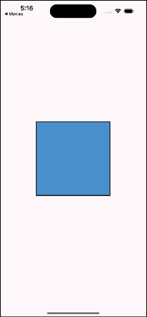
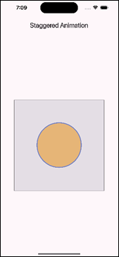
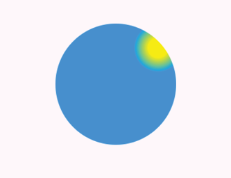

# [CHAPTER 9 Animations and Transitions](contents.md#ch09a)

## [Introduction](contents.md#sc2_178a)

In this chapter, you will learn all about the built-in animations that Flutter provides, as well as some third-party packages for handling transitions and animations. You will start out with some of the easier pre-built animation widgets and then customize your own. Finally, you will build some amazing animations for the movie app.

## [Structure](contents.md#sc2_179a)

The chapter covers the following topics:

- Basic animation concepts
- Advanced animation techniques
- Animation widgets
- Custom animations
- Animation libraries and tools
- Movie app

## [Objectives](contents.md#sc2_180a)

By the end of this chapter, you will have a solid understanding for how animations work in Flutter. You will be able to build you own animations as well as create custom animations. You will understand how to create animations and where to put them. You will learn about third-party packages for animations. Your movie app will look great as you move from page to page.

## [Basic animation concepts](contents.md#sc2_181a)

Animations in Flutter are made up of a few different types of animations, including **drawing-based**, which uses graphics, and **code-based**, which focuses on widget layouts and styles.

For code-based animations, there are two different types: implicit and explicit. Implicit animations are just animations that change the values of another widget, while explicit use an animation controller to explicitly tell it when and how to run.

### [Implicit animations](contents.md#sc3_182a)

Implicit animations give you less control than explicit animations but are easier to use. These widgets are of the type: `AnimatedXXXX`, where XXX could be a Container, opacity, positioning, padding, or any other attribute of a widget. All of these classes extend the `ImplicitlyAnimatedWidget` class. If Flutter does not have one already made for you, you can create your own. A very simple instance of an `AnimatedContainer` looks as follows:

```dart
AnimatedContainer(
  duration: const Duration(milliseconds: 2000),
  curve: Curves.easeInOut,
  decoration: BoxDecoration(
    color: selected ? Colors.blue : Colors.red,
    border: Border.all(
      color: Colors.black,
      width: 2,
    ),
  ),
  child: Container(),
),
```

There are two required parameters: `duration`, which defines how long the animation will run and the child, which will be the widget that is animated. This will show up as either a blue or red square that animates to the other color (Figure 9.1). Not shown is the `onTap` method that changes the selected value, causing the animation to start. It has a two-second duration and uses an `easeInOut` curve (explained as follows):



Figure 9.1: AnimatedContainer

Besides the color, you can animate the other properties of a container, like width and height. There are many more animated widgets. The following are a few examples:

- `AnimatedAlign`
- `AnimatedOpacity`
- `AnimatedPadding`
- `AnimatedPositioned`
- `AnimatedSize`
- `AnimatedScale`
- `AnimatedRotation`
- `AnimatedSlide`
- `AnimatedIcon`
- `AnimatedCrossFade`
- `AnimatedSwitcher`

These widgets modify their respective properties to change the underlying widget. Opacity will cause the widget to fade in and out. `AnimatedPositioned` is just like its Positioned widget and can only work inside of a `Stack` and move the widget inside of the `Stack`. `Size` and `Scale` animate the change in the size and scale of a widget. If you need to just perform one type of animation, then these widgets are a great solution. For more complex animations, you will need to use an implicit animation.

#### [Tween animations](contents.md#sc4_183a)

If you cannot find an animation that does what you need and you want to change a property of a widget, you can use the `TweenAnimationBuilder` widget. This widget uses a `Tween` class (like in-between) that has `begin` and `end` parameters for going from one property value to another.

The following is a `TweenAnimationBuilder` that animates the colors of a square:
```dart
TweenAnimationBuilder<Color?>(
  duration: const Duration(milliseconds: 2000),
  tween: ColorTween(begin: const Color(0xFF0D47A1), end: const Color(0xFFB71C1C)),
  curve: Curves.easeInOut,
  builder: (context, value, child) {
    return Container(
      decoration: BoxDecoration(
        color: value,
        border: Border.all(
          color: Colors.black,
          width: 2,
        ),
      ),
    );
  },
),
```

This is similar to the previous example. Note that to use a `ColorTween`, we had to specify a nullable Color for the builder type. Another type of builder is with a double value that translates (or moves) a square across the screen. The code is as follows:

```dart
TweenAnimationBuilder<double>(
  duration: const Duration(milliseconds: 2000),
  tween: Tween(begin: 0.0, end: 1.0),
  child: Container(
    width: 120,
    height: 120,
    color: Theme.of(context).primaryColor,
  ),
  builder: (context, value, child) {
    return Transform.translate(
      offset: Offset(value * 200 - 100, 0),
      //angle: 0.5 * pi * value,
      child: child,
    );
  },
),

```

This just moves the square from the left side of the screen to the right side of the screen. If you use the child passed in the builder, you will improve performance as that entire widget tree does not have to be rebuilt each time.

## [Advanced animation techniques](contents.md#sc2_184a)

If you need to do more than the basics, you need to learn more advanced animation techniques. We will cover explicit animations, specifically the animation controller. These animations are a bit more complex but allow you to create amazing movement in your app.

### [Explicit animations](contents.md#sc3_185a)

Explicit animations give you more control over your animations but are a bit more complex. Explicit animations are named that way because you, or the user, tell it when to start and stop using an animation controller. If you want to handle multiple animations at the same time, you will need an animation controller.

#### [AnimationController](contents.md#sc4_186a)

An `AnimationController` is a class that controls the progression of animations. It does this by producing a beginning and ending set of values for the duration of the animation. So, the longer the duration, the smaller the incremental values between the begin and ending values. The controller can also stop, forward, and reverse an animation. In order to use an `AnimationController`, you need to provide a `Ticker`. This ticker handles notifying listeners of new values on every frame. There are several mixins that provide this functionality and can be attached to a `State` class. There are two key mixins:

- `SingleTickerProviderStateMixin`: For a single controller.
- `TickerProviderStateMixin`: For multiple controllers.

We will be adding both an animation controller and the mixin to several classes to enable explicit animations. We will also need to change some classes to `Riverpod` classes to access movie information. To make the changes, make the following changes:

1. Open `detail_image.dart`. Currently, the detail page has a hard-coded image. We will change that so that it will display the image passed in. In order to do that, we will need to change the class from a stateless widget to a stateful widget. Of course, we will use `Riverpod`'s version: `ConsumerStatefulWidget`. Change the first two lines of the class to:

    ```dart
    class DetailImage extends ConsumerStatefulWidget {
      final String movieUrl;
      DetailImage({required this.movieUrl, super.key});

      @override
      ConsumerState<DetailImage> createState() => _DetailImageState();
    }
    
    class _DetailImageState extends ConsumerState<DetailImage> with SingleTickerProviderStateMixin {
    ```

1. Import the `Riverpod` package. Just add them with `SingleTickerProviderStateMixin`, and that functionality is automatically added. Next, change the hard-coded image URL to:

    ```dart
    widget.movieUrl
    ```

1. Now that the `DetailImage` class is updated, open `movie_detail.dart` and make the following changes. As the first line in the build method add:

    ```dart
    final movies = ref.read(movieImagesProvider);
    ```

1. Here we get the list of movies. Then change the `DetailImage` line to:

    ```dart
    Stack(children: [DetailImage(movieUrl: movies[widget.movieId])]),
    ```

1. Now back to `movie_detail.dart`, to create an `AnimationController`, you need to provide a duration and a `TickerProvider`, add the controller next:

    ```dart
    late final AnimationController _controller = AnimationController(
      duration: const Duration(seconds: 2),
      vsync: this,
    );
    ```

1. Here, `vsync` is for the `TicketProvider` and `this` refers to the `State` class (here is `_DetailImageState`) with the mixin provided above. Add this as the first line in the `_DetailImageState` class. Just as you need to dispose of a `TextEditingController`, you need to dispose of an animation controller. Add the following to the state class:

    ```dart
    @override
    void initState() {
      super.initState();
      _controller.forward();
    }

    @override
    void dispose() {
      _controller.dispose();
      super.dispose();
    }
    ```

The forward method starts the controller, then when the widget is disposed of, dispose of the controller.

#### [Animation](contents.md#sc4_187a)

Now, a controller by itself does not do anything. We need an animation. An animation is a very simple class that extends `Listenable` (used to notify listeners of changes), and has a status (`dismissed`, `forward`, `reverse`, or `completed`), and a value. Below the controller add the following:

    ```dart
    late final Animation<double> _animation = CurvedAnimation(
      parent: _controller,
      curve: Curves.easeIn,
    );
    ```

This is a curved animation. It just applies a curve to the animation and uses the controller we created above. Another way to create this animation is with the controller's `drive` method. For example:

    ```dart
    late final Animation<double> _animation = _controller.drive(CurveTween(curve: Curves.easeIn));
    ```

What we want is for the detail image to fade in when the detail page shows. To do that, we are going to use a `FadeTransition` widget. This animates the opacity of the widget (that is, fade). This widget requires a value for opacity and for that, we will use the animation we just created. What this does is that every time the controller changes its value, it will update the `FadeTransition` opacity and will slowly fade the image in. Now wrap the `CachedNetworkImage` with the following code:

    ```dart
    FadeTransition(
      opacity: _animation,
      child: CachedNetworkImage(
        // ...
      ),
    );
    ```

Open up `home_screen_image.dart` and change the `onMovieTap` call to:

    ```dart
    onMovieTap(index);
    ```

Do a Hot Restart and go to the detail page. You should see the image slowly fade in. You can change the speed of the fade by changing the duration value of the controller.

#### [Curves](contents.md#sc4_188a)

A curve is a mathematical function that defines the rate of change of an animation over time. It determines how the animated value (for example, `position`, `size`, `opacity`) progresses from its starting point to its ending point. If you do not use a curve, then all animations are linear, which may not feel natural. There are many pre-built curves in Flutter. Some examples are as follows:

- `bounceIn`: Oscillating Curve that grows.
- `bounceOut`: Oscillating Curve that shrinks.
- `bounceInOut`: Oscillating Curve that first grows and then shrinks.
- `elasticIn`: Oscillating Curve that grows and then overshoots its bounds.
- `elasticOut`: Oscillating Curve that shrinks and then overshoots its bounds.
- `elasticInOut`: Oscillating Curve that shrinks and then grows while overshooting its bounds.

可以在官网查看更多曲线及效果示意. [Curves](https://api.flutter.dev/flutter/animation/Curves-class.html)

#### [AnimatedBuilder](contents.md#sc4_189a)

An `AnimatedBuilder` is a general-purpose widget for building an animation. This widget listens to changes in the animation and rebuilds its widget. It has a builder method that returns the widget to animate.

Here is an example:

```dart
AnimatedBuilder(
  animation: _animation,
  builder: (context, child) {
    return CircularProgressIndicator(value: _animation.value);
  },
),
```

This will draw a circular ring that starts at the top and goes clockwise around.

#### [Staggered animations](contents.md#sc4_190a)

Staggered animations are a series of animations controlled by one animation controller. Each animation happens one after the other or they can overlap. An example of a staggered animation is one that shows a square that transforms into a circle. The example showcases the following output screen:



Figure 9.2: Staggered animation

The following is the example taken from the Flutter documentation. We will start with the definition of the class that has the animations and the controller:

```dart
class StaggeredAnimation extends StatefulWidget {
  const StaggeredAnimation({Key? key}) : super(key: key);

  @override
  State<StaggeredAnimation> createState() => _StaggeredAnimationState();
}

class _StaggeredAnimationState extends State<StaggeredAnimation> with SingleTickerProviderStateMixin {
  late AnimationController controller;
  late Animation<double> opacity;
  late Animation<double> width;
  late Animation<double> height;
  late Animation<EdgeInsets> padding;
  late Animation<BorderRadius?> borderRadius;
  late Animation<Color?> color;
}
```

Next, we initialize each of these animations:

```dart
@override
void initState() {
  super.initState();
  // 1
  controller = AnimationController(
    duration: const Duration(milliseconds: 2000),
    vsync: this,
  );
  // 2
  opacity = Tween<double>(
    begin: 0.0,
    end: 1.0,
  ).animate(
    CurvedAnimation(
      parent: controller,
      curve: const Interval(
        0.0,
        0.100,
        curve: Curves.ease,
      ),
    ),
  );
  // 3
  width = Tween<double>(
    begin: 50.0,
    end: 150.0,
  ).animate(
    CurvedAnimation(
      parent: controller,
      curve: const Interval(
        0.125,
        0.250,
        curve: Curves.ease,
      ),
    ),
  );
  // 4
  height = Tween<double>(begin: 50.0, end: 150.0).animate(
    CurvedAnimation(
      parent: controller,
      curve: const Interval(
        0.250,
        0.375,
        curve: Curves.ease,
      ),
    ),
  );
  // 5
  padding = EdgeInsetsTween(
    begin: const EdgeInsets.only(bottom: 16),
    end: const EdgeInsets.only(bottom: 75),
  ).animate(
    CurvedAnimation(
      parent: controller,
      curve: const Interval(
        0.250,
        0.375,
        curve: Curves.ease,
      ),
    ),
  );
  // 6
  borderRadius = BorderRadiusTween(
    begin: BorderRadius.circular(4),
    end: BorderRadius.circular(75),
  ).animate(
    CurvedAnimation(
      parent: controller,
      curve: const Interval(
        0.375,
        0.500,
        curve: Curves.ease,
      ),
    ),
  );
  // 7
  color = ColorTween(
    begin: Colors.indigo[100],
    end: Colors.orange[400],
  ).animate(
    CurvedAnimation(
      parent: controller,
      curve: const Interval(
        0.500,
        0.750,
        curve: Curves.ease,
      ),
    ),
  );
}
```

Here we have created the controller and each animation. An Interval has a beginning and end time. These are values that depend on the time of the controller. The following is a description of the steps:

1. Create an animation controller that lasts two seconds.
2. Define an opacity animation that goes from 0 to 0.10.
3. Create a width animation that goes from a width of 50 to 150 from time 0.125 to 0.250.
4. Create a height animation that goes from a height of 50 to 150 from time 0.250 to 0.375.
5. Create a padding animation that goes from a 16 to 75 from time 0.250 to 0.375.
6. Create a border animation that goes from a height of 4 to 75 from time 0.375 to 0.500.
7. Create a color animation that goes from indigo to orange from time 0.500 to 0.750.

Next is the `build` method. This has a `Scaffold` and when clicked starts the animation:

```dart
@override
Widget build(BuildContext context) {
  return Scaffold(
    appBar: AppBar(
      title: const Text('Staggered Animation'),
    ),
    body: GestureDetector(
      behavior: HitTestBehavior.opaque,
      // 1
      onTap: () async {
        try {
          await controller.forward().orCancel;
          await controller.reverse().orCancel;
        } on TickerCanceled {
          // The animation got canceled, probably because we were disposed.
        }
      },
      child: Center(
        child: Container(
          width: 300,
          height: 300,
          decoration: BoxDecoration(
            color: Colors.black.withOpacity(0.1),
            border: Border.all(
              color: Colors.black.withOpacity(0.5),
            ),
          ),
          // 2
          child: AnimatedBuilder(
            builder: (BuildContext context, Widget? child) {
              return Container(
                padding: padding.value,
                alignment: Alignment.bottomCenter,
                child: Opacity(
                  opacity: opacity.value,
                  child: Container(
                    width: width.value,
                    height: height.value,
                    decoration: BoxDecoration(
                      color: color.value,
                      border: Border.all(
                        color: Colors.indigo[300]!,
                        width: 3,
                      ),
                      borderRadius: borderRadius.value,
                    ),
                  ),
                ),
              );
            },
            animation: controller,
          ),
        ),
      ),
    ),
  );
}
```

The `AnimatedBuilder` returns a `Container` with several of the properties that we are changing in the animations. The animation starts when the container is clicked. The following is a description of the steps:

1. Make the `onTap` asynchronous so that the controller can start and then go backward.
2. Use the `AnimatedBuilder` to return the `Container` with all of the different animation values.

## [Animation widgets](contents.md#sc2_191a)

There are a few other animation widgets that we have not covered yet. The first one is the `AnimatedList`. This widget is used for animating items as they are inserted or removed from a list. Just like a `ListView`, it has an `itemBuilder` method. This method takes a `context`, `index`, and an additional `animation` parameter. This would look as follows:

```dart
final GlobalKey<AnimatedListState> _listKey = GlobalKey<AnimatedListState>();
AnimatedList(
  key: _listKey,
  initialItemCount: movies.length,
  itemBuilder: (context, index, animation) {
    return buildItem(movies[index], animation); // Build each list item
  },
),
```

When an item is removed from the list (and `setState` is called), you would then use the key to remove the item with an animation as follows:

```dart
// Remove the item from the data list
setState(() {
  final removedItem = movies.removeAt(index);
});

// Remove the item from the AnimatedList with animation
_listKey.currentState!.removeItem(
  index,
  (context, animation) => buildItem(removedItem, animation), 
);
```

The next widget is the `AnimatedSwitcher`. This widget is for transitioning between widgets with an animation. It provides a cross-fade between the switching of widgets. It requires a `duration` and you can set the in and out curves.

`AnimatedPositioned` is an animated version of `Position` (which is used inside of a `Stack`). This widget will transition the widget in position over time.

### [Hero animations](contents.md#sc4_192a)

`Hero` widgets provide a transition between pages. Typically, you will have an image (you can have other types of widgets) that will be in a location on one screen and then animate to the new position on the next page. They are very easy to use, just wrap the widget in a `Hero` widget and give it an identical, unique, `tag`. This `tag` can be any object but it is important that they be unique. In the movie app, we will use Heros to wrap the movie images. On the home screen, there are duplicate images. For example, a movie might be in the Trending section as well as the Popular section. We will create a unique key based on the movie URL and the movie type. So, the movie tag will be ‘movieUrl + movieType’. This will create a unique tag.

The first task in creating `Hero` animations for the movie app is to separate the image into its widget. Make the following changes:

1. In the widgets folder, create a new file called `movie_widget.dart`. Add the following:

    ```dart
    import 'package:cached_network_image/cached_network_image.dart';
    import 'package:flutter/material.dart';
    import 'package:flutter_riverpod/flutter_riverpod.dart';
    import 'package:movies/providers.dart';
    import 'package:movies/utils/utils.dart';
    // 1
    enum MovieType {
      trending,
      popular,
      topRated,
      nowPlaying
    }
    class MovieWidget extends ConsumerStatefulWidget {
      // 2
      final int movieId;
      final String movieUrl;
      final OnMovieTap onMovieTap;
      final MovieType movieType;
      const MovieWidget({
        required this.movieId,
        required this.movieUrl,
        required this.onMovieTap,
        required this.movieType,
        super.key,
      });
      @override
      ConsumerState<MovieWidget> createState() => _MovieWidgetState();
    }
    class _MovieWidgetState extends ConsumerState<MovieWidget> {
      late String uniqueHeroTag;
      @override
      void initState() {
        super.initState();
        // 3
        uniqueHeroTag = widget.movieUrl + widget.movieType.name;
      }

      @override
      Widget build(BuildContext context) {
        // TODO Add Image
      }
    }
    ```

    This is the start of a widget for displaying an image. It uses a string to create a unique tag from the movie URL and the movie type. The important lines are as follows:

    1. Define an enum for the different movie types.
    1. The constructor takes the movie ID, URL, movie tap function, and movie type.
    1. In the `initState` method, create a unique tag.

1. Now add the image as follows:

    ```dart
    return GestureDetector(
      onTap: () {
        widget.onMovieTap(widget.movieId);
      },
      child: Padding(
        padding: const EdgeInsets.all(8.0),
        child: SizedBox(
          width: 100,
          height: 142,
          child: Hero(
            tag: uniqueHeroTag,
            child: CachedNetworkImage(
              imageUrl: widget.movieUrl,
              alignment: Alignment.topCenter,
              fit: BoxFit.fitHeight,
              height: 100,
              width: 142,
            ),
          ),
        ),
      ),
    );
    ```

    Here we are wrapping the image in a `Hero` widget with a unique `tag`. When the user taps on the image, the callback will be executed.

1. Open up `horiz_movies.dart`. Add the following and replace the constructor:

    ```dart
    import 'package:movies/utils/utils.dart';
    import 'package:movies/ui/widgets/movie_widget.dart';
    class HorizontalMovies extends StatelessWidget {
      final MovieType movieType;
      final OnMovieTap onMovieTap;
      final List<String> movies;
      const HorizontalMovies({
        required this.onMovieTap,
        required this.movies,
        required this.movieType,
        super.key,
      });
    ```

    Just like the `MovieWidget`, we take a movie type and an `onMovieTap` function.

1. Next, replace the code in the `itemBuilder` with the following:

    ```dart
    return MovieWidget(
      movieId: index,
      movieUrl: movies[index],
      onMovieTap: onMovieTap,
      movieType: movieType,
    );
    ```

    This just uses the movie widget we just created and passes the index and that movie. We will be able to reuse this widget in other places.

1. Now, open `home_screen.dart`. Change the name of the image variable to `movies` to better represent what they are:

    ```dart
    final movies = ref.read(movieImagesProvider);
    ```

1. Now change the three instances of `HorizontalMovies` with the following three calls:

    ```dart
    // Trending Movies
    HorizontalMovies(movies: movies, onMovieTap: onMovieTap, movieType: MovieType.Trending,),

    // Popular Movies
    HorizontalMovies(movies: movies, onMovieTap: onMovieTap, movieType: MovieType.Popular,),

    // Top Rated Movies
    HorizontalMovies(movies: movies, onMovieTap: onMovieTap, movieType: MovieType.TopRated,),
    ```

1. Now add the function for `onMovieTap` after the build method:

    ```dart
    void onMovieTap(int movieId) {
      context.router.push(MovieDetailRoute(movieId: movieId));
    }
    ```

1. Import the `movie_widget.dart` file. Now, we want the detail page to be the ending destination for our `Hero`. In order to do that, it needs to know the `hero` `tag`. This is another good example of using `Riverpod`'s providers. Open up `providers.dart` and add:

    ```dart
    @riverpod
    class HeroTagNotifier extends Notifier<String> {
      @override
      String build() => '';

      void set(String tag) => state = tag;
    }
    ```

1. This creates a notifier provider class. In a terminal window run:

    ```bash
    dart run build_runner build
    ```

    This will allow classes to retrieve the current hero tag and for other classes to set that tag.

1. Back in `detail_image.dart`, add the following line as the first line in the `build` method:

    ```dart
    final heroTag = ref.watch(heroTagProvider);
    ```

1. This uses our provider to get the current hero tag. Now surround the `CachedNetworkImage` with:

    ```dart
    child: Hero(
      tag: heroTag,
      child: CachedNetworkImage(
      // ...
      ),
    ),
    ```

1. While we are changing things, open up `home_screen_image.dart` and add a `Hero` widget. Change the images variable to the following:

    ```dart
    final movies = ref.read(movieImagesProvider);
    ```

1. Then, change the `itemCount` to:

    ```dart
    itemCount: movies.length,
    ```

1. Change `onMovieTap` to:

    ```dart
    ref.read(heroTagProvider.notifier).set('${movies[index]}swiper');
    onMovieTap(index);
    ```

1. This will set the hero tag to the movie URL plus the string swiper and pass in the index used. Wrap the `CachedNetworkImage` with a `Hero` like:

    ```dart
    child: Hero(
      tag: '${movies[index]}swiper',
      child: CachedNetworkImage(
      // ...
      ),
    ),
    ```

1. And the `imageUrl` as follows:

    ```dart
    imageUrl: movies[index],
    ```

1. Open up `movie_widget.dart` and add the following as the first line in the `onTap` method:

    ```dart
    ref.read(heroTagProvider.notifier).set(uniqueHeroTag);
    ```

    This will set the current hero tag. Perform a Hot restart and click on either the main image or one of the images in the Trending list. Notice the animation when you click on the image and it transitions to the detail page.

The last place that needs a `Hero` is the `MovieRow` class:

1. Open up `movie_row.dart` and first change the widget to a `ConsumerWidget` (Riverpod’s version of a `StatelessWidget`):

    ```dart
    class MovieRow extends ConsumerWidget {
      final int movieId;
      final String movieUrl;
      final OnMovieTap onMovieTap;

      const MovieRow({required this.movieId, required this.movieUrl, required this.onMovieTap, super.key});

      @override
      Widget build(BuildContext context, WidgetRef ref) {
        //...
    ```

    This adds a few new parameters, as follows:

    - `movieId`: The id of the movie.
    - `movieUrl`: The URL of the movie.
    - `onMovieTap`: Tap function.

1. Next, we need to create the `hero` tag. Replace:

    ```dart
    if (movie.isNotEmpty) {
      return GestureDetector(
        onTap: () => {},
    ```

    with:

    ```dart
    late String uniqueHeroTag = movieUrl + 'MovieRow';
    if (movieUrl.isNotEmpty) {
      return GestureDetector(
        onTap: () {
          ref.read(heroTagProvider.notifier).set(uniqueHeroTag);
          onMovieTap(movieId);
        },
    ```

    This will create a unique hero tag by adding the `MovieRow` string to the URL. It will then set the tag when tapping on the image.

1. Next, wrap the `CachedNetworkImage` with a `Hero`:

    ```dart
    child: Hero(
      tag: uniqueHeroTag,
      child: CachedNetworkImage(
        imageUrl: movieUrl,
        // ...
      ),
    ),
    ```

    The calling class is `VerticalMovieList`.

1. Open up `vert_movie_list.dart` and change the images variable to:

    ```dart
    final movies = ref.read(movieImagesProvider);
    ```

1. And the call to `MovieRow` with:

    ```dart
    movieId: index, movieUrl: movies[index], onMovieTap: onMovieTap,
    ```

    Since we have modified `VerticalMovieList`, we need to modify its caller.

1. Open up `genre_screen.dart`. Add the routes package:

    ```dart
    import 'package:movies/router/app_routes.dart';
    ```

1. Change the `onMovieTap` to:

    ```dart
    onMovieTap: (movieId) {
      context.router.push(MovieDetailRoute(movieId: movieId));
    },
    ```

Perform a Hot restart and click on a movie in the genre screen. All these `Hero` additions will cause the image to fly from its current position to the top of the screen on the detail page.

## [Custom animations](contents.md#sc2_193a)

If you want to create something truly unique that a traditional widget does not provide, you can use a `CustomPaint` and `CustomPainter` classes. The `CustomPaint` class provides a `Canvas` that you can use to draw lower-level graphics like lines, arcs, circles, and rectangles. The `Canvas` class is key to these types of animations. The `Canvas` class uses a few key classes and methods, listed as follows:

- `Paint`: This class is used for setting the color and style for drawing.
- `saveLayer`: This method sets a rectangle that will be drawn into.
- `restore`: This method restores the canvas to a state before the `saveLayer` call.
- `drawCircle`, `drawRect`, `drawArc`, `drawOval`, `drawPath`, `drawImage`: Drawing methods.
- `drawParagraph`: Draw text.
- `translate`: Shift the coordinate space.
- `scale`: Add a scale to the current transform.
- `clipRect`, `clipPath`: Set the clip region.

There are more methods, but these are some of the key ones.

A `CustomPaint` class looks as follows:

```dart
CustomPaint(
  child: myWidget(),
  foregroundPainter: foregroundPainter(),
  painter: MyPainter(),
)
```

The order of drawing is as follows:

- `painter`
- `child`
- `foregroundPainter`

So, there are three layers that are drawn. Both the `painter` and the `foregroundPainter` can be null. Here is an example of a `CustomerPainter` that draws a circle with a sun (Figure 9.3):



Figure 9.3: CustomPainter

The `painter` looks as follows:

```dart
class MyCustomPainter extends CustomPainter {
  @override
  void paint(Canvas canvas, Size size) {
    final paint = Paint()
      ..shader = RadialGradient(
        center: const Alignment(0.7, -0.6), // near the top right
        radius: 0.2,
        colors: const [
          Color(0xFFFFFF00), // yellow sun
          Color(0xFF0099FF), // blue sky
        ],
        stops: const [
          0.4,
          1.0,
        ],
      ).createShader(Rect.fromCircle(
        center: Offset(size.width / 2, size.height / 2),
        radius: size.width / 2,
      ));
      canvas.drawCircle(
        Offset(size.width / 2, size.height / 2),
        size.width / 2,
        paint,
      );
  }

  @override
  bool shouldRepaint(MyCustomPainter oldDelegate) => false; // No need to repaint
}
```

The `build` method is as follows:

```dart
@override
Widget build(BuildContext context) {
  return MaterialApp(
    home: Scaffold(
      appBar: AppBar(title: const Text("Custom Paint Example")),
      body: Center(
        child: CustomPaint(
          size: const Size(200, 200),
          painter: MyCustomPainter(),
        ),
      ),
    ),
  );
}
```

Another popular widget is the `RotationTransition`. This will rotate another widget and uses an animation controller to define the animation. `ScaleTransition` is similar but scales a widget larger or smaller. Like the `ScaleTransition`, the `SizeTransition` widget changes the size of a widget along a horizontal or vertical axis.

## [Animation libraries and tools](contents.md#sc2_194a)

There are many different types of third-party animation packages. High-level packages like `Lottie` and `Rive` require you to define an animation with their tools and then run it in your app.

`Lottie` animations are JSON-based lightweight, scalable, and usable on multiple platforms. They can be interacted with by the user. You will have to pay to design the animations; however, free animations are available. You can produce `Lottie` animations using other tools like `Adobe After Effects`, `Figma`, etc. You can find it at <https://lottiefiles.com/>.

`Rive` Animations are similar to `Lottie` but require their own tool. You can find it at <https://rive.app/>. `Rive` considers its tools to be smaller and faster than `Lottie`'s.

### [Animation packages](contents.md#sc3_195a)

There are many third-party packages that just perform animations. Some popular ones are as follows:

- `flutter_animate`: Adds many effects to widgets.

- `flutter_spinkit`: Loading animations

- `flutter_staggered_animations`: Used to add animations to lists and gridviews.

- `Funvas`: Create canvas-based animations based on time and math functions

- `simple_animations`: Easily implement custom animations for common use cases.

- `Spring`: A collection of 12 widgets based on spring animation effects.

We will use the `flutter_animate` package, which was written by the author of the `Wonderous App`, to perform some nice animations.

## [Movie app](contents.md#sc2_196a)

The first animation we will create is to modify the heart icon in the `ButtonRow` class to beat like a heart when the user clicks on it.

1. Open up `button_row.dart` and first convert the class to a `StatefulWidget`:

    ```dart
    class ButtonRow extends StatefulWidget {
      final bool favoriteSelected;
      final OnFavoriteSelected onFavoriteSelected;

      const ButtonRow({
        super.key,
        required this.favoriteSelected,
        required this.onFavoriteSelected,
      });

      @override
      State<ButtonRow> createState() => _ButtonRowState();
    }

    class _ButtonRowState extends State<ButtonRow> with TickerProviderStateMixin {
    ```

    The `TickerProviderStateMixin` allows this widget to handle multiple controllers. (Remember you use a `SingleTickerProviderStateMixin`).

1. Then add the animation variables:

    ```dart
    late AnimationController _sizeController;
    late Animation<double> _sizeAnimation;
    late AnimationController _colorController;
    late Animation<Color?> _colorAnimation;
    ```

1. There is one animation controller for the size, one controller for the color and a size and color animation. Now initialize these variables:

    ```dart
    @override
    void initState() {
      super.initState();
      // 1
      _sizeController = AnimationController(
        vsync: this, 
        duration: Duration(seconds: 1), // Adjust pulse duration
      )..repeat(reverse: true); // Make animation repeat

      // 2
      _sizeAnimation = Tween<double>(
        begin: 1.0, // Original size
        end: 1.5, // Scaled-up size
      ).animate(
        CurvedAnimation(parent: _sizeController, curve: Curves.easeInOut),
      );

      // 3
      _colorController = AnimationController(
        vsync: this,
        duration: Duration(seconds: 1), // Adjust color change duration
      )..repeat(reverse: true);

      // 4
      _colorAnimation = ColorTween(
        begin: Colors.white, // Starting color
        end: Colors.red, // Ending color
      ).animate(
        CurvedAnimation(parent: _colorController, curve: Curves.easeInOut),
      );
    }

    @override
    void dispose() {
      _sizeController.dispose();
      _colorController.dispose();
      super.dispose();
    }
    ```

    The size controller is a one second animation that repeats, and uses the size animation. The color controller is a one second animation that repeats, and uses the color animation. Here is an explanation:

    1. Create the size controller. Notice the repeat command.
    2. Create a size animation that starts at a scale of 1 and goes to 1.5.
    3. Create the color controller.
    4. Create a color animation that goes from white to red.

1. From the `onPressed` method on, replace the icon:

    ```dart
    onPressed: () { 
      widget.onFavoriteSelected();
    },

    icon: widget.favoriteSelected
    ? AnimatedBuilder(
      animation: Listenable.merge([_sizeController, _colorController]),
      builder: (context, child) {
        return Icon(
          Icons.favorite_outlined,
          size: 21 * _sizeAnimation.value,
          color: _colorAnimation.value,
        );
      })
    : Icon(
      Icons.favorite_border,
      color: Colors.white,
    ),
    ```

    If the widget is selected, show the `heart` animation, otherwise show a white outlined heart. This uses an `AnimatedBuilder` with two controllers. It uses the merge method from the `Listenable` class to return a list of controllers. Hot Reload and go into the detail page. Click on the favorite button and you will see the animation start.

1. Now we can spice up the Genre Row and add some animation for sliding the row of genres in. Open up `genre_row.dart` and first convert the class to a `StatefulWidget`:

    ```dart
    class GenreRow extends StatefulWidget {
      final List<GenreState> genres;

      const GenreRow({super.key, required this.genres});

      @override
      State<GenreRow> createState() => _GenreRowState();
    }

    class _GenreRowState extends State<GenreRow> with SingleTickerProviderStateMixin {
    ```

    This uses a Single ticker mixin. Now add the needed variables:

    ```dart
    late AnimationController _controller;
    late Animation<Offset> _offsetAnimation;

    @override
    void initState() {
      super.initState();
      _controller = AnimationController(
        vsync: this,
        duration: const Duration(seconds: 2),
      )..forward(); // Start animation on initialization
      _offsetAnimation = Tween<Offset>(
        begin: const Offset(1.0, 0.0), // Start offscreen to the right
        end: Offset.zero, // End at the normal position
      ).animate(CurvedAnimation(
        parent: _controller,
        curve: Curves.elasticOut, // Use elastic curve for bounce effect
      ));
    }

    @override
    void dispose() {
      _controller.dispose();
      super.dispose();
    }
    ```

1. This creates a two second animation controller and an offset animation that will start on the right side of the screen and go to the left. The `elasticOut` curve will give it a bounce effect. Next, wrap the `ListView` with:

    ```dart
    child: SlideTransition(
      position: _offsetAnimation,
    ```

1. Change the genres instance to:

    ```dart
    widget.genres
    ```

    Hot reload and you should see the row of genres animate from right to left.

### [Flutter animate](contents.md#sc3_197a)

The Flutter animate package (or `flutter_animate`) was written by the author of the Wonderous app, which is a showcase for Flutter apps and animations. You can find more information at: <https://flutter.gskinner.com/wonderous/>. To use the package, open `pubspec.yaml` and add:

flutter_animate: ^4.5.2

Run `flutter pub get` to install the package. Make the following changes:

1. Now open up `movie_widget.dart`. **Remember, that to use an animation controller, your state class needs to use a ticker mixin**. Add the following to the end of the state class:

    ```dart
    with SingleTickerProviderStateMixin
    ```

    Then, add the following before the uniqueTag to create an animation controller with a two second duration. The code is as follows:

    ```dart
    bool animateImage = false;
    late final AnimationController _controller = AnimationController(
      duration: const Duration(seconds:2),
      vsync: this,
    );
    ```

    Change the `onTap` method to:

    ```dart
    onTap: () {
      setState(() {
        ref.read(heroTagProvider.notifier).set(uniqueHeroTag);
        animateImage = true;
        _controller.forward();
      });
    },
    ```

    This removes the `onMovieTap` call so that we can start the animation by calling `_controller.forward()`.

1. After the `CachedNetworkImage` widget add the following:

    ```dart
    .animate(
      // 1
      autoPlay: false,
      // 2
      controller: _controller,
      // 3
      onComplete: (controller) {
        // 4
        if (animateImage) {
          animateImage = false;
          widget.onMovieTap(widget.movieId);
        }
      },
      // 5
    )
    .scaleXY(begin: 1.0, end: 1.1, duration: 600.ms)
    // 6
    .then(delay: 600.ms)
    // 7
    .scaleXY(begin: 1.1, end: 1.0, duration: 600.ms),
    ```

    Import the `flutter_animate` package. This uses `flutter_animate`’s animate class. Here is an explanation of the steps:

    1. Use the `autoPlay` parameter to make sure the animation does not start at first.
    2. Set the `controller`.
    3. Listen to the completion of the animation.
    4. Reset the `controller`.
    5. Scale the image up to 1.1 percent.
    6. Wait for 600 milliseconds.
    7. Scale the image back down to normal.

    What this does is pulse the image before launching into the detail screen.

Hot Restart (reload may not work) and try clicking on a trending movie to see the animation.

### [Custom routes](contents.md#sc3_198a)

To add a transition animation between pages, the `AutoRoute` package has a custom route class that will allow you to add an animation. Open up `app_routes.dart`. Change the movie detail and video page route to:

```dart
CustomRoute(
  path: '/details/:movieId',
  page: MovieDetailRoute.page,
  maintainState: false,
  transitionsBuilder: TransitionsBuilders.slideBottom,
  durationInMilliseconds: 500,
),

CustomRoute(
  page: VideoPageRoute.page,
  maintainState: false,
  transitionsBuilder: TransitionsBuilders.slideRight,
  durationInMilliseconds: 500,
),
```

The first transition will slide in from the bottom, the second transition will slide from the right. Do a Hot Restart (not reload). Try navigating to the detail page and click on the trailer.

## [Conclusion](contents.md#sc2_199a)

In this chapter, you learned about all the available Flutter animation widgets and how to use both implicit and explicit animations. There are many different types of animations and the possibilities are limitless. As well as the built-in animations, there are third-party animation packages that allow designers to use tools to create animations and you can use those in your apps. You learned about the important animation controller as well as the animation classes it uses to create animations for the movie app.

In the next chapter, you will learn about Futures and asynchronous programming, which will allow you to perform tasks in the background, load data, and then handle the result. This will set you up for handling networking and databases. You will also learn how to use networking libraries to retrieve data from the internet. This will allow us to finally get real movie data. You will also learn more about how to handle JSON data.
