# [CHAPTER 11 Networking](contents.md#ch11a)

## [Introduction](contents.md#sc2_212a)

In this chapter, you will learn all about networking and start using **The Movie Database (TMDB)** website to retrieve the latest movies. You will learn how to asynchronously download data and update the screen with new moves. You will learn about APIs and how to retrieve data from the internet using networking packages.

## [Structure](contents.md#sc2_213a)

The chapter covers the following topics:

- Networking
- TMDB
- JSON and serialization
- Data models
- Networking packages
- Dio package

## [Objectives](contents.md#sc2_214a)

By the end of this chapter, you will have a solid understanding of how to download data in the background and update the UI with that new information. You will understand the JSON format, how to create models for downloaded data, and how to put the data into those models. You will know how to work with networking APIs and write code to use them. You will also be able to use packages to create code to connect with APIs to download that data. You will also learn about consuming data from other sites.

## [Networking](contents.md#sc2_215a)

Cellular phones use WiFi and cellular data to handle networking. So far, the movie app only has icons, images, and videos. All the icons come from the Flutter framework, but the URLs we have used pull in images and videos from the internet. The cached network image library uses networking calls to download images in the background, and the `pod_player` package uses networking to play videos. Now, we will learn how to download data ourselves. We will still use a package to make things easier, but it is a lower-level package that allows us to download information from other sites. Not only can the package download images or videos, but the package allows us to download anything we want. Flutter comes with its own package for networking, but we will use a better third-party package. Most apps need to be able to retrieve data from the internet. This is a critical part of your app and should be written early in app development so that you can have data to use for your UIs.

## [TMDB](contents.md#sc2_216a)

We will be using the TMDB site to get information about movies. This site allows you to freely use it for personal use. If you decide to use the app commercially, you will need a paid account. You will need to create an account and be approved, so make sure you put in a valid email address when you sign up. Go to the TMDB site: <https://www.themoviedb.org/signup>. You will see a sign-up form, as shown in Figure 11.1. Enter all required information.

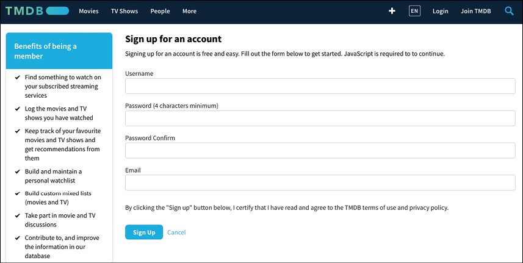

Figure 11.1: TMDB signup

Once you click on the signup button, you will receive an email to verify your email, and shortly, you will be accepted. Once you have been accepted, you will see your dashboard, as shown in Figure 11.2. Note that you are signing up for the TMDB site that anyone can use to view movies.

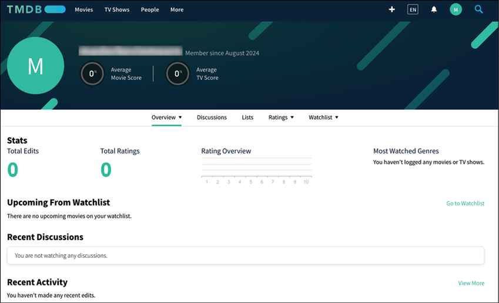

Figure 11.2: TMDB dashboard

To go to the developer section, choose the More link and then the API link, as shown in the following figure:

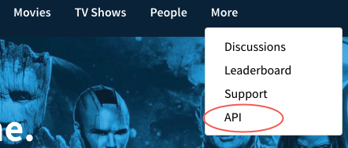

Figure 11.3: TMDB API Link

On the API site, you will need to create a developer API key. Click on the Developer link:

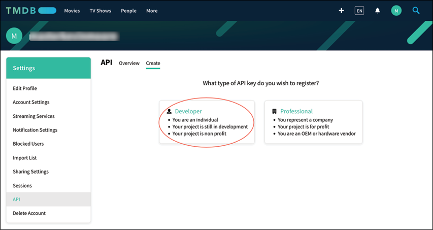

Figure 11.4: TMDB API Key

On the next page, choose Mobile Application for the type, give your app any name you want, and add an Application URL. The author is unsure whether this field needs a valid website, as they entered their website here. Finally, enter a summary and your information:

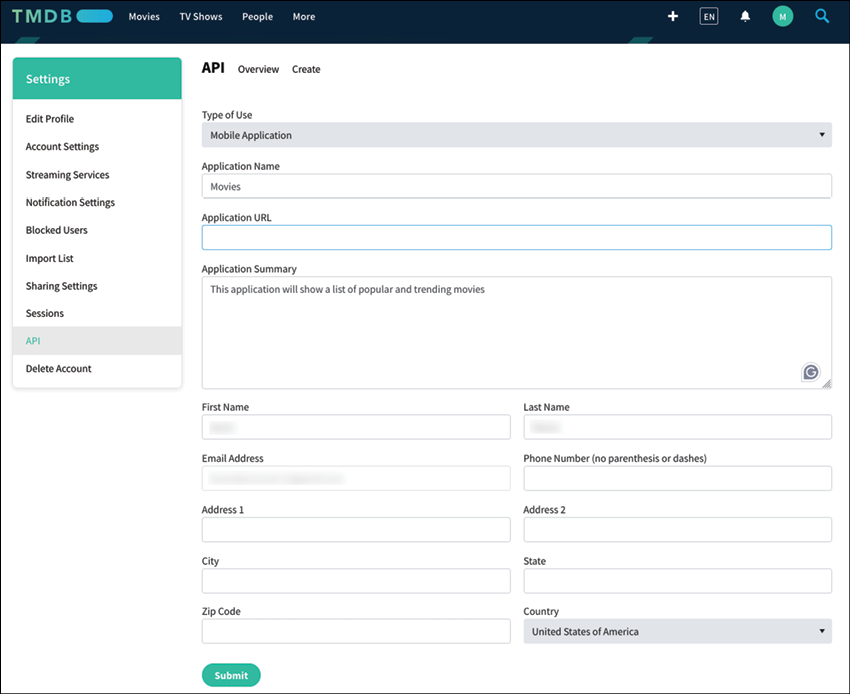

Figure 11.5: TMDB API key application

Once you select `Submit`, you will be taken to the API Key page, as shown in the following figure. Copy the API Key since you will need it later.

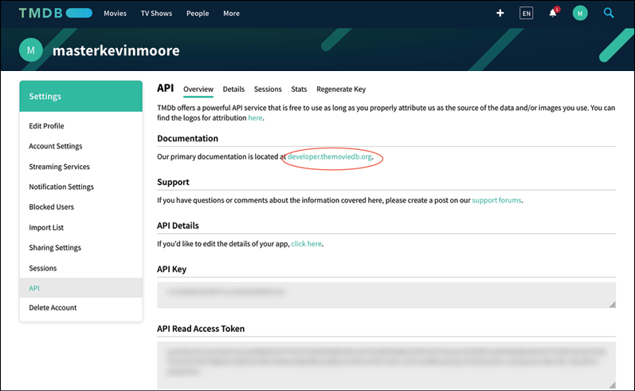

Figure 11.6: TMDB API key overview

Click on the `developer.themoviedb.org` link, and you will be taken to the `Getting Started` page, as shown in the following figure:

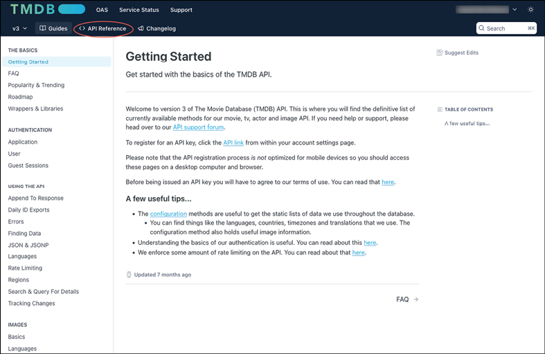

Figure 11.7: TMDB API reference

Next, click on the `API Reference` menu, as shown in the following figure:

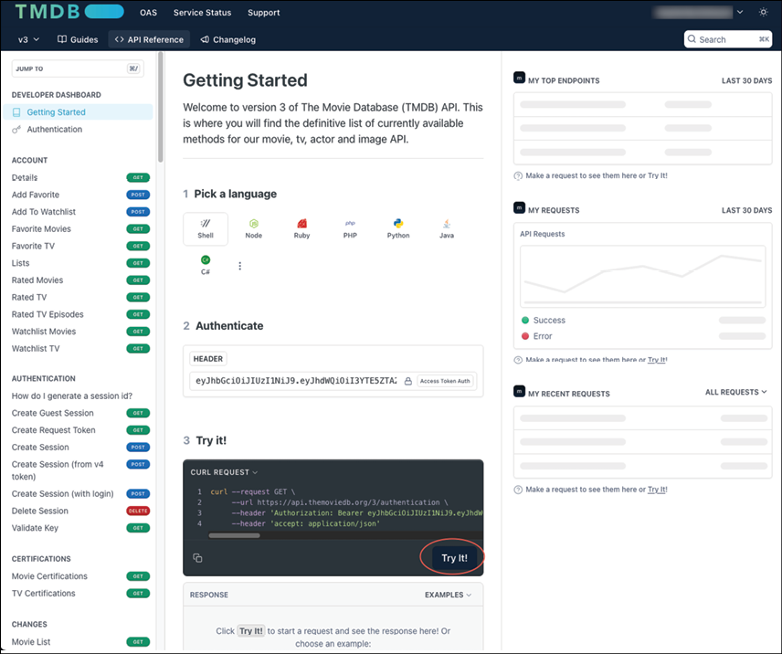

Figure 11.8: TMDB Getting Started

To make sure your key works, click on the `Try it!` Button. You should see a successful response as follows:

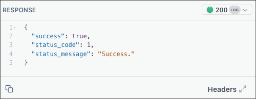

Figure 11.9: Success response

Scroll down the left list to the `Movie Lists` section and click on `Now Playing`. This will show the `Now Playing API`:

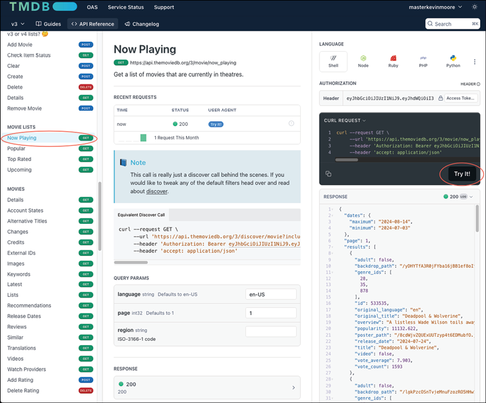

Figure 11.10: TMDB Now Playing API

Click on the `Try it!` Button, and you should see a response.

## [JSON and serialization](contents.md#sc2_217a)

The response above contains data in the `JavaScript Object Notation (JSON)` format. It is the most widely used format for `Representational State Transfer (REST)-based APIs` that servers provide. REST-based APIs are standardized ways for systems to communicate. These consist of stateless requests from a client to a server. That means that the server does not remember previous calls. Most servers return data in JSON format. JSON is easy to read and uses left "{" and right "}" brackets with key/value pairs. These values can have child entries as well. Dart and Flutter use JSON extensively. What you will typically do is read in JSON and convert it into class files so that your app can read that data easily. JSON supports a few data types listed as follows:

- String: A value surrounded by quotes `"`
- Number: An integer value (No quotes)
- Boolean: `true` or `false`
- null: Empty value `null`
- Array: A list of items using `[ ]`
- Object: A collection of key/value pairs using `{ }`

There is a hard and easy way to convert JSON to a class. While it is possible to treat JSON as just a long string and try to parse out the data, it is much easier to use a package that already knows how to do that. Flutter has a built-in package for decoding JSON, but in this chapter, you will use the `freezed`, `json_serializable`, and `json_annotation` packages to help make the process easier.

Flutter’s built-in `dart:convert` package contains methods like `json.decode()` and `json.encode()`, which converts a JSON string to a `Map<String, dynamic>` map and back. While this is a step ahead of manually parsing JSON, you still have to write extra code that takes that map and puts the values into a new class.
The `json_serializable` package is useful because it can generate model classes for you according to the annotations you provide via the `json_annotation` package. `freezed` is even more powerful and allows you to create classes that handle both JSON serialization and deserialization and provides the following methods:

- `copyWith`: Allows you to create copies of a class by changing specific fields.
- `toString`: Creates a method that returns a string with all data values.
- `equals operator`: Provides equality. This is needed for adding classes to lists and maps.
- `hashCode`: Getter that provides a unique value for the class and its values. Needed for equals to work.
- `toJson`: Returns a JSON `Map<String, dynamic>` map.
- `fromJson`: Converts a JSON map to this class.

Since `freezed` uses the `json_serializable` package, we will talk about `freezed`. Before looking at automated serialization, you must understand how to serialize JSON manually.

So, how do you go about writing code to serialize JSON yourself? Typical model classes have `toJson()` and `fromJson()` methods. The `toJson()` method helps to convert objects into JSON strings, and the `fromJson()` method helps to parse a JSON string into an object so you can use it inside the program. In an earlier chapter, you wrote the `Movie` class. The following is an example of what it would look like with the two new methods:

```dart
class Movie {
  final int movieId;
  final String image;
  final String title;
  final String overview;
  final double popularity;
  final DateTime releaseDate;

  Movie({
    required this.movieId, 
    required this.image, 
    required this.title, 
    required this.overview, 
    required this.popularity, 
    required this.releaseDate});

  factory Movie.fromJson(Map<String, dynamic> json) {
    return Movie(
      movieId: json['movieId'],
      image: json['image'],
      title: json['title'],
      overview: json['overview'],
      popularity: json['popularity'],
      releaseDate: json['releaseDate'],
    );
  }

  Map<String, dynamic> toJson() {
    return <String, dynamic>{
      'movieId': movieId,
      'image': image,
      'title': title,
      'overview': overview,
      'popularity': popularity,
      'releaseDate': releaseDate,
    };
  }
}
```
Notice that we have to write every single field to create a new movie and convert it into a JSON map. This is a lot of work. With `freezed`, you will add `annotations` to the class and write it in a certain way to have it generate a lot of code for you.

1. Start by adding the needed libraries to the `pubspec.yaml` file. Under the dependencies section, add the following:

    ```yaml
    intl: ^0.20.2
    json_annotation: ^4.11.0
    freezed_annotation: ^3.1.0
    ```

2. Under the dev_dependencies section, add:

    ```yaml
    json_serializable: ^6.13.0
    freezed: ^3.2.5
    ```

The `intl` package is the Flutter internationalization package which has some date formatting utilities that we will be using. Both annotation packages have annotation classes that are needed for your models. The dev dependencies are used when running the builder. Do a Pub get. Now that we have these libraries, it is time to create the models for the movies. As you saw earlier, the TMDB website lists movies in JSON format. It looks as follows:

```json
{
  "dates": {
    "maximum": "2024-08-14",
    "minimum": "2024-07-03"
  },
  "page": 1,
  "results": [
    {
      "adult": false,
      "backdrop_path": "/yDHYTfA3R0jFYba16jBB1ef8oIt.jpg",
      "genre_ids": [
        28,
        35,
        878
      ],
      "id": 533535,
      "original_language": "en",
      "original_title": "Deadpool & Wolverine",
      "overview": "A listless Wade Wilson toils away in civilian life with his days as the morally flexible mercenary, Deadpool, behind him. But when his homeworld faces an existential threat, Wade must reluctantly suit-up again with an even more reluctant Wolverine.",
      "popularity": 11132.622,
      "poster_path": "/8cdWjvZQUExUUTzyp4t6EDMubfO.jpg",
      "release_date": "2024-07-24",
      "title": "Deadpool & Wolverine",
      "video": false,
      "vote_average": 7.893,
      "vote_count": 1634
    }
  ],
  "total_pages": 167,
  "total_results": 3339
}
```

This just shows one entry, but the important parts are as follows:

- `page`: 1. This shows which page is returned.
- `results`: This is the list of movies.
- In the brackets are all the details for the movie.
- `total_pages`: The total number of pages worth of movies the API could return. Useful for downloading the next page.
- `total_results`: This gives the total number of movies available.

## [Data models](contents.md#sc2_218a)

We will need to create a `movie` class that has this information in it. In the `data/models` folder, create a new file named `movie_results.dart`.

1. Start by adding the imports and parts as follows:

    ```dart
    import 'package:freezed_annotation/freezed_annotation.dart';
    import 'package:intl/intl.dart';
    part 'movie_results.freezed.dart';
    part 'movie_results.g.dart';
    ```

    This imports the freezed annotation and the international package. The part files will be created for you when you run the builder. The `freezed.dart` file is for equality, and the `g.dart` file is for JSON.

2. Next, add a helper function that helps override the serialization so that we can use dates instead of strings:

    ```dart
    // Parsing function to be used by @JsonKey
    DateTime? _parseDate(String? dateString) {
      if (dateString == null || dateString.isEmpty) {
        return null;
      }
      return DateFormat('yyyy-MM-dd').parse(dateString);
    }
    ```

    This just uses the `intl` package’s `DateFormat` class to convert a string into a `DateTime` class.

3. Now add the class. Note that we are not using every single field that the data returns, just the most useful:

    ```dart
    // 1
    @freezed
    // 2
    class MovieResults with _$MovieResults {
      // 3
      const factory MovieResults({
        // 4
        @JsonKey(name: 'backdrop_path')
        String? backdropPath,
        // 5
        required int id,
        @JsonKey(name: 'original_title')
        required String originalTitle,
        required String overview,
        @JsonKey(name: 'poster_path')
        String? posterPath,
        @JsonKey(name: 'media_type')
        String? mediaType,
        required bool adult,
        required String title,
        @JsonKey(name: 'original_language')
        required String originalLanguage,
        @JsonKey(name: 'genre_ids')
        required List<int> genreIds,
        required double popularity,
        // 6
        @JsonKey(name: 'release_date', fromJson: _parseDate)
        DateTime? releaseDate,
        required bool video,
        @JsonKey(name: 'vote_average')
        required double voteAverage,
        @JsonKey(name: 'vote_count')
        required int voteCount,
      // 7
      }) = _MovieResults;
      // 8
      factory MovieResults.fromJson(Map<String, dynamic> json) =>
      _$MovieResultsFromJson(json);
    }
    ```

    Here, we are creating a `MovieResults` class. The `with _$MovieResults` is a mixin that will be generated by `freezed`. It uses a factory method to create the `MovieResults` class. The following is a description of the important elements:

    1. Use the `@freezed` annotation to mark the class to be generated with freezed.
    2. Use the generated `$_$MovieResults` mixin.
    3. Use a factory to create the class.
    4. The `@JsonKey` annotation allows you to use one name for the field and another for the data it should be expecting. In Dart, you do not use underscores for field names.
    5. If a field is not nullable, it needs the `required` keyword.
    6. Use the `fromJson` annotation to specify a function to convert the field into a date.
    7. The factory ends with an `underscore` class name. This is needed by `freezed`.
    8. Use a factory for the `fromJson` method. `freezed` will create the method.

4. In the terminal window, run the build runner command:

    ```bash
    dart run build_runner build
    ```

    You should now see the `.freezed.dart` and `.g.dart` files. Remember when you saw the JSON output there were fields for total_pages and total_results? We will need to write a class that has these fields. It will also contain a list of the movies.

5. In the same folder, create a new file named `movie_response.dart`. Add the following:

    ```dart
    import 'package:freezed_annotation/freezed_annotation.dart';
    import 'package:movies/data/models/movie_results.dart';

    part 'movie_response.freezed.dart';

    part 'movie_response.g.dart';

    @freezed
    class MovieResponse with _$MovieResponse {
      const factory MovieResponse(
              {required int page,
              required List<MovieResults> results,
              @JsonKey(name: 'total_pages') required int totalPages,
              @JsonKey(name: 'total_results') required int totalResults}) =
          _MovieResponse;

      factory MovieResponse.fromJson(Map<String, dynamic> json) =>
          _$MovieResponseFromJson(json);
    }
    ```

6. In the terminal window, run the build runner command:

    ```bash
    dart run build_runner build
    ```

    If you see some warnings on the JsonKey annotations in some IDE, this warning does not understand how the classes are built, and if you want to remove those warnings, you can add the following to the `analysis_options.yaml` file underneath the last `analyzer` item:

    ```yaml
    analyzer:
      errors:
        invalid_annotation_target: ignore
    ```

Now, it is time to start using these models.

## [Networking packages](contents.md#sc2_219a)

Dart provides the `http` package. This provides basic functionality for accessing the internet. While it is perfectly fine to use this package, there are many others that provide functionality like logging, network timeouts, and response and request modification. Many web services that provide data use REST, a style for designing networked applications. It provides several different interfaces, as follows:

- GET: for retrieving information.
- POST: For creating new data.
- PUT: For updating existing data.
- DELETE: For deleting data.

Data is usually in JSON format but can also be in other formats, like XML. Since JSON is easy to use and is part of Dart and Flutter, we will use that format.

Many other packages provide a bit more functionality than the `http` package.

## [Dio package](contents.md#sc2_220a)

An application programming interface (API) is a set of rules that define how systems communicate. The TMDB website has APIs for talking to its movie database. We will use the `Dio` package because it is easy to use to talk to this database or set of APIs.

1. Start out by adding the `Dio` package to the `pubspec.yaml`:

    ```yaml
    dependencies:
      dio: ^5.9.2
    ```

    Perform a Pub get.

2. Next, create a new folder in the `lib` folder named `network`. Inside this folder, create a new file named `movie_api_service.dart`. Add the following:

    ```dart
    import 'package:dio/dio.dart';
    // 1
    const String movieAPIUrl = '<https://api.themoviedb.org/3/>';
    // 2
    const trendingUrl = 'trending/movie/week';
    const nowPlayingUrl = 'movie/now_playing';
    const topRatedUrl = 'movie/top_rated';
    const popularUrl = 'movie/popular';
    const pageParameterName = 'page';
    const movieIdParameterName = 'movie_id';
    const apiKeyParameterName = 'api_key';

    class MovieAPIService {
      late final Dio dio;
      final showDebugInfo = false;
    }
    ```

    This defines several URLs needed for movies and then defines the class and a flag to show debug information. If you look at the `Now Playing` page on the TMDB website, you will see the following:

    

    Figure 11.11: TMDB Now Playing API

    The `https://api.themoviedb.org/3/` URL is called the base URL. All other URLs are made from this URL plus a specific location, like `movie/now_playing`. We will be concatenating these strings to make the full URL. We have defined a late field for the `Dio` class, because we will initialize it later. The `showDebugInfo` is a flag for printing all the network calls. This is useful as it prints all the network calls to the console.

3. Add the following:

    ```dart
    MovieAPIService() {
      configureDio();
    }
    void configureDio() {
      final options = BaseOptions(
        baseUrl: movieAPIUrl,
        connectTimeout: const Duration(seconds: 5),
        receiveTimeout: const Duration(seconds: 3),
      );
      dio = Dio(options);
      // TODO Add interceptors
    }
    ```

    This creates options for `Dio` with the base URL and some timeouts for connecting and receiving data. We then create the `Dio` class with those options.

4. For the `TODO`, add the following:

    ```dart
    dio.interceptors.add(
      InterceptorsWrapper(
        onRequest:
            (RequestOptions options, RequestInterceptorHandler handler) {
              final queryParameters = options.queryParameters;
              queryParameters[apiKeyParameterName] = apiKey;
              return handler.next(options);
            },
        onResponse: (Response response, ResponseInterceptorHandler handler) {
          // Do something with response data.
          // If you want to reject the request with a error message,
          // you can reject a `DioException` object using `handler.reject(dioError)`.
          return handler.next(response);
        },
        onError: (DioException error, ErrorInterceptorHandler handler) {
          // Do something with response error.
          // If you want to resolve the request with some custom data,
          // you can resolve a `Response` object using `handler.resolve(response)`.
          return handler.next(error);
        },
      ),
    );
    if (showDebugInfo) {
      dio.interceptors.add(
        LogInterceptor(
          responseBody: true,
          // Whether to log the response body (can be large)
          error: true,
          // Whether to log errors
          request: true,
          // Whether to log requests
          requestHeader: true,
          // Whether to log request headers
          responseHeader: true, // Whether to log response headers
        ),
      );
    }
    ```

    This adds an `interceptor`. This will intercept all API calls both before, after, and when there is an error. You can handle errors in the `onError` callback and add the API key to each query in the `onRequest` callback. If you look at the `onRequest` call, you will see that we get the current query parameters map and add the API key. The `showDebugInfo` flag adds a logging interceptor to print out all API data. This helps when debugging problems. However, you should always turn this off before shipping a product. The major sections are as follows:

    1. Use an `InterceptorsWrapper` helper class. (Makes it easier to write)
    2. The `onRequest` method catches requests before they are made and can modify them.
    3. Get the current query parameters and add the API key.
    4. Handle errors. This is a good place to handle expired access tokens.
    5. Add a `LogInterceptor` to print API call information.

### [API Security](contents.md#sc4_221a)

You may have noticed that there is an error with the `apiKey` variable. We have not defined it yet because we do not want to put this key in our app. This would be a security problem if someone were to download your app and look at the source code. To get around this problem, you can use a library to store the information in a file that has not been checked into source control. One of these libraries is the `flutter_dotennv` package. This package will load the variable inside an invisible `.env` file in your root directory.

1. Add the following to your `pubspec.yaml` file:

    ```yaml
    flutter_dotenv: ^6.0.0
    ```

2. Now, in the root folder of your project, create a new file named `.env` (make sure you have a dot before the name; this makes it invisible on the system). If you have your files in git, add the `.env` file to your `.gitignore` file. You also need to add this to your list of assets so that it is included in your app.

3. To do this, add the following as an assets section at the bottom of the `pubspec.yaml` file:

    ```yaml
    uses-material-design: true
    assets:
        - .env
    ```

    Perform a Pub Get. Make sure that assets is indented properly underneath `uses-material-design`.

4. In the `.env` file, add your key as follows:

    ```txt
    TMDB_KEY=''
    ```

    Add your key inside of the single quotes.

5. Next, in the `movie_api_service.dart` file, after the `dio` field, add the following:

    ```dart
    final String apiKey = dotenv.env['TMDB_KEY']!;
    ```

    Add the import:

    ```dart
    import 'package:flutter_dotenv/flutter_dotenv.dart';
    ```

    This will allow us to have the key just on our development machine. You could add it to a continuous integration (CI) machine as well, if needed. Now, you need to initialize `dotenv` to load the `.env` file.

6. In `main.dart` file, change the definition of the `main` function to:

    ```dart
    Future<void> main() async {
    ```

    Add the following before the `runApp` call:

    ```dart
    await dotenv.load(fileName: '.env');
    ```

    Add the import for `dotenv`.

### [Trending movies](contents.md#sc4_222a)

Now that we have the `dio` class and the API key configured, we need to write a method that will get the list of trending movies.

1. In the `movie_api_service.dart`, at the end of the class, add the following code:

    ```dart
    Future<Response> getTrending([int page = 1]) async {
      final response = await dio.get(
        trendingUrl, 
        queryParameters: {pageParameterName: page}
      );
      return response;
    }
    ```

    This method takes an optional page number that defaults to one. It then uses the trending URL (which is added to the base URL) and a page query. Changing the page number will get the movie results for that page.

    Now that we have our movie API service, we need to add a provider so that other classes can use it.

2. Open up `providers.dart` and add:

    ```dart
    @Riverpod(keepAlive: true)
    MovieAPIService movieAPIService(Ref ref) => MovieAPIService();
    ```

3. Add the import for the `MovieAPIService` and then change the construction of the view model:

    ```dart
    final model = MovieViewModel(
      movieAPIService: ref.read(movieAPIServiceProvider)
    );
    ```

4. Open `movie_viewmodel.dart` and add the service at the beginning of the class:

    ```dart
    final MovieAPIService movieAPIService; 
    ```

5. Add the movie API import. Add a constructor:

    ```dart
    MovieViewModel({required this.movieAPIService});
    ```

6. In the terminal window, run the build runner command:

    ```dart
    dart run build_runner build
    ```

### [Logging](contents.md#sc4_223a)

Since we could get errors, it would be nice to have the ability to log error messages. We will use the `lumberdash` library. `Lumberdash` and the color packages provide very nice logging capabilities and will print in color.

1. Open `pubspec.yaml` and add:

    ```yaml
    lumberdash: ^3.0.0
    colorize_lumberdash: ^3.0.0
    ```

2. Do a Pub get and then open `main.dart` file. At the top of the `main` function add:

    ```dart
    WidgetsFlutterBinding.ensureInitialized();
    putLumberdashToWork(withClients: [
      ColorizeLumberdash(),
    ]);
    ```

    This will ensure that Flutter is initialized before configuring `Lumberdash`.

### [ViewModel](contents.md#sc4_224a)

We can now use this service in the movie view model.

1. Open `movie_viewmodel.dart` file. In the setup method, remove the `loadMovies` method. Go to `getTrendingMovies`.

2. Replace the method with the following:

    ```dart
    // 1
    Future<MovieResponse?> getTrendingMovies(int page) async {
      // 2
      final response = await movieAPIService.getTrending(page);
      // 3
      if (response.statusCode == 200) {
        // 4
        var movieResponse = MovieResponse.fromJson(response.data);
        trendingMovies = movieResponse.results;
        return movieResponse;
      } else {
        // 5
        logError(
        'Failed to load movies with error ${response.statusCode} and message ${response.statusMessage}');
        return null;
    }
    }
    ```

3. Then change the definition of `trendingMovies` to the following:

    ```dart
    List<MovieResults> trendingMovies = [];
    ```

    Import the `MovieResponse` and `MovieResults` classes. Here, we perform the following steps:

    1. Return a `MovieResponse`.
    2. Call the service to get the trending movies.
    3. Check the status code. This service always returns 200 for success.
    4. Parse the JSON into a `MovieResponse` class.
    5. Otherwise, we have an error. Log the error.

    > Status codes are HTTP codes: Any codes in the 200-299 range are considered successful. Codes in the range of 400-499 are client errors, and 500-599 are server errors.

Warning: this will cause a lot of errors in our code that we will have to work through.

### [Fixing errors](contents.md#sc4_225a)

1. Open `home_screen.dart`. You will need to change the definition of `movieFuture`:

    ```dart
    Future<List<MovieResponse?>>? movieFuture;
    ```

2. Import `MovieResponse`. Inside of `loadData`, change the call to:

    ```dart
    movieFuture ??= Future.wait([
      movieViewModel.getTrendingMovies(1),
      // movieViewModel.getTopRated(1),
      // movieViewModel.getPopular(1),
      // movieViewModel.getNowPlaying(1)
    ]);
    ```

    We will deal with the other calls later. Inside the `buildScreen` method, comment out the `HorizontalMovies` for the last two movie lists: popular and top-rated.

3. Inside of `HorizontalMovies`, change the definition of movies to:

    ```dart
    final List<MovieResults> movies;
    ```

4. Inside of `MovieWidget`, change the fields and constructor to:

    ```dart
    final int movieId;
    final String movieUrl;
    final OnMovieTap onMovieTap;
    final MovieType movieType;

    const MovieWidget(
        {required this.movieId,
        required this.movieUrl,
        required this.onMovieTap,
        required this.movieType,
        super.key});
    ```

5. Then change the `heroTag` to the following:

    ```dart
    uniqueHeroTag = widget.movieUrl + widget.movieType.name;
    ```

6. Then the `imageUrl` for `CachedNetworkImage` to:

    ```dart
    imageUrl: widget.movieUrl,
    ```
7. Change `onMovieTap` call to the following:

    ```dart
    widget.onMovieTap(widget.movieId);
    ```

    The movie URL is contained in the `posterPath` field of the `MovieResults` class. However, this path is only a partial path. To create the full path, we must create a method to build this path.

8. Open `utils.dart` and add the following code:

    ```dart
    import 'package:intl/intl.dart';

    enum ImageSize { small,large }

    String getImageUrl(ImageSize size, String? path) {
      if (path == null) {
        return '';
      }
      switch (size) {
        case ImageSize.small:
          return 'http://image.tmdb.org/t/p/w154/$path';
        case ImageSize.large:
          return 'http://image.tmdb.org/t/p/w780/$path';
      }
    }

    final yearFormat = DateFormat('yyyy');

    String youtubeImageFromId(String videoId) {
      return 'https://img.youtube.com/vi/$videoId/hqdefault.jpg';
    }
    ```

    This will build a URL from a base URL, a small size of 154 or a large size of 780, and a path. There is also a year formatter for the movie date and a method for getting a YouTube URL.

9. Back in `HorizontalMovies`, add the following as the first line in the `itemBuilder` section, replacing the current `MovieWidget`:

    ```dart
    final imageUrl =
        getImageUrl(ImageSize.small, movies[index].posterPath);
    return MovieWidget(
      movieId: movies[index].id,
      movieUrl: imageUrl,
      onMovieTap: onMovieTap,
      movieType: movieType,
    );
    ```

    Do a full hot restart. You will see the trending list but not the `Swiper` movies, as that uses the now playing list, which we commented out.

10. Open `movie_api_service.dart` and add the rest of the API calls:

    ```dart
    Future<Response> getNowPlaying([int page = 1]) async {
      final response = await dio.get(
        nowPlayingUrl,
        queryParameters: {pageParameterName: page},
      );
      return response;
    }

    Future<Response> getTopRated([int page = 1]) async {
      final response = await dio.get(
        topRatedUrl,
        queryParameters: {pageParameterName: page},
      );
      return response;
    }

    Future<Response> getPopular([int page = 1]) async {
      final response = await dio.get(
        popularUrl,
        queryParameters: {pageParameterName: page},
      );
      return response;
    }
    ```

11. Back in `MovieViewModel`, change the other lists to `MovieResults`:

    ```dart
    List<MovieResults> topRatedMovies = [];
    List<MovieResults> popularMovies = [];
    List<MovieResults> nowPlayingMovies = [];
    ```

12. Remove the `allMovies` variable, and the `loadMovies` method. Replace `getPopular` with:

    ```dart
    Future<MovieResponse?> getPopular(int page) async {
      final response = await movieAPIService.getPopular(page);
      if (response.statusCode == 200) {
        var movieResponse = MovieResponse.fromJson(response.data);
        popularMovies = movieResponse.results;
        return movieResponse;
      } else {
        logError(
            'Failed to load movies with error ${response.statusCode} and message ${response.statusMessage}');
        return null;
      }
    }
    ```

13. Replace `getTopRated` with the following:

    ```dart
    Future<MovieResponse?> getTopRated(int page) async {
      final response = await movieAPIService.getTopRated(page);
      if (response.statusCode == 200) {
        var movieResponse = MovieResponse.fromJson(response.data);
        topRatedMovies = movieResponse.results;
        return movieResponse;
      } else {
        logError(
            'Failed to load movies with error ${response.statusCode} and message ${response.statusMessage}');
        return null;
      }
    }
    ```

14. Replace `getNowPlaying` with:

    ```dart
    Future<MovieResponse?> getNowPlaying(int page) async {
      final response = await movieAPIService.getNowPlaying(page);
      if (response.statusCode == 200) {
        var movieResponse = MovieResponse.fromJson(response.data);
        nowPlayingMovies = movieResponse.results;
        return movieResponse;
      } else {
        logError(
            'Failed to load movies with error ${response.statusCode} and message ${response.statusMessage}');
        return null;
      }
    }
    ```

15. Then, remove the `findMovieById` method.

    There are a few more errors.

16. Open `home_screen_image.dart`. Underneath the `CurrentMovie` variable, add the following:

    ```dart
    final imageUrl = getImageUrl(
      ImageSize.large, currentMovie.backdropPath
    );
    ```

17. Replace `uniqueHeroTag` with:

    ```dart
    String uniqueHeroTag = '${currentMovie.posterPath}swiper';
    ```

18. Replace `onMovieTap` with:

    ```dart
    onMovieTap(currentMovie.id);
    ```

19. Finally, replace `imageUrl: currentMovie.image` with:

    ```dart
    imageUrl: imageUrl,
    ```

20. In `movie_detail.dart`, comment out `currentMovie` for now.

21. In `HomeScreen`, uncomment the calls in `loadData`. All errors should be gone, and you should be able to perform a hot restart. Do not click on a movie, as that will crash until we get the details page fixed.

### [Movie details](contents.md#sc3_226a)

To fix `movie_details.dart`, we need the details for the movie that was selected. To do that, we need a new API call to get the details.

1. At the top of `movie_api_service.dart`, add a new URL for the details:

    ```dart
    const movieUrl = 'movie';
    ```

2. After the `getPopular` method, add the following code:

    ```dart
    Future<Response> getMovieDetails(int movieId) async {
      return dio.get('$movieUrl/$movieId');
    }
    ```

    This will get the details for a movie with the given ID. Now, we need to create a model for the movie details.

3. Inside of the `data/models` directory, add `genre.dart`. Add the following:

    ```dart
    import 'package:freezed_annotation/freezed_annotation.dart';

    part 'genre.freezed.dart';
    part 'genre.g.dart';

    @freezed
    abstract class Genre with _$Genre {
      const factory Genre({required int id, required String name}) = _Genre;

      factory Genre.fromJson(Map<String, dynamic> json) => _$GenreFromJson(json);
    }

    @freezed
    abstract class Genres with _$Genres {
      const factory Genres({required List<Genre> genres}) = _Genres;

      factory Genres.fromJson(Map<String, dynamic> json) => _$GenresFromJson(json);
    }
    ```

    This is just a model with an id and name. This will contain all the genres that the movie has.

4. Next, create `movie_details.dart`. Add the following:

    ```dart
    import 'package:freezed_annotation/freezed_annotation.dart';
    import 'package:movies/data/models/genre.dart';
    part 'movie_details.freezed.dart';
    part 'movie_details.g.dart';

    @freezed
    class MovieDetails with _$MovieDetails {
      const factory MovieDetails({
        @JsonKey(name: 'adult')
        required bool adult,
        @JsonKey(name: 'backdrop_path')
        required String backdropPath,
        @JsonKey(name: 'budget')
        required int budget,
        @JsonKey(name: 'genres')
        required List<Genre> genres,
        @JsonKey(name: 'homepage')
        required String homepage,
        @JsonKey(name: 'id')
        required int id,
        @JsonKey(name: 'imdb_id')
        required String imdbId,
        @JsonKey(name: 'origin_country')
        required List<String> originCountry,
        @JsonKey(name: 'original_language')
        required String originalLanguage,
        @JsonKey(name: 'original_title')
        required String originalTitle,
        @JsonKey(name: 'overview')
        required String overview,
        @JsonKey(name: 'popularity')
        required double popularity,
        @JsonKey(name: 'poster_path')
        required String posterPath,
        @JsonKey(name: 'release_date')
        required DateTime releaseDate,
        @JsonKey(name: 'revenue')
        required int revenue,
        @JsonKey(name: 'runtime')
        required int runtime,
        @JsonKey(name: 'status')
        required String status,
        @JsonKey(name: 'tagline')
        required String tagline,
        @JsonKey(name: 'title')
        required String title,
        @JsonKey(name: 'video')
        required bool video,
        @JsonKey(name: 'vote_average')
        required double voteAverage,
        @JsonKey(name: 'vote_count')
        required int voteCount,
      }) = _MovieDetails;

      factory MovieDetails.fromJson(Map<String, dynamic> json) => _$MovieDetailsFromJson(json);
    }
    ```

    There is a lot here, but it contains all the necessary information.

5. In the terminal window, run the build runner command:

    ```bash
    dart run build_runner build
    ```

6. Back in `movie_viewmodel.dart`, add the `getMovieDetails` method at the bottom:

    ```dart
    Future<MovieDetails?> getMovieDetails(int movieId) async {
      final response = await movieAPIService.getMovieDetails(movieId);
      if (response.statusCode == 200) {
        try {
          return MovieDetails.fromJson(response.data);
        } catch (e) {
          logError('Failed to parse movie details with error $e');
          return null;
        }
      } else {
        logError(
            'Failed to load movie details with error ${response.statusCode} and message ${response.statusMessage}');
        return null;
      }
    }
    ```

    This will just call the API service to get the movie details. Now, the `MovieDetails` class needs this information.

7. In this class, remove the following lines:

    ```dart
    List<GenreState> genreStates = [];
    late Movie currentMovie;
    ```

8. Along with the previous command, remove the `buildGenreState` method and the call to it. In the `buildScreen` method, wrap the `SafeArea` widget with a `FutureBuilder` as follows:

    ```dart
    return FutureBuilder(
      future: loadData(),
      builder: (context, snapshot) {
        if (snapshot.connectionState != ConnectionState.done) {
          return const NotReady();
        }
        if (snapshot.hasError) {
          logMessage('Error: ${snapshot.error.toString()}');
          return Text(snapshot.error.toString());
        }
        final movieDetails = snapshot.data as MovieDetails?;
        if (movieDetails == null) {
          return const NotReady();
        }
    ```

    You will need to fix the ending parentheses by adding the following at the end of the method:

    ```dart
    },
    );
    ```

9. At the bottom, add the following code:

    ```dart
    Future loadData() async {
      return movieViewModel.getMovieDetails(widget.movieId);
    }
    ```

    This will return a `Future` that will have the `MovieDetails` in the `snapshot.data`. Instead of passing in parts to the other classes, we will just pass in the details class.

10. In `detail_image.dart`, update the `DetailImage` parameter and constructor to:

    ```dart
    final MovieDetails details;
    const DetailImage({required this.details, super.key});
    ```

11. After the `screenWidth` variable, add the following:

    ```dart
    final imageUrl = getImageUrl(ImageSize.large, widget.details.backdropPath);
    ```

12. Then change `widget.movieUrl` to `imageUrl`, and the hard-coded strings:

    ```dart
    'Dune'
    ```

    To:

    ```dart
    widget.details.title,
    ```

    and:

    ```dart
    '2024'
    ```

    To:

    ```dart
    yearFormat.format(widget.details.releaseDate)
    ```

13. Back in `MovieDetail`, change:

    ```dart
    DetailImage(movieUrl: currentMovie.image)
    ```

    To:

    ```dart
    DetailImage(details: movieDetails)
    ```

14. Inside of `GenreRow`, change:

    ```dart
    final List<GenreState> genres;
    ```

    To:

    ```dart
    final List<Genre> genres;
    ```

    And `genre.genre` to `genre.name`.

15. After that, change the call in `MovieDetails` from:

    ```dart
    GenreRow(genres: genreStates),
    ```

    To:

    ```dart
    GenreRow(genres: movieDetails.genres),
    ```

16. In `MovieOverview`, change:

    ```dart
    final String details;
    ```
    To:

    ```dart
    final MovieDetails details;
    ```

17. Also, change the following:

    ```dart
    details,
    ```

    To:

    ```dart
    details.overview,
    ```

    In `MovieDetail`, update the call to `MovieOverview` to:

    ```dart
    MovieOverview(details:movieDetails),
    ```

Hot restart. If you click on a `Movie`, you should now see actual data on the movie. Your screen will look something as follows:

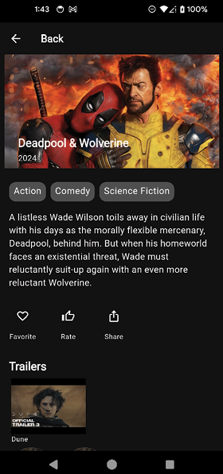

Figure 11.12: Movie Details

#### [Trailers and cast](contents.md#sc4_227a)

Notice that there is still the hard-coded Trailer and cast members. TMDB has APIs for both movies and cast members.

1. Open up `movie_api_service.dart` and add the following video and credit constants:

    ```dart
    const videosParameter = 'videos';
    const creditsParameter = 'credits';
    ```

2. Now add the method to get the list of videos for a movie:

    ```dart
    Future<Response> getMovieVideos(int movieId) async {
      return dio.get('$movieUrl/$movieId/$videosParameter');
    }
    ```

3. Add the method to get the list of credits for a movie:

    ```dart
    Future<Response> getMovieCredits(int movieId) async {
      return dio.get('$movieUrl/$movieId/$creditsParameter');
    }
    ```

    Now that we have these calls, we need the models to put them in.

4. In the `data/models` directory, add `movie_videos.dart`. Add the following code:

    ```dart
    import 'package:freezed_annotation/freezed_annotation.dart';

    part 'movie_videos.freezed.dart';
    part 'movie_videos.g.dart';

    @freezed
    abstract class MovieVideos with _$MovieVideos {
      const factory MovieVideos({
        @JsonKey(name: 'id') required int id,
        @JsonKey(name: 'results') required List<MovieVideo> results,
      }) = _MovieVideos;

      factory MovieVideos.fromJson(Map<String, dynamic> json) =>
          _$MovieVideosFromJson(json);
    }

    @freezed
    abstract class MovieVideo with _$MovieVideo {
      const factory MovieVideo({
        @JsonKey(name: 'name') required String name,
        @JsonKey(name: 'key') required String key,
        @JsonKey(name: 'size') required int size,
        @JsonKey(name: 'official') required bool official,
        @JsonKey(name: 'published_at') required DateTime publishedAt,
        @JsonKey(name: 'id') required String id,
      }) = _MovieVideo;

      factory MovieVideo.fromJson(Map<String, dynamic> json) =>
          _$MovieVideoFromJson(json);
    }
    ```

5. Create the credits file: `movie_credits.dart`. The code is as follows:

    ```dart
    import 'package:freezed_annotation/freezed_annotation.dart';

    part 'movie_credits.freezed.dart';
    part 'movie_credits.g.dart';

    @freezed
    abstract class MovieCredits with _$MovieCredits {
      const factory MovieCredits({
        @JsonKey(name: 'id') required int id,
        @JsonKey(name: 'cast') required List<MovieCast> cast,
        @JsonKey(name: 'crew') required List<MovieCast> crew,
      }) = _MovieCredits;

      factory MovieCredits.fromJson(Map<String, dynamic> json) =>
          _$MovieCreditsFromJson(json);
    }

    @freezed
    abstract class MovieCast with _$MovieCast {
      const factory MovieCast({
        @JsonKey(name: 'adult') required bool adult,
        @JsonKey(name: 'gender') required int gender,
        @JsonKey(name: 'id') required int id,
        @JsonKey(name: 'name') required String name,
        @JsonKey(name: 'original_name') required String originalName,
        @JsonKey(name: 'popularity') required double popularity,
        @JsonKey(name: 'profile_path') required String? profilePath,
        @JsonKey(name: 'cast_id') int? castId,
        @JsonKey(name: 'character') String? character,
        @JsonKey(name: 'credit_id') required String creditId,
        @JsonKey(name: 'order') int? order,
        @JsonKey(name: 'job') String? job,
      }) = _MovieCast;

      factory MovieCast.fromJson(Map<String, dynamic> json) =>
          _$MovieCastFromJson(json);
    }
    ```

6. In the terminal window, run the build runner command:

    ```bash
    dart run build_runner build
    ```

7. Add the following two methods to `MovieViewModel`:

    ```dart
    Future<MovieVideos?> getMovieVideos(int movieId) async {
      final response = await movieAPIService.getMovieVideos(movieId);
      if (response.statusCode == 200) {
        try {
          return MovieVideos.fromJson(response.data);
        } catch (e) {
          logError('Failed to parse movie videos with error $e');
          return null;
        }
      } else {
        logError(
            'Failed to load movie videos with error ${response.statusCode} and message ${response.statusMessage}');
        return null;
      }
    }

    Future<MovieCredits?> getMovieCredits(int movieId) async {
      final response = await movieAPIService.getMovieCredits(movieId);
      if (response.statusCode == 200) {
        try {
          return MovieCredits.fromJson(response.data);
        } catch (e) {
          logError('Failed to parse movie credits with error $e');
          return null;
        }
      } else {
        logError(
            'Failed to load movie credits with error ${response.statusCode} and message ${response.statusMessage}');
        return null;
      }
    }
    ```

8. Now, in `movie_detail.dart`, add the following underneath `movieViewModel` parameters in `_MovieDetailState`:

    ```dart
    MovieCredits? credits;
    MovieVideos? movieVideos;
    ```

9. Change the `Trailer` call to:

    ```dart
    movieVideos: movieVideos?.results,
    ```

10. Then, change the hard-code video `movieVideo: 'U2Qp5pL3ovA'` to:

    ```dart
    VideoPageRoute(movieVideo: video));
    ```

11. In `trailer.dart`, inside of `Trailer`, change:

    ```dart
    final List<String>? movieVideos;
    ```

    To:

    ```dart
    final List<MovieVideo>? movieVideos;
    ```

    Change:

    ```dart
    imageUrl: movieVideo,
    ```

    To:

    ```dart
    imageUrl: youtubeImageFromId(movieVideo.key),
    ```

12. Also, change `'Dune'` to `movieVideo.name`.

13. In `utils.dart`, change `OnMovieVideoTap` to:

    ```dart
    typedef OnMovieVideoTap = void Function(MovieVideo video);
    ```

    You will then need to change the video items.

14. In `video_page.dart`, change the `String` to:

    ```dart
    final MovieVideo movieVideo;
    ```

15. In `initState`, change the `youtubeUrlFromId` call to:

    ```dart
    youtubeUrlFromId(widget.movieVideo.key),
    ```

16. Back in `movie_detail.dart`, add the following after the `Trailer` call:

    ```dart
    Padding(
      padding: const EdgeInsets.only(
          left: 16, bottom: 16, top: 16),
      child: Text('Cast',
          style: Theme.of(context)
              .textTheme
              .headlineLarge),
    ```

    This will add a title of `Cast` below the trailer and before the cast.

17. Next, change the `HorizontalCast` call to:

    ```dart
    HorizontalCast(castList: credits?.cast ?? []),
    ```

    (Make sure to remove the const).

18. Add the following calls to the beginning of the `loadData` method:

    ```dart
    credits = await movieViewModel.getMovieCredits(widget.movieId);
    movieVideos = await movieViewModel.getMovieVideos(widget.movieId);
    ```

    Now, we have some errors in these widgets. We will need to change their parameters.

19. Next, open `hori_cast.dart` and change `castList` to:

    ```dart
    final List<MovieCast> castList;
    ```

20. Change the `CastImage` call to:

    ```dart
    return CastImage(
              imageUrl:
                  getImageUrl(ImageSize.small, castList[index].profilePath),
              name: castList[index].name);
    ```

21. In the terminal window, run the build runner command:

    ```dart
    dart run build_runner build
    ```

    (Note: You may have to add imports to the `app_routes.dart` file)

Perform a hot reload, and you should see real trailers for the movie and the cast members, as shown in the following figure:

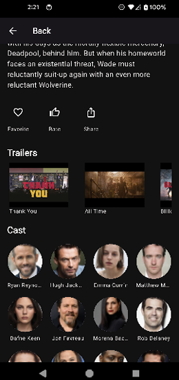

Figure 11.13: Movie Details with Cast

#### [Home screen image](contents.md#sc4_228a)

Now that we have movie details on the detail screen, we need those details on the main home screen. Open `home_screen_image.dart`. Replace:

```dart
child: Hero(
  tag: uniqueHeroTag,
  child: CachedNetworkImage(
    imageUrl: currentMovie.image,
    alignment: Alignment.topCenter,
    fit: BoxFit.fitHeight,
    height: 374,
    width: screenWidth,
  ),
)
```

With the following:

```dart
child: Padding(
  padding: const EdgeInsets.all(8.0),
  child: Stack(children: [
    Align(
      alignment: Alignment.topCenter,
      child: Hero(
        tag: uniqueHeroTag,
        child: CachedNetworkImage(
          imageUrl: imageUrl,
          alignment: Alignment.topCenter,
          fit: BoxFit.fitHeight,
          height: 374,
          width: screenWidth,
        ),
      ),
    ),
    Align(
      alignment: Alignment.bottomLeft,
      child: Padding(
        padding: const EdgeInsets.only(left: 16.0),
        child: Column(
          mainAxisSize: MainAxisSize.min,
          mainAxisAlignment: MainAxisAlignment.start,
          crossAxisAlignment: CrossAxisAlignment.start,
          children: [
            Text(
              movieViewModel.nowPlayingMovies[index].title,
              style: Theme.of(context).textTheme.headlineLarge,
            ),
            addVerticalSpace(4),
            currentMovie.releaseDate != null
                ? Text(
                    yearFormat.format(currentMovie.releaseDate!),
                    style: Theme.of(context).textTheme.bodyMedium,
                  )
                : Container(),
            addVerticalSpace(4),
            Padding(
              padding: const EdgeInsets.only(bottom: 8.0, right: 8.0),
              child: AutoSizeText(
                movieViewModel.nowPlayingMovies[index].overview,
                style: Theme.of(context).textTheme.bodyMedium,
                maxLines: 3,
                overflow: TextOverflow.ellipsis,
              ),
            ),
          ],
        ),
      ),
    )
  ]),
),
```

This will add the movie name, release year, and details to the main image, as shown in the following figure:

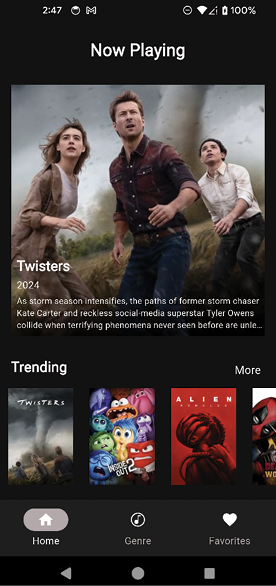

Figure 11.14: Movie text

#### [Final APIs](contents.md#sc4_229a)

There are a few more APIs that we will use in later chapters. We will add them but not use them until later. The first one retrieves a list of genres.

1. In `movie_api_service.dart`, add the following constants:

    ```dart
    const genreUrl = 'genre/movie/list';
    const searchMovieUrl = 'search/movie';
    const discoverMovieUrl = 'discover/movie';
    const configurationUrl = 'configuration';
    const queryParameterName = 'query';
    const genreParameterName = 'with_genres';
    ```

2. Add the following code to the end of the class:

    ```dart
    Future<Response> getGenres() async {
      final response = await dio.get(genreUrl);
      return response;
    }

    Future<Response> searchMovies(String query, [int page = 1]) async {
      return dio.get(
        searchMovieUrl,
        queryParameters: {queryParameterName: query},
      );
    }

    Future<Response> searchMoviesByGenre(String genre, [int page = 1]) async {
      return dio.get(
        discoverMovieUrl,
        queryParameters: {genreParameterName: genre, pageParameterName: page},
      );
    }

    Future<Response> getMovieConfiguration() async {
      return dio.get(configurationUrl);
    }
    ```

    After the `getGenres` method, there is `searchMovies` to search by a query string, `searchMoviesByGenre` to search by genre, and finally, `getMovieConfiguration`, which will be used to get configuration information in a later chapter.

3. Now, update `MovieViewModel`. Replace:

    ```dart
    late List<String> movieGenres;
    ```

    With:

    ```dart
    List<Genre>? movieGenres;
    ```

4. Replace `setupGenres` with:

    ```dart
    Future setupGenres() async {
      final response = await movieAPIService.getGenres();
      if (response.statusCode == 200) {
        movieGenres = Genres.fromJson(response.data).genres;
      } else {
        logError(
            'Failed to load genres with error ${response.statusCode} and message ${response.statusMessage}');
      }
    }
    ```

    This will get all of the current genres that the service supports.

5. At the end of the class add:

    ```dart
    Future<MovieResponse?> searchMoviesByGenre(String genres, int page) async {
      final response = await movieAPIService.searchMoviesByGenre(genres, page);
      if (response.statusCode == 200) {
        var movieResponse = MovieResponse.fromJson(response.data);
        return movieResponse;
      } else {
        logError(
            'Failed to load movies with error ${response.statusCode} and message ${response.statusMessage}');
        return null;
      }
    }

    Future<MovieResponse?> searchMovies(String searchText, int page) async {
      final response = await movieAPIService.searchMovies(searchText, page);
      if (response.statusCode == 200) {
        var movieResponse = MovieResponse.fromJson(response.data);
        return movieResponse;
      } else {
        logError(
            'Failed to load movies with error ${response.statusCode} and message ${response.statusMessage}');
        return null;
      }
    }
    ```

    These two methods just implement the APIs for searching for movies.

#### [Genres](contents.md#sc4_230a)

Now that `MovieViewModel` loads genres instead of strings, you need to change some of the genre screens.

1. Open `genre_screen.dart`. Add a `!` character after the `movieGenres` in the `buildGenreState` method:

    ```dart
    for (final genre in movieViewModel.movieGenres!) {
    ```

2. Open `genre_section.dart`, in `GenreState`, change the `string` to a `Genre`:

    ```dart
    final Genre genre;
    ```

3. In `GenreSection`, change the `GridView.builder` to:

    ```dart
    child: GridView.builder(
      shrinkWrap: true,
      padding: const EdgeInsets.all(0.0),
      itemCount: genreChips.length,
      gridDelegate: const SliverGridDelegateWithFixedCrossAxisCount(
        crossAxisCount: 3,
        crossAxisSpacing: 0,
        childAspectRatio: 2.2,
        mainAxisSpacing: 0),
    ```

4. Then, in `getGenreChips`, change the following:

```dart
final genreState = widget.genreStates[index];
```

To:

```dart
final genre = widget.genreStates[index].genre;
```

And:

```dart
label: Text(genreState.genre,
```

To:

```dart
label: Text(genre.name,
```

And:

```dart
genre: genreState.genre,
```

To:

```dart
genre: genre,
```

Hot restart and test the Genre screen. As you can see, adding network calls required many changes. **Ideally, you would write your networking code early on in your app work so you can design around the models instead of using strings, as we needed to do.**

## [Conclusion](contents.md#sc2_231a)

In this chapter, you learned about APIs and networking packages. You also saw how to sign up for a service that provides an API and how to implement those APIs in code.

In the next chapter, you will learn about local storage and databases. These will allow you to store user information locally so that a network connection is not always needed and to save application settings.
