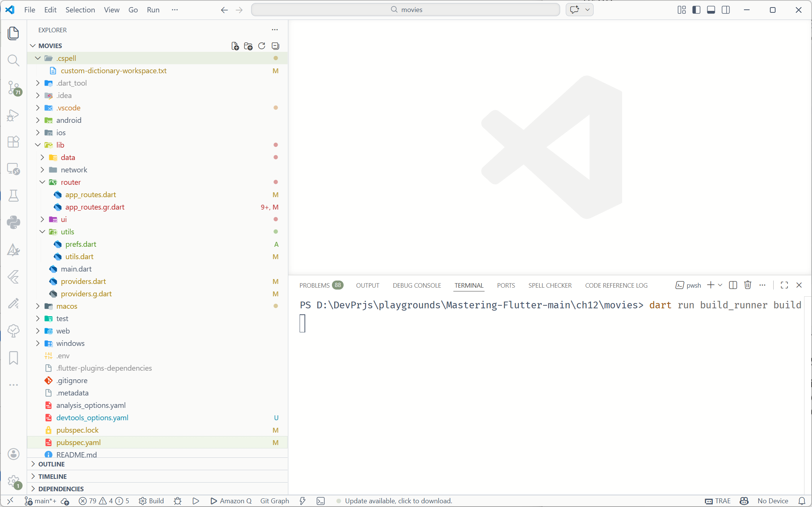
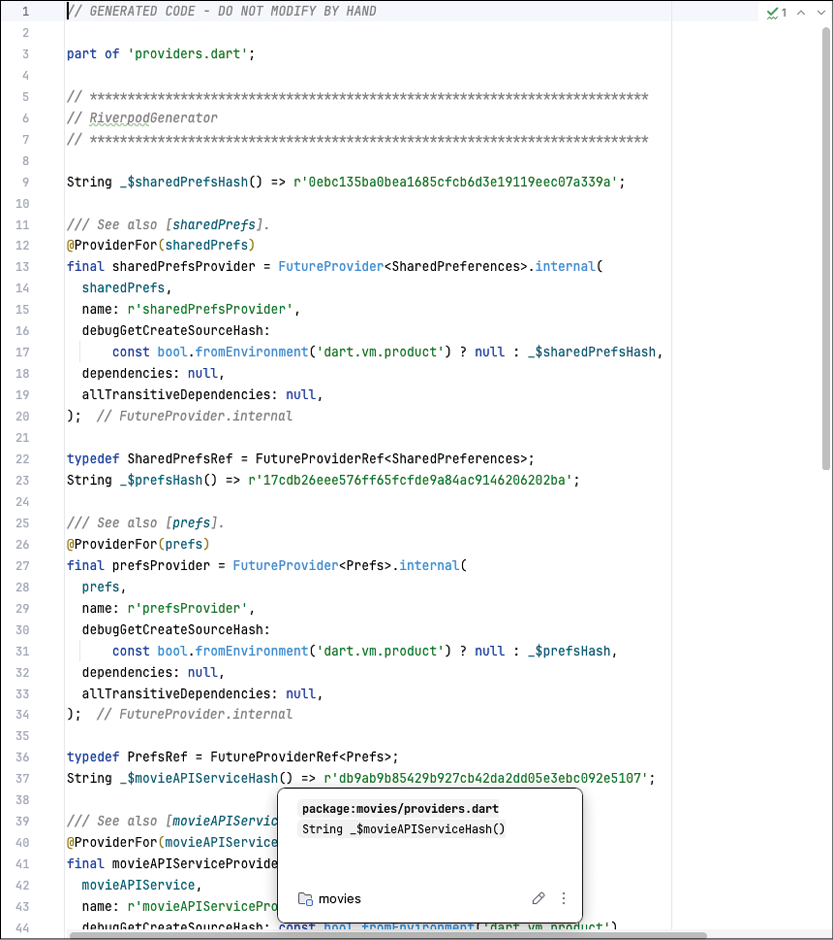
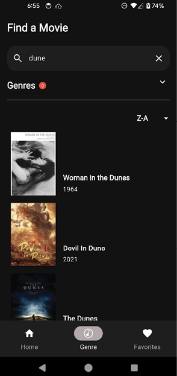

# [CHAPTER 12 Local Storage and Databases](contents.md#ch12a)

## [Introduction](contents.md#sc2_232a)

In this chapter, you will learn about storing information on the device. You will learn about storing data from simple key/value pairs to full databases and tables. This will allow you to save user information as well as cache data that does not need to be downloaded each time the app starts up.

## [Structure](contents.md#sc2_233a)

The chapter covers the following topics:

- SharedPreferences
- Saving genres
- Databases
- Movie configuration

## [Objectives](contents.md#sc2_234a)

By the end of this chapter, you will have a solid understanding of `SharedPreferences` and how to create local databases. You will learn how to create tables and database classes to interact with local files. You will save a user's genre selections to `SharedPreferences` and favorites to a local database. You will also download movie configuration and genre information and store them in the local database, caching that information for future sessions.

## [SharedPreferences](contents.md#sc2_235a)

So far, you have learned how to build UIs that display information but have not saved any information on the local device. When a user restarts your app, it will start the same way each time. If you wanted to have settings or preferences that a user could set, it would not do any good if it only lasted the lifetime of the current session. In this chapter, you will learn how to save those settings and movie information so that if there is no internet connection, those settings will still be available.

There are many types of information you could save. You could save the current screen the user is on or their sorting preferences. In this chapter, you will save the user's favorites locally. Since these favorites cannot be stored on The Movie Database (TMDB) site, saving them locally is a good option. Of course, if the user uninstalls your app, they will lose any settings saved locally. For more permanent storage, you would need a server that would allow you to save that information. In [Chapter 15](ch15.md), Firebase, you will learn about Firebase and how you can save that information in the cloud.

There are several ways to save data locally. This is usually done using the local storage that phones provide. You could save the information in a file you create but that is pretty low-level and there are better ways to do it. Both iOS and Android have a way to save preferences as well as a built-in SQLite database that can be used to save data. We will cover both preferences and different ways to use databases.

There are many types of persistence, but one of the most basic is the notion of preferences, where you can save small amounts of data. This is called `SharedPreferences` on Android. If you are familiar with iOS, that class is called `UserDefaults`. These classes allow you to save very simple key/value pairs to the device. It is not meant to store large amounts of data; it is meant to store settings. This can be the current user's access token, name, settings values, or anything that can be stored as an `int`, `String`, `double`, or `Boolean`. We will be using the `shared_preferences` plugin. This plugin supports all platforms.

Next, we will create a `Prefs` class that will handle all interactions with the `shared_preferences` plugin:

1. Open up `pubspec.yaml` and add:

    ```dart
    shared_preferences: ^2.5.5
    ```

2. Run `flutter pub get`.

3. Next, create `prefs.dart` in the `utils` directory. Add the following:

    ```dart
    import 'package:shared_preferences/shared_preferences.dart';
    class Prefs {
      final SharedPreferences preferences;
      Prefs(this.preferences);
      // Add methods
    }
    ```

    This is the `Prefs` class that takes an instance of the `SharedPreferences` class.

4. Next, create two methods for storing and getting strings:

    ```dart
    void setString(String key, String value) {
      preferences.setString(key, value);
    }
    String? getString(String key) {
      return preferences.getString(key);
    }
    ```
    Notice that the `setString` method takes a key and a string value. The `getString` method just needs the key. If it does not exist, a null value is returned.

5. Add the remaining methods:

    ```dart
    void setInt(String key, int value) {
      preferences.setInt(key, value);
    }
    int? getInt(String key) {
      return preferences.getInt(key);
    }
    void setBool(String key, bool value) {
      preferences.setBool(key, value);
    }
    bool? getBool(String key) {
      return preferences.getBool(key);
    }
    void setDouble(String key, double value) {
      preferences.setDouble(key, value);
    }
    double? getDouble(String key) {
      return preferences.getDouble(key);
    }
    ```
    This just creates getters and setters for `int`, `bool`, and `double`.

6. Open the `providers.dart` file in the `lib` directory. Add the following:

    ```dart
    import 'package:movies/utils/prefs.dart';
    import 'package:shared_preferences/shared_preferences.dart';
    @Riverpod(keepAlive: true)
    Future<SharedPreferences> sharedPrefs(Ref ref) =>
        SharedPreferences.getInstance();
    ```
    (Make sure the imports are before the part statement). The first import is for the `prefs.dart` file you just created. The last import is for the `SharedPreferences` plugin. The `@Riverpod` annotation tells the `Riverpod` generator to create a single `FutureProvider` for the `SharedProvider` plugin.

    Since you created a nice class to make this package easier to use, you will use the `Prefs` class instead. This also makes testing easier. Add the following:

    ```dart
    @Riverpod(keepAlive: true)
    Future<Prefs> prefs(Ref ref) async {
      final sharedPrefs = await ref.read(sharedPrefsProvider.future);
      return Prefs(sharedPrefs);
    }
    ```
    This will create a provider for the `Prefs` class.

7. Open up the Terminal tab at the bottom of Android Studio, as shown in the following figure:

    

    Figure 12.1: Generating files

8. Then type `dart run build_runner build`. This will run build_runner and will update the `providers.g.dart` file. You can have the build_runner running continuously by using the watch command instead of the build. Opening `providers.g.dart` file, you will see something as follows:

    

    Figure 12.2: Generated file

    This class has been created for you, so do not attempt to change it yourself. It will be overwritten the next time you run the builder. You do not need to worry about what is created. The most important variable is the `sharedPrefsProvider` variable. You can use this variable throughout your code to get an `SharedPreference` instance.  

## [Saving genres](contents.md#sc2_236a)

A good way to use preferences is to save the selected genres. Since this is only needed on a per-phone basis, it is perfect for saving the user time. For example, if the user likes horror/romance films, pre-selecting those genres would save them time. The first thing we want to do is put the `GenreState` class into its file and add the freeze annotation.

Create the `GenreState` class:

1. Open up `genre_section.dart` and remove the `GenreState` class.

2. In the `data/models` folder, create a new file named `genre_state.dart`.

3. Add the following:

    ```dart
    import 'package:freezed_annotation/freezed_annotation.dart';

    import 'package:movies/data/models/genre.dart';

    part 'genre_state.freezed.dart';
    part 'genre_state.g.dart';

    @freezed
    abstract class GenreState with _$GenreState {
      const factory GenreState({required Genre genre, required bool isSelected}) =
          _GenreState;

      factory GenreState.fromJson(Map<String, dynamic> json) =>
          _$GenreStateFromJson(json);
    }
    ```

4. In the terminal, type `dart run build_runner build`.

5. Open `genre_section.dart` and add the `GenreState` import.

6. Open `genre_screen.dart` and add the `GenreState` import.

7. Above the `GenreScreen` class, add the following constant before the class that will be used to save genres:

    ```dart
    const String genreStringKey = 'GenreKey';
    ```
    While we are in the `GenreScreen` class, we will be adding the ability to search for movies.

8. Remove the `currentMovieList` variable.

9. Add the following variables:

    ```dart
    // after `late MovieViewModel movieViewModel;`
    String currentSearchString = '';
    //   `List<GenreState> genreStates = [];`
    List<MovieResults> currentMovieList = [];
    final moviesNotifier = ValueNotifier<List<MovieResults>>([]);
    MovieResponse? currentMovieResponse;
    Sorting selectedSort = Sorting.aToz;
    ```
    The `currentSearchString` holds the string the user is searching for. As we no longer use the `Movie` class, the `currentMovieList` holds a list of `MovieResults`. The `currentMovieResponse` is the current list of movies based on the search a user made. Sorting starts with an A-Z sort, but the user can change that.

10. Inside the `buildGenreState` method, add the following call at the end of the method:

    ```dart
    getSelectedGenres();
    ```

11. At the end of the class, add the import for the `collection` package:

    ```dart
    void getSelectedGenres() async {
      // 1
      final prefs = await ref.read(prefsProvider.future);
      // 2
      final genreNameList = prefs.getString(genreStringKey)?.split(',');
      if (genreNameList?.isNotEmpty == true) {
        // 3
        for (final genreName in genreNameList!) {
          // 4
          var genreState = genreStates
              .firstWhereOrNull((genre) => genre.genre.name == genreName);
          if (genreState != null) {
            // 5
            final index = genreStates.indexOf(genreState);
            genreState = genreState.copyWith(isSelected: true);
            genreStates[index] = genreState;
          }
        }
      }
    }
    ```
    You will need to add the `collection` import for the `firstWhereOrNull` call. This method will get the `genre` settings from the preferences package. Note that the genres are stored as a single string, separated by commas. Here is a breakdown:

    1. Get an instance of the `Prefs` class.
    2. Get the `genre` string and split it into an array of genre names.
    3. Go through each genre.
    4. Find the genre state with that name.
    5. Get the index and then make a copy with the selected value set.

    This gets the genres, but how do you save them?

12. Before this method, add the following save method:

    ```dart
    void saveSelectedGenres() async {
      final prefs = await ref.read(prefsProvider.future);
      final genreNameList = genreStates.map((state) => state.genre.name).toList();
      prefs.setString(genreStringKey, genreNameList.join(','));
    }
    ```
    This will get the `Prefs` class and save the genres as a comma separated string.

13. Update the `GenreSearchRow` call:

    ```dart
    GenreSearchRow((searchString) {
      currentSearchString = searchString;
      currentMovieResponse = null;
      FocusScope.of(context).unfocus();
      expandedNotifier.value = false;
      search();
    }),
    ```
    This will take the `searchString` returned by the search row, close the keyboard (unfocus call), close the genre section, and start a search.

14. Since the `search` method does not exist yet, add the `search` method:

    ```dart
    Future<List<MovieResults>?> search() async {
      // 1
      if (currentSearchString.isEmpty && genreStates.isEmpty) {
        moviesNotifier.value = <MovieResults>[];
        return <MovieResults>[];
      }
      // 2
      // 1st, search by title
      // Search through the list for the search string
      final pageNumber = (currentMovieResponse?.page == null)
          ? 1
          : (currentMovieResponse!.page + 1);
      // 3
      if (currentSearchString.isNotEmpty) {
        currentMovieResponse =
            await movieViewModel.searchMovies(currentSearchString, pageNumber);
        currentMovieList = currentMovieResponse!.results;
      }
      // 4
      // 2nd Search by genre if there is no search string
      if (currentSearchString.isEmpty && genreStates.isNotEmpty) {
        final buffer = getGenreString();
        currentMovieResponse = await movieViewModel.searchMoviesByGenre(
          buffer.toString(),
          pageNumber,
        );
        currentMovieList = currentMovieResponse!.results;
        // 3rd Search through the movies to see if they match our genres
        // 5
      } else if (genreStates.isNotEmpty && currentMovieList.isNotEmpty) {
        currentMovieList = currentMovieList.where((movie) {
          for (final selectedGenre in genreStates) {
            if (movie.genreIds.contains(selectedGenre.genre.id)) {
              return true;
            }
          }
          return false;
        }).toList();
      }
      // 6
      sortMovies();
      return currentMovieList;
    }
    ```
    This `search` method does several things. Here is a breakdown:

    1. Check to see if the search string and genre states are empty.
    2. Update the page number (There could be multiple pages of results).
    3. Perform the search using the search string.
    4. If the search string is empty and we have genres, do a search by genre.
    5. If we have genres, go through the results and find movies that have those genres.
    6. Sort the movies.

    Now add the `getGenreString` and `sortMovies` methods.

15. Add the `getGenreString` method:

    ```dart
    StringBuffer getGenreString() {
      final buffer = StringBuffer();
      genreStates.map((e) {
        if (e.isSelected) {
          if (buffer.isNotEmpty) {
            buffer.write('|');
          }
          buffer.write(e.genre.id);
        }
      }).toList();
      return buffer;
    }
    ```
    This `getGenreString` method builds a `StringBuffer` that is a `|` delimited string. This is required by the movies API.

16. Add the `sortMovies` method:  

    ```dart
    void sortMovies() {
      if (currentMovieList.isEmpty) {
        return;
      }
      currentMovieList = currentMovieList.sorted((a, b) {
        switch (selectedSort) {
          case Sorting.aToz:
            return a.originalTitle.compareTo(b.originalTitle);
          case Sorting.zToa:
            return b.originalTitle.compareTo(a.originalTitle);
          case Sorting.rating:
            return b.popularity.compareTo(a.popularity);
          case Sorting.year:
            if (a.releaseDate != null && b.releaseDate != null) {
              return a.releaseDate!.compareTo(b.releaseDate!);
            }
        }
        return 0;
      });
      moviesNotifier.value = currentMovieList;
    }
    ```
    This just returns a sorted list of movies. We now need a way to save the selected genres.

17. Find `onGenreSelected` and replace with:

    ```dart
    onGenresSelected: (genres) {
      genreStates = genres;
      saveSelectedGenres();
      currentMovieResponse = null;
    });
    ```
    This will save the selected genres. Next, we need to save the selected sort value.

18. Find `SortPicker` and change the call to:

    ```dart
    SortPicker(
      useSliver: true,
      onSortSelected: (sorting) {
        selectedSort = sorting;
        sortMovies();
    }),
    ```
    This will re-sort the current movie list.

19. Change the call to `VerticalMovieList` with:

    ```dart
    ValueListenableBuilder<List<MovieResults>>(
      valueListenable: moviesNotifier,
      builder: (BuildContext context, List<MovieResults> value, Widget? child) {
        return VerticalMovieList(
          movies: value,
          movieViewModel: movieViewModel,
          onMovieTap: (movieId) {
            context.router.push(MovieDetailRoute(movieId: movieId));
          },
        );
      },
    ),
    ```
    This wraps the movie list with a `ValueListenableBuilder`. This will help performance by only updating this section if the list of movies changes. Notice that `VerticalMovieList` does not like those changes.

20. Open `vert_movie_list.dart` and remove the `onMovieTap typedef` as it already exists in `utils.dart`. Import the `utils.dart` file.

21. Change the fields and constructor to the following:

    ```dart
    final List<MovieResults> movies;
    final MovieViewModel movieViewModel;
    final OnMovieTap onMovieTap;
    const VerticalMovieList({
      super.key,
      required this.movies,
      required this.movieViewModel,
      required this.onMovieTap,
    });
    ```
    Add any imports needed.

22. Change the call to `MovieRow` to:

    ```dart
    return MovieRow(
      movie: movies[index],
      movieViewModel: movieViewModel,
      onMovieTap: (movie) {
        onMovieTap(movie.id);
      },
    );
    ```
    This passes the view model to `MovieRow`.

23. Open `movie_row.dart`. Change the fields and constructor to:

    ```dart
    final MovieResults movie;
    final MovieViewModel movieViewModel;
    final OnMovieResultsTap onMovieTap;
    const MovieRow({
      required this.movie,
      required this.movieViewModel,
      required this.onMovieTap,
      super.key,
    });
    ```
    Add any imports. Notice that we changed `onMovieTap` to `onMovieResultsTap`. That definition does not exist. We want to pass the `MovieResults` to the caller.

24. Open `utils.dart` and add:

    ```dart
    typedef OnMovieResultsTap = void Function(MovieResults movie);
    const Widget emptyWidget = SizedBox.shrink();
    ```

25. Back in `MovieRow`, change the first two lines in the build method with:

    ```dart
    final imageUrl = getImageUrl(ImageSize.small, movie.posterPath);
    final uniqueHeroTag = '${imageUrl}MovieRow';
    if (imageUrl.isNotEmpty) {
    ```

26. Change onMovieTap(movie.movieId) to:

    ```dart
    onMovieTap(movie);
    ```

27. Change the `imageUrl` parameter in `CachedNetworkImage` call to:

    ```dart
    imageUrl: imageUrl,
    ```
    Next, you need to put in real movie information in instead of just using the text title and 1979 for the title and year.

28. Replace the `Column` with:

    ```dart
    Expanded(
      child: LayoutBuilder(
        builder: (BuildContext context, BoxConstraints constraints) {
          return Column(
            mainAxisSize: MainAxisSize.min,
            mainAxisAlignment: MainAxisAlignment.end,
            crossAxisAlignment: CrossAxisAlignment.start,
            children: [
              const Spacer(),
              SizedBox(
                width: constraints.maxWidth,
                child: AutoSizeText(
                  movie.title,
                  maxLines: 3,
                  minFontSize: 10,
                  style: Theme.of(context).textTheme.labelLarge,
                  overflow: TextOverflow.ellipsis,
                ),
              ),
              addVerticalSpace(4),
              movie.releaseDate != null
                  ? Text(
                      yearFormat.format(movie.releaseDate!),
                      style: Theme.of(context).textTheme.bodyMedium,
                    )
                  : Container(),
              addVerticalSpace(4),
            ],
          );
        },
      ),
    ),
    ```
    This wraps the `column` with `Expanded` and `LayoutBuilder` widgets. The `Expanded` widget makes the column as big as possible, and the `LayoutBuilder` gives us some sizes to work with. Specifically, we need the column's width. The `SizedBox` uses the `constraints.maxWidth` value from the `LayoutBuilder`.

Perform a hot reload. Press the `Genre` tab, type in a search query, select any genres, and press the search icon. You should see something like the following figure:



Figure 12.3: Genre search

## [Databases](contents.md#sc2_237a)

There are times when an internet connection is not available or when you want to store information locally. That is where on-device databases come in. By storing information locally, you can display information to the user without a connection or save information to be uploaded to the internet later when the connection is restored. Luckily, Flutter has many database options for you. We will cover some of the most popular databases and then we will use the `drift` database as the database for the movies app.

### [SQLite](contents.md#sc3_238a)

Both Android and iOS come with the built-in SQLite database. This is a self-contained, serverless SQL database engine. It is file based, very small, and efficient. It does not require any configuration and uses SQL. If you are familiar with SQL, you will understand how to use SQLite. However, because it is based on SQL, it can be hard for users who do not know that language. It is important to understand the basics of SQL. SQL stores data in tables that are made up of columns and rows. Each column is a specific data type, and each row is a record in that table. SQL comprises queries (getting information) and commands for adding, deleting, and updating data.

For queries, you should use the `SELECT` command. This would look as follows:

```sql
SELECT name, address FROM Customers;
```

This command selects the name and address columns from the Customers table.

To add data, you would use the `INSERT` command as follows:

```sql
INSERT INTO Customers (NAME, ADDRESS) VALUES(value1, value2);
```

This makes a new row and inserts value1 into the name column and value2 into the address column.

To delete a row, use the `DELETE` command as follows:

```sql
DELETE FROM Customers WHERE id = 1;
```

This command searches for the row with an id of 1 and deletes that row.

To update a row, use the `UPDATE` command as follows:

```sql
UPDATE Customers SET phone='555-12345' WHERE id=1;
```

This will change the row's phone column to this value for the row with an id of 1.

If you want to use SQLite by itself, you can use the `sqlite3` package. You can find this package at: <https://pub.dev/packages/sqlite3>.

### [Floor](contents.md#sc3_239a)

Floor is a reactive SQLite abstraction that is inspired by the Android Room persistence library. This package requires a knowledge of SQL as you use query statements in the code which is mapped to classes. If you come from the Android world and like the Room database, you will be familiar with the setup of this library. This package requires the creation of entities, which are classes for storing information in tables. You then create a data access object (DAO) class for queries, insertions, updates, and deletions. Finally, you need to create a database class that extends the FloorDatabase. This class will hold all of the DAO classes. Here is an example of a Person entity:

```dart
import 'package:floor/floor.dart';
@entity
class Person {
  @primaryKey
  final int id;
  final String name;
  Person(this.id, this.name);
}
```
This uses the `@entity` annotation to mark this class as an entity. Because the plugin uses annotations, you must use the floor generator to create classes based on this annotation. To create a DAO, you would use something as follows:

```dart
import 'package:floor/floor.dart';
@dao
abstract class PersonDao {
  @Query('SELECT * FROM Person')
  Future<List<Person>> findAllPeople();
  @Query('SELECT name FROM Person')
  Stream<List<String>> findAllPeopleName();
  @Query('SELECT * FROM Person WHERE id = :id')   
  Stream<Person?> findPersonById(int id);
  @insert
  Future<void> insertPerson(Person person);
}
```
To create the database, you would create a class as follows:

```dart
import 'dart:async';
import 'package:floor/floor.dart';
import 'package:sqflite/sqflite.dart' as sqflite;
import 'dao/person_dao.dart';
import 'entity/person.dart';
part 'app_database.g.dart'; // the generated code will be there
@Database(version: 1, entities: [Person])
abstract class AppDatabase extends FloorDatabase {
  PersonDao get personDao;
}
```
To use the generated classes, you would write code as follows:

```dart
final database = await $FloorAppDatabase.databaseBuilder('app_database.db').build();
final personDao = database.personDao;
final person = Person(1, 'Frank');
await personDao.insertPerson(person);
final result = await personDao.findPersonById(1);
```

### [Hive](contents.md#sc3_240a)

Hive is a lightweight and fast key/value database written in Dart. You can also store annotated classes. Here is an example of a simple box:

```dart
var box = Hive.box('myBox');
box.put('name', 'David');
var name = box.get('name');
```
You can also create `BoxCollections`. This is just a collection of multiple boxes. Here is an example:

```dart
final collection = await BoxCollection.open(
  'MyFirstFluffyBox', // Name of your database
  {'cats', 'dogs'}, // Names of your boxes
  path: './', // Path where to store your boxes (Only used in Flutter / Dart IO)
  key: HiveCipher(), // Key to encrypt your boxes (Only used in Flutter / Dart IO)
);

// Open your boxes. Optional: Give it a type.
final catsBox = collection.openBox<Map>('cats');
// Put something in
await catsBox.put('fluffy', {'name': 'Fluffy', 'age': 4});
await catsBox.put('loki', {'name': 'Loki', 'age': 2});
// Get values of type (immutable) Map?
final loki = await catsBox.get('loki');
```
To store a class you would write a class as follows:

```dart
@HiveType(typeId: 0)
class Person extends HiveObject {
  @HiveField(0)
  String name;
  @HiveField(1)
  int age;
}
```
You would use this class as follows:

```dart
var box = await Hive.openBox('myBox');
var person = Person()
  ..name = 'Dave'
  ..age = 22;
box.add(person);
print(box.getAt(0)); // Dave - 22
person.age = 30;
person.save();
```
You can find Hive at <https://pub.dev/packages/hive>.

### [Isar](contents.md#sc3_241a)

If you are interested in a NoSQL database, then Isar is one of the best. It is very fast and works on most platforms. The author originally used it for the movies project and ran into trouble with the web. That part is still in development, so we chose drift. Isar uses annotations and a generator as well. Isar uses the `@collection` annotation for classes. One of the nice features of this database is that you can have references for other collections. Here is an example of an email and recipient class:

```dart
part 'email.g.dart';
@collection
class Email {
  Id id = Isar.autoIncrement; // you can also use id = null to auto increment
  @Index(type: IndexType.value)
  String? title;
  List<Recipient>? recipients;
  @enumerated
  Status status = Status.pending;
}
@embedded
class Recipient {
  String? name;
  String? address;
}
enum Status {
  draft,
  pending,
  sent,
}
```
As you can see, it has IDs, indexes, embedded classes, and the ability to handle enumerations. To use the database, you will have to use the `path_provider` package and open the database as follows:

```dart
final dir = await getApplicationDocumentsDirectory();
final isar = await Isar.open(
  [EmailSchema],
  directory: dir.path,  
);
```
You can then query emails:

```dart
final emails = await isar.emails.filter()
  .titleContains('awesome', caseSensitive: false)
  .sortByStatusDesc()
  .limit(10)
  .findAll();
```
In addition to queries, you can also insert and delete:

```dart
final newEmail = Email()..title = 'Amazing new database';
await isar.writeTxn(() {
  await isar.emails.put(newEmail); // insert & update
});
final existingEmail = await isar.emails.get(newEmail.id!); // get
await isar.writeTxn(() {
  await isar.emails.delete(existingEmail.id!); // delete
});
```
One of the features the author likes about this database is its powerful query language. The following are a few examples:

```dart
final importantEmails = isar.emails
  .where()
  .titleStartsWith('Important') // use index
  .limit(10)
  .findAll()
final specificEmails = isar.emails
  .filter()
  .recipient((q) => q.nameEqualTo('David')) // query embedded objects
  .or()
  .titleMatches('*university*', caseSensitive: false) // title containing 'university' (case insensitive)
  .findAll()
```
You can find Isar at <https://pub.dev/packages/isar>. As mentioned earlier, Isar would be a great database if you do not need it for the web.

### [Drift](contents.md#sc3_242a)

Drift is described as a reactive persistence library built on top of SQLite. You can find documentation for drift at <https://pub.dev/packages/drift> and <https://drift.simonbinder.eu/>. Drift is similar to other packages in that you need to create Table classes and annotate a Database class. It has a builder for these generated files. Drift's tables are a bit different. All table classes must extend the `Table` class, and you define fields with the get keyword. The following is an example table:

```dart
class TodoItems extends Table {
  IntColumn get id => integer().autoIncrement()();
  TextColumn get title => text().withLength(min: 6, max: 32)();
  TextColumn get content => text().named('body')();
  IntColumn get category =>
  integer().nullable().references(TodoCategory, #id)();
  DateTimeColumn get createdAt => dateTime().nullable()();
}
```
An ID field is defined as:

```dart
IntColumn get id => integer().autoIncrement()();
```
This defines a field named `id` that is an `IntColumn` and auto increments (automatically increments the id without you knowing what the next value should be). You can have text fields defined as a `TextColumn` and a date field defined as a `DateTimeColumn`. To create a Database, you create a class that extends to a Drift built class, similar to the way `freezed` creates its classes. The following is a sample:

```dart
@DriftDatabase(tables: [TodoItems, TodoCategory])
class AppDatabase extends _$AppDatabase {
}
```

The `_AppDatabase` class will get generated for you. The `@DriftDatabase` annotation defines the tables.

## [Movie configuration](contents.md#sc2_243a)

TMDB has an API call that will get you information on all the image types and sizes. This API is at <https://api.themoviedb.org/3/configuration>. This API returns the base URL for images as well as the sizes. You build a URL for each image from the base URL and a size. Instead of hard coding the sizes and base URLs, you can download the configuration information and store it in a local database.

First, we need to create a UI model for the configuration, use the following steps:

1. Create a new file in the `data/models` folder named `movie_configuration.dart`.

2. Add the following:

    ```dart
    import 'package:freezed_annotation/freezed_annotation.dart';
    part 'movie_configuration.freezed.dart';
    part 'movie_configuration.g.dart';
    @freezed
    abstract class MovieConfiguration with _$MovieConfiguration {
      const factory MovieConfiguration({
        @JsonKey(name: 'images')
        required MovieConfigurationImages images,
        @JsonKey(name: 'change_keys')
        required List<String> changeKeys,
      }) = _MovieConfiguration;
      factory MovieConfiguration.fromJson(Map<String, dynamic> json) => _$MovieConfigurationFromJson(json);
    }
    @freezed
    abstract class MovieConfigurationImages with _$MovieConfigurationImages {
      const factory MovieConfigurationImages({
        @JsonKey(name: 'base_url')
        required String baseUrl,
        @JsonKey(name: 'secure_base_url')
        required String secureBaseUrl,
        @JsonKey(name: 'backdrop_sizes')
        required List<String> backdropSizes,
        @JsonKey(name: 'logo_sizes')
        required List<String> logoSizes,
        @JsonKey(name: 'poster_sizes')
        required List<String> posterSizes,
        @JsonKey(name: 'profile_sizes')
        required List<String> profileSizes,
        @JsonKey(name: 'still_sizes')
        required List<String> stillSizes,
      }) = _MovieConfigurationImages;
      factory MovieConfigurationImages.fromJson(Map<String, dynamic> json) => _$MovieConfigurationImagesFromJson(json);
    }
    ```
    This holds all the information on the movie images.

3. Create a new file in the `data/models` folder called `models.dart` to hold the list of all the models for the UI. Add all of the models:

    ```dart
    export 'genre.dart';
    export 'movie_response.dart';
    export 'movie_results.dart';
    export 'movie_details.dart';
    export 'movie_credits.dart';
    export 'movie_videos.dart';
    export 'movie_configuration.dart';
    ```
    This is useful when you need several model imports. By importing this file, you will get all models.

### [Images](contents.md#sc3_244a)

Now that we have a configuration class, we can update our utility methods for getting the image URL. Open `utils.dart` and replace `getImageUrl` with the following:

```dart
String imageUrl(String baseUrl, String size, String file) => '$baseUrl$size$file';

String? getSizedImageUrl(ImageSize size, MovieConfiguration configuration, String? file) {
  if (file == null) {
    return null;
  }
  switch (size) {
    case ImageSize.small:
      return imageUrl(configuration.images.baseUrl, configuration.images.posterSizes[1], file);
    case ImageSize.large:
      return imageUrl(configuration.images.baseUrl, configuration.images.posterSizes[5], file);
  }
}
String? getMovieDetailsImagePath(
  MovieDetails details, MovieConfiguration configuration) {
    return getSizedImageUrl(
      ImageSize.large, 
      configuration, 
      details.backdropPath);
}
```
This uses the `MovieConfiguration` class to build the URL. The `getMovieDetailsImagePath` method will return a larger image using the `backdropPath` URL.

### [Database models](contents.md#sc3_245a)

Now, we can start creating database models of genres and favorites.

Genres will just be a list of supported genres from TMDB.

Favorites will be what the user selects as a movie favorite and will be stored so that when they restart the app, all of their favorites are listed. Now, start creating the database models:

1. In the `data` folder, create a new folder named `database`.

1. In the `database` folder, create a new folder named `models`.

1. In the `models` folder, create a new file named `genre.dart`.

1. Add the following:

    ```dart
    import 'package:freezed_annotation/freezed_annotation.dart';
    part 'genre.freezed.dart';
    part 'genre.g.dart';

    @freezed
    abstract class DBMovieGenre with _$DBMovieGenre {
      const factory DBMovieGenre({
        required int id,
        required int remoteId,
        required String name,
      }) = _DBMovieGenre;
      // Add this private constructor
      const DBMovieGenre._();
      factory DBMovieGenre.fromJson(Map<String, dynamic> json) => _$DBMovieGenreFromJson(json);
    }
    ```

1. Create a file named `favorite.dart` and add:

    ```dart
    import 'package:freezed_annotation/freezed_annotation.dart';
    part 'favorite.freezed.dart';
    part 'favorite.g.dart';
    @freezed
    abstract class DBFavorite with _$DBFavorite {
      const factory DBFavorite({
        required int id,
        required int movieId,
        required String backdropPath,
        required String posterPath,
        required bool favorite,
        required double popularity,
        required DateTime releaseDate,
        required String title,
        required String overview,
      }) = _DBFavorite;
      // Add this private constructor
      const DBFavorite._();
      factory DBFavorite.fromJson(Map<String, dynamic> json) => _$DBFavoriteFromJson(json);
    }
    ```
    Note that `DBFavorite` is more like `MovieDetails` than the `Favorite` class. This is because we want to save all the details about the movie without making another network call.

1. Next, create the file `configuration.dart`. This file will hold the movie configuration information and has image sizing values:

    ```dart
    import 'package:freezed_annotation/freezed_annotation.dart';

    part 'configuration.freezed.dart';
    part 'configuration.g.dart';

    @freezed
    abstract class DBConfiguration with _$DBConfiguration {
      const factory DBConfiguration({
        required int id,
        required DBConfigurationImages images,
        required List<String> changeKeys,
      }) = _DBConfiguration;
      // Add this private constructor
      const DBConfiguration._();
      factory DBConfiguration.fromJson(Map<String, dynamic> json) =>
          _$DBConfigurationFromJson(json);
    }

    @freezed
    abstract class DBConfigurationImages with _$DBConfigurationImages {
      const factory DBConfigurationImages({
        required String baseUrl,
        required String secureBaseUrl,
        required List<String> backdropSizes,
        required List<String> logoSizes,
        required List<String> posterSizes,
        required List<String> profileSizes,
        required List<String> stillSizes,
      }) = _DBConfigurationImages;
      const DBConfigurationImages._();
      factory DBConfigurationImages.fromJson(Map<String, dynamic> json) =>
          _$DBConfigurationImagesFromJson(json);
    }
    ```

1. Next, create the file `database_models.dart`. This is called a barrel file and holds all of the model files:

    ```dart
    export 'configuration.dart';
    export 'genre.dart';
    export 'favorite.dart';
    ```

1. Then, type `dart run build_runner build`.

1. Now, add the `drift` plugins. In `pubspec.yaml` add the following:

    ```yaml
    drift: ^2.20.2
    drift_flutter: ^0.2.0
    sqlite3_flutter_libs: ^0.5.24
    path_provider: ^2.1.4
    path: ^1.9.0
    ```

1. In the `dev_dependencies` section, add:

    ```yaml
    drift_dev: ^2.20.3
    ```

1. Then, add the following to resolve some dependency conflicts:

    ```yaml
    dependency_overrides:
      web: ^1.0.0
    ```
    > 目前暂时不需要此兼容性覆盖

1. In the `database` folder, create a new file named `database_interface.dart`. Add the following:

    ```dart
    import 'package:movies/data/database/models/database_models.dart';
    abstract class IDatabase {
      Future deleteDatabase();
      Future<List<DBMovieGenre>> getGenres();
      Future saveGenres(List<DBMovieGenre> genres);
      Future<DBConfiguration?> getMovieConfiguration();
      Future<DBConfiguration?> getMovieConfigurationById(int id);
      Future saveMovieConfiguration(DBConfiguration configuration);
      Future saveFavorite(DBFavorite favorite);
      Future<bool> removeFavorite(int id);
      Future<List<DBFavorite>> getFavorites();
      Stream<List<DBFavorite>> streamFavorites();
    }
    ```
    This will be the interface for all databases.

1. To create the drift database, create a new folder named `drift` in the database folder.

1. Create the file `movie_database.dart` in the `drift` folder. Add:

    ```dart
    import 'package:drift/drift.dart';
    import 'package:drift_flutter/drift_flutter.dart';
    part 'movie_database.g.dart';
    class DriftConfigurationImages extends Table {
      // TODO Add fields
    }
    class DriftFavorite extends Table {
      // TODO Add fields
    }
    class DriftGenre extends Table {
      // TODO Add fields
    }
    @DriftDatabase(
    tables: [DriftFavorite, DriftConfigurationImages, DriftGenre],
    )
    class MovieDatabase extends _$MovieDatabase {
      MovieDatabase() : super(driftDatabase(name: 'Movies'));
      @override
      int get schemaVersion => 1;
    }
    ```
    This file defines tables for movie image configuration, favorites, and genres. The `MovieDatabase` class is pretty simple. Just pass in the name of the movie file and annotate the class with the `@DriftDatabase` annotation, which has all three tables.

1. Next, add the `DriftConfigurationImages` fields:

    ```dart
    IntColumn get id => integer().autoIncrement()();
    TextColumn get baseUrl => text()();
    TextColumn get secureBaseUrl => text()();
    TextColumn get backdropSizes => text()();
    TextColumn get logoSizes => text()();
    TextColumn get posterSizes => text()();
    TextColumn get profileSizes => text()();
    TextColumn get stillSizes => text()();
    ```
    This defines an id field as well as URLs and size strings.

1. Next, add the `DriftFavorite` fields:

    ```dart
    IntColumn get id => integer().autoIncrement()();
    IntColumn get movieId => integer()();
    TextColumn get backdropPath => text()();
    TextColumn get posterPath => text()();
    BoolColumn get favorite => boolean()();
    RealColumn get popularity => real()();
    DateTimeColumn get releaseDate => dateTime()();
    TextColumn get title => text()();
    TextColumn get overview => text()();
    ```

1. Next, add the `DriftGenre` fields:

    ```dart
    IntColumn get id => integer().autoIncrement()();
    IntColumn get remoteId => integer()();
    TextColumn get name => text()();
    ```

1. Create the file `drift_database.dart` in the `drift` folder. **This file will do the work of retrieving and saving database information.** Add the following code:

    ```dart
    import 'package:drift/drift.dart';
    import 'package:movies/data/database/models/database_interface.dart';
    import 'package:movies/data/database/models/database_models.dart';
    import 'package:movies/data/database/drift/movie_database.dart';
    class DriftDatabase implements IDatabase {
      final MovieDatabase movieDatabase = MovieDatabase();
      DriftDatabase();
      @override
      Future deleteDatabase() async {}
      @override
      Future<List<DBFavorite>> getFavorites() async {
        // TODO Add getFavorites
      }
      @override
      Future<List<DBMovieGenre>> getGenres() async {
        // TODO Add getGenres
      }
      @override
      Future<DBConfiguration?> getMovieConfiguration() async {
        // TODO Add getMovieConfiguration
      }
      @override
      Future<DBConfiguration?> getMovieConfigurationById(int id) async {
        return getMovieConfiguration();
      }
      @override
      Future<bool> removeFavorite(int id) async {
        // TODO Add removeFavorite
      }
      @override
      Future saveFavorite(DBFavorite favorite) async {
        // TODO Add saveFavorite
      }
      @override
      Future saveGenres(List<DBMovieGenre> genres) async {
        // TODO Add saveGenres
      }
      @override
      Future saveMovieConfiguration(DBConfiguration configuration) async {
        // TODO Add saveMovieConfiguration
      }
      @override
      Stream<List<DBFavorite>> streamFavorites() {
        // TODO Add streamFavorites
      }
    }
    ```

1. Now, add the `getFavorites` code:

    ```dart
    // 1
    final favorites = await movieDatabase.managers.driftFavorite.get();
    final dbFavorites = <DBFavorite>[];
    for (final favorite in favorites) {
      // 2
      dbFavorites.add(DBFavorite(
      id: favorite.id,
      movieId: favorite.movieId,
      backdropPath: favorite.backdropPath,
      posterPath: favorite.posterPath,
      favorite: favorite.favorite,
      popularity: favorite.popularity,
      releaseDate: favorite.releaseDate,
      title: favorite.title,
      overview: favorite.overview));
    }
    return dbFavorites;
    ```
    1. Drift creates a managers field that has a driftXXXX getter for each table.
    2. For each favorite, add a database favorite to the array.

1. Add the `getGenres` code:

    ```dart
    final genres = await movieDatabase.managers.driftGenre.get();
    final dbGenres = <DBMovieGenre>[];
    for (final genre in genres) {
      dbGenres.add(DBMovieGenre(
      id: genre.id,
      remoteId: genre.remoteId,
      name: genre.name,
      ));
    }
    return dbGenres;
    ```
    This is similar to favorites but with genres.

1. Add the `getMovieConfiguration` code:

    ```dart
    final images = await movieDatabase.managers.driftConfigurationImages.get();
    final dbImages = <DBConfigurationImages>[];
    for (final genre in images) {
      dbImages.add(DBConfigurationImages(
      baseUrl: genre.baseUrl,
      secureBaseUrl: genre.secureBaseUrl,
      backdropSizes: genre.backdropSizes.split(','),
      logoSizes: genre.logoSizes.split(‘,’),
      posterSizes: genre.posterSizes.split(','),
      profileSizes: genre.profileSizes.split(','),
      stillSizes: genre.stillSizes.split(','),
      ));
    }
    if (dbImages.isEmpty) {
      return null;
    }
    // Don't care about changeKeys
    return DBConfiguration(id: 1, images: dbImages[0], changeKeys: []);
    ```
    This creates an array of image configurations.

1. Add the `removeFavorite` code:

    ```dart
    return await movieDatabase.driftFavorite.deleteWhere(
          (table) => table.id.equals(id),
        ) !=
        -1;
    ```
    This will delete a favorite that has the passed in ID.

1. Add the `saveFavorite` code:

    ```dart
    movieDatabase.managers.driftFavorite.create(
      (x) => DriftFavoriteData(
        id: favorite.id,
        movieId: favorite.movieId,
        backdropPath: favorite.backdropPath,
        posterPath: favorite.posterPath,
        favorite: favorite.favorite,
        popularity: favorite.popularity,
        releaseDate: favorite.releaseDate,
        title: favorite.title,
        overview: favorite.overview,
      ),
    );
    ```
    This uses the create method to create a new favorite row in the database.

1. Add the `saveGenre` code:

    ```dart
    for (final genre in genres) {
      movieDatabase.managers.driftGenre.create(
        (x) => DriftGenreData(
          id: genre.id,
          remoteId: genre.remoteId,
          name: genre.name,
        ),
      );
    }
    ```
    This will go through the list and create new genre entries. This will happen only once.

1. Add the `saveMovieConfguration` code:

    ```dart
    movieDatabase.managers.driftConfigurationImages.create(
      (x) => DriftConfigurationImagesCompanion.insert(
        baseUrl: configuration.images.baseUrl,
        secureBaseUrl: configuration.images.secureBaseUrl,
        backdropSizes: configuration.images.backdropSizes.join(','),
        logoSizes: configuration.images.logoSizes.join(','),
        posterSizes: configuration.images.posterSizes.join(','),
        profileSizes: configuration.images.profileSizes.join(','),
        stillSizes: configuration.images.stillSizes.join(','),
      ),
    );
    ```
    This will create a movie image configuration row.

1. Add the `streamFavorites` code:

    ```dart
    return movieDatabase.managers.driftFavorite.watch().map((dbFavorites) {
      final favorites = <DBFavorite>[];
      for (final favorite in dbFavorites) {
        favorites.add(
          DBFavorite(
            id: favorite.id,
            movieId: favorite.movieId,
            backdropPath: favorite.backdropPath,
            posterPath: favorite.posterPath,
            favorite: favorite.favorite,
            popularity: favorite.popularity,
            releaseDate: favorite.releaseDate,
            title: favorite.title,
            overview: favorite.overview,
          ),
        );
      }
      return favorites;
    });
    ```
    `Drift` supports streams. Using the `watch` method returns a stream, and then we follow that with a map, which will convert the returned type into one we can work with.

### [Movie view model](contents.md#sc3_246a)

Now that you have the repository done, you need to update the `MovieViewModel` to use it. Open `movie_viewmodel.dart`. Follow these steps:

1. After the `movieAPIService` field, add the following:

    ```dart
    final IDatabase database;
    ```

1. Add a movie configuration field:

    ```dart
    MovieConfiguration? movieConfiguration;
    ```

1. Remove the following:

    ```dart
    Stream<List<Favorite>>? favoriteStream;
    List<Favorite>? favoriteList;
    ```

1. Change the constructor to:

    ```dart
    MovieViewModel({required this.movieAPIService, required this.database});
    ```

1. Change `setupConfiguration` to:

    ```dart
    Future setupConfiguration() async {
      final response = await movieAPIService.getMovieConfiguration();
      if (response.statusCode == 200) {
        movieConfiguration = MovieConfiguration.fromJson(response.data);
      } else {
        logError(
        'Failed to load genres with error ${response.statusCode} and message ${response.statusMessage}');
      }
    }
    ```

1. Add the following method:

    ```dart
    String? getImageUrl(ImageSize size, String? file) {
      if (file == null || movieConfiguration == null) {
        logMessage('movieConfiguration is null for getImageUrl file: $file');
        return null;
      }
      return getSizedImageUrl(size, movieConfiguration!, file);
    }
    ```

1. Remove `streamFavorites` and `updateFavorite` and replace it with:

    ```dart
    Future saveFavorite(MovieDetails movieDetails) async {
      database.saveFavorite(DBFavorite(
      id: movieDetails.id,
      movieId: movieDetails.id,
      backdropPath: movieDetails.backdropPath,
      posterPath: movieDetails.posterPath,
      favorite: true,
      popularity: movieDetails.popularity,
      releaseDate: movieDetails.releaseDate,
      title: movieDetails.title,
      overview: movieDetails.overview));
    }
    Future<bool> removeFavorite(int id) async {
      return database.removeFavorite(id);
    }
    Future<List<DBFavorite>> getFavorites() async {
      return database.getFavorites();
    }
    Stream<List<DBFavorite>> streamFavorites() {
      return database.streamFavorites();
    }
    ```

1. Open up `providers.dart` to add new providers and update the viewmodel provider. Add the following ( ch11.md 中已经添加过了):

    ```dart
    @Riverpod(keepAlive: true)
    MovieAPIService movieAPIService(Ref ref) => MovieAPIService();
    ```

1. Then change `movieViewModel` to:

    ```dart
    final database = await ref.read(driftDatabaseProvider.future);
    final model = MovieViewModel(
      database: database, 
      movieAPIService: ref.read(movieAPIServiceProvider),
    );
    await model.setup();
    return model;
    ```

1. At the end of the file add:

    ```dart
    @Riverpod(keepAlive: true)
    Future<IDatabase> driftDatabase(Ref ref) {
      return Future.value(DriftDatabase());
    }
    ```
    This adds a provider for the drift database.

1. Then type `dart run build_runner build`.

1. Open `favorite_screen.dart`.

1. Change `Favorite` to `DBFavorite` everywhere in the file.

1. In the `onFavoritesTap` call, change the `setState` code with the following:

    ```dart
    removeFavorite(favorite);
    ```

1. Change the `removeFavorite` method to:

    ```dart
    await movieViewModel.removeFavorite(favorite.id);
    setState(() {});
    ```

1. In `vert_favorite_list.dart` change `Favorite` to `DBFavorite`.

1. In `favorite_row.dart` change `Favorite` to `DBFavorite`.

1. Change the `imageUrl` field to:

    ```dart
    final imageUrl = movieViewModel.getImageUrl(ImageSize.small, favorite.posterPath);
    ```

1. Since `imageUrl` will be null if there is no value, remove the `if (imageUrl.isNotEmpty)` check and the else block of code.

1. Change the `CachedNetworkImage` call to:

    ```dart
    child: imageUrl != null
        ? CachedNetworkImage(
            imageUrl: imageUrl,
            alignment: Alignment.topCenter,
            fit: BoxFit.cover,
            height: 140,
            width: 100,
          )
        : emptyWidget,
    ```

1. Change the `Title` string to `favorite.title`.

1. Change the `'1972'` text to `yearFormat.format(favorite.releaseDate)`.

1. In `utils.dart`, change the `OnFavoriteResultsTap` to use a `DBFavorite`.

1. Change all calls of `getImageUrl` to call the `movieViewModel`'s `getImageUrl` in all files. (do a find and replace).

### [Cleanup](contents.md#sc3_247a)

There are a few files that need to be cleaned up due to all of the changes.

1. Start with `home_screen_image.dart`, change the `CachedNetworkImage` call to:

    ```dart
    child: imageUrl != null
        ? CachedNetworkImage(
            imageUrl: imageUrl,
            alignment: Alignment.topCenter,
            fit: BoxFit.fitHeight,
            height: 374,
            width: screenWidth,
          )
        : emptyWidget,
    ```

1. In `horiz_movies.dart`, change the extended class from `StatelessWidget` to `ConsumerWidget` to allow us to get the movie view model.

1. Change the `build` method to:

    ```dart
    Widget build(BuildContext context, WidgetRef ref) {
    ```

1. Then add and wrap the `SizedBox` with:

    ```dart
    final movieAsync = ref.watch(movieViewModelProvider);
    return movieAsync.when(
      error: (e, st) => Text(e.toString()),
      loading: () => Container(),
      data: (viewModel) {
        return SizedBox(
    ```

1. Change the `imageUrl` and `MovieWidget` to:

    ```dart
    final imageUrl = viewModel.getImageUrl(
      ImageSize.small,
      movies[index].posterPath,
    );
    return imageUrl != null
        ? MovieWidget(
            movieId: movies[index].id,
            movieUrl: imageUrl,
            onMovieTap: onMovieTap,
            movieType: movieType,
          )
        : emptyWidget;
    ```

1. In `detail_image.dart`, add a `movieConfiguration` field and change the constructor to:

    ```dart
    // under `final MovieDetails details;`
    final MovieConfiguration movieConfiguration;

    const DetailImage({
      super.key,
      required this.details,
      required this.movieConfiguration,
    });
    ```

1. Change the `imageUrl` definition to:

    ```dart
    final imageUrl = getMovieDetailsImagePath(
      widget.details,
      widget.movieConfiguration,
    );
    ```
    This method is a bit different as it uses the `backdropPath` and a large image.

1. Change the `CachedNetworkImage` call to:

    ```dart
    child: imageUrl != null
        ? CachedNetworkImage(
            imageUrl: imageUrl,
            alignment: Alignment.topCenter,
            fit: BoxFit.fitWidth,
            height: 200,
            width: screenWidth,
          )
        : emptyWidget,
    ```

1. In `movie_detail.dart`, add the following after the `movieVideos` field definition:

    ```dart
    List<DBFavorite> favorites = [];
    int currentFavoriteId = -1;
    ```

1. After setting the `movieViewModel` in the `data: (viewModel)`, add the following:

    ```dart
    //data: (viewModel) {
    //  movieViewModel = viewModel;
        getFavorites();
    ```

1. Add the following two methods:

    ```dart
    Future getFavorites() async {
      favorites = await movieViewModel.getFavorites();
      favoriteNotifier.value = isMovieFavorite(widget.movieId);
    }
    bool isMovieFavorite(int id) {
      return favorites.firstWhereOrNull((favorite) => favorite.movieId == id) != null;
    }
    ```

1. Import the `collection.dart` package (for `firstWhereOrNull`).

1. Change the call to `DetailImage` to:

    ```dart
    DetailImage(
      details: movieDetails,
      movieConfiguration:
        movieViewModel.movieConfiguration!,
    ),
    ```

1. Change the `onFavoriteSelected` callback to:

    ```dart
    onFavoriteSelected: () async {
      if (favoriteNotifier.value) {
        if (currentFavoriteId != -1) {
          movieViewModel.removeFavorite(
            currentFavoriteId,
          );
        }
        favoriteNotifier.value = false;
      } else {
        currentFavoriteId = movieDetails.id;
        await movieViewModel.saveFavorite(
          movieDetails,
        );
        favoriteNotifier.value = true;
      }
    },
    ```

1. Change the call to `HorizontalCast` to:

    ```dart
    HorizontalCast(movieViewModel: movieViewModel, castList: credits?.cast ?? []);
    ```

1. Open `horiz_cast.dart`, add the movie view model, and change the constructor:

    ```dart
    final MovieViewModel movieViewModel;
    const HorizontalCast({required this.movieViewModel, required this.castList, super.key});
    ```

1. Change the `CastImage` call to:

    ```dart
    var imageUrl = movieViewModel.getImageUrl(
      ImageSize.small,
      castList[index].profilePath,
    );
    return imageUrl != null
        ? CastImage(imageUrl: imageUrl, name: castList[index].name)
        : emptyWidget;
    ```

1. Open `movie_row.dart` and remove the check for `imageUrl` being empty.

1. Change the `CachedNetworkImage` call to:

    ```dart
    child: imageUrl != null
        ? CachedNetworkImage(
            imageUrl: imageUrl,
            alignment: Alignment.topCenter,
            fit: BoxFit.cover,
            height: 142,
            width: 100,
          )
        : emptyWidget,
    ```

Since the app has had multiple plugins added, you will need to stop and restart it. Rerun the app and test the added features:

- Try selecting multiple genres on the `Genre` screen. Stop/restart the app to see if they are still there.
- In a Movie detail screen, click the favorite button and then go to the favorites page to see if it is there.
- Click on the favorite button in the `Favorites` screen to make sure it is removed.
- Go back to the detail screen of a favorite movie and ensure the favorite button is red.

## [Conclusion](contents.md#sc2_248a)

In this chapter, you learned all about `SharedPreferences` and how you can save key/value data. You saved selected `genre` information. You could also have saved information like whether the user chose a light/dark theme or any other information that can be contained as a basic dart type. You then explored different databases and used the drift database to save genre, movie configuration, and favorite information. This will provide cached genre and movie configuration and allow the user to save their favorite movies.

In the next chapter, you will learn how to modify your app to work on the web and the desktop. Two great platforms that expand the reach of your apps. You will learn how to handle menus for desktop apps as well as adjust your UI to handle larger screens. You will also learn how to deploy web apps using Firebase hosting. You will then be able to create desktop apps for macOS and Windows.
