# [CHAPTER 13 Web and Desktop](contents.md#ch13a)

## [Introduction](contents.md#sc2_249a)

In this chapter, you will learn how to run Flutter apps on desktop platforms like macOS, Windows, and Linux, as well as on the web. You will create menus for desktop apps that allow the app to perform more like native apps. Learn about some of the issues when running on the web and learn how to make your UIs more adaptive to the width of larger screens. Learn how to use navigation rails instead of the bottom navigation on the desktop and web. Finally, you will host your web app on Firebase Hosting so that others can see it.

## [Structure](contents.md#sc2_250a)

The chapter covers the following topics:

- Other platforms
- MacOS
- Menus
- AdaptiveScaffold
- Windows
- Web
- Firebase Hosting

## [Objectives](contents.md#sc2_251a)

By the end of this chapter, you will know how to create desktop apps for Mac and Windows, as well as menus. You will know how to create an adaptive UI that can expand and change based on the size of the screen. You will have created a web app that solves database issues, allowing your database to run on the web.

## [MacOS](contents.md#sc2_252a)

One of the great benefits of Flutter is that it can run not only on mobile devices but also on the desktop and web. Most of the time, there are not many changes needed to get the app to work on these platforms. Since these platforms have different forms and inputs, they will have different needs. The most obvious is the size difference. The user usually has more room to display information on the desktop and the web. To account for those differences, you may want to show different layouts. If you are familiar with Gmail, you will notice that on the web, there is a list of labels on the left, and you can split your screen into email lists and content. To use the same code, you would break your UI into different components and display them in different holders, depending on the platform. For example, you could have a list of emails as one component that would show up as one screen on a phone but just a part of a larger screen on the desktop or web. You also have menus on desktop platforms that allow you to easily access different parts of the app. Usually, there will be a file menu with all of the actions you can do to files and an edit menu for cut, copy, paste, and so on. You would then have app-specific menus, like accessing search.

If you are using a Mac or have seen one used, you know that each app has a window with three colored icons in the top left of the window that allows a user to close, minimize, and expand that window. Mac apps also have a menu system that is built into the screen’s top row. This usually has the System Apple menu, a menu with the app’s name, and any app-specific menu. Usually, Mac apps are developed in Xcode, and you can edit the menus there. To fully understand how this works, open up Xcode and navigate to your app’s macOS folder.

1. Choose File | Open:

    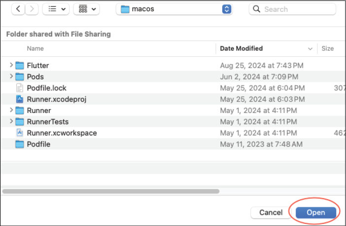

    Figure 13.1: macOS folder

    Click the `Open` button. This will open the correct file for the project. If you click on the `Runner` folder on the left, you should see the following:

    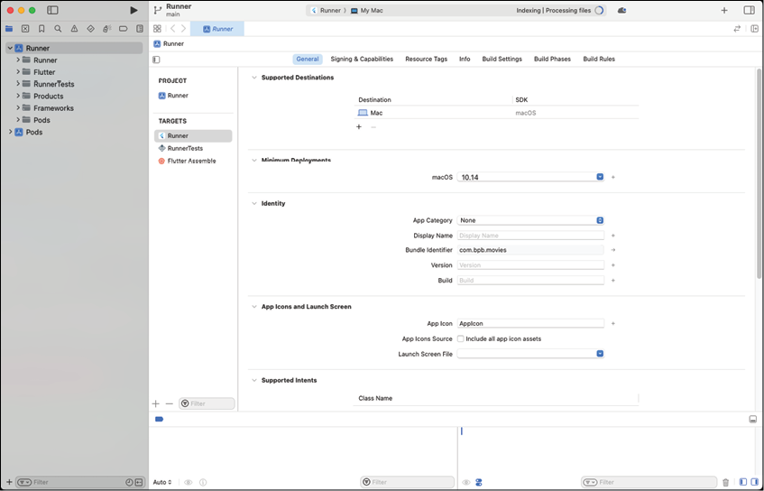

    Figure 13.2: Runner general screen

    This is the General screen and has the targeted macOS version, App Category, Display Name, and Bundle Identifier. Some of these values have already been added when the project was created but you can change them here. For example, you can add a Display Name and version numbers.

2. Go back to the `Runner` screen and click on `Signing & Capabilities`. Select the `Outgoing Connections (Client)` checkbox:

    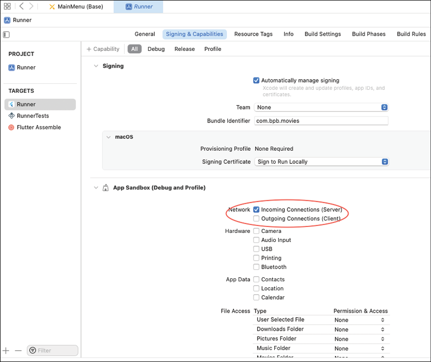

    Figure 13.3: Connections

3. In Android Studio, change the device from your current phone to macOS (desktop) and run the app. You should see just the movies menu, as follows:

    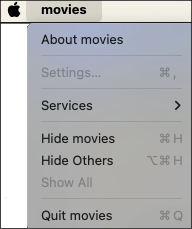

    Figure 13.4: Movie menu

4. To fix the lowercase movie name, return the Xcode and enter a Display Name:

    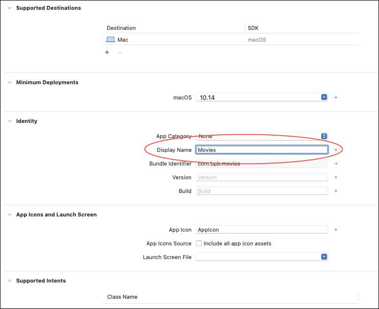

    Figure 13.5: Display name

5. Then open `Runner/Runner/Configs/AppInfo`. Change movies to Movies:

    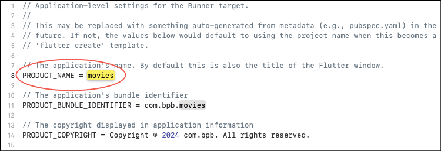

    Figure 13.6: AppInfo

    Stop and restart the app. You may encounter the following dialog. Select `Open` Anyway`:

    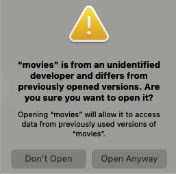

    Figure 13.7: Debug running

    This should happen just during development. Your app should work and look as follows:

    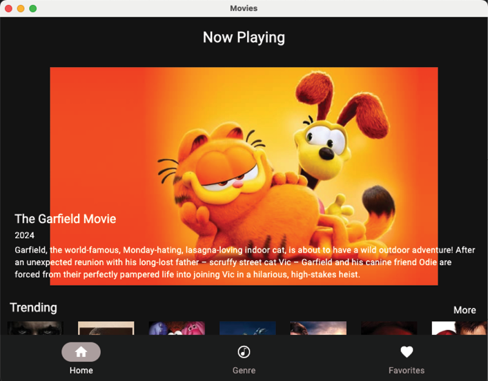

    Figure 13.8: macOS app

## [Menus](contents.md#sc2_253a)

Menus are now built into Flutter but do not work on all platforms yet. The `PlatformMenu` and the `PlatformMenuItem` are used to define menu items. These classes define a label and, in the case of `PlatformMenu`, a list of menus of type `PlatformMenuItem`. The `PlatformMenuItem` has an `onSelected` parameter that is used to handle the user selecting the menu. You can also provide a shortcut or keyboard command. To create your own set of menus you will use Flutter code to create the menus and add them before the `MaterialApp` call. This will not affect mobile devices. One of the problems with the menu system is that it sits above all of the screens, and a way to communicate the selection of a menu item to the rest of the app is needed. There are several ways to handle this. We will use the `EventBus` package. This is a package that allows classes to subscribe or listen to events. Any class can send events.

1. Add the `EventBus` package to `pubspec.yaml`:

    ```yaml
    dependencies:
      event_bus: ^2.0.1
    ```

2. Do a Pub get.

3. In the `ui` folder, create the file `menus.dart`. We will start by adding a few event classes. Add:

    ```dart
    import 'package:flutter/material.dart';
    import 'package:flutter/services.dart';
    import 'package:movies/providers.dart';
    import 'package:flutter_riverpod/flutter_riverpod.dart';
    sealed class MenuEvent {}
    class QuitEvent extends MenuEvent {}
    class HomeEvent extends MenuEvent {}
    class GenreEvent extends MenuEvent {}
    class FavoritesEvent extends MenuEvent {}
    class SearchEvent extends MenuEvent {}
    class SearchMovieEvent extends MenuEvent {
      final String searchText;
      SearchMovieEvent(this.searchText);
    }
    ```
    This defines a top level `MenuEvent` class that all the other classes extend. Most of these do not have any information attached to them, except for the `SearchMovieEvent` class, which has a `searchText` string parameter used for a search.

4. Next, create the `MenuManager` class:

    ```dart
    class MenuManager {
      final Ref ref;
      MenuManager(this.ref);
      List<PlatformMenu> createMenus() {
        return [
          createMovieMenu(),
          createOptionsMenu(),
        ];
      }
    }
    ```
    This class just takes a Riverpod Ref so that it can access other providers. The main `createMenus` method will return a list of menus.

5. Next, add the `createMovieMenu` method at the end of the class:

    ```dart
    PlatformMenu createMovieMenu() {
      return PlatformMenu(label: 'Movies', menus: [
        PlatformMenuItem(
        label: 'Quit',
        onSelected: () => ref.read(eventBusProvider).fire(QuitEvent()),
        shortcut: const SingleActivator(LogicalKeyboardKey.keyQ, meta: true)),
      ]);
    }
    ```
    This returns a `PlatformMenu` with a label and just a `Quit` menu item. This will fire a `Quit` event. We will create the `eventBusProvider` later. Notice the `SingleActivator`. This is used to allow the user to use the keyboard for keyboard commands. In this case, Command+Q is to quit the app. On Windows, this will be Ctrl+Q.

6. Next, create an `Options` menu:

    ```dart
    PlatformMenu createOptionsMenu() {
      return PlatformMenu(label: 'Options', menus: [
        PlatformMenuItem(
          label: 'Home',
          onSelected: () => ref.read(eventBusProvider).fire(HomeEvent()),
          shortcut: const SingleActivator(LogicalKeyboardKey.keyH, meta: true)),
        PlatformMenuItem(
          label: 'Genre',
          onSelected: () => ref.read(eventBusProvider).fire(GenreEvent()),
          shortcut: const SingleActivator(LogicalKeyboardKey.keyG, meta: true)),
        PlatformMenuItem(
          label: 'Favorites',
          onSelected: () => ref.read(eventBusProvider).fire(FavoritesEvent()),
          shortcut: const SingleActivator(LogicalKeyboardKey.keyF, meta: true)),
        PlatformMenuItem(
          label: 'Search',
          onSelected: () => ref.read(eventBusProvider).fire(SearchEvent()),
          shortcut: const SingleActivator(LogicalKeyboardKey.keyS, meta: true)),
      ]); 
    }
    ```
    This creates four menus:

    - `Home` - Go to the home page
    - `Genre` - Go to the genre page
    - `Favorites` - Go to the favorites page
    - `Search` - Bring up the search dialog

7. Open up `providers.dart`. Add:

    ```dart
    @riverpod
    class SearchTextNotifier extends Notifier<String> {
      @override
      String build() => '';

      void set(String text) => state = text;
    }

    @riverpod
    class CurrentIndexNotifier extends Notifier<int> {
      @override
      int build() => 0;

      void set(int index) => state = index;
    }

    @Riverpod(keepAlive: true)
    MenuManager menuManager(Ref ref) => MenuManager(ref);

    @Riverpod(keepAlive: true)
    EventBus eventBus(Ref ref) => EventBus();
    ```
    The first provider just stores the current search string. The second is to keep track of the current index and the third is for the menu manager and the fourth is for the EventBus.

8. In the terminal, type: `dart run build_runner build`

9. Open `main.dart`. In the `build` method, wrap the `MaterialApp` widget so that the `build` method now looks like:

    ```dart
    // under `final router = ref.watch(appRouterProvider);`
    final menuManager = ref.watch(menuManagerProvider);
    return PlatformMenuBar(
      menus: menuManager.createMenus(),
      child: MaterialApp.router(
        routerConfig: router.config(),
        title: 'Movies',
        debugShowCheckedModeBanner: false,
        theme: createTheme(),
      ),
    );
    ```
    This wraps `MaterialApp` with a `PlatformMenuBar` and calls our `createMenus` method. Stop and restart your Mac app. Your menus should look like the following:

    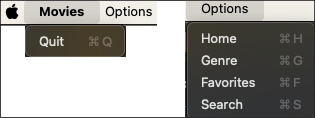

    Figure 13.9: macOS menus

### [Platforms](contents.md#sc3_254a)

One question you may have is, How do I tell which platform I am on? Flutter has a Platform class that answers these questions. This is found in the `dart:io` package. The steps are as follows:

1. Open `utils/utils.dart`.

2. Add the following:

    ```dart
    import 'dart:io';
    import 'package:flutter/foundation.dart';
    bool isWeb() {
      return kIsWeb;
    }
    bool isDesktop() {
      if (kIsWeb) {
        return false;
      }
      return Platform.isWindows || Platform.isLinux || Platform.isMacOS;
    }
    bool isMobile() {
      if (kIsWeb) {
        return false;
      }
      return Platform.isIOS || Platform.isAndroid;
    }
    bool isMac() {
      if (kIsWeb) {
        return false;
      }
      return Platform.isMacOS;
    }
    bool isWindows() {
      if (kIsWeb) {
        return false;
      }
      return Platform.isWindows;
    }
    ```
    The `kIsWeb` constant is from Flutter and is how you tell if you are running a web app. For desktop, we check the different desktop platforms. For mobile, we check for iOS and Android. If you need to check for Mac or Windows specifically, use the last two methods.

### [DesktopWindow](contents.md#sc3_255a)

One noticeable difference between mobile and desktop is the use of a free floating window to hold your app's content. These windows can be resized quite a bit. At some point, when making the window smaller, your app becomes unusable. To prevent that, there is a package called `desktop_window`. This package only has a few methods, but they are very helpful. Here are a few of these methods:

- setWindowSize
- setMinWindowSize
- setMaxWindowSize
- setFullScreen

We will be using the `setWindowSize` and `setMinWindowSize` methods. The steps are as follows:

1. Add the `desktop_window` package to `pubspec.yaml`:

    ```yaml
    desktop_window: ^0.4.2
    ```

2. Do a Pub get.

3. Open `main.dart`. Add the following before the `runApp` call:

    ```dart
    if (isDesktop()) {
      await DesktopWindow.setWindowSize(const Size(700, 600));
      await DesktopWindow.setMinWindowSize(const Size(700, 600));
    }
    // before `runApp(...`
    ```
    Stop and run the app, and you will see that you cannot make your window size smaller than 700x600. You will see some errors related to SQLite. To fix these, update the `drift` libraries to newer versions.(目前版本已经使用到2.31.0,应该没有此问题,但未经测试.)

4. In `pubspec.yaml` change: `drift: ^2.31.0`, and in `dev_dependencies`: `drift_dev: ^2.31.0`.

## [AdaptiveScaffold](contents.md#sc2_256a)

As we mentioned, desktop windows can be resized. It would be nice if we could change the layout when the screen changes sizes. If you had an email app, you could show just the list of emails when the screen is small but show the list and the contents of the email when the screen gets bigger. Enter the Flutter Adaptive Scaffold package. This package adapts to a variety of screens and has presets for different screen sizes. This package divides the screen as follows:

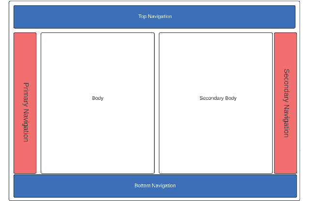

Figure 13.10: Screen layout

Currently, the movie app just has body and bottom navigation elements. One nice feature of desktop apps is the use of a navigation rail. This is a smaller navigation item that can be placed on the left or right. We still want to use a `BottomNavigationBar` on a small mobile device but use a `NavigationRail` on larger devices. The `body` is the primary screen that takes up the space left by the navigational elements. The `secondaryBody` acts as an option to split the space between two panes for purposes such as having a detailed view. To make this change, we will update the `main_screen.dart` file. This will be almost a complete rewrite. The steps are as follows:

1. Open `pubspec.yaml`. Add:

    ```yaml
    flutter_adaptive_scaffold: ^0.3.3
    ```

2. Do a Pub get.

3. Open the `main_screen.dart` file.

4. Replace the code with:

    ```dart
    class MainScreen extends ConsumerStatefulWidget {
      const MainScreen({super.key});
      @override
      ConsumerState<MainScreen> createState() => _MainScreenState();
    }
    class _MainScreenState extends ConsumerState<MainScreen> {
      int currentIndex = 0;
      List<Widget> tabScreens = [];
      // TODO add other methods
    }
    ```

5. Add the `initState` method:

    ```dart
    @override
    void initState() {
      super.initState();
      // 1
      tabScreens.add(const HomeScreen());
      tabScreens.add(const GenreScreen());
      tabScreens.add(const FavoriteScreen());
      // 2
      ref.read(eventBusProvider).on<MenuEvent>().listen((event) {
        switch (event) {
          case HomeEvent():
          setState(() {
            currentIndex = 0;
            ref.read(currentIndexProvider.notifier).set(currentIndex);
          });
          case GenreEvent():
          setState(() {
            currentIndex = 1;
            ref.read(currentIndexProvider.notifier).set(currentIndex);
          });
          case FavoritesEvent():
          setState(() {
            currentIndex = 2;
            ref.read(currentIndexProvider.notifier).set(currentIndex);
          });
          case QuitEvent():
            SystemNavigator.pop();
          case SearchEvent():
            // 3
            if (mounted) {
              showDialog(
                context: context,
                builder: (context) => const SearchDialog(),
              );
            }
          case SearchMovieEvent():
            // 4
            ref.read(searchTextProvider.notifier).set(event.searchText);
            currentIndex = 1;
            ref.read(currentIndexProvider.notifier).set(currentIndex);
        }
      });
    }
    ```
    Here we have the following:

    1. Add screens to a list to avoid re-creating the screens each time.
    2. Listen for event bus events.
    3. Set the current index.
    4. Set the current index in the provider.
    5. Show the search dialog. (SearchDialog not written yet)
    6. Set the search text for the SearchMovieEvent.

### [AdaptiveLayout](contents.md#sc3_257a)

Next, we will be adding the `AdaptiveLayout`:

1. Open the `main_screen.dart` file.

2. Add the `build` method:

    ```dart
    @override
    Widget build(BuildContext context) {
      // 1
      currentIndex = ref.watch(currentIndexProvider);
      // 2
      return AdaptiveLayout(
        // 3
        primaryNavigation: SlotLayout(
          config: <Breakpoint, SlotLayoutConfig>{
            Breakpoints.mediumAndUp: SlotLayout.from(
              key: const Key('PrimaryNavigation'),
              builder: (_) {
                // 4
                return AdaptiveScaffold.standardNavigationRail(
                  padding: const EdgeInsets.all(0),
                  destinations: const [
                    NavigationRailDestination(
                      icon: Icon(Icons.home),
                      label: Text('Home'),
                    ),
                    NavigationRailDestination(
                      icon: Icon(Symbols.genres),
                      label: Text('Genre'),
                    ),
                    NavigationRailDestination(
                      icon: Icon(Icons.favorite),
                      label: Text('Favorites'),
                    ),
                  ],
                  onDestinationSelected: (int index) {
                    setState(() {
                      currentIndex = index;
                      ref.read(currentIndexProvider.notifier).set(currentIndex);
                    });
                  },
                  selectedIndex: currentIndex,
                  backgroundColor: Colors.black,
                );
              },
            ),
          },
        ),
        // 5
        body: SlotLayout(
          config: <Breakpoint, SlotLayoutConfig?>{
            Breakpoints.standard: SlotLayout.from(
              key: const Key('body'),
              builder: (_) {
                return Scaffold(body: tabScreens[currentIndex]);
              },
            ),
          },
        ),
        // 6
        bottomNavigation: SlotLayout(
          config: <Breakpoint, SlotLayoutConfig?>{
            Breakpoints.small: SlotLayout.from(
              key: const Key('bottomNavigation'),
              builder: (_) => SizedBox(
                height: 80,
                child: BottomNavigationBar(
                  currentIndex: currentIndex,
                  onTap: (index) {
                    setState(() {
                      currentIndex = index;
                      ref.read(currentIndexProvider.notifier).set(currentIndex);
                    });
                  },
                  items: const <BottomNavigationBarItem>[
                    BottomNavigationBarItem(
                      icon: Icon(Icons.home),
                      label: 'Home',
                    ),
                    BottomNavigationBarItem(
                      icon: Icon(Symbols.genres),
                      label: 'Genre',
                    ),
                    BottomNavigationBarItem(
                      icon: Icon(Icons.favorite),
                      label: 'Favorites',
                    ),
                  ],
                ),
              ),
            ),
          },
        ),
      );
    }
    ```
    Here, we use the `AdaptiveLayout` and set three items:

    - `primaryNavigation`: This will be a navigation rails for medium and higher screens.
    - `body`: This will be our screens.
    - `bottomNavigation`: This will be a bottom navigation bar on small screens.

    Here is a description of the code:

    1. Get the current index.
    2. Use the `AdaptiveLayout` for the top level widget.
    3. For the primary navigation, use a `SlotLayout` for medium size layouts.
    4. Create a navigation rail on the left side.
    5. For the body, use the tab screens.
    6. For the bottom, use a `BottomNavigationBar` for a small display.

### [Search dialog](contents.md#sc3_258a)

Now that we have the event for searching, we need to create a search dialog. Flutter has a system method called `showDialog` that displays a modal dialog with the given content. The steps are as follows:

1. In the `genres` folder, create the new file `search_dialog.dart`.

2. Add the following:

    ```dart
    import 'package:auto_route/auto_route.dart';
    import 'package:flutter/material.dart';
    import 'package:flutter_riverpod/flutter_riverpod.dart';
    import 'package:movies/providers.dart';
    import 'package:movies/ui/menus.dart';
    import 'package:movies/utils/utils.dart';

    class SearchDialog extends ConsumerStatefulWidget {
      const SearchDialog({super.key});

      @override
      ConsumerState<SearchDialog> createState() => _SearchDialogState();
    }

    class _SearchDialogState extends ConsumerState<SearchDialog> {
      TextEditingController searchTextController = TextEditingController();

      @override
      void dispose() {
        searchTextController.dispose();
        super.dispose();
      }

      @override
      Widget build(BuildContext context) {
        // TODO Add AlertDialog
      }
    }
    ```
    This creates a widget with a text controller for the search value.

3. Add the code for the dialog:

    ```dart
    final query = MediaQuery.of(context);
    final width = query.size.width * 0.7;
    const height = 300.0;
    return AlertDialog(
      contentPadding: const EdgeInsets.fromLTRB(24.0, 0.0, 0.0, 24.0),
      shape: RoundedRectangleBorder(borderRadius: BorderRadius.circular(10.0)),
      content: SizedBox(
        width: width,
        height: height,
        child: SingleChildScrollView(
          child: SizedBox(
            width: width,
            height: height,
            child: Column(
              crossAxisAlignment: CrossAxisAlignment.center,
              children: [
                Expanded(
                  child: TextField(
                    cursorColor: Colors.black,
                    decoration: const InputDecoration(
                      border: InputBorder.none,
                      hintText: 'Search Movies',
                      // hintStyle: TextStyle(color: Colors.black),
                    ),
                    autofocus: true,
                    style: const TextStyle(color: Colors.black),
                    textInputAction: TextInputAction.done,
                    onSubmitted: (value) {
                      ref.read(eventBusProvider).fire(SearchMovieEvent(value));
                      context.router.maybePop();
                    },
                    controller: searchTextController,
                  ),
                ),
                Row(
                  mainAxisAlignment: MainAxisAlignment.center,
                  children: [
                    ElevatedButton(
                      onPressed: () => context.router.maybePop(),
                      child: const Text('Cancel'),
                    ),
                    addHorizontalSpace(8),
                    ElevatedButton(
                      onPressed: () {
                        ref
                            .read(eventBusProvider)
                            .fire(SearchMovieEvent(searchTextController.text));
                        context.router.maybePop();
                      },
                      child: const Text('Search'),
                    )
                  ],
                )
              ],
            ),
          ),
        ),
      ),
    );
    ```
    This is just a `TextField` and two buttons: one to cancel and one to send a search event. To implement this event we need to make some changes to the `GenreScreen`.

4. Open `genre_screen.dart`.

5. Remove the `currentSearchString` field.

6. Add a new field:

    ```dart
    final searchTextNotifier = ValueNotifier<String>('');
    ```

7. In the `buildScreen` method add the following before the return.

    ```dart
    final searchText = ref.watch(searchTextProvider);
    if (searchText != searchTextNotifier.value) {
      searchTextNotifier.value = searchText;
      currentMovieResponse = null;
      expandedNotifier.value = false;
      search();
    }
    ```

8. Change the call to `GenreSearchRow` to:

    ```dart
    ValueListenableBuilder<String>(
      valueListenable: searchTextNotifier,
      builder: (BuildContext context, String value, Widget? child) {
        return GenreSearchRow(searchTextNotifier.value, (searchString) {
          searchTextNotifier.value = searchString;
          currentMovieResponse = null;
          FocusScope.of(context).unfocus();
          expandedNotifier.value = false;
          search();
        });
      },
    ),
    ```

9. Change all instances of `currentSearchString` to `searchTextNotifier.value`.

Next, we need to change `GenreSearchRow`. The steps are as follows:

1. Open `genre_search_row.dart`.

2. Add a new field and change the constructor:

    ```dart
    final String searchText;
    final OnSearch onSearch;
    const GenreSearchRow(this.searchText, this.onSearch, {super.key});
    ```

3. Change the `movieTextController` to:

    ```dart
    late TextEditingController movieTextController = TextEditingController(text: widget.searchText);
    ```

4. Remove the `initState` method, as it is not needed any more.

5. At the beginning of the `build` method, add:

    ```dart
    movieTextController.text = widget.searchText;
    ```

Do a hot restart and try selecting the search menu. It should bring up the search dialog and take you to the genre screen with search results. Try the other menu items and make sure they take you to the given screen.

You should see the navigation rails on the left, as shown in the following figure:

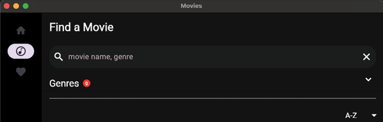

Figure 13.11: Navigation rails

## [Windows](contents.md#sc2_259a)

In addition to the Mac, Flutter runs on Windows. Very little needs to be done to get it to work. However, the one area that still needs work is the menus. On Windows, menus are in the window itself. This window is part of the Windows operating system and not Flutter. Currently, the `PlatformMenuBar` only works on Mac. To create menus on Windows, we need a plugin that helps. There are a lot of packages that put a menu inside of the Flutter canvas but not in the window. We will use an older `menubar` plugin that will help until `PlatformMenuBar` works on Windows.

On Windows, running the app should look as follows:

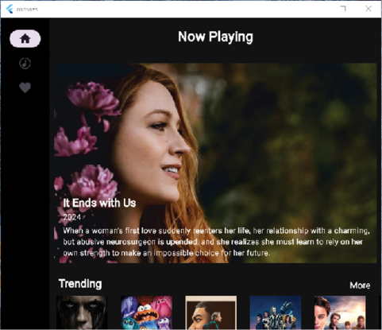

Figure 13.12: Windows version

To add the menu package, do the following:

1. Add the menubar package to pubspec.yaml:

    ```yaml
    menubar:
        git:
            url: https://github.com/google/flutter-desktop-embedding
            path: plugins/menubar
            ref: 12decbe0f592e14e03223f6f2c0c7e0e2dbd70a1
    ```

    This uses a different way to bring in a plugin. This uses git, specifying a URL, path, and a commit reference.

2. Do a Pub get.

3. Open `menus.dart`. Add:

    ```dart
    void createWindowsMenus() {
      setApplicationMenu([createWindowsMovieMenu(), createWindowsOptionsMenu()]);
    }


    NativeSubmenu createWindowsMovieMenu() {
      return NativeSubmenu(
        label: 'Movies',
        children: [
          NativeMenuItem(
            label: 'Quit',
            onSelected: () => ref.read(eventBusProvider).fire(QuitEvent()),
            shortcut: LogicalKeySet(
              LogicalKeyboardKey.control,
              LogicalKeyboardKey.keyQ,
            ),
          ),
        ],
      );
    }

    NativeSubmenu createWindowsOptionsMenu() {
      return NativeSubmenu(
        label: 'Options',
        children: [
          NativeMenuItem(
            label: 'Home',
            onSelected: () => ref.read(eventBusProvider).fire(HomeEvent()),
            shortcut: LogicalKeySet(
              LogicalKeyboardKey.control,
              LogicalKeyboardKey.keyH,
            ),
          ),
          NativeMenuItem(
            label: 'Genre',
            onSelected: () => ref.read(eventBusProvider).fire(GenreEvent()),
            shortcut: LogicalKeySet(
              LogicalKeyboardKey.control,
              LogicalKeyboardKey.keyG,
            ),
          ),
          NativeMenuItem(
            label: 'Favorites',
            onSelected: () => ref.read(eventBusProvider).fire(FavoritesEvent()),
            shortcut: LogicalKeySet(
              LogicalKeyboardKey.control,
              LogicalKeyboardKey.keyF,
            ),
          ),
          NativeMenuItem(
            label: 'Search',
            onSelected: () => ref.read(eventBusProvider).fire(SearchEvent()),
            shortcut: LogicalKeySet(
              LogicalKeyboardKey.control,
              LogicalKeyboardKey.keyS,
            ),
          ),
        ],
      );
    }
    ```
    This uses the menubar package to create menus.

4. Open `main.dart`. Replace the code in `_MainAppState` with:

    ```dart
    var initialized = false;
    @override
    Widget build(BuildContext context) {
      // 1
      WidgetsBinding.instance.addPostFrameCallback((_) {
        if (initialized) {
          return;
        }
        // 2
        if (isWindows()) {
          final menuManager = ref.read(menuManagerProvider);
          menuManager.createWindowsMenus();
        }
        initialized = true;
      });
      final router = ref.watch(appRouterProvider);
      final menuManager = ref.watch(menuManagerProvider);
      if (isMac()) {
        // 3
        return PlatformMenuBar(
          menus: menuManager.createMenus(),
          child: MaterialApp.router(
          routerConfig: router.config(),
          title: 'Movies',
          debugShowCheckedModeBanner: false,
          theme: createTheme(),
        ),
      );
      } else {
        // 4
        return MaterialApp.router(
          routerConfig: router.config(),
          title: 'Movies',
          debugShowCheckedModeBanner: false,
          theme: createTheme(),
        );
      }
    }
    ```
    This code will add a `PostFrameCallback` that will be called when the `build` method finishes drawing. The steps are as follows:

    1. Add a callback to be called when UI finishes drawing.
    2. If we are on Windows, create the menus (only once).
    3. If we are on a Mac, use the `PlatformMenuBar` class to create for menus.
    4. Otherwise just use a `MaterialApp` widget.

On Windows, run the app. You should see two menus, namely, the Movies and Option menus (Figure 13.13). If you are a regular Windows user, you will notice that this is not exactly what Windows apps look like but is closer than other plugins. Until `PlatformMenuBar` works with Windows, there will have to be work around:

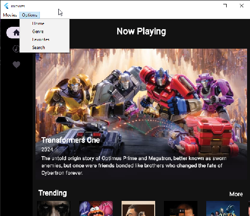

Figure 13.13: Windows menus

## [Web](contents.md#sc2_260a)

The web version of Flutter is unique from other platforms. It compiles and renders in three different running ways:

- `HTML`: Uses HTML elements and CSS to render the UI. **This has been deprecated**.
- `CanvasKit`: Uses the `Skia` graphics engine. It is slower to load but renders fast.
- `WebAssembly`: It compiles to a binary format that the web can understand.

To get our app to run on the web, we must make several changes, mostly related to the database. Since Flutter updates quite frequently and our web folder is now pretty old, it is time to recreate the folder. Since we have not added any of our files to this folder, it is okay to delete them. Follow these steps:

1. Delete the `web` folder.

2. From the terminal type:

    ```bash
    flutter create --platforms web .
    flutter config --enable-web
    ```

3. Delete the newly created `widget_test.dart` in the test folder. This should create an updated `index.html` file. If the `web` folder was created with an earlier version of generated code, or you have problems running on the web, this is a good way to fix issues. However, if you have made any custom changes, you must back up the folder first and then copy your changes. As we are using the `drift` package, we will need a special file: `sqlite3.wasm`. You can find this file in the project resources for this chapter.

4. Copy `sqlite3.wasm` and `drift_worker.js` to the `web` folder.

5. In the `data/database/drift` folder, create a new file named `connection.dart`. Add the following:

    ```dart
    // We use a conditional export to expose the right connection factory depending
    // on the platform.
    export 'unsupported.dart'

    if (dart.library.js) 'web.dart'
    if (dart.library.ffi) 'native.dart';
    ```

6. Create a new file named `native.dart`. Add:

    ```dart
    import 'dart:io';

    import 'package:drift/drift.dart';
    import 'package:drift/native.dart';
    import 'package:path_provider/path_provider.dart';
    import 'package:path/path.dart' as p;

    DatabaseConnection connect() {
      return DatabaseConnection.delayed(
        Future(() async {
          final dbFolder = await getApplicationDocumentsDirectory();
          final file = File(p.join(dbFolder.path, 'movies.sqlite'));
          return NativeDatabase.createBackgroundConnection(file);
        }),
      );
    }
    ```

    This will get the application directory and create a file named `movies.sqlite` and then create a `DatabaseConnection`.

7. Create a new file named `unsupported.dart`. Add:

    ```dart
    import 'package:drift/drift.dart';

    Never _unsupported() {
      throw UnsupportedError(
        'No suitable database implementation was found on this platform.',
      );
    }

    // Depending on the platform the app is compiled to, the following stubs will
    // be replaced with the methods in native.dart or web.dart

    DatabaseConnection connect() {
      _unsupported();
    }

    Future<void> validateDatabaseSchema(GeneratedDatabase database) async {
      _unsupported();
    }
    ```

    This is used when there is an unsupported version of Flutter.

8. Create a new file named `web.dart`. Add the following:

    ```dart
    import 'package:drift/drift.dart';
    import 'package:drift/wasm.dart';
    import 'package:flutter/foundation.dart';

    DatabaseConnection connect() {
      return DatabaseConnection.delayed(
        Future.sync(() async {
          final db = await WasmDatabase.open(
            databaseName: 'movies',
            sqlite3Uri: Uri.parse('/sqlite3.wasm'),
            driftWorkerUri: Uri.parse('/drift_worker.js'),
          );

          if (db.missingFeatures.isNotEmpty) {
            debugPrint(
              'Using ${db.chosenImplementation} due to unsupported '
              'browser features: ${db.missingFeatures}',
            );
          }

          return db.resolvedExecutor;
        }),
      );
    }
    ```
    This will use the `sqlite3.wasm` and `drift_worker.js` file to create a database file on the web.

9. Open `movie_database.dart` and add the following import:

    ```dart
    import 'package:movies/data/database/drift/connection.dart' as impl;
    ```

10. Change the constructor to:

    ```dart
    MovieDatabase() : super(impl.connect());
    ```

Unfortunately, the `dotenv` package does not work on the web, and the web cannot load files with a dot in the file name, so we need to copy this file and then read it from the assets folder. The steps are as follows:

1. Copy the .env file to `dotenv` file in the root directory.

2. Add the following after the `.env` in the `pubspec.yaml` file:

    ```yaml
    - dotenv
    ```

3. Update `movie_api_service.dart`.

    1. Change the definition of the `apiKey` to:

        ```dart
        late String apiKey;
        ```

    2. Change the constructor and add another method:

        ```dart
        MovieAPIService();

        Future init() async {
          if (!isWeb()) {
            apiKey = dotenv.env['TMDB_KEY']!;
            configureDio();
          } else {
            await webLoad();
          }
        }

        Future webLoad() async {
          try {
            final dotEnvString = await rootBundle.loadString('dotenv');
            if (dotEnvString.contains('TMDB_KEY')) {
              final parts = dotEnvString.split('=');
              if (parts.length == 2) {
                apiKey = parts[1];
                if (apiKey.contains("'")) {
                  apiKey = apiKey.replaceAll("'", "");
                }
              }
            } else {
              apiKey = dotEnvString;
            }
          } catch (e) {
            print(e);
          }
          configureDio();
        }
        ```
        This will load the `dotenv` file and get the API key. Then, we will call the `configureDio` method.

4. Update `utils.dart`. Change the `getSizedImageUrl` method to use the secure base URL, as websites do not like the http non-secured links.

    ```dart
    String? getSizedImageUrl(ImageSize size, MovieConfiguration configuration, String? file) {
      if (file == null) {
        return null;
      }
      switch (size) {
        case ImageSize.small:
        return imageUrl(configuration.images.secureBaseUrl, configuration.images.posterSizes[1], file);
        case ImageSize.large:
        return imageUrl(configuration.images.secureBaseUrl, configuration.images.posterSizes[5], file);
      }
    }
    ```

5. Change `main.dart` to not load the `.env` file if on the web:

    ```dart
    if (!isWeb()) {
      await dotenv.load(fileName: '.env');
    }
    ```

    This will load the `.env` file if on the web.

6. Open `providers.dart` and replace the `movieAPIService` and `movieViewModel` with:

    ```dart
    @Riverpod(keepAlive: true)
    Future<MovieAPIService> movieAPIService(MovieAPIServiceRef ref) async {
      final service = MovieAPIService();
      await service.init();
      return service;
    }

    @Riverpod(keepAlive: true)
    Future<MovieViewModel> movieViewModel(MovieViewModelRef ref) async {
      final database = await ref.read(driftDatabaseProvider.future);
      final service = await ref.read(movieAPIServiceProvider.future);
      final model = MovieViewModel(database: database, movieAPIService: service);
      await model.setup();
      return model;
    }
    ```

7. In the terminal, type the following:

    ```bash
    dart run build_runner build
    ```

Run the app on the web. Try different pages and notice any problems. One issue you may encounter is problems loading images. Since all these images are from the internet, some websites do not allow you to use them on a web page. This is called cross-origin resource sharing (CORS). This is a security mechanism implemented in browsers to prevent web pages from accessing resources from other domains. Some sites like TMDB allow you to use their images freely while others like YouTube make you use their APIs instead. To fix this, we will change the `Trailer` class. The steps are as follows:

1. Open `trailers.dart`.

2. Change the `CachedNetworkImage` call to:

    ```dart
    CachedNetworkImage(
      imageUrl: youtubeImageFromId(movieVideo.key),
      alignment: Alignment.topLeft,
      fit: BoxFit.fitHeight,
      height: 98,
      errorWidget: (_, __, ___) => const Placeholder(),
    ),
    ```

    This will show a placeholder widget when there is an error.

Seeing the Favorites screen on the web shows an overflow problem. To fix that, do the following:

1. Open `widgets/favorite_row.dart`.
2. Remove the `textWidth` variable.
3. Wrap the `Stack` widget with an `Expanded` widget.
4. Remove the `SizedBox` widget surrounding the `AutoSizeText`.

This should make the favorite row fit better.

## [Firebase Hosting](contents.md#sc2_261a)

When you build a web project, you need a place to host your web page. There are many ways to do this, but Firebase Hosting is an easy way to host your site. This will require some configuration and setup of Firebase. We will also need to change some of our Dart code to handle web issues. To start, you will need to set up Firebase:

1. Go to <https://console.firebase.google.com/> and sign up or log in if you already have an account.

2. Create a new project.

    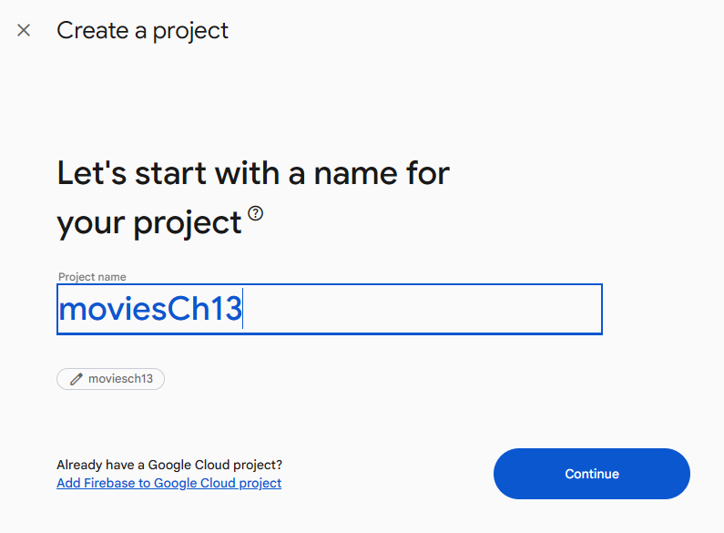

    Figure 13.14: New project

3. Type a name for the project and press Continue, as shown in Figure 13.15:

    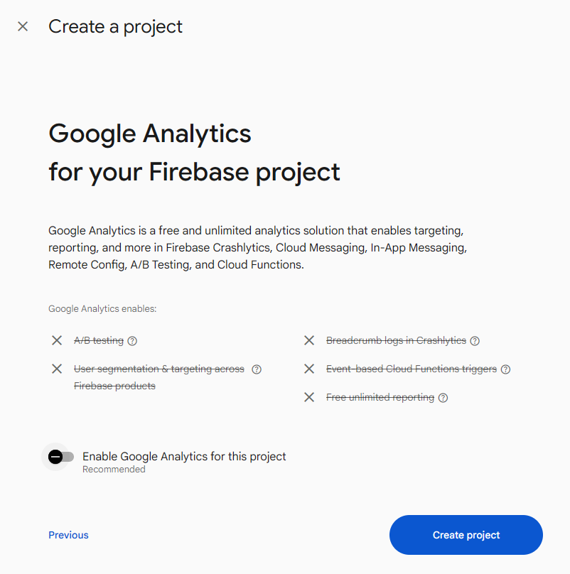

    Figure 13.15: Analytics

4. Disable analytics (unless you want it) and press Create project, as done in Figure 13.16. You will see the following screen while Firebase creates your project:

    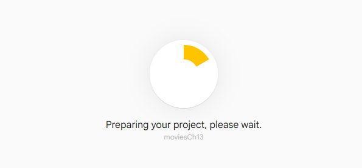

    Figure 13.16: Loading

5. When finished, press Continue. The screen is as follows:

    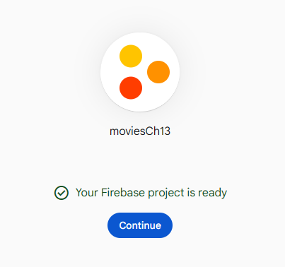

    Figure 13.17: Project finished

6. Add a new web app. You should see a set of icons for the different types of projects you can create. Click on the </> icon:

    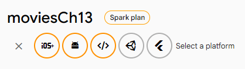

    Figure 13.18: Add web app

7. In the following screen, give your app a name, click the checkbox for Firebase Hosting and then click on Register app:

    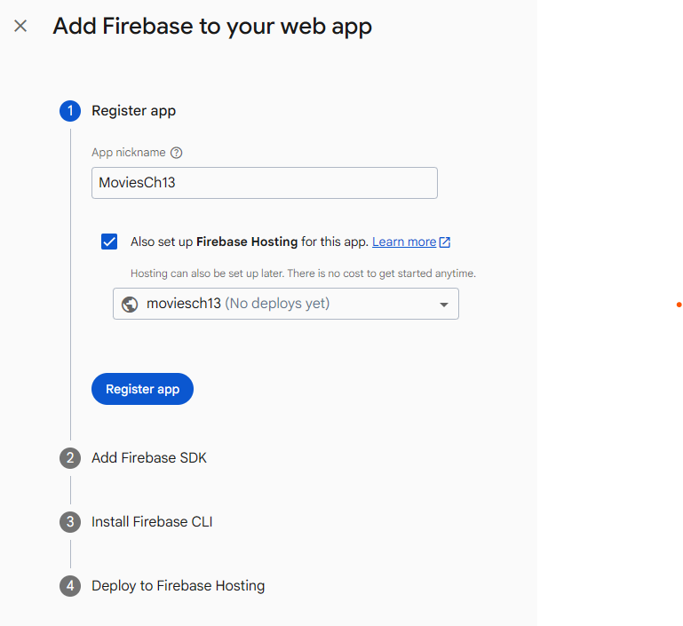

    Figure 13.19: Adding Firebase to web app

8. Deploy to Firebase Hosting page:

    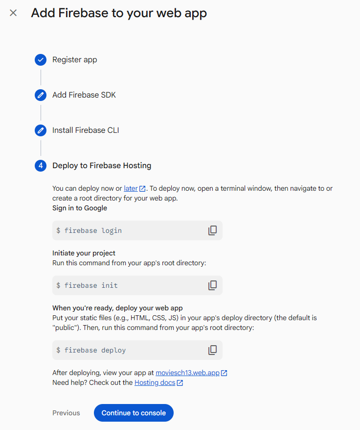

    Figure 13.20: Deploy setup

9. Install the Firebase tools:

    ```bash
    npm install -g firebase-tools
    ```

10. Login to Firebase:

    ```bash
    firebase login
    ```

11. Initialize Hosting:

    ```bash
    firebase init
    ```

    You should see the following output:

    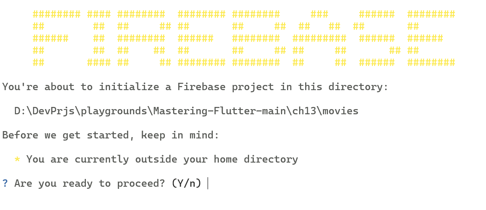

    Figure 13.21: Firebase initialization

    Choose the `Use an existing project` option if you have one already created or `Create a new Project` if not.

12. Choose hosting. You will see the following output:

    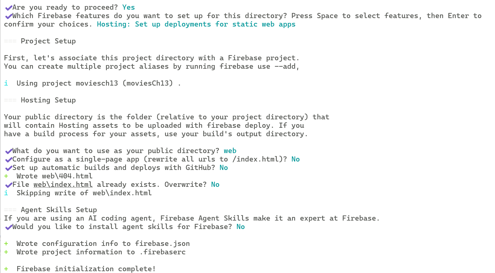

    Figure 13.22: Setup

13. Open `firebase.json` and add your site below the hosting section:

    ```json
    "site": "<your site name>",
    ```

14. Deploy the project using the following command:

    ```bash
    firebase deploy
    ```

    You will see the following output:

    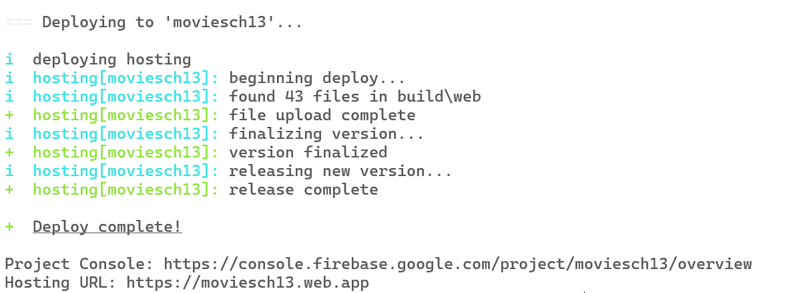

    Figure 13.23: Deploying

15. Click on the Hosting URL link to see the page:

    > 访问终端给出的网址 <https://moviesch13.web.app> 没有内容，Firebase console 给出的另一个网址 <https://moviesch13.firebaseapp.com/> 可以正常访问。

    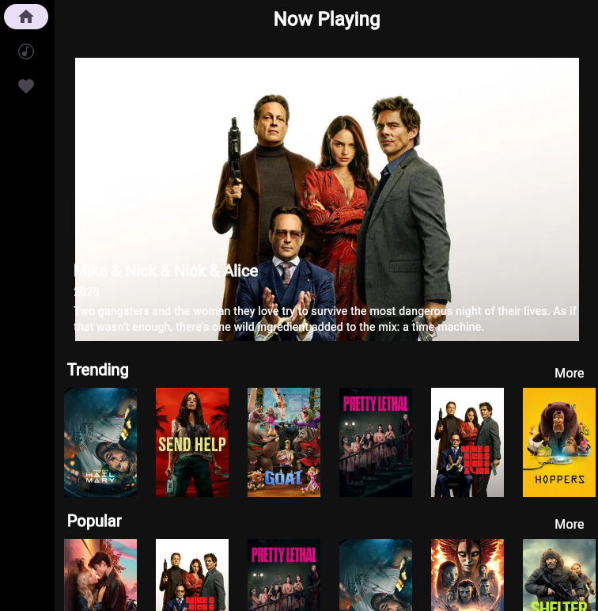

    Figure 13.24: Website

## [Conclusion](contents.md#sc2_262a)

In this chapter, you have learned how to create apps for the Mac, Windows, and the web. You know how to create menus for desktop platforms, and you have created an adaptive layout that can be adapted to many different form factors. You have also created a dialog for doing searches. You took the leap onto the web and learned about many of the issues with developing websites. You were able to host the site on Firebase, which will allow others to view the work you have done.

In the next chapter, you will learn all about user input and gestures. This will be helpful for apps that require field entry and note taking, as well as handling different types of gestures, like tapping, long pressing, and more.
