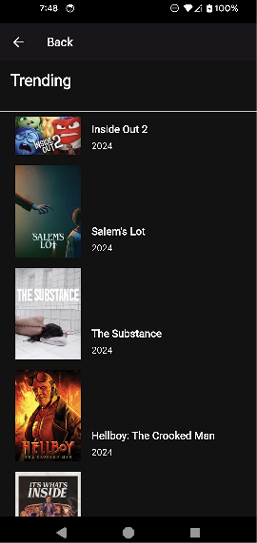

# [CHAPTER 14 Handling User Input and Gestures](contents.md#ch14a)

## [Introduction](contents.md#sc2_263a)

In this chapter, you will learn how to handle user input. There are many ways to capture a user's input, from buttons to text fields. Buttons are the most common input method and provide a variety of styling options to indicate different states. You will learn about the all-important GestureDetector widget for handling taps and other gestures. Ink widgets are a great way to provide splash feedback for a user pressing your widgets. You will learn about repositories and how to separate your code to make it easier to switch components. And finally, you will implement infinite scrolling and paging API calls to show a complete list of movies.

## [Structure](contents.md#sc2_264a)

The chapter covers the following topics:

- User input and event handling
- GestureDetector
- Focus management
- Text
- Ink widgets
- KeyboardListener
- Repositories
- Movie listing

## [Objectives](contents.md#sc2_265a)

By the end of this chapter, you will know how to handle events from several different input types and how to handle focus management. You will learn how to handle gestures such as taps, long presses, and keyboard entries for specific widgets. You will learn about Ink widgets, part of Google's Material Design. You will learn how to create a repository and separate database and network API calls. You will also learn how to create an infinite scrolling list of movies.

## [User input and event handling](contents.md#sc2_266a)

User input and event handling are important for building interactive and responsive Flutter applications. They allow your app to react to user actions, such as taps, gestures, keyboard input, and more. As you have seen in the movie app, the user will tap on a movie to go to the detail page. If they are on a desktop machine, they will usually click with a mouse, and if they are on a tablet, they can use a stylus. For desktop apps, using the keyboard and keyboard shortcuts makes your app more useable for power users, while touch is the most common input source on mobile devices.

Flutter provides the `GestureDetector` widget to detect various touch gestures like taps, drags, scaling, and more. `GestureDectector` also handles mouse clicks on desktop and web apps.

For text input, Flutter's `TextField` and `TextFormField` widgets handle text input, while `FocusNode` and `FocusScope` manage keyboard focus and navigation. You can also use `RawKeyboardListener` for lower-level keyboard event handling. Flutter can also handle input from game controllers, accessibility devices, and other platform-specific input mechanisms.

For the desktop, changing the cursor when in different areas of the app helps the user know what to do in that area. For example, when moving the mouse over a text field, you can change the cursor to a text input cursor as follows:

```dart
MouseRegion(
  cursor: SystemMouseCursors.text,
  child: TextField(),
)
```

**Callback functions are the core of event handling in Flutter.** These functions are triggered when specific events occur, such as a button tap, text field change, or gesture detection.

## [GestureDetector](contents.md#sc2_267a)

The `GestureDetector` widget in Flutter is the main widget for capturing and responding to user interactions with your app. It is a powerful tool that allows you to detect a wide range of gestures, from simple taps to complex multi-touch gestures like pinch-to-zoom. `GestureDetector` itself does not have a visual representation. It acts as an invisible wrapper around its child widget, capturing user interactions on that child. It listens for pointer events (touches, mouse clicks, etc.) on its child and attempts to recognize specific gestures for the provided callbacks. You provide callback functions to the `GestureDetector` for the gestures you want to detect. These callbacks are triggered when the corresponding gesture is recognized. There are many different methods `GestureDetector` handles:

- `onTap`
- `onDoubleTap`
- `onLongPress`
- `onScaleUpdate`

These are just a few of the provided methods. There are other methods for secondary and tertiary taps. If you want to handle panning or scaling an image, use the following methods:

- `onPanDown`
- `onPanStart`
- `onPanUpdate`
- `onPanEnd`
- `onPanCancel`

Similar methods exist for scaling. For dragging, there are several callbacks to use:

- `onVerticalDragDown`
- `onVerticalDragStart`
- `onVerticalDragUpdate`
- `onVerticalDragEnd`
- `onVerticalDragCancel`

There are callbacks for Horizontal drags as well. You have seen instances of `GestureDetector` in classes like `FavoriteRow`:

```dart
GestureDetector(
  onTap: () => onMovieTap(favorite.movieId)
)
```

You will mostly just use the `onTap` method, but the other methods exist for more complex interactions.

## [Focus management](contents.md#sc2_268a)

The `FocusManager` class plays a central role in managing focus within your application. It acts as a singleton service that provides access to the focus tree and offers methods for controlling focus behavior. The `FocusManager` maintains the focus tree, tracks the primary focus, and sends key events to the primary focus. It also maintains the `rootScope`, which is the top-level scope for focus nodes. You can get an instance of the `FocusManager` with:

```dart
FocusManager focusManager = FocusManager.instance;
```

There are only a few methods you can use with the `FocusManager`:

- `addEarlyKeyEventHandler`: Handle key events before widgets
- `addLateKeyEventHandler`: Handle key events if not handled by other widgets

You will not usually use the `FocusManager` as the `FocusNode` class is used with widgets. Flutter's focus management system is key to controlling which widget receives input from the keyboard or other input devices. It ensures a smooth and intuitive user experience, especially when dealing with forms, text fields, and interactive elements. On a mobile device, the keyboard's next arrow will go to the next focusable widget, while on the desktop or web, the tab key will move to the next widget.

`FocusNode` is a fundamental class for managing focus in Flutter. Each widget that wants to receive focus needs to be associated with a `FocusNode`. You will create one focus node for each `TextField`. `FocusNodes` form a hierarchical tree structure that mirrors the widget tree. This tree helps determine the flow of focus between widgets. Setting the `autofocus` property to true on a `TextField` automatically gives it focus when it is first built. The easiest way to programmatically request focus for a widget is to use `focusNode.requestForcus()` for the focus node associated with that widget. You can attach a listener to a `FocusNode` to be notified when its focus state changes by calling `addListener()`. This allows you to perform actions or update the UI based on focus events. Here is a sample code that detects when the focus is lost and sets the editing flag to false:

```dart
textFocusNode.addListener(() {
  if (!textFocusNode.hasFocus && widget.editing) {
    setState(() {
      widget.editing = false;
    });
  }
});
```

`FocusNode` methods:

- `hasFocus`: Indicates whether the `FocusNode` currently has focus.
- `requestFocus()`: Requests focus on the associated widget.
- `unfocus()`: Removes focus from the associated widget.
- `addListener()`: Allows you to listen for focus changes on the FocusNode.

A `FocusScope` defines a subtree in the focus tree. It allows you to manage focus within that subtree, such as moving focus to the next or previous widget within the scope.

Each `FocusScope` is associated with a `FocusScopeNode`, which is a special type of `FocusNode` that manages the focus within its scope. You will typically only need these if you use a `FocusScope`.

`FocusScopeNode` methods:

- `requestFocus()`: Requests focus for a specific `FocusScopeNode` within the scope.
- `nextFocus()`: Moves focus to the next focusable widget in the scope.
- `previousFocus()`: Moves focus to the previous focusable widget in the scope.
- `unfocus()`: Removes focus from any focused widget within the scope.

If you need to have a grouped set of widgets with their own specialized traversal policy, you will use a `FocusTraversalGroup`. This widget has a `FocusTraversalPolicy` to determine how focusable widgets are traversed. This is more complex than you really need, but if you have a large screen with a lot of form widgets and you need to have different traversal policies for each, this will be the widget you need. There are some predefined policies like `WidgetOrderTraversalPolicy` (which is just the order in which the widgets were created) or `ReadingOrderTraversalPolicy` (which is the natural ready order). You can use `OrderedTraversalPolicy` to specify a specific order.

## [Text](contents.md#sc2_269a)

`TextField` widgets in Flutter are the primary way to capture text input from users. They are versatile and offer a range of features for creating various input experiences, from simple single line entries to complex multi-line text editors. Here is a closer look at how they work and contribute to event handling. The `TextField` widget offers callbacks like `onChanged` (for text changes), `onSubmitted` (for text submission), and `onEditingComplete` (for editing completion). You can set a `FocusNode` on a `TextField` by setting the `focusNode` field with an instance of a `FocusNode`. You can make a `TextField` multi-line by using these fields:

```dart
keyboardType: TextInputType.multiline,
maxLines: null,
```

To listen for text changes, use a statement like:

```dart
onChanged: (String text) => _phone = text,
```

For a final submitted text value, use:

```dart
onSubmitted: (value) {},
```

To change the keyboard type for different fields, use the `keyboardType` parameter. This can be:

- `TextInputType.text`
- `TextInputType.decimal`
- `TextInputType.number`
- `TextInputType.phone`
- `TextInputType.datetime`
- `TextInputType.emailAddress`
- `TextInputType.url`
- `TextInputType.visiblePassword`
- `TextInputType.name`
- `TextInputType.streetAddress`

To set the action button on the keyboard, use the `textInputAction` field. These can be:

- `TextInputAction.done`
- `TextInputAction.go`
- `TextInputAction.search`
- `TextInputAction.send`
- `TextInputAction.previous`
- `TextInputAction.continueAction` (iOS – Return key)
- `TextInputAction.join` (iOS – Return Key Join)
- `TextInputAction.route` (iOS – route)
- `TextInputAction.newline` – carriage return
- `TextInputAction.emergencyCall`

For passwords, you need to set the `obscureText` field to true. Here is a sample showing a `TextField` with a few fields set:

```dart
TextField(
  autofocus: true,
  focusNode: textFocusNode,
  textInputAction: TextInputAction.done,
  onSubmitted: (value) {
    // Handle text value
  },
  controller: searchTextController,
)
```

## [Ink widgets](contents.md#sc2_270a)

`Ink` widgets are part of Material Design's widgets. This is made up of widgets like:

- `Ink`
- `InkWell`
- `InkResponse`

`Ink` will draw a color or decoration under the child, while the `InkWell` will draw on top of an `Ink` widget. The `InkWell` widget provides material style visual feedback (like ripple effects) when a user interacts with certain areas of the UI. It handles taps and clicks, making them ideal for buttons and clickable UI elements. `InkWell` is an ink splash effect that makes your UI feel responsive. It is a great way to provide visual feedback to users when they interact with tappable elements. You can change the splash color and the radius of the splash, as well as a few more fields, to customize the look of the splash. `InkWell` relies on the `GestureDetector` to handle taps. It handles all types of taps and hovers (entering and exiting the area) with the `onHover` callback, mouse cursors for desktop and web, and can use different colors for different states. `InkWell` requires a Material ancestor. This can be the `MaterialApp` at the root of your UI, or it can be wrapped in a `Material` widget. Be careful when using containers with colors, as this will cause the ripple effect not to work. Here is an example of an `InkWell` inside of an `Ink` widget. This shows a green square that, when tapped has a blue ripple effect:

```dart
Ink(
  color: Colors.green,
  width: double.infinity,
  height: 300,
  child: InkWell(
    splashColor: Colors.blue,
    onTap: () {},
    child: const Center(child: Text('Tap Me')),
  ),
)
```

### [InkResponse](contents.md#sc3_271a)

InkWells are designed for rectangular areas, while `InkResponse`s can be of any shape. You can use the `splashFactory` field to define an `InteractiveInkFeatureFactory` instance. You can use existing factories such as `InkRipple.splashFactory` and `InkSplash.splashFactory` or create your own. This class has most of the same fields as an `InkWell` but is more customizable. `InkResponse`s can clip splashes that extend outside of its bounds. To set the shape used to highlight when pressed or focused, use the `highlightShape` field. You can change borders and many different colors:

- `Focus`
- `Hover`
- `Highlight`
- `Overlay`
- `Splash`

## [KeyboardListener](contents.md#sc2_272a)

`KeyboardListener` is a widget in Flutter that allows you to listen to and respond to raw keyboard events in your application. It gives you lower-level access to keyboard input, enabling you to build custom interactions or handle scenarios where the standard focus-based input handling might not be sufficient. The `onKeyEvent` field is the primary callback function that is triggered whenever a key event occurs. It receives a `KeyEvent` object as an argument, which contains information about the key that was pressed or released. This event contains the `physicalKey`, which represents the physical key that was pressed or released (e.g., `PhysicalKeyboardKey.keyA`, `PhysicalKeyboardKey.arrowUp`). The `logicalKey` represents the logical key, which considers modifiers like Shift or Alt (e.g., `LogicalKeyboardKey.keyA`, `LogicalKeyboardKey.shiftLeft`). The `character` is the Unicode character string that would be produced by the key press (if applicable). Note that the `character` field is not available on key up events. The event you get will either be a `KeyUpEvent` or a `KeyDownEvent`, indicating what type of event it is. Here is an example of a `KeyboardListener` wrapping a `TextField` that will handle the enter or escape keys:

```dart
KeyboardListener(
  focusNode: textFocusNode,
  onKeyEvent: (event) {
    if (event.runtimeType == KeyDownEvent &&
      ((event.logicalKey == LogicalKeyboardKey.enter) ||
        (event.logicalKey == LogicalKeyboardKey.escape))) {
      setState(() {
        // Do something when these events happen
      });
    }
  },
  child: TextField()
)
```

You also saw the `SingleActivator` class used in your menus. This is a shortcut that uses the `LogicalKeyboardKey`.

## [Repositories](contents.md#sc2_273a)

Notice that we now have several different types of models. We have models that the UI uses and models that the database uses. This is because database models may have different fields (like IDs) that the UI does not need. Your UI may only show a small portion of the data downloaded. To solve this problem, you need to convert database models to UI models and the reverse. To do this, create a set of methods to convert from one model type to another:

1. Create a new file called `model_converter.dart` in the `database` folder.

2. Add the methods for converting genres:

    ```dart
    import 'package:movies/data/database/models/database_models.dart';
    import 'package:movies/data/models/models.dart';

    List<Genre> databaseGenreToGenre(List<DBMovieGenre> databaseGenres) {
      return databaseGenres
        .map((databaseGenre) =>
          Genre(id: databaseGenre.remoteId, name: databaseGenre.name))
        .toList();
    }

    List<DBMovieGenre> movieGenreToDatabaseGenre(List<Genre> genres) {
      return genres
        .map((genre) =>
          DBMovieGenre(id: genre.id, remoteId: genre.id, name: genre.name))
        .toList();
    }
    ```

    The first method takes a list of database genres and converts them to a list of genres and the second converts genres to database genres.

3. Add the movie configuration methods:

    ```dart
    MovieConfiguration? databaseMovieConfigurationToMovieConfiguration(
      DBConfiguration? databaseMovieConfiguration) {
      if (databaseMovieConfiguration == null) {
        return null;
      }
      return MovieConfiguration(
        images: databaseImagesToImages(databaseMovieConfiguration.images),
        changeKeys: databaseMovieConfiguration.changeKeys,
      );
    }
    DBConfiguration? movieConfigurationToDbConfiguration(
      MovieConfiguration movieConfiguration) {
      final dbConfiguration = DBConfiguration(id: 1, images: imagesToDbImages(movieConfiguration.images),
        changeKeys: [...movieConfiguration.changeKeys]);
      return dbConfiguration;
    }
    ```

4. Add the configuration image methods:

    ```dart
    MovieConfigurationImages databaseImagesToImages(DBConfigurationImages databaseImages) {
      return MovieConfigurationImages(
        baseUrl: databaseImages.baseUrl,
        secureBaseUrl: databaseImages.secureBaseUrl,
        backdropSizes: databaseImages.backdropSizes,
        logoSizes: databaseImages.logoSizes,
        posterSizes: databaseImages.posterSizes,
        profileSizes: databaseImages.profileSizes,
        stillSizes: databaseImages.stillSizes,
      );
    }
    DBConfigurationImages imagesToDbImages(MovieConfigurationImages images) {
      final dbImages = DBConfigurationImages(
        baseUrl: images.baseUrl,
        secureBaseUrl: images.secureBaseUrl,
        backdropSizes: [...images.backdropSizes],
        logoSizes: [...images.logoSizes],
        posterSizes: [...images.posterSizes],
        profileSizes: [...images.profileSizes],
        stillSizes: [...images.stillSizes],
      );
      return dbImages;
    }
    ```

### [Sources](contents.md#sc3_274a)

Interfaces are a great way to define a set of methods but have different implementations. To do this, we will create a `MovieSource` interface that will define the methods required for implementing a class of type `MovieSource`. This class will be abstract so that it cannot be created by itself.

1. In the `data` folder, create a new folder named `sources`.

2. Create a new file named `movie_source.dart`.

3. Add the following interface:

    ```dart
    import 'package:movies/data/database/models/favorite.dart';
    import 'package:movies/data/models/models.dart';
    abstract class MovieSource {
      Future<List<Genre>> getGenres();
      Future<MovieResponse?> getTrending(int page);
      Future<MovieResponse?> getNowPlaying(int page);
      Future<MovieResponse?> getTopRated(int page);
      Future<MovieResponse?> getPopular(int page);
      Future<MovieResponse?> searchMovies(String query, int page);
      Future<MovieResponse?> searchMoviesByGenre(String genre, int page);
      Future<MovieDetails?> getMovieDetails(int movieId);
      Future<MovieVideos?> getMovieVideos(int movieId);
      Future<MovieConfiguration?> getMovieConfiguration();
      Future<MovieCredits?> getMovieCredits(int movieId);
      Future saveFavorite(MovieDetails movieDetails);
      Future<bool> removeFavorite(int id);
      Future<List<DBFavorite>> getFavorites();
      Stream<List<DBFavorite>> streamFavorites();
    }
    ```

    This defines some of the methods that we have already used. We will now create two sources: one for the database and one for the network API.

4. Create a new file named `network_movie_source.dart`. Add:

    ```dart
    import 'package:lumberdash/lumberdash.dart';
    import 'package:movies/data/database/models/favorite.dart';
    import 'package:movies/data/models/models.dart';
    import 'package:movies/network/movie_api_service.dart';
    import 'package:movies/data/sources/movie_source.dart';

    class NetworkMovieSource implements MovieSource {
      final MovieAPIService _movieAPIService;
      NetworkMovieSource(this._movieAPIService);
      // TODO implement methods
    }
    ```

5. Add the `getGenres` method:

    ```dart
    @override
    Future<List<Genre>> getGenres() async {
      final response = await _movieAPIService.getGenres();
      if (response.statusCode == 200) {
        return Genres.fromJson(response.data).genres;
      } else {
        logError('Failed to load genres with error ${response.statusCode} and message ${response.statusMessage}');
        return [];
      }
    }
    ```

    This uses the movie service to get the genre list, convert the data from JSON and return the result.

6. Add the `getTrending` method:

    ```dart
    @override
    Future<MovieResponse?> getTrending([int page = 1]) async {
      final response = await _movieAPIService.getTrending(page);
      if (response.statusCode == 200) {
        return MovieResponse.fromJson(response.data);
      } else {
        logError('Failed to load trending movies with error ${response.statusCode} and message ${response.statusMessage}');
        return null;
      }
    }
    ```

7. Add the `getNowPlaying` method:

    ```dart
    @override
    Future<MovieResponse?> getNowPlaying([int page = 1]) async {
      final response = await _movieAPIService.getNowPlaying(page);
      if (response.statusCode == 200) {
        return MovieResponse.fromJson(response.data);
      } else {
        logError('Failed to load now playing movies with error ${response.statusCode} and message ${response.statusMessage}');
        return null;
      }
    }
    ```

8. Add the `getTopRated` method:

    ```dart
    @override
    Future<MovieResponse?> getTopRated([int page = 1]) async {
      final response = await _movieAPIService.getTopRated(page);
      if (response.statusCode == 200) {
        return MovieResponse.fromJson(response.data);
      } else {
        logError('Failed to load top rated movies with error ${response.statusCode} and message ${response.statusMessage}');
        return null;
      }
    }
    ```

9. Add the `getPopular` method:

    ```dart
    @override
    Future<MovieResponse?> getPopular([int page = 1]) async {
      final response = await _movieAPIService.getPopular(page);
      if (response.statusCode == 200) {
        return MovieResponse.fromJson(response.data);
      } else {
        logError('Failed to load popular movies with error ${response.statusCode} and message ${response.statusMessage}');
        return null;
      }
    }
    ```

10. Add the `getMovieConfiguration` method:

    ```dart
    @override
    Future<MovieConfiguration?> getMovieConfiguration() async {
      final response = await _movieAPIService.getMovieConfiguration();
      if (response.statusCode == 200) {
        return MovieConfiguration.fromJson(response.data);
      } else {
        logError('Failed to load movie configuration with error ${response.statusCode} and message ${response.statusMessage}');
        return null;
      }
    }
    ```

11. Add the `getMovieCredits` method:

    ```dart
    @override
    Future<MovieCredits?> getMovieCredits(int movieId) async {
      final response = await _movieAPIService.getMovieCredits(movieId);
      if (response.statusCode == 200) {
        return MovieCredits.fromJson(response.data);
      } else {
        logError('Failed to load movie credits with error ${response.statusCode} and message ${response.statusMessage}');
        return null;
      }
    }
    ```

12. Add the `getMovieDetails` method:

    ```dart
    @override
    Future<MovieDetails?> getMovieDetails(int movieId) async {
      final response = await _movieAPIService.getMovieDetails(movieId);
      if (response.statusCode == 200) {
        try {
          return MovieDetails.fromJson(response.data);
        } catch (e) {
          logError('Failed to parse movie details with error $e');
          return null;
        }
      } else {
        logError('Failed to load movie details with error ${response.statusCode} and message ${response.statusMessage}');
        return null;
      }
    }
    ```

13. Add the `getMovieVideos` method:

    ```dart
    @override
    Future<MovieVideos?> getMovieVideos(int movieId) async {
      final response = await _movieAPIService.getMovieVideos(movieId);
      if (response.statusCode == 200) {
        return MovieVideos.fromJson(response.data);
      } else {
        logError('Failed to load movie details with error ${response.statusCode} and message ${response.statusMessage}');
        return null;
      }
    }
    ```

14. Add the `searchMovies` method:

    ```dart
    @override
    Future<MovieResponse?> searchMovies(String query, [int page = 1]) async {
      final response = await _movieAPIService.searchMovies(query, page);
      if (response.statusCode == 200) {
        return MovieResponse.fromJson(response.data);
      } else {
        logError('searchMovies failed movies with error ${response.statusCode} and message ${response.statusMessage}');
        return null;
      }
    }
    ```

15. Add the `searchMoviesByGenre` method:

    ```dart
    @override
    Future<MovieResponse?> searchMoviesByGenre(String genre, [int page = 1]) async {
      final response = await _movieAPIService.searchMoviesByGenre(genre, page);
      if (response.statusCode == 200) {
        return MovieResponse.fromJson(response.data);
      } else {
        logError('searchMoviesByGenre failed with error ${response.statusCode} and message ${response.statusMessage}');
        return null;
      }
    }
    ```

16. Add the `saveFavorite` method:

    ```dart
    @override
    Future<int> saveFavorite(MovieDetails movieDetails) async {
      return 0;
    }
    ```

    This method is not used for the network API so it just returns 0.

17. Add the `removeFavorite` method:

    ```dart
    @override
    Future<bool> removeFavorite(int id) async {
      return false;
    }
    ```

    This is not used as well.

18. Add the `getFavorites` method:

    ```dart
    @override
    Future<List<DBFavorite>> getFavorites() async {
      return <DBFavorite>[];
    }
    ```

    This is not used.

19. Add the `streamFavorites` method:

    ```dart
    @override
    Stream<List<DBFavorite>> streamFavorites() {
      return Stream.value(<DBFavorite>[]);
    }
    ```

Now that you have the network source, you can create a database source. This will contain only the methods needed to access the database.

Create a new file in the `sources` directory named `database_source.dart`. Add the following:

```dart
import 'package:movies/data/models/models.dart';
import 'package:movies/data/database/drift/database_interface.dart';
import 'package:movies/data/database/model_converter.dart';

class DatabaseSource {
  final IDatabase? _database;

  DatabaseSource(this._database);

  Future<List<Genre>> getGenres() async {
    final genres = <Genre>[];
    if (_database == null) {
      return genres;
    }
    final networkGenres = await _database.getGenres();
    genres.addAll(databaseGenreToGenre(networkGenres));
    return genres;
  }

  Future<MovieConfiguration?> movieConfiguration() async {
    if (_database == null) {
      return null;
    }
    return databaseMovieConfigurationToMovieConfiguration(
      await _database.getMovieConfiguration());
  }
}
```

This is pretty simple, as we only save genres and the configuration to the database.

### [Repository](contents.md#sc3_275a)

Just as we have abstracted out the different sources, we want to separate out calling the database and the network. To do that, we want to create a repository class that will call either the database or the network APIs, depending on the call. This class will implement the `MovieSource` interface. Next, create the `MovieRepository` class:

1. In the `data` folder, create a new folder named `repository`.

2. Create a new file named `movie_repository.dart`. Add the following:

    ```dart
    import 'package:lumberdash/lumberdash.dart';
    import 'package:movies/data/database/models/favorite.dart';
    import 'package:movies/data/database/drift/database_interface.dart';
    import 'package:movies/data/database/model_converter.dart';
    import 'package:movies/data/models/models.dart';
    import 'package:movies/data/sources/movie_source.dart';
    class MovieRepository implements MovieSource {
      final MovieSource _movieSource;
      final IDatabase? _database;
      MovieRepository(this._movieSource, this._database);
      // Implement methods
    }
    ```

    This takes in both the movie source and the database interface. Note that by using the database interface, we can test this repository. (See [Chapter 18](ch18.md), Testing and Performance)

3. Add the `getGenres` method:

    ```dart
    @override
    Future<List<Genre>> getGenres() async {
      try {
        final dbMovieGenres = await _database?.getGenres();
        if (dbMovieGenres?.isEmpty == true) {
          final genres = await _movieSource.getGenres();
          await _database?.saveGenres(movieGenreToDatabaseGenre(genres));
          return genres;
        }
        if (_database == null) {
          return [];
        }
        return databaseGenreToGenre(dbMovieGenres!);
      } catch (e) {
        logMessage('getGenres: ${e.toString()}');
        logError(e);
        return [];
      }
    }
    ```

    This uses the database interface to get the genre list. If this does not exist, we call the network movie source to get the list of genres and then save the genres to the database. This should only happen once, as subsequent calls will just retrieve the data from the database and save a call to the network.

4. Add the `getTrending` method:

    ```dart
    @override
    Future<MovieResponse?> getTrending(int page) async {
      try {
        return _movieSource.getTrending(page);
      } catch (e) {
        logMessage('getTrending: ${e.toString()}');
        logError(e);
      }
      return null;
    }
    ```

5. Add the `getNowPlaying` method:

    ```dart
    @override
    Future<MovieResponse?> getNowPlaying(int page) async {
      try {
        return _movieSource.getNowPlaying(page);
      } catch (e) {
        logMessage('getNowPlaying: ${e.toString()}');
        logError(e);
      }
      return null;
    }
    ```

6. Add the `getTopRated` method:

    ```dart
    @override
    Future<MovieResponse?> getTopRated(int page) async {
      try {
        return _movieSource.getTopRated(page);
      } catch (e) {
        logMessage('getTopRated: ${e.toString()}');
        logError(e);
      }
      return null;
    }
    ```

7. Add the `getPopular` method:

    ```dart
    @override
    Future<MovieResponse?> getPopular(int page) async {
      try {
        return _movieSource.getPopular(page);
      } catch (e) {
        logMessage('getPopular: ${e.toString()}');
        logError(e);
      }
      return null;
    }
    ```

8. Add the `getMovieConfiguration` method:

    ```dart
    @override
    Future<MovieConfiguration?> getMovieConfiguration() async {
      try {
        final dbMovieConfiguration = await _database?.getMovieConfiguration();
        if (dbMovieConfiguration == null) {
          final movieConfiguration = await _movieSource.getMovieConfiguration();
          if (movieConfiguration == null) {
            return null;
          }
          final dbConfiguration =
            movieConfigurationToDbConfiguration(movieConfiguration);
          await _database?.saveMovieConfiguration(dbConfiguration!);
          return movieConfiguration;
        }
        return databaseMovieConfigurationToMovieConfiguration(
          dbMovieConfiguration);
      } catch (e) {
        logMessage('getMovieConfiguration: ${e.toString()}');
        logError(e);
      }
      return null;
    }
    ```

    This will first check the database for the configuration information. If it has not been stored, retrieve it using the movie source and save it to the database.

9. Add the `getMovieCredits` method:

    ```dart
    @override
    Future<MovieCredits?> getMovieCredits(int movieId) async {
      try {
        return _movieSource.getMovieCredits(movieId);
      } catch (e) {
        logMessage('getMovieCredits: ${e.toString()}');
        logError(e);
      }
      return null;
    }
    ```

10. Add the `getMovieDetails` method:

    ```dart
    @override
    Future<MovieDetails?> getMovieDetails(int movieId) async {
      try {
        return _movieSource.getMovieDetails(movieId);
      } catch (e) {
        logMessage('getMovieDetails: ${e.toString()}');
        logError(e);
      }
      return null;
    }
    ```

11. Add the `getMovieVideos` method:

    ```dart
    @override
    Future<MovieVideos?> getMovieVideos(int movieId) async {
      try {
        return _movieSource.getMovieVideos(movieId);
      } catch (e) {
        logMessage('getMovieVideos: ${e.toString()}');
        logError(e);
      }
      return null;
    }
    ```

12. Add the `searchMovies` method:

    ```dart
    @override
    Future<MovieResponse?> searchMovies(String query, int page) async {
      try {
        return _movieSource.searchMovies(query, page);
      } catch (e) {
        logMessage('searchMovies: ${e.toString()}');
        logError(e);
      }
      return null;
    }
    ```

13. Add the `searchMoviesByGenre` method:

    ```dart
    @override
    Future<MovieResponse?> searchMoviesByGenre(String genre, int page) async {
      try {
        return _movieSource.searchMoviesByGenre(genre, page);
      } catch (e) {
        logMessage('searchMoviesByGenre: ${e.toString()}');
        logError(e);
      }
      return null;
    }
    ```

    Use the movie source to search for movies by genre.

14. Add the `saveFavorite` method:

    ```dart
    @override
    Future saveFavorite(MovieDetails movieDetails) async {
      if (_database == null) {
        return;
      }
      try {
        final favorite = DBFavorite(
          id: movieDetails.id,
          movieId: movieDetails.id,
          backdropPath: movieDetails.backdropPath,
          posterPath: movieDetails.posterPath,
          favorite: true,
          popularity: movieDetails.popularity,
          releaseDate: movieDetails.releaseDate,
          title: movieDetails.title,
          overview: movieDetails.overview);
        _database.saveFavorite(favorite);
      } catch (e) {
        logMessage('saveFavorite: ${e.toString()}');
        logError(e);
      }
    }
    ```

    This method saves a favorite to the database.

15. Add the `removeFavorite` method:

    ```dart
    @override
    Future<bool> removeFavorite(int id) async {
      if (_database == null) {
        return false;
      }
      try {
        return _database.removeFavorite(id);
      } catch (e) {
        logMessage('removeFavorite: ${e.toString()}');
        logError(e);
      }
      return false;
    }
    ```

    This will remove a favorite from the database.

16. Add the `getFavorites` method:

    ```dart
    @override
    Future<List<DBFavorite>> getFavorites() async {
      if (_database == null) {
        return [];
      }
      try {
        return _database.getFavorites();
      } catch (e) {
        logMessage('getFavorites: ${e.toString()}');
        logError(e);
      }
      return [];
    }
    ```

    This will get the list of favorites saved to the database.

17. Add the `streamFavorites` method:

    ```dart
    @override
    Stream<List<DBFavorite>> streamFavorites() {
      if (_database == null) {
        return Stream.value(<DBFavorite>[]);
      }
      return _database.streamFavorites();
    }
    ```

    This will stream favorites from the database so that when the database is updated, the UI will also update.

### [MovieViewModel](contents.md#sc3_276a)

Now that you have the repository done, you need to update the `MovieViewModel` to use it. Open `movie_viewmodel.dart` and change all methods to use the new repository:

1. Instead of directly using the API service, change:

    ```dart
    final MovieAPIService movieAPIService;
    ```

    To:

    ```dart
    final MovieSource _movieRepository;
    ```

    Remove:

    ```dart
    final IDatabase database;
    ```

    Change the constructor to:

    ```dart
    MovieViewModel(this._movieRepository);
    ```

1. Change `setupConfiguration` to:

    ```dart
    Future setupConfiguration() async {
      final configuration = await _movieRepository.getMovieConfiguration();
      if (configuration != null) {
        movieConfiguration = configuration;
      }
    }
    ```

1. Change `setupGenres` to:

    ```dart
    Future setupGenres() async {
      movieGenres = await _movieRepository.getGenres();
    }
    ```

1. Replace the following methods:

    ```dart
    Future saveFavorite(MovieDetails movieDetails) async {
      _movieRepository.saveFavorite(movieDetails);
    }
    Future<bool> removeFavorite(int id) async {
      return _movieRepository.removeFavorite(id);
    }
    Future<List<DBFavorite>> getFavorites() async {
      return _movieRepository.getFavorites();
    }
    Stream<List<DBFavorite>> streamFavorites() {
      return _movieRepository.streamFavorites();
    }
    ```

1. Replace the `getXXXMovies` calls with:

    ```dart
    Future<MovieResponse?> getTrendingMovies(int page) async {
      final response = await _movieRepository.getTrending(page);
      if (response != null) {
        trendingMovies = response.results;
      }
      return response;
    }
    Future<MovieResponse?> getPopular(int page) async {
      final response = await _movieRepository.getPopular(page);
      if (response != null) {
        popularMovies = response.results;
      }
      return response;
    }
    Future<MovieResponse?> getTopRated(int page) async {
      final response = await _movieRepository.getTopRated(page);
      if (response != null) {
        topRatedMovies = response.results;
      }
      return response;
    }
    Future<MovieResponse?> getNowPlaying(int page) async {
      final response = await _movieRepository.getNowPlaying(page);
      if (response != null) {
        nowPlayingMovies = response.results;
      }
      return response;
    }
    ```

1. Replace the rest of the methods with:

    ```dart
    Future<MovieDetails?> getMovieDetails(int movieId) async {
      return _movieRepository.getMovieDetails(movieId);
    }
    Future<MovieVideos?> getMovieVideos(int movieId) async {
      return _movieRepository.getMovieVideos(movieId);
    }
    Future<MovieCredits?> getMovieCredits(int movieId) async {
      return _movieRepository.getMovieCredits(movieId);
    }
    // genres is a pipe delimited string
    Future<MovieResponse?> searchMoviesByGenre(String genres, int page) async {
      final response = await _movieRepository.searchMoviesByGenre(genres, page);
      if (response != null) {
        nowPlayingMovies = response.results;
      }
      return response;
    }
    Future<MovieResponse?> searchMovies(String searchText, int page) async {
      final response = await _movieRepository.searchMovies(searchText, page);
      if (response != null) {
        nowPlayingMovies = response.results;
      }
      return response;
    }
    ```

1. Open up `providers.dart` to add new providers and update the viewmodel provider.

1. After movieAPIService, add:

    ```dart
    @Riverpod(keepAlive: true)
    Future<MovieSource> networkMovieSource(Ref ref) async {
      final service = await ref.read(movieAPIServiceProvider.future);
      return NetworkMovieSource(service);
    }
    @Riverpod(keepAlive: true)
    Future<MovieSource> movieRepository(Ref ref) async {
      final databaseFuture = ref.watch(driftDatabaseProvider.future);
      final serviceFuture = ref.watch(networkMovieSourceProvider.future);
      return MovieRepository(
        await serviceFuture, await databaseFuture);
    }
    ```

1. Then change `movieViewModel` to:

    ```dart
    final repositoryFuture = ref.watch(movieRepositoryProvider.future);
    final model = MovieViewModel(await repositoryFuture);
    await model.setup();
    return model;
    ```

1. Make sure you have all of the required imports.

1. Then type:

    ```dart
    dart run build_runner build
    ```

## [Movie listing](contents.md#sc2_277a)

One area that we have not finished is the More link on the home page. We want to bring up a new screen that shows the full list of trending, now playing, popular, or top-rated movies. It would also be nice if the listing would only load one page at a time so that we have an infinite (or at least how many movies exist) list of movies. We will use a package that will help in managing the pages and scrolling. Open up `home_screen.dart`, and you can see that the `onMoreClicked` method is empty. Start by creating the movie listing page:

1. Create a new folder in `ui/screens` named `movie_listing`.

2. Create a new file named `movie_listing.dart`.

3. Add the `MovieListing` class:

    ```dart
    import 'package:auto_route/auto_route.dart';
    import 'package:flutter/material.dart';
    import 'package:flutter_riverpod/flutter_riverpod.dart';
    import 'package:infinite_scroll_pagination/infinite_scroll_pagination.dart';

    import 'package:movies/data/models/models.dart';
    import 'package:movies/providers.dart';
    import 'package:movies/router/app_routes.dart';
    import 'package:movies/ui/widgets/movie_widget.dart';
    import 'package:movies/ui/theme/theme.dart';
    import 'package:movies/ui/widgets/movie_row.dart';
    import 'package:movies/ui/widgets/not_ready.dart';
    import 'package:movies/ui/movie_viewmodel.dart';

    const pageCount = 20;
    const movieRowHeight = 140;

    @RoutePage(name: 'MovieListingRoute')
    class MovieListing extends ConsumerStatefulWidget {
      final MovieType movieType;
      const MovieListing(this.movieType, {super.key});
      @override
      ConsumerState<MovieListing> createState() => _MovieListingState();
    }

    class _MovieListingState extends ConsumerState<MovieListing> {
      // details in next steps
    }
    ```

4. Add the needed fields:

    ```dart
    late MovieViewModel movieViewModel;
    bool loading = false;
    int totalPagesAvailable = 0;
    int totalMoviesAvailable = 0;
    int currentPage = 1;
    MovieResponse? currentMovieResponse;
    final PagingController<int, MovieResults> _pagingController =
      PagingController(firstPageKey: 0);
    ```

    We will use the view model to get the movies. The other variables are for keeping track of how many pages and movies are available. Also, we need to keep track of the last page we loaded. The paging controller is from the `infinite_scroll_pagination` package. This is a great package for helping load and keep track of what we have downloaded.

5. Add the `initState` method:

    ```dart
    @override
    void initState() {
      super.initState();
      _pagingController.addPageRequestListener((pageKey) {
        loadMovies();
      });
    }
    ```

    This will add a listener to the controller that will call our loadMovies method.

6. Add the `build` method:

    ```dart
    @override
    Widget build(BuildContext context) {
      final movieViewModelAsync = ref.watch(movieViewModelProvider);
      return movieViewModelAsync.when(
        error: (e, st) => Text(e.toString()),
        loading: () => const NotReady(),
        data: (viewModel) {
          movieViewModel = viewModel;
          return buildScreen();
        },
      );
    }
    ```

    This method just waits for the view model to load and then calls buildScreen.

7. Add the `buildScreen` method:

    ```dart
    Widget buildScreen() {
      return SafeArea(
        // 1
        child: FutureBuilder(
          future: loadMovies(),
          builder: (context, snapshot) {
            if (snapshot.connectionState != ConnectionState.done) {
              return const Center(child: CircularProgressIndicator());
            }
            return Scaffold(
              appBar: AppBar(
                backgroundColor: screenBackground,
                leading: BackButton(
                  color: Colors.white,
                  onPressed: () {
                    context.router.maybePopTop();
                  },
                ),
                centerTitle: false,
                title: Text('Back', style: Theme.of(context).textTheme.headlineMedium),
              ),
              body: Container(
                color: screenBackground,
                child: Column(
                  mainAxisSize: MainAxisSize.min,
                  mainAxisAlignment: MainAxisAlignment.start,
                  crossAxisAlignment: CrossAxisAlignment.start,
                  children: [
                    Padding(
                      padding: const EdgeInsets.fromLTRB(16, 16.0, 0.0, 24.0),
                      child: Text(getTitle(), style: Theme.of(context).textTheme.titleLarge),
                    ),
                    const Divider(),
                    Expanded(
                      // 2
                      child: PagedListView<int, MovieResults>(
                        pagingController: _pagingController,
                        builderDelegate: PagedChildBuilderDelegate<MovieResults>(
                          // 3
                          itemBuilder: (context, item, index) => MovieRow(
                            movie: item,
                            movieViewModel: movieViewModel,
                            onMovieTap: (movie) {
                              context.router
                                .push(MovieDetailRoute(movieId: item.id));
                            },
                          ),
                        ),
                      ),
                    ),
                  ],
                ),
              ),
            );
          },
        ),
      );
    }
    ```

    This has some of the basic elements of the screen and then uses a `PagedListView` with our paging controller and a movie row being returned:

    a. Use a `FutureBuilder` to load the current page of movies.
    b. The `PagedListView` is from the `infinite_scroll_pagination` package.
    c. The `itemBuilder` just returns a `MovieRow`.

8. Add the `getTitle` and `onMovieTap` methods:

    ```dart
    String getTitle() {
      switch (widget.movieType) {
        case MovieType.trending:
          return 'Trending';
        case MovieType.popular:
          return 'Popular';
        case MovieType.topRated:
          return 'Top Rated';
        case MovieType.nowPlaying:
          return 'Now Playing';
      }
    }
    void onMovieTap(int movieId) {
      context.router.push(MovieDetailRoute(movieId: movieId));
    }
    ```

9. Add the `loadMovies` method:

    ```dart
    Future loadMovies() async {
      if (loading) {
        return;
      }
      loading = true;
      if (totalPagesAvailable == 0) {
        currentPage = 1;
      }
      // 1
      switch (widget.movieType) {
        case MovieType.trending:
          currentMovieResponse =
            await movieViewModel.getTrendingMovies(currentPage);
        case MovieType.popular:
          currentMovieResponse = await movieViewModel.getPopular(currentPage);
        case MovieType.topRated:
          currentMovieResponse = await movieViewModel.getTopRated(currentPage);
        case MovieType.nowPlaying:
          currentMovieResponse = await movieViewModel.getNowPlaying(currentPage);
      }
      if (currentMovieResponse != null) {
        // 2
        totalPagesAvailable = currentMovieResponse!.totalPages;
        totalMoviesAvailable = currentMovieResponse!.totalResults;
        currentPage++;
        // 3
        final isLastPage =
          (_pagingController.itemList?.length ?? 0 + pageCount) >=
            totalMoviesAvailable;
        // 4
        if (isLastPage) {
          _pagingController.appendLastPage(currentMovieResponse!.results);
        } else {
          // 5
          _pagingController.appendPage(
            currentMovieResponse!.results, currentPage);
        }
      }
      loading = false;
    }
    ```

    This method does the following:

    1. Call the proper method from the view model based on the movie type.
    2. Gets the total pages and total results.
    3. Check if we are on the last page.
    4. If we are on the last page, append it to the end of the list.
    5. Otherwise, append the page of results.

10. In the terminal, type:

    ```dart
    dart run build_runner build
    ```

    Now, we need to update the `HomeScreen` class to call this class.

11. Open `home_screen.dart`.

12. Change the `SingleChildScrollView` to a `CustomScrollView`:

    ```dart
    return CustomScrollView(slivers: [
      SliverFillRemaining(
        hasScrollBody: false,
    )
    ```

13. Fix the ending parenthesis.

14. Change the call to `HomeScreenImage`:

    ```dart
    HomeScreenImage(
      movieViewModel: movieViewModel,
      onMovieTap: onMovieTap,
    )
    ```

15. In the first `TitleRow`'s `onMoreClicked` add:

    ```dart
    context.router.push(
      MovieListingRoute(movieType: MovieType.trending));
    ```

16. Add the other routes. For popular:

    ```dart
    context.router.push(
      MovieListingRoute(movieType: MovieType.popular));
    ```

17. Top rated:

    ```dart
    context.router.push(
      MovieListingRoute(movieType: MovieType.topRated));
    ```

18. Open `app_routes.dart` and add the movie listing route at the end:

    ```dart
    CustomRoute(
      page: MovieListingRoute.page,
      maintainState: false,
      transitionsBuilder: TransitionsBuilders.fadeIn,
      durationInMilliseconds: 500,
    )
    ```

Run `dart run build_runner build`, do a hot restart and click on the More link. You should see something as follows:



Figure 14.1: Movie listing page

Try scrolling and make sure you can see multiple pages of movies. Depending on your internet connection, it should be pretty smooth.

## [Conclusion](contents.md#sc2_278a)

In this chapter, you learned how to handle user input. There are many ways to capture a user's input, from buttons to text fields. The most important widget to remember is the `GestureDetector`. This makes any widget clickable. Focus management is an important area to understand and is key to making it easier to traverse your app. You also learned about repositories and how to separate your code to make it easier to switch components. Finally, you implemented infinite scrolling and paging API calls.

In the next chapter, you will learn all about Firebase, including its NoSQL database, authentication, and cloud messaging. This is an easy-to-setup and use server. You will learn how to set up Firebase, install the Firebase packages, and implement Firebase database calls.
