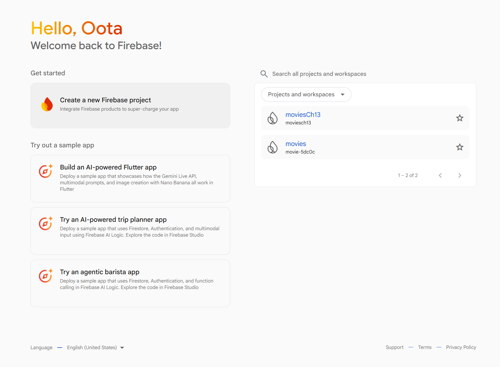
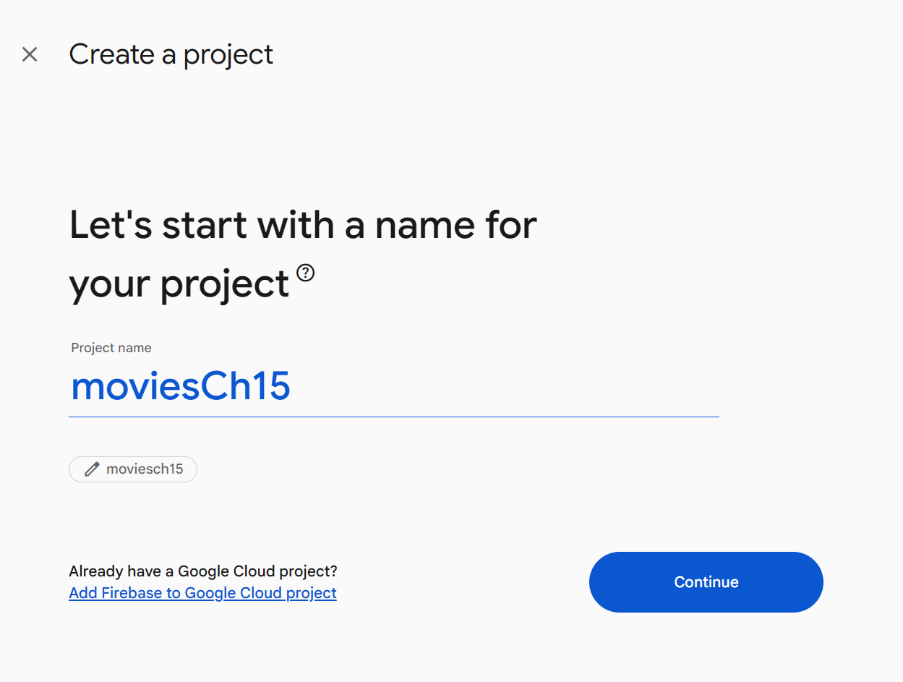
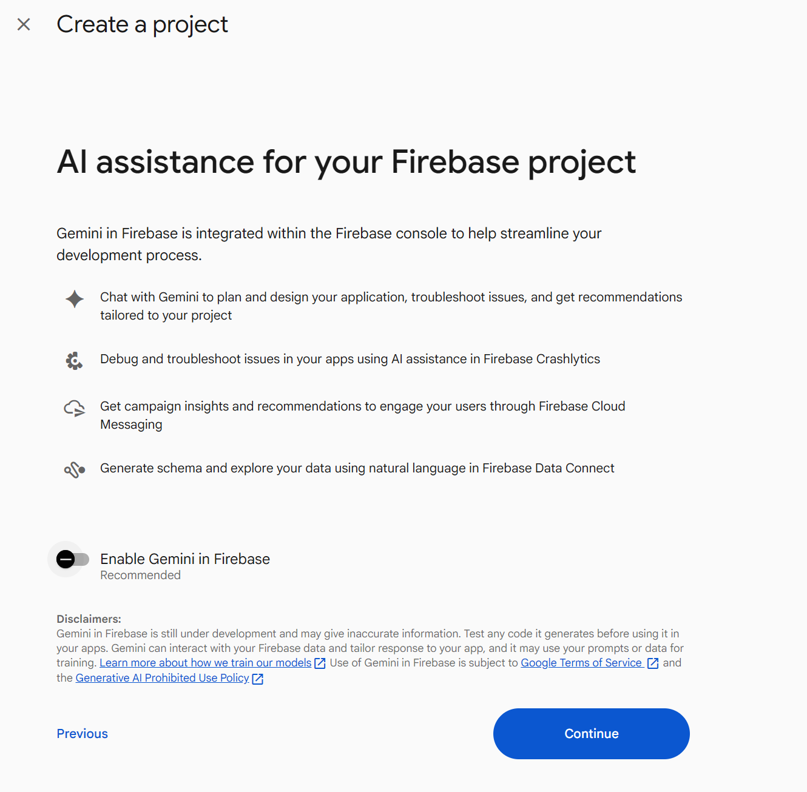
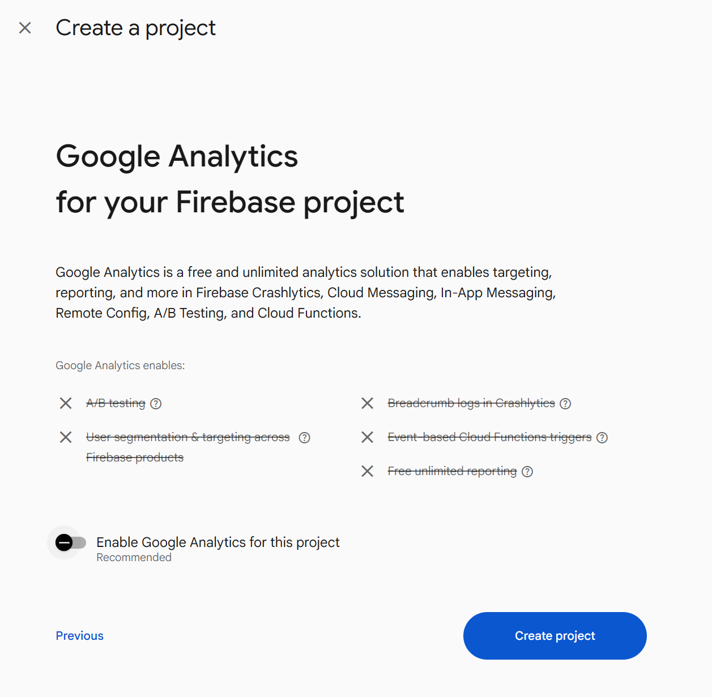
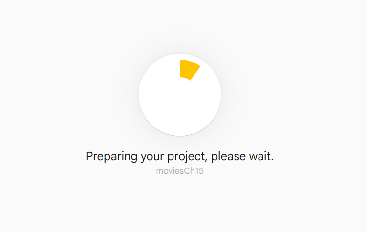
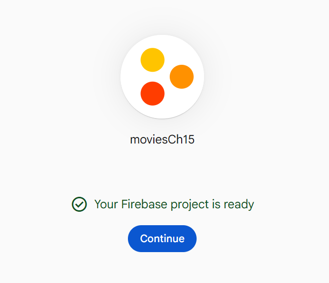
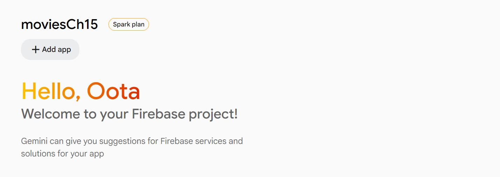
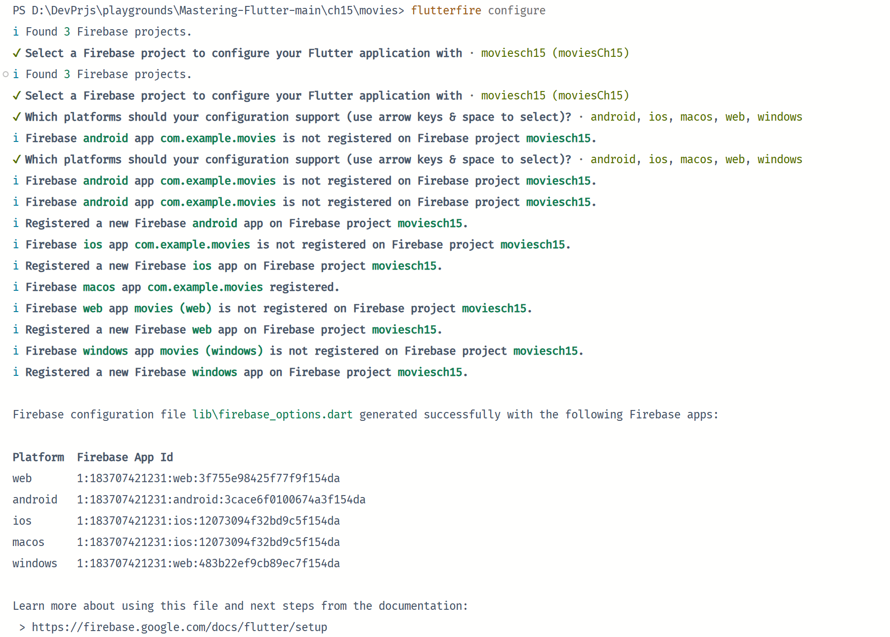
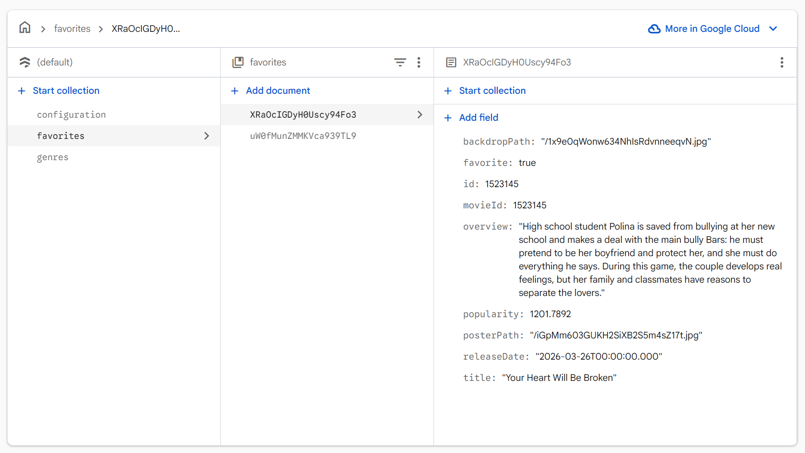
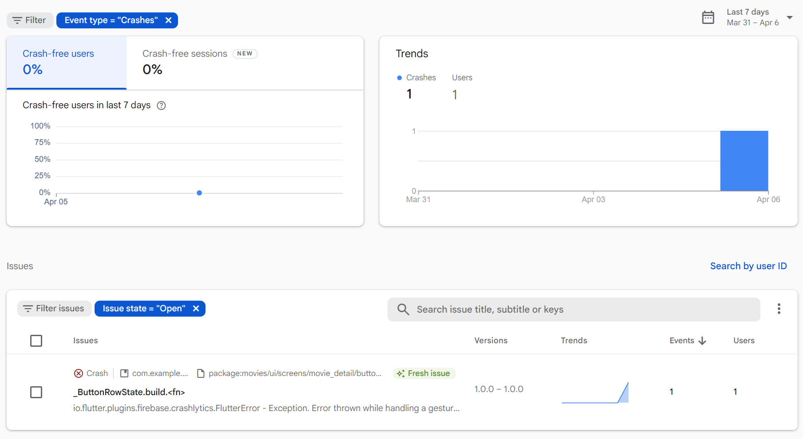

# [CHAPTER 15 Firebase](contents.md#ch15a)

## [Introduction](contents.md#sc2_279a)

In this chapter, you will learn about many of the services that Firebase provides. You will learn how to sign up for Firebase and create a Cloud Firestore database. You will also learn how to retrieve and save data in Firestore. There are many services that Firebase provides, and you will learn about a few of the most important ones. Now that your movie app is taking shape and getting ready for release, you will learn how to track crashes in your app with Crashlytics. You will switch your database from Drift to Firebase with just a change to a Riverpod provider.

## [Structure](contents.md#sc2_280a)

The chapter covers the following topics:

- Introduction to Firebase
- Authentication
- Cloud Firestore
- Collections
- Reading and writing data
- Crashlytics
- Other services

## [Objectives](contents.md#sc2_281a)

By the end of this chapter, you will have learned about several Firebase services. You will be able to investigate the services that we do not cover in detail in this chapter. You will learn how to set up Firebase and Cloud Firestore and you will learn about Collections and documents that make up the database. Finally, you will have learned how to set up Crashlytics to start tracking crashes in the movie app.

## [Introduction to Firebase](contents.md#sc2_282a)

Firebase is a set of online services that Google bought in 2014 and has been adding to ever since. Their first product was the Firebase Realtime Database, which synchronizes data between iOS, Android, and web devices. They then launched Firebase Hosting and Authentication. This positioned the company as a mobile backend service. In 2016, they launched Firebase Analytics, and then in 2017, they acquired Crashlytics. In the same year, they launched Cloud Firestore, a real-time document database. Cloud Firestore is more powerful than Realtime Database and can handle larger datasets. Many developers use Firebase to save data, handle notifications to mobile devices, handle crashes, distribute apps, and remotely configure their devices. Firebase is easy to set up and start using. Crashlytics has been a staple for dealing with crashes. It is a great tool to monitor any crashes your users are encountering, and plan fixes around them. It will show how many users are experiencing each crash and the stack trace for each one so you can figure out what is causing the crash. Google is also advertising its generative AI ability with Firebase. There are more features than can be described in this chapter. It is recommended to go to <https://firebase.google.com/> to read more. In this chapter, we will be working with the Cloud Firestore database and replacing drift with Firestore.

Note: Google also provides Firestore Cloud SQL, which is a relational database.

### [Setting up Firebase](contents.md#sc3_283a)

In [Chapter 13](ch13.md), Web and Desktop, you worked with Firebase to host your app as a web page. If you want to create a new project with Firebase, perform the following:

1. Go to <https://console.firebase.google.com/> and log in.

2. Create a new Firebase project:

    

    Figure 15.1: New project

3. Create a project:

    

    Figure 15.2: Name project

4. Enable/disable Gemini in Firebase:

    

    Figure 15.2_1: Gemini in Firebase

5. Enable/disable analytics:

    

    Figure 15.3: Analytics

6. Press Create project:

    

    Figure 15.4: Preparing

7. Press Continue:

    

    Figure 15.5: Project created

8. The project has been created:

    

    Figure 15.6: Add apps

Firebase has some command line tools that make it easy to add Firebase to your app. You can find a full description here: <https://firebase.google.com/docs/flutter/setup?platform=android>. The first step is to install the Firebase CLI tool:

1. Go to <https://firebase.google.com/docs/cli#setup_update_cli>.

2. Follow the procedures for your OS.

3. For Windows, type the following in a terminal:

    ```shell
    npm install -g firebase-tools
    ```

4. To login to Firebase, in a terminal type:

    ```shell
    firebase login
    ```

5. Install Firebase Dart tool:

    ```shell
    dart pub global activate flutterfire_cli
    ```

6. From your Flutter project directory, run the following command to start the app configuration workflow:

    ```shell
    flutterfire configure
    ```

    

    Figure 15.7: flutterfire configure

7. In your project's folder, add the Firebase packages:

    ```shell
    flutter pub add firebase_core
    flutter pub add cloud_firestore
    flutter pub add firebase_auth
    flutter pub add google_sign_in
    ```

    This adds the core Firebase library, Firestore, Firebase Auth, and Google sign in.

8. Inside of main.dart, add the following imports:

    ```dart
    import 'package:firebase_core/firebase_core.dart';
    import 'package:movies/firebase_options.dart';
    ```

9. Add the following after putLumberdashToWork:

    ```dart
    await Firebase.initializeApp(
      options: DefaultFirebaseOptions.currentPlatform,
    );
    ```

Stop and re-run your app to make sure everything still works.

## [Authentication](contents.md#sc2_284a)

Firebase provides authentication. If you have an app that requires different data for different users, you will want a way to create user accounts, allow the user to sign in, and retrieve data just for that user. While the movie app uses the same data for each user and does not require a login, we will create a sample function for signing in with the Google sign-in package.

启用Google sign-in in the Firebase console:

1. Go to the [Firebase console](https://console.firebase.google.com/) and select your project.

2. 导航至 Authentication > Sign-in method.

3. 点击 Google 选项并启用它。

4. 设定项目的公开名称和支持电子邮件地址。

5. 进入 Project settings > General > Android app, 添加 SHA-1 和 SHA-256 证书指纹。你可以使用以下命令生成这些指纹：

    ```shell
    keytool -list -v -alias androiddebugkey -keystore ~/.android/debug.keystore
    ```

    默认密码是 "android"。

6. 下载更新后的 google-services.json 文件，并将其放在 android/app 目录下。

在项目中使用，The steps are as follows:

1. In the `data/database` folder, create a new folder named `firebase`.

2. Create a new file: `firebase_auth.dart`.

3. Add the following:

    ```dart
    import 'package:cloud_firestore/cloud_firestore.dart';
    import 'package:firebase_auth/firebase_auth.dart';
    import 'package:google_sign_in/google_sign_in.dart';

    // Google Sign-In Service Class
    class GoogleSignInService {
      static final FirebaseAuth _auth = FirebaseAuth.instance;
      static final GoogleSignIn _googleSignIn = GoogleSignIn.instance;
      static bool isInitialize = false;
      static Future<void> initSignIn() async {
        if (!isInitialize) {
          await _googleSignIn.initialize(
            serverClientId:
                '183707421231-4cvha1lbiedtc2gfflm88vplq0qcqkij.apps.googleusercontent.com',
          );
        }
        isInitialize = true;
      }

      // Sign in with Google
      static Future<UserCredential?> signInWithGoogle() async {
        try {
          initSignIn();
          final GoogleSignInAccount googleUser = await _googleSignIn
              .authenticate();
          final idToken = googleUser.authentication.idToken;
          final authorizationClient = googleUser.authorizationClient;
          GoogleSignInClientAuthorization? authorization =
              await authorizationClient.authorizationForScopes([
                'email',
                'profile',
              ]);
          final accessToken = authorization?.accessToken;
          if (accessToken == null) {
            final authorization2 = await authorizationClient
                .authorizationForScopes(['email', 'profile']);
            if (authorization2?.accessToken == null) {
              throw FirebaseAuthException(code: "error", message: "error");
            }
            authorization = authorization2;
          }
          final credential = GoogleAuthProvider.credential(
            accessToken: accessToken,
            idToken: idToken,
          );
          final UserCredential userCredential = await FirebaseAuth.instance
              .signInWithCredential(credential);
          final User? user = userCredential.user;
          if (user != null) {
            final userDoc = FirebaseFirestore.instance
                .collection('users')
                .doc(user.uid);
            final docSnapshot = await userDoc.get();
            if (!docSnapshot.exists) {
              await userDoc.set({
                'uid': user.uid,
                'name': user.displayName ?? '',
                'email': user.email ?? '',
                'photoURL': user.photoURL ?? '',
                'provider': 'google',
                'createdAt': FieldValue.serverTimestamp(),
              });
            }
          }
          return userCredential;
        } catch (e) {
          print('Error: $e');
          rethrow;
        }
      }

      // Sign out
      static Future<void> signOut() async {
        try {
          await _googleSignIn.signOut();
          await _auth.signOut();
        } catch (e) {
          print('Error signing out: $e');
          rethrow;
        }
      }

      // Get current user
      static User? getCurrentUser() {
        return _auth.currentUser;
      }
    }
    ```

    This function starts the process of launching a sign-in screen for Google accounts. Once the user signs in, you will get a Google user. For a real app, you would need to do some error handling and check that a user was returned. We then use the return authentication to get a credential and sign in with that credential. You would want to save the user credential to get a User class. This User class has a display name, email, and user ID.

    注意 `serverClientId` 使用了 `google-services.json` 文件中的 `client` -> `oauth_client` -> `client_id` 字段。

    > 关于 severClientId， 可以在 [Google Cloud 中的 “凭证 - API 和服务 - moviesCh15” 查询](https://console.cloud.google.com/apis/credentials?project=moviesch15) 。

4. Find a place to put a call to the sign in. To test, put it in the call for the rate button as it does not have any functionality at this point (and this is just for testing):

    ```dart
    icon: IconButton(
      onPressed: () {
        GoogleSignInService.signInWithGoogle();
      },
    ```

5. Run your app on Android and test sign in. It should take you to a Google sign in.

> 几个有用的网文
>
> [Flutter Google Sign-In with google_sign_in 7: Understanding the New Authentication Flow](https://dev.to/_ashish_tandon_/flutter-google-sign-in-with-googlesignin-7-understanding-the-new-authentication-flow-2pbe)
> [Flutter Google Sign-In v7.1.1 + Firebase Auth 安裝與設定完整指南（Android/iOS）](https://limouth.com/blog/flutter-google-sign-in-setup-guide/)
> [Flutter 新版 Google Sign-In 插件完整解析（含示例讲解）](https://jishuzhan.net/article/1993372339686408194)
> [在 Flutter 修復 Android 的 Google 登入（google_sign_in v7.1.1）](https://limouth.com/blog/fixing-android-google-signin-v7/)

## [Cloud Firestore](contents.md#sc2_285a)

Cloud Firestore is Google's newest NoSQL document database. NoSQL is a non-relational database that does not rely on tables. There is nothing in the database that defines how the data should be stored. Data is stored first in collections and then in documents and usually contain JSON data. These documents have unique IDs. You can nest documents as far as you want but that can complicate data retrieval and storage. NoSQL can be useful for large data sets, real-time applications (like chat, games, etc.), or other types.

Realtime Database was the first version, and while they are both NoSQL databases, they have a few differences:

- Realtime database:

    - Stores data as a single JSON tree.
    - Queries retrieve the entire subtree.
    - Optimized for real-time synchronization and low latency.
    - Optimized for smaller datasets.

- Cloud Firestore:

    - Stores data in documents, organized into collections
    - More powerful and flexible queries.
    - Better for larger datasets.

Both provide offline support with local caching and use a rule-based system to secure data. Realtime charges are based on bandwidth and storage, while Firestore charges are based mostly on read/write operations and less on bandwidth and storage.

To get an instance of Firestore, you would call:

```dart
final db = FirebaseFirestore.instance;
```

To initialize Firebase, you would use:

```dart
FirebaseApp firebaseApp = await Firebase.initializeApp(
  options: DefaultFirebaseOptions.currentPlatform,
);
```

## [Collections](contents.md#sc2_286a)

For Firestore, collections are containers for documents. The way this works is you would create a collection with a given name. You can do this both from the console or from code. For example, the movie app will have a collection named `Favorites`. This will store all the favorites that a user would make. You can then have documents inside of that collection. How you store those documents is crucial to how easy it is to retrieve them. If you just add a document without an ID, Firestore will assign a unique ID for you. This might look something like `4Kc59lp62s74BGJtAxlE`. Inside of that document is the JSON data for that favorite. For our app, we will be storing favorites with no user-identifying information. If you want the app to be useable by multiple users, you would either embed a user ID in the record or have a sub-collection for that user. Designing the layout of your collections is important for loading and saving data speed. Storing your data in a deep layout will make retrieval quicker but make your code more complex while making your collection structure shallow would require you to load more data than you would probably need. You can also nest collections. For example, you can have a collection that then has a list of documents that are user IDs; those can then have sub-collections with documents. This will make your code more complex, so you must decide how you want to structure your data. It is recommended to do tests with different collection layouts to see the performance difference and what it would take to implement. One important thing to note about NoSQL databases is that you do not have JOIN operations that you would have in a typical SQL database. This means you cannot query multiple tables with linked fields at once. This means you will probably have to duplicate information in different documents and keep that information synced. This is not trivial and should be considered when deciding on using a NoSQL database.

To create a collection in code, you would call:

```dart
db = FirebaseFirestore.instance;
final favoritesCollection = db.collection('favorites');
```

This gets an instance of Firebase Firestore and creates a collection object with the name favorites.

## [Reading and writing data](contents.md#sc2_287a)

To read data, you would use the collections `get()` method. This returns to a `QuerySnapshot` class. From this class, you can get a list of documents and create classes from each document's data. For example, to get a list of favorites:

```dart
final favorites = <DBFavorite>[];
final querySnapshot = await favoritesCollection.get();
for (final doc in querySnapshot.docs) {
  var favorite = DBFavorite.fromJson(doc.data());
  favorite = favorite.copyWith(id: int.tryParse(doc.id) ?? 0);
  favorites.add(favorite);
}
```

This waits for the collection's get call to finish and then iterates through each doc to get a new `favorite`. Writing data is even easier:

```dart
final ref = await favoritesCollection.add(favorite.toJson());
return Future.value(ref.id);
```

This just adds the JSON to the collection. The result is a DocumentReference, which has an ID and a few methods for dealing with the document.

To remove a favorite, you would need to get the specific favorite document and then delete it. This is a bit tricky. This is an example of searching for a favorite with a given ID:

```dart
final ref = await favoritesCollection.where('id', isEqualTo: id).get();
if (ref.docs.isNotEmpty) {
  ref.docs[0].reference.delete();
}
```

Here, we search the collection for a document with the given ID and then get it. If it exists, we get the first document and delete it. A where statement can return multiple documents, but in our case, we are searching for a unique ID.

### [Firebase database](contents.md#sc3_288a)

Get started with Firestore Standard edition by creating a Cloud Firestore database. The guide is available at:

[Create a Cloud Firestore database](https://firebase.google.com/docs/firestore/quickstart#create)

We will be using the Standard edition of Firestore.

To create our Firebase database class, perform the following:

1. Create a new file named `firebase_database.dart` in the `firebase` directory.

2. Add the class definition:

    ```dart
    import 'package:cloud_firestore/cloud_firestore.dart';
    import 'package:firebase_core/firebase_core.dart';
    import 'package:movies/data/database/drift/database_interface.dart';
    import 'package:movies/data/database/models/configuration.dart';
    import 'package:movies/data/database/models/favorite.dart';
    import 'package:movies/data/database/models/genre.dart';
    import 'package:movies/firebase_options.dart';

    const favorites = 'favorites';
    const genres = 'genres';
    const configuration = 'configuration';
    const images = 'images';

    class FirebaseDatabase implements IDatabase {
      // to add something here
    }
    ```

    Besides the imports, we define some constants for our collection names.

3. Add the variables:

    ```dart
    static late FirebaseApp firebaseApp;
    final firebase = FirebaseFirestore.instance;
    final favoritesCollection = FirebaseFirestore.instance.collection(favorites);
    final genresCollection = FirebaseFirestore.instance.collection(genres);
    final configurationCollection =
        FirebaseFirestore.instance.collection(configuration);
    final imagesCollection = FirebaseFirestore.instance.collection(images);
    ```

    This gets an instance of the `FirebaseFirestore` class and creates collection references.

4. Initialize Firestore:

    ```dart
    static Future initialize() async {
      firebaseApp = await Firebase.initializeApp(
        options: DefaultFirebaseOptions.currentPlatform,
      );
    }
    ```

    This needs to be called before Firestore can be used and will be initialized in the `Riverpod` providers file.

5. Override the `deleteDatabase` method. This will not do anything:

    ```dart
    @override
    Future deleteDatabase() {
      return Future.value(null);
    }
    ```

    You would normally not want to delete a server database from the code. If you need to delete the database, you can go to the Firebase console.

6. Get the list of favorites:

    ```dart
    @override
    Future<List<DBFavorite>> getFavorites() async {
      final favorites = <DBFavorite>[];
      final querySnapshot = await favoritesCollection.get();
      for (final doc in querySnapshot.docs) {
        var favorite = DBFavorite.fromJson(doc.data());
        favorite = favorite.copyWith(id: int.tryParse(doc.id) ?? 0);
        favorites.add(favorite);
      }
      return favorites;
    }
    ```

    This is just like the sample above.

7. Stream Favorites:

    ```dart
    @override
    Stream<List<DBFavorite>> streamFavorites() {
      return favoritesCollection
          .snapshots()
          .map((snapShot) => snapShot.docs
              .map((doc) => DBFavorite.fromJson(doc.data()))
              .toList())
          .asBroadcastStream();
    }
    ```

    Firestore can also stream collections. The snapshots call returns a stream of `QuerySnapshot` objects that we map to our `favorite class.

8. Remove a favorite:

    ```dart
    @override
    Future<bool> removeFavorite(int id) async {
      final ref = await favoritesCollection.where('id', isEqualTo: id).get();
      if (ref.docs.isNotEmpty) {
        ref.docs[0].reference.delete();
      }
      return Future.value(true);
    }
    ```

    Just like the example we gave above.

9. Save a favorite:

    ```dart
    @override
    Future saveFavorite(DBFavorite favorite) async {
      final ref = await favoritesCollection.add(favorite.toJson());
      return Future.value(ref.id);
    }
    ```

10. Get all genres:

    ```dart
    @override
    Future<List<DBMovieGenre>> getGenres() async {
      final genres = <DBMovieGenre>[];
      final querySnapshot = await genresCollection.get();
      for (final doc in querySnapshot.docs) {
        var genre = DBMovieGenre.fromJson(doc.data());
        genre = genre.copyWith(id: int.tryParse(doc.id) ?? 0);
        genres.add(genre);
      }
      return genres;
    }
    ```

11. Save a list of genres:

    ```dart
    @override
    Future saveGenres(List<DBMovieGenre> genres) {
      for (final genre in genres) {
        genresCollection.add(genre.toJson());
      }
      return Future.value(null);
    }
    ```

12. Get the Movie configuration:

    ```dart
    @override
    Future<DBConfiguration?> getMovieConfiguration() async {
      final querySnapshot = await configurationCollection.get();
      for (final doc in querySnapshot.docs) {
        var configuration = DBConfiguration.fromJson(doc.data());
        configuration = configuration.copyWith(id: int.tryParse(doc.id) ?? 0);
        final imagesSnapshot = await imagesCollection.get();
        if (imagesSnapshot.docs.isNotEmpty) {
          final images =
              DBConfigurationImages.fromJson(imagesSnapshot.docs[0].data());
          configuration = configuration.copyWith(images: images);
        }
        return configuration;
      }
      return Future.value(null);
    }
    ```

13. Get a movie configuration by ID:

    ```dart
    @override
    Future<DBConfiguration?> getMovieConfigurationById(int id) async {
      final docRef = await configurationCollection.doc(id.toString()).get();
      final data = docRef.data();
      if (data != null) {
        return DBConfiguration.fromJson(data);
      }
      return null;
    }
    ```

14. Save a movie configuration:

    ```dart
    @override
    Future saveMovieConfiguration(DBConfiguration configuration) {
      final configJson = configuration.toJson();
      print(configJson);
      configurationCollection.add(configJson);
      return Future.value(null);
    }
    ```

### [Firebase provider](contents.md#sc3_289a)

For this chapter, we are going to switch from using the drift database to Firebase. To do that we will create a new provider for Firebase and use that in place of drift. Since they both implement the IDatabase interface, we can swap them. Next, add the Firebase provider to the providers file:

1. Open up `lib/providers.dart` file.

2. Add the Firebase provider:

    ```dart
    @Riverpod(keepAlive: true)
    IDatabase firebase(Ref ref) => FirebaseDatabase();
    ```

3. Add a `database` `provider` that we can use to switch between the two databases:

    ```dart
    @Riverpod(keepAlive: true)
    Future<IDatabase> database(Ref ref) {
      // Change this to what we want to use
      return Future.value(ref.watch(firebaseProvider));
    }
    ```

4. Modify the movieViewModel to:

    ```dart
    @Riverpod(keepAlive: true)
    Future<MovieSource> movieRepository(Ref ref) async {
      final database = await ref.watch(databaseProvider.future);
      final serviceFuture = ref.watch(networkMovieSourceProvider.future);
      return MovieRepository(await serviceFuture, database);
    }
    ```

    With the addition of Firebase, we will need to make a few changes. Firebase requires a minimum Android SDK value of 23.

5. Open `android/app/build.gradle.kts` file.

6. Change the `minSdkVersion` to:

    ```Kotlin
    minSdk = 23
    ```

    > 实际在 `build.gradle.kts` 中，设置项目为 `minSdk = flutter.minSdkVersion`
    > 这个设置在文件 `D:\d\flutter\packages\flutter_tools\gradle\src\main\kotlin\FlutterExtension.kt` 中，如下所示：
    > `val minSdkVersion: Int = 24`

    Finally, we need to use a special file for improving our JSON serialization.

7. In the root folder, create a new file named `build.yaml` file.

8. Add:

    ```yaml
    targets:
      $default:
        builders:
          json_serializable|json_serializable:
            options:
              explicit_to_json: true
              include_if_null: false
    ```

    This will fix the problem of the `DBConfiguration` images not fully being serialized.

9. In the terminal, run the following:

    ```shell
    dart run build_runner build
    ```

Stop and restart your app to make sure everything works. Try saving some favorites and check your Firebase console. You should see something like this:



Figure 15.8: Favorites

This shows the configuration, favorites, and genre collections. The favorites collection is selected and there are three documents. Each document has a favorite JSON.

## [Crashlytics](contents.md#sc2_290a)

Crashlytics is Firebase's real-time crash and error reporting system. This is a great way to keep track of how your app is doing and fix crashes before they get out of control. Crashlytics has a dashboard where you can view all of your crashes and stack traces.

It's recommended to enable Google Analytics.

The guide is as follows: [Get started with Crashlytics for Flutter](https://firebase.google.com/docs/crashlytics/flutter/get-started)

1. Go to the Firebase console of the project.

2. Click `setting` -> `Integration`.

3. In the card of `Google Analytics`, click `Enable`.

4. Select the location, Check to use the default setting and to accept the terms, then click `Enable Google Analytics`.

5. Add the Google Analytics SDK following the tips.

To add Crashlytics to the movie app, follow these steps:

1. Add Crashlytics. In a terminal type:

    ```shell
    flutter pub add firebase_crashlytics && flutter pub add firebase_analytics
    ```

1. Configure Crashlytics:

    ```shell
    flutterfire configure
    ```

1. In main.dart add the following after Firebase.initializeApp:

    ```dart
    FlutterError.onError = (errorDetails) {
      FirebaseCrashlytics.instance.recordFlutterFatalError(errorDetails);
    };
    // Pass all uncaught asynchronous errors that aren't handled by the Flutter framework to Crashlytics
    PlatformDispatcher.instance.onError = (error, stack) {
      FirebaseCrashlytics.instance.recordError(error, stack, fatal: true);
      return true;
    };
    ```

This will catch both regular and asynchronous errors. To finish the setup, you will need to cause a crash. Let us use the `Share` icon in `button_row.dart`.

1. Add the onPressed for the Share icon in `button_row.dart` to:

    ```dart
    throw Exception();
    ```

1. Run the app and click on the Share button.

1. Go to the Crashlytics tab in the Firebase console. You should see the following:

    

    Figure 15.9: Crashlytics

## [Other services](contents.md#sc2_291a)

Firebase has more services than we can cover in this chapter. Some of the notable services include:

- Cloud messaging: Provides a connection from your server to all devices to send notifications.
- Remote config: Allows you to dynamically personalize an app and provide experiments. You set up variables that your app checks for. You can provide different UIs or features based on those settings.
- App distribution: Used for managing pre-release versions of your apps to testers.
- App hosting: Used to host web apps. Can be used for Flutter web apps.
- A/B testing: Used for experiments. Allows you to analyze results.
- Analytics: A way to analyze events from your app.
- Test lab: A cloud-based app testing service run on real devices.
- Performance monitoring: Measure network requests, screen rendering, and other performance-related tasks.
- Generative AI integration: Integrate with Google's Gemini and other AI technologies.

All of this adds up to a powerful set of tools that will help you in your journey to developing your application.

## [Conclusion](contents.md#sc2_292a)

In this chapter, you learned about a lot of the services that Firebase provides. Many of these services are free or free for a certain amount of usage. You learned how to set up Firebase and, specifically, Firebase Cloud Firestore. You know how to retrieve and save data in Firestore as well as how this information is stored: collections and documents. You can also keep track of any crashes, thanks to Crashlytics.

In the next chapter, you will learn more about packages and how to create your own. Packages form the backbone of many apps, and having the ability to break your app up into multiple packages will make your build faster and allow it to be worked on by multiple teams.
