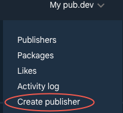
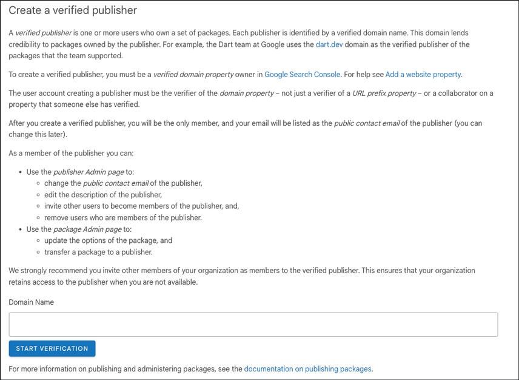
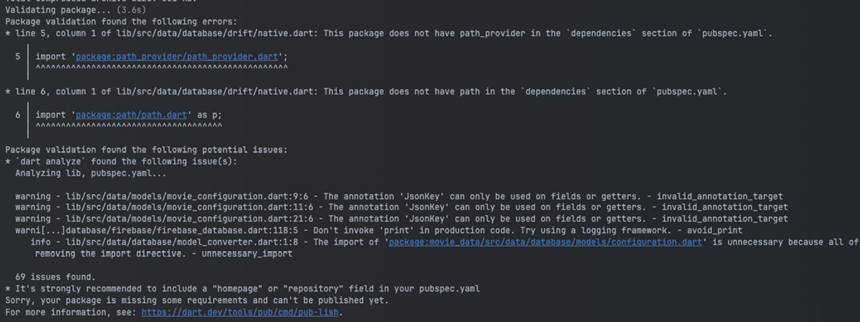
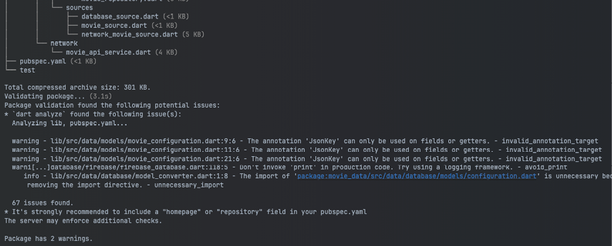

# [CHAPTER 16 Packages](contents.md#ch16a)

## [Introduction](contents.md#sc2_293a)

In this chapter, you will learn all about packages and how to create one. You will also learn how to fix any errors that come with refactoring a project with a package. Share your projects with the Flutter community by publishing your very own package. You will also learn about the importance of being a verified publisher. These skills will help you reuse your code for other projects as well as sharing with others. While you will use other packages, there is great satisfaction in helping others with the knowledge you have learned by writing packages that can be shared with others.

## [Structure](contents.md#sc2_294a)

The chapter covers the following topics:

- Introduction to packages
- Creating a package
- Refactoring code to package
- Publishing a package

## [Objectives](contents.md#sc2_295a)

By the end of this chapter, you will have learned all about packages and how to create a new one. You will learn how to register to become a verified publisher and how to publish a package. You will have a good understanding of what a package is and some of the benefits of using your own package.

## [Introduction to packages](contents.md#sc2_296a)

Packages are collections of Dart code put into their own project. Think of it as a mini-Flutter project. The project does not have to be Flutter related but can be just Dart code. Packages can also include assets and will have a pubspec.yaml file, just like a Flutter project. This pubspec.yaml does the same thing as in a Flutter project.

The difference between a package and a plugin is that a package does not contain native code, just Dart. The most common place to store packages is at Google's pub.dev site. While you can publish to other sites, most people expect packages to be at pub.dev. Each package on the site has a score that developers can use to judge the quality of the package. People can like a package, but pub.dev also auto-generates a popularity value (measured as the number of apps that depend on this package over the last 60 days) and pub points, which are a combination of:

- Following Dart file conventions, up to 30 points.
- Provides documentation, up to 20 points.
- Platform support (how many platforms), up to 20 points.
- Pass static analysis, up to 50 points. Errors will count against.
- Up-to-date dependencies, up to 20 points.

To add a local package to your project (and not one from pub.dev), you would give the package a name and a path. For example:

```yaml
my_package:
  path: ../my_package
```

Remember that when we added the menubar package, we used git settings. Those were as follows:

```yaml
menubar:
  git:
    url: <https://github.com/google/flutter-desktop-embedding>
    path: plugins/menubar
    ref: 12decbe0f592e14e03223f6f2c0c7e0e2dbd70a1
```

Here, the URL is the path to GitHub, the path is the sub-project, and the ref is the git commit hash. As you can see, there are several ways to import a package. We will use the local package method for our new package.

## [Creating a package](contents.md#sc2_297a)

We are going to create our own package by moving all of the database and networking code to its own package. This will isolate the code so that other team members can work on just that portion of the project to improve or make changes to it. You could also create a package if you felt your code would be useful to others. For example, I created a package to make it easier to use the Supabase Postgres database. Initially, I had it as part of one project and then realized that I needed that same code for other projects. By creating it in its own package, and eventually publishing it, I was able to make changes in one place, and all projects would get those updates. Of course, updating a package requires updating the version number in the `pubspec.yaml` file.

To create a project, you can use your IDE or create one from the command line. To create a new package from the command line, you would use the flutter create command as follows:

```shell
flutter create --template=package --org=<org> --project-name=<project name> <directory name>
```

### [Movie data project](contents.md#sc3_298a)

To create our package, do the following:

1. Go to the Terminal app.

2. Go to the directory above your current directory.

3. Type the following:

    ```shell
    flutter create --template=package --org=com.bpb.movies --project-name=movie_data movie_data
    ```

This will create a new folder named `movie_data` with a new package. If you look at the generated files, they look pretty similar. The packages have:

- A `lib` directory for source files.
- A `test` directory for test files.
- A `pubspec.yaml` file for other packages.

What it does not have are the platform directories:

- android
- ios
- windows
- macos
- linux
- web

One of the files created from this process is the `README.md` file. This is an important file that is shown as the main page when you publish your package. The other two files that are generated for you are:

- `ChangeLog.md`: Lists changes for each version.
- `LICENSE` file: What type of license this project is under.

#### [Example app](contents.md#sc4_299a)

In addition to the package documentation in the README file, it is really helpful to create an example project. This example project will be inside of the package at the root level. This will be an application, and when created, it will have the typical counter app. It is recommended to replace this with a sample app that demonstrates how to use your package. In our case, you might have different screens that make calls into the movie API or database calls so that the user can see how your code is called.

To create the example app, go to the terminal and perform the following:

1. Create the `example` directory.

    ```shell
    mkdir example
    ```

1. Go into the example directory.

    ```shell
    cd example
    ```

1. Create a new project.

    ```shell
    Flutter create .
    ```

Take a look at the generated project. It looks like a normal Flutter app and has the `android`, `ios`, `linux`, `macos`, `web`, and `windows` directories. Inside the `lib` folder is one main.dart file. You can delete all the code here and create or own and even create other files. Sometimes, copying files from your main project will help create this sample app.

## [Refactoring code to package](contents.md#sc2_300a)

What we want to do is move all of the files in the `data` and `network` folders to these new packages. The steps are as follows:

1. Open the `movie_data` project.

2. Inside of the `lib` directory create a new `src` directory.

   **Note that packages use a `src` directory instead of being directly inside of the `lib` directory. These files are hidden unless you export them via the `movie_data.dart` file.**

1. From the Finder, File Explorer, or other file system app, move the `data` and `network` directories to the `src` directory in the new package. (You can do this in some IDEs, but it might be harder)

2. Move the following packages from the `movies` project's `pubspec.yaml` to the `movie_data` project's `pubspec.yaml` file:

    ```yaml
    json_annotation: ^4.11.0
    freezed_annotation: ^3.1.0
    dio: ^5.9.2
    drift: ^2.31.0
    drift_flutter: ^0.2.8
    sqlite3_flutter_libs: ^0.5.42
    cloud_firestore: ^6.2.0
    firebase_auth: ^6.3.0
    google_sign_in: ^7.2.0
    ```

    Add the following dependencies:

    ```yaml
    intl: ^0.20.0
    lumberdash: ^3.0.0
    firebase_core: ^4.6.0
    ```

    Move the following dev_dependencies:

    ```yaml
    json_serializable: ^6.13.0
    freezed: ^3.2.5
    drift_dev: ^2.31.0
    ```

    Add these dev_dependencies:

    ```yaml
    build_runner: ^2.13.1
    ```

3. Do a global replace in `movie_data` to replace `'package:movies'` to `'package:movie_data/src'`. Most IDE's have a global find and replace function.

2. Delete the `test/movie_data_test.dart` file.

3. Move the file `database_interface.dart` in the `data/database/drift` folder to the `database` folder.

4. Fix any incorrect imports to `database_interface.dart`.

5. Open `firebase_database.dart`. We need to make a few changes.

6. Remove the `firebase_options.dart` import.

7. Add a new field below imagesCollection, add a constructor, and change the initialize method.

    ```dart
    final FirebaseOptions options;
    FirebaseDatabase(this.options);
    ```

1. Remove the `initialize` method.

2. Open `movie_api_service.dart`.

3. Remove the two imports that do not exist.

4. Change the constructor and `init` method to:

    ```dart
    MovieAPIService(this.apiKey);
    Future init() async {
      configureDio();
    }
    ```

1. Remove the `webload` method.

    Notice the `movie_data.dart` file. This is the entry point for projects using your package.

1. Open `movie_data.dart`. This is the barrel file for the package (a barrel file is simply a list of dart files you export).

2. Remove the generated calculator method.

3. Add the following exports so that users of the package will see the files:

    ```dart
    library;
    export 'src/data/models/models.dart';
    export 'src/data/database/models/database_models.dart';
    export 'src/data/database/firebase/firebase_database.dart';
    export 'src/data/database/firebase/firebase_auth.dart';
    export 'src/data/database/drift/drift_database.dart';
    export 'src/data/repository/movie_repository.dart';
    export 'src/data/sources/database_source.dart';
    export 'src/data/sources/movie_source.dart';
    export 'src/data/sources/network_movie_source.dart';
    export 'src/network/movie_api_service.dart';
    export 'src/data/database/database_interface.dart';
    ```

    The model files have all of the models in them.

1. Open `src/data/models/models.dart`.

2. Add a missing export:

    ```dart
    export 'genre_state.dart';
    ```

1. Copy the `build.yaml` file over to the project root directory.

2. In the terminal, type:

    ```shell
    dart run build_runner build.
    ```

    To make sure the build system works probably.

### [Movies project](contents.md#sc3_301a)

Now, we need to update the main project.

1. Open `pubspec.yaml`.

2. Remove the following packages, if you have not already.

    ```yaml
    json_annotation: ^4.11.0
    freezed_annotation: ^3.1.0
    dio: ^5.9.2
    drift: ^2.31.0
    drift_flutter: ^0.2.8
    sqlite3_flutter_libs: ^0.5.42
    cloud_firestore: ^6.2.0
    firebase_auth: ^6.3.0
    google_sign_in: ^7.2.0
    ```

    dev_dependencies:

    ```yaml
    json_serializable: ^6.13.0
    freezed: ^3.2.5
    drift_dev: ^2.31.0
    ```

1. Add the `movies_data` package:

    ```yaml
    movie_data:
      path: ../movie_data
    ```

1. Do a Pub Get.

2. Find all files with the old imports and places with errors and replace them with:

    ```dart
    import 'package:movie_data/movie_data.dart';
    ```

1. Open `providers.dart` and remove the incorrect imports.

2. Change the `movieAPIService` call to (and add needed imports):

    ```dart
    @Riverpod(keepAlive: true)
    Future<MovieAPIService> movieAPIService(Ref ref) async {
      String apiKey;
      if (!isWeb()) {
        apiKey = dotenv.env['TMDB_KEY']!;
      } else {
        apiKey = await webLoad();
      }
      final service = MovieAPIService(apiKey);
      await service.init();
      return service;
    }
    Future<String> webLoad() async {
      String apiKey = '';
      try {
        final dotEnvString = await rootBundle.loadString('dotenv');
        if (dotEnvString.contains('TMDB_KEY')) {
          final parts = dotEnvString.split('=');
          if (parts.length == 2) {
            apiKey = parts[1];
            if (apiKey.contains("'")) {
              apiKey = apiKey.replaceAll("'", "");
            }
          }
        } else {
          apiKey = dotEnvString;
        }
      } catch (e) {
        print(e);
      }
      return apiKey;
    }
    ```

1. Change the database, and Firebase calls to:

    ```dart
    @Riverpod(keepAlive: true)
    Future<IDatabase> database(Ref ref) {
      // Change this to what we want to use
      final firebaseFuture = ref.watch(firebaseProvider.future);
      return firebaseFuture;
    }
    @Riverpod(keepAlive: true)
    Future<IDatabase> firebase(Ref ref) async {
      return FirebaseDatabase(DefaultFirebaseOptions.currentPlatform);
    }
    ```

1. In the terminal, type:

    ```shell
    dart run build_runner build.
    ```

1. To fix a few problems with iOS overflow and the top system, open `ui/theme/theme.dart`. Add the following to the ThemeData:  

    ```dart
    scaffoldBackgroundColor: Colors.black,
    ```

1. In `main_screen.dart`, remove the `SizedBox` around the `BottomNavigationBar`. 

Try running the app now to make sure that it works.

## [Publishing a package](contents.md#sc2_302a)

If you would like to share your package with others, then `pub.dev` is the place where other developers can find it. `pub.dev` has the ability to easily search for packages that are sorted by relevance and popularity. To get popular, you need to have good documentation and make your package easy to use. To publish a package, there are a few things that are required for a package. The most important file is the `pubspec.yaml`. This will describe the package. In order for the user on `pub.dev` to know what your package is all about; they would read what you put into the `Readme.md` file. This is a markdown file and should be formatted using the markdown language. One site for documentation on markdown is <https://www.markdownguide.org/>. Without a good Readme, users will not know why to use your package. So, it is critical that you describe your package, what it does, how to use it, and maybe even why they should use it. To know what you have done for each version, you will update the `Changelog.md` file describing what you have done in each version. Finally, you need a license that lets the user know how they can use your package.

#### [pubspec.yaml](contents.md#sc4_303a)

You already know about this file, but it is also used by the publishing tool, so certain fields need to be filled out. Make sure you fill out:

- name: Name of the package.
- description: A small description of the package.
- version: The current version of the package.
- repository: URL to your repo, usually a GitHub site. (Optional)
- homepage: URL to a homepage for the package. It can also be the GitHub site. (Optional)

#### [Readme.md](contents.md#sc4_304a)

This is your place to describe your package and explain how to use it. Here is a quick set of markdown characters:

- Use the '#' characters for different header levels. One # is a top level, ## is the second level, etc.
- Use the triple backtick character for the code. For example:

    \`\`\`dart
    Final configuration = Configuration();
    \`\`\`

- Use the '**' character to surround the text to make it bold.

Use a markdown app to view the results before publishing. If you can add graphics, it would be even better, as that will catch the eyes of readers. If you are building a widget, show what the widget looks like in its different variations.

#### [Changelog.md](contents.md#sc4_305a)

This file is for commenting on the changes you make for each version. Make sure you update this file every time you publish a new version. The first version goes at the bottom, and the newer versions go above that. Here is an example:

    \## 1.0.1

    - Add Movie Theme

    \## 1.0.0-dev.1

    - First release.

Make sure you keep the version in the `pubspec.yaml` synced with the `Changelog` file.

#### [License file](contents.md#sc4_306a)

To publish a package, you will need a license file. The recommended license is the BSD 3-clause file. <https://opensource.org/license/BSD-3-Clause>. If you need any other type of license, you can find them online. Just put it in the LICENSE file.

### [Requirements](contents.md#sc3_307a)

There are a few other requirements:

- The package size should be less than 100 MB after compression. You can split it into multiple packages if needed.
- Included packages should be from `pub.dev`.
- You will need a Google account to manage permissions.

#### [Verified publisher](contents.md#sc4_308a)

Being a verified publisher means that you have your own domain that can be verified by Google. You can publish your package as an unverified publisher, but it is not recommended. You will have a higher rating, and people will trust your package more if you are a verified publisher. It takes a bit of time, but it is worth it. To become a verified publisher, do the following:

- Go to pub.dev.

- Log in with your Google account:

    

    Figure 16.1: Pub.dev sign-in

- Select Create publisher:

    

    Figure 16.2: Create publisher

- Follow the instructions on the next page:

    

    Figure 16.3: Start verification

    It takes quite a bit of work after this, as you will have to have access to your domain settings by setting some DNS-CNAME records. Google will then verify these settings, and after some time, you will become verified.

#### [Publishing](contents.md#sc4_309a)

To publish, you will use the dart command-line tool. You can find more information at <https://dart.dev/tools/pub/cmd/pub-lish> and <https://dart.dev/tools/pub/publishing>. The command for publishing is:

```shell
dart pub publish
```

This has an additional optional parameter of `–dry-run`. This allows you to test your publishing before it actually sends it to `pub.dev`. Once you have everything ready: from the `readme`, `changelog`, `license file`, and `pubspec.yaml`, you can try to publish.

> It is critical that you have this in a Git repo as the publish command uses git to list files.

> Some readers may find some of the topics discussed to be overly elementary. However, we hope that while you read, you will learn some new and useful ideas. The intention is for all readers to be familiar with these foundations and be able to utilize Wireshark to its full potential.

To do a dry run for publishing the package, apply the following:

1. In the terminal type:

    ```shell
    dart pub publish –dry-run
    ```

    Trying a dry-run in our package produces:

    

    Figure 16.4: Publish dry run

    As you can see, we have a few errors we need to fix. This tells us that we are missing the `path_provider` and the `path` package as it is needed for the `drift` package.

1. Add the two missing packages to `pubspec.yaml`:

    ```yaml
    path_provider: ^2.1.5
    path: ^1.9.1
    ```

1. From the command line type:

    ```shell
    dart pub publish –-dry-run
    ```

    Look through the errors to see if you can fix any issues before you publish. Also, note that having your package in a path that has spaces in the name could cause issues as well. If you have files that you do not want to be published, create a `.pubignore` file and add those files to that file. The output from the publish command looks like:

    

    Figure 16.5: Successful publish dry run

## [Conclusion](contents.md#sc2_310a)

In this chapter, you learned all about packages and how to create a new package. You then learned how to fix any errors that come with refactoring a project with a package. Finally, you learned how to register to become a verified publisher and how to publish a package.

In the next chapter, you will learn all about platform channels and plugins. This will help you understand plugins and how you would go about creating your own package for Android and iOS and accessing native systems.
