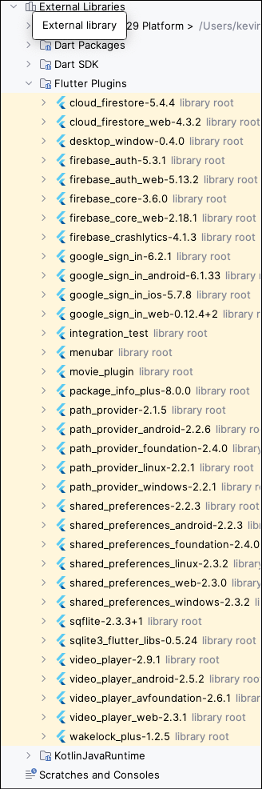
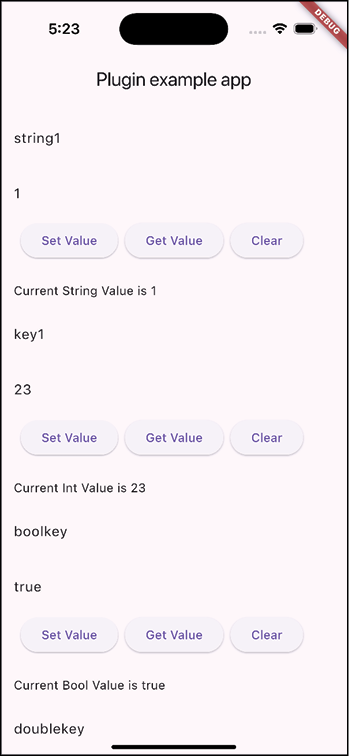
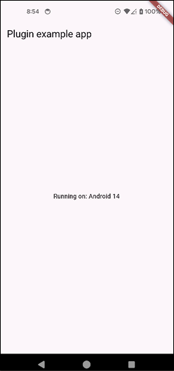
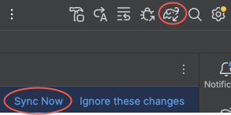
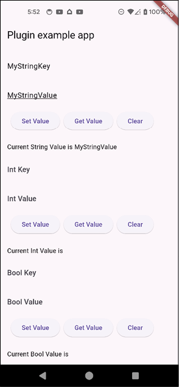

# [CHAPTER 17 Platform Channels and Plugins](contents.md#ch17a)

## [Introduction](contents.md#sc2_311a)

In this chapter, you will learn about plugins and when you need to use them or build your own. There are many third-party plugins that provide the backbone for Flutter’s functionality and should be what you use if you need native functionality. If that functionality does not exist, you can build your own. You will learn how plugins work and how to build your own SharedPreferences type plugin.

## [Structure](contents.md#sc2_312a)

The chapter covers the following topics:

- Writing a plugin
- Using third-party plugins
- Platform channels
- Building a plugin

## [Objectives](contents.md#sc2_313a)

By the end of this chapter, you will know when to use third-party plugins and when to build your own. You will understand how plugins work and communicate with the Flutter app. You will also understand how to create and build a plugin that will replace the SharedPreferences plugin.

## [Writing a plugin](contents.md#sc2_314a)

Unlike a package, which is a library of Dart code, a plugin is a set of native code with a Dart front-end. Depending on which platforms are supported, you will have Android, iOS, macOS, Linux, and Windows. When a plugin is created, there are three main .dart files:

- <plugin name>.dart
- <plugin name>_method_channel.dart
- <plugin name>_platform_interface.dart

These files are the entry point into the plugin.

The first file, <plugin name>.dart, is what the user of the plugin will see. These have all of the methods that can be called for this plugin. This class will, in turn, call the platform singleton instance, which will then call the channel class. The platform class implements the PlatformInterface class, which just has a constructor that takes a token. This class is itself abstract and is implemented by the channel class. This is a bit confusing, but it helps to separate interfaces from classes. The channel class is so named because it has an instance of a MethodChannel. This class is used to talk to native code. The way they do this is by sending and receiving messages. You would make a call as follows:

```dart
methodChannel.invokeMethod<Return Type>(String methodName, [arguments]);
```

You define what method names that will be available and then the user calls a method in the plugin class. Remember that the main plugin name (defined by how you created the plugin) will contain all of the methods the user of the plugin will see.

In this chapter, we will be creating a shared preferences plugin. This will duplicate the current shared preferences but will demonstrate how to create a plugin and implement it in Android and iOS. We will not be creating any other platform code, but if you would like to expand on it, you can create the Windows, macOS, or Linux versions.

## [Using third-party plugins](contents.md#sc2_315a)

In Android Studio, there is an External Libraries section in the Project view. If you open up the Flutter Plugins section, you will see all of the plugins we are currently using in our project:



Figure 17.1: Movie plugins

As you can see in Figure 17.1, there are a lot of them. When you need native functionality that Flutter does not provide, then it is highly recommended that you first search for an existing plugin from pub.dev. You can do a search and will usually find multiple plugins that do what you need. The only thing you need to do is determine which plugin is best. Do this by viewing the plugin’s ratings, documentation, and examples. Before you fully commit to a plugin, it might be wise to do a test with the plugin to make sure it handles all of your needs. For example, there are many video plugins, all with different features. Do you need a plugin that works on certain platforms? If it does not, you can eliminate that plugin. Does it have all of the features you need? If not, you can eliminate that one. What happens if you search all available plugins and nothing matches what you are looking for? If you find one that is close to what you want, you can fork that plugin and modify it yourself (assuming it has a license that allows you to do that). That will give you a head start in building a plugin. I needed a plugin that worked on iOS and Android and used Bluetooth to connect to a specific device. Since this was a very specific need, it was decided to write our own plugin. Luckily, we had native code examples we could use for this. We had older iOS and Android apps that had this implemented, so we could copy a lot of the code over.

## [Platform channels](contents.md#sc2_316a)

Platform channels are a way for Flutter apps to communicate with native code running on a device. They provide a bidirectional communication channel between Flutter and native code. The idea is for a Flutter app to tell a plugin to perform an action on the native side and have the plugin execute that action and return a result. Channels work by sending messages between Flutter and the native code. These messages are serialized in a format that both sides can understand. The MethodChannel is the most common channel and is used to invoke methods on the native side and return a result. MethodChannels just require a name that needs to be the same on both sides of the channel. On the native side, you would create a MethodChannel with a channel name and the type of messenger used to process messages. This is usually a BinaryMessenger. If you have your own way of sending messages, you would implement your own messenger. To create a MethodChannel you would use the following:

```dart
channel = MethodChannel(flutterPluginBinding.binaryMessenger, "<channel name>");
```

This binaryMessenger comes from the onAttachedToEngine method, which looks as follows on Android:

```java
override fun onAttachedToEngine(flutterPluginBinding: FlutterPlugin.FlutterPluginBinding) {
```

It looks like this on iOS:

```swift
public static func register(with registrar: FlutterPluginRegistrar) {
```

The easiest way to start working on a Plugin is to use the flutter create –template=plugin command. This creates the needed starting project for you. This will consist of the following:

- Dart-based project for the plugin.
- Example project to test your plugin.
- Platform folders for each platform that is iOS, Android, etc.

Inside the Dart-based project, you will have a lib folder with three files. If the project is named movie_plugin then they will be:

- `movie_plugin.dart`
- `movie_plugin_method_channel.dart`
- `movie_plugin_platform_interface.dart`

The `MoviePlugin` class will define all of the methods that are available for this plugin. This file will just call methods from the `MoviePluginPlatform` class. The `MoviePluginPlatform` extends the `PlatformInterface` which has a few methods for identifying it and then dummy methods. These methods throw an `UnimplementedError`. The reason for this is that each platform has to implement this method. If they do not, then this error will be thrown. For example, if you write the Android native portion but then try to run the app on iOS, you will get this error. This will remind you that you have to implement iOS. The `MoviePluginPlatform` creates a static instance of the `MethodChannelMoviePlugin` class. As its name implies, this class creates a `MethodChannel` with the name `movie_plugin`. The `MethodChannelMoviePlugin` class then calls the `invokeMethod` function on the method channel that takes a return type, the string value of the method name, and any arguments. The argument types are dynamic, meaning they can be anything that can be serialized. The author usually uses `JSON` as it is easy to use on both sides of the plugin. An example would be:

```dart
return methodChannel.invokeMethod<String?>('getString', {'key': key });
```

This calls the native `getString` method, passing in a map argument with a key value. The return value is a nullable string, meaning that the call may not find a string. Just remember that it looks like:

```dart
return methodChannel.invokeMethod<return value>(method name, list of arguments);
```

One other important channel type is the `EventChannel`. This is a great way to send messages from the plugin to the user. This class takes a messenger and a channel name like the `MethodChannel`. In the native code, you need to set a stream handler. This handler must implement the `onListen` and `onCancel` methods. The `onListen` method will return an `EventSink` class that you will use to send messages. The `EventSink` interface looks like:

```kotlin
public interface EventSink {
  void success(Object var1);
  void error(String var1, String var2, Object var3);
  void endOfStream();
}
```

Sending JSON values of events to the success method works well. The Flutter app will then listen to the `EventChannel` and handle any events. `EventChannels` are a great way for a Flutter app to listen for events that have not been specifically requested. For example, you may get a native `Bluetooth` event that you want to send to your Flutter app.

## [Building a plugin](contents.md#sc2_317a)

For this chapter, we will be building a plugin that will replace the `shared_preferences` plugin. This plugin saves primitive values to local storage. This is a relatively easy set of methods. For the Android portion, it will use the `SharedPreferences` class, and for iOS, it will use the `UserDefaults` class.

### [Creating the plugin](contents.md#sc3_318a)

While you can create the plugin through your IDE, we will be creating it through the terminal so you can see the parameters needed. Since we are building this for Android and iOS, we will be specifying those platforms. To create the plugin, you will use the flutter create command with the plugin template. The steps are as follows:

1. From the terminal, go to the folder above your project:

    ```bash
    cd ..
    ```

1. Type:

    ```bash
    flutter create --org=com.bpb --template=plugin --platforms=android,ios movie_plugin
    ```

    This will create a plugin with a `com.bpb.movie_plugin` package with Android and iOS native code.

1. Open the project from your IDE. For Android Studio, you can also open up the Android project that is part of this plugin. The reason is that Android Studio handles the project as an Android project when you open up that folder. So, you will have your `movies`, `movie_plugin`, and `movie_plugin/android` projects open. In the `movie_plugin` project, you will first see the `README.md` file. This has some dummy information that you will need to change if you want to publish your plugin. Open up `pubspec.yaml`. Most of this looks the same as a regular Flutter project. There are two main differences:

    - No publish_to field
    - Extra homepage field

There is also an example project inside. This project is useful for testing the plugin. We will be using this project to bring up a simple one-screen app for testing shared preferences:



Figure 17.2: Plugin example app

This has four sections. The first one is for setting the key/value pair for strings, the second for ints, the third for Booleans, and the fourth for doubles. This will allow us to test setting, retrieving, and clearing values. You will want to enter a key and then a value, click the Set Value button and then click the Get Value button to see if the value shows up in the line below. Then try pressing the Clear button and then the Get button to make sure it is gone. If all of these areas work, you know your plugin is working. If they do not, you can fix that area.

### [Building the plugin](contents.md#sc3_319a)

In the `movie_plugin` project, you will see the three generated files. Open up `movie_plugin.dart`. This has a generated `getPlatformVersion` default method. Try running the example project. It should look like:

For Android, it will look as follows:



Figure 17.4: Android plugin example app

### [Android plugin](contents.md#sc3_320a)

Now, open up the Android project. This will be the Android folder inside of the `movie_plugin` folder. While this project builds from the main `movie_plugin` project, Android Studio does not know anything about the Flutter system. If you open `MoviePlugin.kt`, you will see lots of errors for files it cannot find. While you could edit these files knowing that the main `movie_plugin` project would be able to build them, it is easier to work in this project with everything compiling correctly in this sub-project. We will do some gradle magic to fix this. The steps are as follows:

1. Open up `settings.gradle.kts`. Add the following:

    ```kotlin
    import java.util.Properties

    pluginManagement {
        val flutterSdkPath = {
            val properties = Properties()
            val propertiesFile = file("local.properties")
            if (propertiesFile.exists()) {
                propertiesFile.inputStream().use { properties.load(it) }
            }
            val path = properties.getProperty("flutter.sdk")
            requireNotNull(path) { "flutter.sdk not set in local.properties" }
            path
        }

        val sdkPath = flutterSdkPath()
        settings.extra.set("flutterSdkPath", sdkPath)

        includeBuild("$sdkPath/packages/flutter_tools/gradle/")

        repositories {
            google()
            mavenCentral()
            gradlePluginPortal()
        }
    }

    plugins {
        id("dev.flutter.flutter-plugin-loader") version "1.0.0"
        id("com.android.library") version "9.1.0" apply false
        id("org.jetbrains.kotlin.android") version "2.3.20" apply false
        id("org.gradle.toolchains.foojay-resolver-convention") version "1.0.0"
    }
    ```

    What this does is set a variable to point to your `local.properties` file which should have the location of where Flutter is installed. It will then include the Flutter gradle build file and then apply some plugins.

1. Open `build.gradle.kts`. Add the following to the top of the file:

    ```kotlin
    import org.jetbrains.kotlin.gradle.dsl.JvmTarget
    import org.jetbrains.kotlin.gradle.dsl.KotlinVersion
    import java.util.Properties

    // 1. 初始化并加载 Properties
    val localProperties = Properties()
    val localPropertiesFile = rootProject.file("local.properties")

    if (localPropertiesFile.exists()) {
        // 使用 Kotlin 扩展函数 .reader()，它会自动处理流的关闭
        localPropertiesFile.reader(Charsets.UTF_8).use { reader ->
            localProperties.load(reader)
        }
    }

    // 2. 获取属性并进行逻辑校验
    val flutterRoot: String? = localProperties.getProperty("flutter.sdk")

    if (flutterRoot == null) {
        // Kotlin 中抛出异常不需要 new 关键字
        throw GradleException("Flutter SDK not found. Define location with flutter.sdk in the local.properties file.")
    }
    ```

    This does the same thing and gets the location of Flutter.

1. Find the dependencies section and add this line:

    ```kotlin
    // This allows the Plugin code to compile
    compileOnly(files("$flutterRoot/bin/cache/artifacts/engine/android-arm64/flutter.jar"))
    ```

1. Do a Gradle sync. This can be done by either of these two buttons.

    

    Figure 17.5: Gradle sync

Going back to `MoviePlugin.kt`, you will see that all of the errors are gone. You can now start work. Since we are working on replicating the `SharedPreferences` plugin, we will want all of the methods that we use in the `Prefs.dart` file:

1. Remove this import as it is not needed:

    ```kotlin
    import androidx.annotation.NonNull
    ```

1. Add an enum for all of the method calls we will support above the `MoviePlugin` class:

    ```kotlin
    enum class MethodCalls(val value: String) {
      GetString("getString"),
      SetString("setString"),
      Clear("clear"),
      ContainsKey("containsKey"),
      GetInt("getInt"),
      SetInt("setInt"),
      GetDouble("getDouble"),
      SetDouble("setDouble"),
      GetBool("getBool"),
      SetBool("setBool"),
    }
    ```

    This just defines some enums we can use that will define in one place the strings that should be used. Note that it is important that the strings match both name and case.

1. Before the `onAttachedToEngine` method, add the following fields:

    ```kotlin
    private lateinit var context: Context
    private lateinit var sharedPreferences: SharedPreferences
    ```

    Then, add the imports needed. This will let us save a Context and create a SharedPreferences instance.

1. Add the following to the `onAttachedToEngine` method after the channel setup:

    ```kotlin
    context = flutterPluginBinding.applicationContext
    sharedPreferences = context.getSharedPreferences("movie_plugin", Context.MODE_PRIVATE)
    ```

    Luckily, the passed in `flutterPluginBinding` has a `Context` we can use. This is needed to get the `SharedPreferences`.

1. In the `onMethodCall` method, replace the code with:

    ```kotlin
    Log.e("MoviePlugin", "onMethodCall: ${call.method}")
    when (call.method) {
      MethodCalls.GetString.value -> {
        val key = call.argument<String>("key")
        Log.e("MoviePlugin", "key: $key")
        if (key == null) {
          result.error("INVALID_ARGUMENT", "Key cannot be null", null)
          return
        }
        getString(key, result)
      }
    }
    ```

    Add the Log import. This will help us when we are testing. This is just the getString call. Notice that we have not written the getString method yet. What this does is check the string of the call.method and match it to our enum value. The MethodCall class also contains arguments. For the getString call, we are expecting a key argument, and it will return a nullable string. We return an error if the key argument is not found. We then pass the key and the result class to the getString method. For plugins, it is critical to set the result value for the caller to check the result.

1. Add the getString method to the bottom of the file:

    ```kotlin
    private fun getString(key: String, result: Result) {
      val value = sharedPreferences.getString(key, null)
      Log.e("MoviePlugin", "getString: key: $key value: $value")
      result.success(value)
    }
    ```

    This method takes the key and uses the sharedPreferences class to get the string associated with that key. We then set the result’s success method with that value. Note that this value can be null. We will be doing something similar for the other types.

1. Add the `setString` method:

    ```kotlin
    private fun setString(key: String, value: String, result: Result) {
      val commitResult = sharedPreferences.edit().putString(key, value).commit()
      Log.e("MoviePlugin", "setString: key: $key value: $value commitResult: $commitResult")
      result.success(commitResult)
    }
    ```

    This method will save the value with the given `key`. In Android, you need to call the `edit` method, call `putXXX`, and then the `commit` method.

    > **Note:** There are newer ways to do this in Android, but we will just be covering the easiest way.

    Next, we need to add two methods for clearing and checking for the key:

1. Add the clear and containsKey methods:

    ```kotlin
    private fun clear(result: Result) {
      val commitResult = sharedPreferences.edit().clear().commit()
      result.success(commitResult)
    }
    private fun containsKey(key: String, result: Result) {
      val value = sharedPreferences.contains(key)
      result.success(value)
    }
    ```

    Remember to always call `result.success` or `result.error` methods.

1. Add the int methods:

    ```kotlin
    private fun getInt(key: String, result: Result) {
      val value = sharedPreferences.getInt(key, 0)
      result.success(value)
    }
    private fun setInt(key: String, value: Int, result: Result) {
      val commitResult = sharedPreferences.edit().putInt(key, value).commit()
      result.success(commitResult)
    }
    ```

1. Add the Double methods:

    ```kotlin
    private fun getDouble(key: String, result: Result) {
      val value = sharedPreferences.getFloat(key, 0.0f).toDouble()
      result.success(value)
    }
    private fun setDouble(key: String, value: Double, result: Result) {
      val commitResult = sharedPreferences.edit().putFloat(key, value.toFloat()).commit()
      result.success(commitResult)
    }
    ```

1. Add the Boolean methods:

    ```kotlin
    private fun getBool(key: String, result: Result) {
      val value = sharedPreferences.getBoolean(key, false)
      result.success(value)
    }
    private fun setBool(key: String, value: Boolean, result: Result) {
      val commitResult = sharedPreferences.edit().putBoolean(key, value).commit()
      result.success(commitResult)
    }
    ```

1. Now, return to the `onMethodCall` method and add the handling of the `setString`, `clear`, and `containsKey` methods:

    ```kotlin
    MethodCalls.SetString.value -> {
      val key = call.argument<String>("key")
      val value = call.argument<String>("value")
      Log.e("MoviePlugin", "key: $key value: $value")
      if (key == null) {
        result.error("INVALID_ARGUMENT", "Key cannot be null", null)
        return
      }
      if (value == null) {
        result.error("INVALID_ARGUMENT", "value cannot be null", null)
        return
      }
      setString(key, value, result)
    }
    MethodCalls.Clear.value -> {
      clear(result)
    }
    MethodCalls.ContainsKey.value -> {
      val key = call.argument<String>("key")
      if (key == null) {
        result.error("INVALID_ARGUMENT", "Key cannot be null", null)
        return
      }
      containsKey(key, result)
    }
    ```

1. Add the int method calls:

    ```kotlin
    MethodCalls.GetInt.value -> {
      val key = call.argument<String>("key")
      if (key == null) {
        result.error("INVALID_ARGUMENT", "Key cannot be null", null)
        return
      }
      getInt(key, result)
    }
    MethodCalls.SetInt.value -> {
      val key = call.argument<String>("key")
      val value = call.argument<Int>("value")
      if (key == null) {
        result.error("INVALID_ARGUMENT", "Key cannot be null", null)
        return
      }
      if (value == null) {
        result.error("INVALID_ARGUMENT", "value cannot be null", null)
        return
      }
      setInt(key, value, result)
    }
    ```

1. Add the Double calls:

    ```kotlin
    MethodCalls.GetDouble.value -> {
      val key = call.argument<String>("key")
      if (key == null) {
        result.error("INVALID_ARGUMENT", "Key cannot be null", null)
        return
      }
      getDouble(key, result)
    }
    MethodCalls.SetDouble.value -> {
      val key = call.argument<String>("key")
      val value = call.argument<Double>("value")
      if (key == null) {
        result.error("INVALID_ARGUMENT", "Key cannot be null", null)
        return
      }
      if (value == null) {
        result.error("INVALID_ARGUMENT", "value cannot be null", null)
        return
      }
      setDouble(key, value, result)
    }
    ```

1. Add the Boolean calls:

    ```kotlin
    MethodCalls.GetBool.value -> {
      val key = call.argument<String>("key")
      if (key == null) {
        result.error("INVALID_ARGUMENT", "Key cannot be null", null)
        return
      }
      getBool(key, result)
    }
    MethodCalls.SetBool.value -> {
      val key = call.argument<String>("key")
      val value = call.argument<Boolean>("value")
      if (key == null) {
        result.error("INVALID_ARGUMENT", "Key cannot be null", null)
        return
      }
      if (value == null) {
        result.error("INVALID_ARGUMENT", "value cannot be null", null)
        return
      }
      setBool(key, value, result)
    }
    ```

### [Plugin files](contents.md#sc3_321a)

So far, we have just built the Android portion of the plugin. The movie app needs an interface to talk to, and that is where the `movie_plugin.dart` file comes in. This is the entry point and main interface for the plugin. What we need is a way for the movie app to talk to this dart entry point, which then calls the appropriate native code. In our case, either Android or iOS. It does this by sending the method call on the `MethodChannel`. The running native code will be listening on that channel for the method call. Let us start with the `MoviePluginPlatform` class:

1. Open up `movie_plugin_platform_interface.dart`.

2. Remove the `getPlatformVersion` method.

3. Add the following methods. These methods will not do anything but are the interface for the plugin.

    ```dart
    Future<String?> getString(String key) async {
      throw UnimplementedError('getString has not been implemented.');
    }
    Future setString(String key, String value) async {
      throw UnimplementedError('setString has not been implemented.');
    }
    Future clear() async {
      throw UnimplementedError('clear has not been implemented.');
    }
    Future<bool?> containsKey(String key) async {
      throw UnimplementedError('containsKey has not been implemented.');
    }
    Future<int?> getInt(String key) async {
      throw UnimplementedError('getInt has not been implemented.');
    }
    Future setInt(String key, int value) async {
      throw UnimplementedError('setInt has not been implemented.');
    }
    Future<bool?> getBool(String key) async {
      throw UnimplementedError('getBool has not been implemented.');
    }
    Future setBool(String key, bool value) async {
      throw UnimplementedError('setBool has not been implemented.');
    }
    Future<double?> getDouble(String key) async {
      throw UnimplementedError('getDouble has not been implemented.');
    }
    Future setDouble(String key, double value) async {
      throw UnimplementedError('setDouble has not been implemented.');
    }
    ```

    Notice the `UnimplementedError`. This will be thrown on any platform that has not been written or implemented yet.

4. Open up `movie_plugin_method_channel.dart`.

5. Add the same `MethodCalls` enum and above the class:

    ```dart
    enum MethodCalls {
      getString('getString'),
      setString('setString'),
      clear('clear'),
      containsKey('containsKey'),
      getInt('getInt'),
      setInt('setInt'),
      getBool('getBool'),
      setBool('setBool'),
      getDouble('getDouble'),
      setDouble('setDouble');
      final String value;
      const MethodCalls(this.value);
    }
    ```

6. Now replace `getPlatformVersion` with:

    ```dart
    @override
    Future<String?> getString(String key) async {
      return methodChannel.invokeMethod<String?>(MethodCalls.getString.value, {'key': key });
    }
    @override
    Future setString(String key, String value) async {
      return methodChannel.invokeMethod<void>(MethodCalls.setString.value, {'key': key, 'value': value });
    }
    @override
    Future clear() async {
      return methodChannel.invokeMethod<void>(MethodCalls.clear.value);
    }
    @override
    Future<bool?> containsKey(String key) async {
      return methodChannel.invokeMethod<bool>(MethodCalls.containsKey.value, {'key': key });
    }
    @override
    Future<int?> getInt(String key) async {
      return methodChannel.invokeMethod<int?>(MethodCalls.getInt.value, {'key': key });
    }
    @override
    Future setInt(String key, int value) async {
      return methodChannel.invokeMethod<void>(MethodCalls.setInt.value, {'key': key, 'value': value });
    }
    @override
    Future<bool?> getBool(String key) async {
      return methodChannel.invokeMethod<bool?>(MethodCalls.getBool.value, {'key': key });
    }
    @override
    Future setBool(String key, bool value) async {
      return methodChannel.invokeMethod<void>(MethodCalls.setBool.value, {'key': key, 'value': value });
    }
    @override
    Future<double?> getDouble(String key) async {
      return methodChannel.invokeMethod<double?>(MethodCalls.getDouble.value, {'key': key });
    }
    @override
    Future setDouble(String key, double value) async {
      return methodChannel.invokeMethod<void>(MethodCalls.setDouble.value, {'key': key, 'value': value });
    }
    ```

    This just calls the `invokeMethod` call with the name of the method and the arguments.

7. Open `movie_plugin.dart` and replace `getPlatformVersion` with:

    ```dart
    Future<String?> getString(String key) async {
      return MoviePluginPlatform.instance.getString(key);
    }
    Future setString(String key, String value) async {
      return MoviePluginPlatform.instance.setString(key, value);
    }
    Future clear() async {
      return MoviePluginPlatform.instance.clear();
    }
    Future<bool?> containsKey(String key) async {
      return MoviePluginPlatform.instance.containsKey(key);
    }
    Future<int?> getInt(String key) async {
      return MoviePluginPlatform.instance.getInt(key);
    }
    Future setInt(String key, int value) async {
      return MoviePluginPlatform.instance.setInt(key, value);
    }
    Future<double?> getDouble(String key) async {
      return MoviePluginPlatform.instance.getDouble(key);
    }
    Future setDouble(String key, double value) async {
      return MoviePluginPlatform.instance.setDouble(key, value);
    }
    Future<bool?> getBool(String key) async {
      return MoviePluginPlatform.instance.getBool(key);
    }
    Future setBool(String key, bool value) async {
      return MoviePluginPlatform.instance.setBool(key, value);
    }
    ```

    This will call the `MoviePluginPlatform`’s version of each method. If you look at the files on the left you will see several files that have a red underline. This means they all have errors.

8. Delete the `movie_plugin_method_channel_test.dart` and `movie_plugin_test.dart` files in the `example/test` folder. We will be writing tests in the next chapter.

9. Delete the `plugin_integration_test.dart` file in the `example/integration_test` folder.

Note that tests will be written in the next chapter that discusses writing tests.

### [Example plugin app](contents.md#sc3_322a)

In order to test our plugin, it helps to have an example app that we can test with. Figure 17.1 shows what the app will look like. All of the code will be in `main.dart`.

1. Delete the `initState` and `initPlatformState` methods, along with `_platformVersion` variable.

2. Open up `main.dart` in the `example/lib` folder. We need text controllers for each field. Add the controllers and strings after the `_moviePlugin` variable:

    ```dart
    TextEditingController stringKeyTextController = TextEditingController();
    TextEditingController stringValueTextController = TextEditingController();
    TextEditingController intKeyTextController = TextEditingController();
    TextEditingController intValueTextController = TextEditingController();
    TextEditingController boolKeyTextController = TextEditingController();
    TextEditingController boolValueTextController = TextEditingController();
    TextEditingController doubleKeyTextController = TextEditingController();
    TextEditingController doubleValueTextController = TextEditingController();
    String currentStringValue = '';
    String currentIntValue = '';
    String currentBoolValue = '';
    String currentDoubleValue = '';
    ```

3. Replace the `build` method with:

    ```dart
    @override
    Widget build(BuildContext context) {
      return MaterialApp(
        home: Scaffold(
          appBar: AppBar(
            title: const Text('Plugin example app'),
          ),
          body: CustomScrollView(
            slivers: [
              SliverList(
                delegate: SliverChildListDelegate(
                  [
                    // TODO Add Fields
                  ],
                ),
              ),
            ],
          ),
        ),
      );
    }
    ```

4. Replace the `TODO` with:

    ```dart
    Padding(
      padding: const EdgeInsets.all(16.0),
      child: Column(
        crossAxisAlignment: CrossAxisAlignment.start,
        children: [
        ],
      ),
    ),
    ```

5. For the `children` list add the first two text fields:

    ```dart
    TextField(
      decoration: const InputDecoration(
        border: InputBorder.none,
        hintText: 'String Key',
      ),
      textInputAction: TextInputAction.next,
      controller: stringKeyTextController,
    ),
    const SizedBox(
      height: 16,
    ),
    TextField(
      decoration: const InputDecoration(
        border: InputBorder.none,
        hintText: 'String Value',
      ),
      textInputAction: TextInputAction.done,
      controller: stringValueTextController,
    ),
    ```

6. Add the first button row and the text:

    ```dart
    Padding(
      padding: const EdgeInsets.all(8.0),
      child: Row(
        children: [
          ElevatedButton(
            onPressed: () async {
              if (stringKeyTextController.text.isNotEmpty &&
                  stringValueTextController.text.isNotEmpty) {
                await _moviePlugin.setString(
                  stringKeyTextController.text,
                  stringValueTextController.text);
              }
            },
            child: const Text('Set Value')),
          const SizedBox(
            width: 8,
          ),
          ElevatedButton(
            onPressed: () async {
              if (stringKeyTextController.text.isNotEmpty) {
                final currentString = await _moviePlugin
                    .getString(stringKeyTextController.text);
                if (currentString != null) {
                  setState(() {
                    currentStringValue = currentString;
                  });
                }
              }
            },
            child: const Text('Get Value')),
          const SizedBox(
            width: 8,
          ),
          ElevatedButton(
            onPressed: () async {
              final currentString =
                  await _moviePlugin.clear();
              if (currentString != null) {
                setState(() {
                  currentStringValue = '';
                });
              }
            },
            child: const Text('Clear')),
        ],
      ),
    ),
    const SizedBox(
      height: 16,
    ),
    Text('Current String Value is $currentStringValue'),
    const SizedBox(
      height: 16,
    ),
    ```

7. Add the Int fields and text:

    ```dart
    TextField(
      decoration: const InputDecoration(
        border: InputBorder.none,
        hintText: 'Int Key',
      ),
      textInputAction: TextInputAction.next,
      controller: intKeyTextController,
    ),
    const SizedBox(
      height: 16,
    ),
    TextField(
      decoration: const InputDecoration(
        border: InputBorder.none,
        hintText: 'Int Value',
      ),
      textInputAction: TextInputAction.done,
      keyboardType: TextInputType.number,
      inputFormatters: <TextInputFormatter>[
        FilteringTextInputFormatter.digitsOnly,
      ],
      controller: intValueTextController,
    ),
    Padding(
      padding: const EdgeInsets.all(8.0),
      child: Row(
        children: [
          ElevatedButton(
            onPressed: () async {
              if (intKeyTextController.text.isNotEmpty &&
                  intValueTextController.text.isNotEmpty) {
                await _moviePlugin.setInt(
                  intKeyTextController.text,
                  int.parse(intValueTextController.text));
              }
            },
            child: const Text('Set Value')),
          const SizedBox(
            width: 8,
          ),
          ElevatedButton(
            onPressed: () async {
              if (intKeyTextController.text.isNotEmpty) {
                final currentValue = await _moviePlugin
                    .getInt(intKeyTextController.text);
                if (currentValue != null) {
                  setState(() {
                    currentIntValue = '$currentValue';
                  });
                }
              }
            },
            child: const Text('Get Value')),
          const SizedBox(
            width: 8,
          ),
          ElevatedButton(
            onPressed: () async {
              final currentString =
                  await _moviePlugin.clear();
              if (currentString != null) {
                setState(() {
                  currentIntValue = '';
                });
              }
            },
            child: const Text('Clear')),
        ],
      ),
    ),
    const SizedBox(
      height: 16,
    ),
    Text('Current Int Value is $currentIntValue'),
    const SizedBox(
      height: 16,
    ),
    ```

8. Add the Boolean text fields:

    ```dart
    TextField(
      decoration: const InputDecoration(
        border: InputBorder.none,
        hintText: 'Bool Key',
      ),
      textInputAction: TextInputAction.next,
      controller: boolKeyTextController,
    ),
    const SizedBox(
      height: 16,
    ),
    TextField(
      decoration: const InputDecoration(
        border: InputBorder.none,
        hintText: 'Bool Value',
      ),
      textInputAction: TextInputAction.done,
      controller: boolValueTextController,
    ),
    Padding(
      padding: const EdgeInsets.all(8.0),
      child: Row(
        children: [
          ElevatedButton(
            onPressed: () async {
              if (boolKeyTextController.text.isNotEmpty &&
                  boolValueTextController.text.isNotEmpty) {
                await _moviePlugin.setBool(
                  boolKeyTextController.text,
                  boolValueTextController.text == 'true');
              }
            },
            child: const Text('Set Value')),
          const SizedBox(
            width: 8,
          ),
          ElevatedButton(
            onPressed: () async {
              if (boolKeyTextController.text.isNotEmpty) {
                final currentBool = await _moviePlugin
                    .getBool(boolKeyTextController.text);
                if (currentBool != null) {
                  setState(() {
                    currentBoolValue = '$currentBool';
                  });
                }
              }
            },
            child: const Text('Get Value')),
          const SizedBox(
            width: 8,
          ),
          ElevatedButton(
            onPressed: () async {
              final currentBool =
                  await _moviePlugin.clear();
              if (currentBool != null) {
                setState(() {
                  currentBoolValue = '';
                });
              }
            },
            child: const Text('Clear')),
        ],
      ),
    ),
    const SizedBox(
      height: 16,
    ),
    Text('Current Bool Value is $currentBoolValue'),
    const SizedBox(
      height: 16,
    ),
    ```

9. Add the double fields:

    ```dart
    TextField(
      decoration: const InputDecoration(
        border: InputBorder.none,
        hintText: 'Double Key',
      ),
      textInputAction: TextInputAction.next,
      controller: doubleKeyTextController,
    ),
    const SizedBox(
      height: 16,
    ),
    TextField(
      decoration: const InputDecoration(
        border: InputBorder.none,
        hintText: 'Double Value',
      ),
      textInputAction: TextInputAction.done,
      keyboardType: TextInputType.number,
      inputFormatters: <TextInputFormatter>[
        FilteringTextInputFormatter.allow(RegExp(r'^\d+\.?\d{0,2}')),
      ],
      controller: doubleValueTextController,
    ),
    Padding(
      padding: const EdgeInsets.all(8.0),
      child: Row(
        children: [
          ElevatedButton(
            onPressed: () async {
              if (doubleKeyTextController.text.isNotEmpty &&
                  doubleValueTextController.text.isNotEmpty) {
                await _moviePlugin.setDouble(
                  doubleKeyTextController.text,
                  double.parse(doubleValueTextController.text));
              }
            },
            child: const Text('Set Value')),
          const SizedBox(
            width: 8,
          ),
          ElevatedButton(
            onPressed: () async {
              if (doubleKeyTextController.text.isNotEmpty) {
                final currentValue = await _moviePlugin
                    .getDouble(doubleKeyTextController.text);
                if (currentValue != null) {
                  setState(() {
                    currentDoubleValue = '$currentValue';
                  });
                }
              }
            },
            child: const Text('Get Value')),
          const SizedBox(
            width: 8,
          ),
          ElevatedButton(
            onPressed: () async {
              final currentString =
                  await _moviePlugin.clear();
              if (currentString != null) {
                setState(() {
                  currentDoubleValue = '';
                });
              }
            },
            child: const Text('Clear')),
        ],
      ),
    ),
    const SizedBox(
      height: 16,
    ),
    Text('Current Double Value is $currentDoubleValue'),
    ```

Now, run the example app on Android. Fill in the string key and value and press the `Set Value` button. After entering `MyStringKey` for the key and `MyStringValue` for the key, then after pressing the `Set Value` button and then the `Get Value` button, you should see the text field show the value:



Figure 17.6: Testing plugin

Go ahead and test the other fields to make sure they work. If they do not, then you will need to debug or print logging statements to find out why.

### [iOS plugin](contents.md#sc3_323a)

Now that we know Android works, it is time to build out the iOS side. Luckily, this will entail just one file. In the plugin’s ios/Classes folder, open up MoviePlugin.swift. This is the swift file for our plugin. We will be writing almost the same code as in Android’s Kotlin but using Swift. The steps are as follows:

1. Add the MethodCalls enum above the class:

    ```swift
    enum MethodCalls: String {
      case getString = "getString"
      case setString = "setString"
      case clear = "clear"
      case containsKey = "containsKey"
      case getInt = "getInt"
      case setInt = "setInt"
      case getBool = "getBool"
      case setBool = "setBool"
      case getDouble = "getDouble"
      case setDouble = "setDouble"
    }
    ```

1. Inside of the handle method, replace the current code with:

    ```swift
    let args = call.arguments as? [String: Any]
    switch MethodCalls(rawValue: call.method) {
      case .getString:
        guard let key = args?["key"] as? String else {
          result(false)
          return
        }
        getString(key: key, result: result)
      case .setString:
        guard let key = args?["key"] as? String, let value = args?["value"] as? String else {
          result(false)
          return
        }
        setString(key: key, value: value, result: result)
      case .clear:
        clear()
        result(true)
      case .containsKey:
        guard let key = args?["key"] as? String else {
          result(false)
          break
        }
        containsKey(key: key, result: result)
      case .getInt:
        guard let key = args?["key"] as? String else {
          result(false)
          return
        }
        getInt(key: key, result: result)
      case .setInt:
        guard let key = args?["key"] as? String, let value = args?["value"] as? Int else {
          result(false)
          return
        }
        setInt(key: key, value: value, result: result)
      case .getBool:
        guard let key = args?["key"] as? String else {
          result(false)
          return
        }
        getBool(key: key, result: result)
      case .setBool:
        guard let key = args?["key"] as? String, let value = args?["value"] as? Bool else {
          result(false)
          return
        }
        setBool(key: key, value: value, result: result)
      case .getDouble:
        guard let key = args?["key"] as? String else {
          result(false)
          return
        }
        getDouble(key: key, result: result)
      case .setDouble:
        guard let key = args?["key"] as? String, let value = args?["value"] as? Double else {
          result(false)
          return
        }
        setDouble(key: key, value: value, result: result)
      default:
        result(FlutterMethodNotImplemented)
    }
    ```

    While this code looks a bit different, it is very similar to Android. The only differences are the switch statement and the guard/let commands that are common in Swift. The guard/let is a way to set a variable, and if the condition is false, return false.

1. Add the string methods:

    ```swift
    func getString(key: String, result: @escaping FlutterResult) {
      let defaults = UserDefaults.standard
      result(defaults.string(forKey: key))
    }
    func setString(key: String, value: String, result: @escaping FlutterResult) {
      let defaults = UserDefaults.standard
      defaults.set(value, forKey: key)
      result(true)
    }
    ```

    This uses the UserDefaults class for iOS, which can store and retrieve simple values, just like Android’s SharedPreferences.

1. Add the clear and containsKey methods:

    ```swift
    func clear() {
      let defaults = UserDefaults.standard
      if let appDomain = Bundle.main.bundleIdentifier,
        let prefs = defaults.persistentDomain(forName: appDomain) {
        for (key, _) in prefs {
          defaults.removeObject(forKey: key)
        }
      }
    }
    func containsKey(key: String, result: @escaping FlutterResult) {
      let defaults = UserDefaults.standard
      let value = defaults.object(forKey: key)
      result(value != nil)
    }
    ```

1. Add the int methods:

    ```swift
    func getInt(key: String, result: @escaping FlutterResult) {
      let defaults = UserDefaults.standard
      result(defaults.integer(forKey: key))
    }
    func setInt(key: String, value: Int, result: @escaping FlutterResult) {
      let defaults = UserDefaults.standard
      defaults.set(value, forKey: key)
      result(true)
    }
    ```

1. Add the bool methods:

    ```swift
    func getBool(key: String, result: @escaping FlutterResult) {
      let defaults = UserDefaults.standard
      result(defaults.bool(forKey: key))
    }
    func setBool(key: String, value: Bool, result: @escaping FlutterResult) {
      let defaults = UserDefaults.standard
      defaults.set(value, forKey: key)
      result(true)
    }
    ```

1. Add the double methods:

    ```swift
    func getDouble(key: String, result: @escaping FlutterResult) {
      let defaults = UserDefaults.standard
      result(defaults.double(forKey: key))
    }
    func setDouble(key: String, value: Double, result: @escaping FlutterResult) {
      let defaults = UserDefaults.standard
      defaults.set(value, forKey: key)
      result(true)
    }
    ```

Now, run the example app on an iPhone or iOS simulator. You should see the same screen, and the results should be the same. If you get any compile errors, check to make sure you entered the code correctly.

### [Movies app](contents.md#sc3_324a)

That takes care of the Android and iOS plugin package.

1. Return to the movies package and open the `pubspec.yaml` file.

2. Add the following after the movie_data:

    ```yaml
    movie_plugin:
      path: ../movie_plugin
    ```

    This will add the `movie_plugin` plugin.

3. Do a Pub Get.

4. Open `providers.dart` file. Replace the `prefs` entry and add one for the `movie_plugin`:

    ```dart
    @Riverpod(keepAlive: true)
    Prefs prefs(PrefsRef ref) {
      return Prefs(ref.read(moviePluginProvider));
    }
    @Riverpod(keepAlive: true)
    MoviePlugin moviePlugin(MoviePluginRef ref) {
      return MoviePlugin();
    }
    ```

    This replaces `SharedPreferences` class with the `movie_plugin` plugin.

5. In a terminal run:

    ```bash
    dart run build_runner build
    ```

6. Open up the `prefs.dart` file in the utils directory.

7. Replace the `preferences` variable with:

    ```dart
    final MoviePlugin preferences;  
    ```

8. Remove the `SharedPreferences` import and add the `MoviePlugin` import.

9. Change all of the methods to:

    ```dart
    Future setString(String key, String value) async {
      preferences.setString(key, value);
    }
    Future<String?> getString(String key) async {
      return await preferences.getString(key);
    }
    Future setInt(String key, int value) async {
      preferences.setInt(key, value);
    }
    Future<int?> getInt(String key) async {
      return preferences.getInt(key);
    }
    Future setBool(String key, bool value) async {
      preferences.setBool(key, value);
    }
    Future<bool?> getBool(String key) async {
      return preferences.getBool(key);
    }
    Future setDouble(String key, double value) async {
      preferences.setDouble(key, value);
    }
    Future<double?> getDouble(String key) async {
      return preferences.getDouble(key);
    }
    ```

    The only difference is that these return a Future of the value. If you look at the files that have errors, the only one left is the genre_screen.dart. Since our version of prefs returns futures, we need to change the code a bit to wait for the values.

10. Open `genre_screen.dart`. Go to the `saveSelectedGenres` method. Replace the contents with:

    ```dart
    final prefs = ref.read(prefsProvider);
    final genreNameList = genreStates.map((state) => state.genre.name).toList();
    await prefs.setString(genreStringKey, genreNameList.join(','));
    ```

11. Replace the first two lines of the `getSelectedGenres` method:

    ```dart
    final prefs = ref.read(prefsProvider);
    var genreNameList = (await prefs.getString(genreStringKey))?.split(',');
    ```

Try running the Movies app on both Android and iOS. Go to the Genre screen and select a few genres. If you stop and restart your app, it should remember the genres you selected.

That was a lot of work, but you created your very own plugin that is very similar to one on `pub.dev`. Now you know how to build your own, so that any time you come across any missing functionality in Flutter that is implemented on the native side, you will be able to build your own. You can also use what you learned in the last chapter to publish this plugin just like you would a package.

## [Conclusion](contents.md#sc2_325a)

In this chapter, you learned about plugins and how to build them. You learned that you need to write native code for each platform you support. While a lot more difficult than writing straight Flutter Dart code, it is very satisfying to create a plugin that implements native code. If your plugin is useful, publish it on pub.dev and share it with others. Who knows, you could become a famous plugin developer.

In the next chapter, we will implement tests for our plugin as well as tests for the movie app. This will help us be assured that our plugin and app function the way they should, and if anything breaks in your code, your tests should let you know before it is too late.
