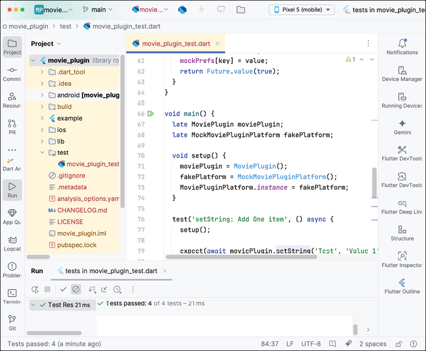
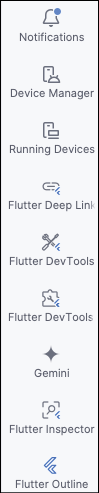
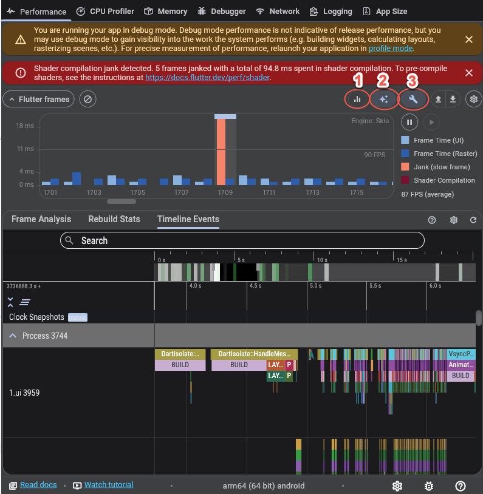
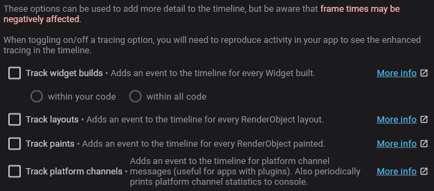
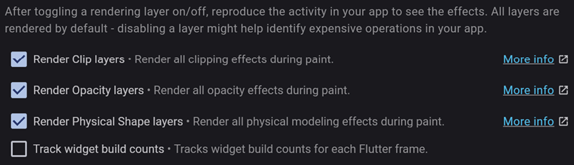
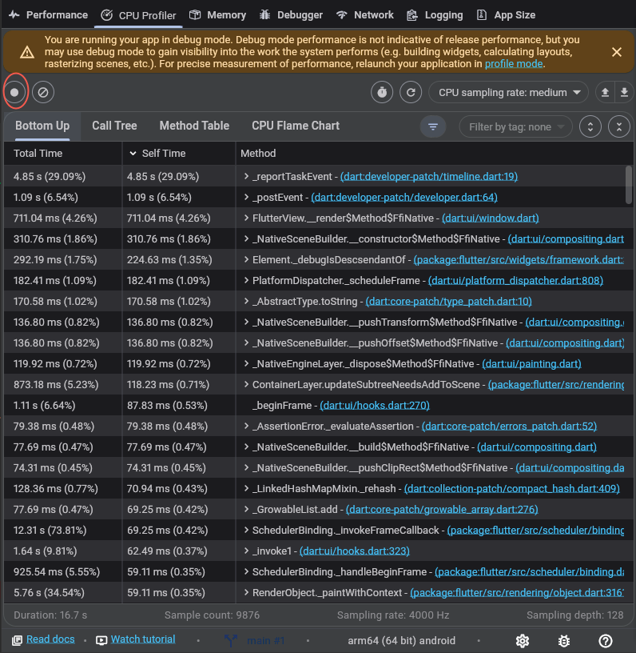
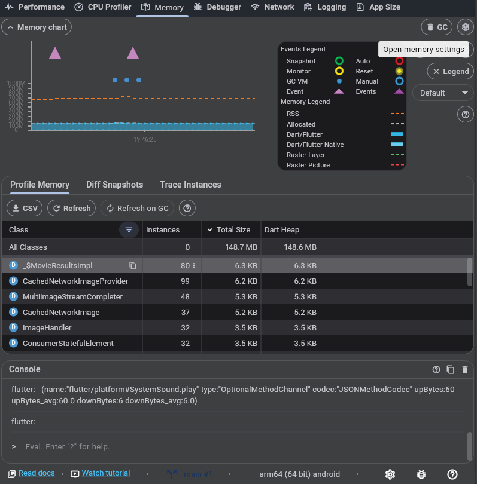
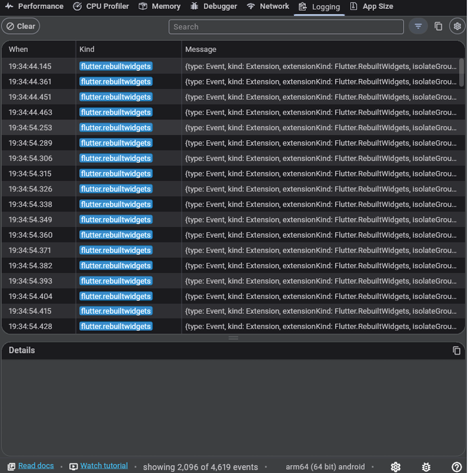

# [CHAPTER 18 Testing and Performance](contents.md#ch18a)

## [Introduction](contents.md#sc2_326a)

Flutter is a very fast framework, and normally, you will not need to worry about performance. However, there are times when parts of your app may show performance problems. In addition, testing your app will ensure that it performs the way you expect and is as fast as you need it to. In this chapter, you will learn about the different types of testing, how to write tests for your app or plugin, how to write UI tests, and how to view performance information. With this information, you can make sure new code does not break existing functionality by monitoring tests and making sure they do not break. You will also be able to find areas in your app that are slowing down parts of your app. Flutter includes a lot of tools for writing tests and measuring your app's performance.

## [Structure](contents.md#sc2_327a)

The chapter covers the following topics:

- Testing
- Unit testing
- Widget testing
- Integration
- Performance

## [Objectives](contents.md#sc2_328a)

By the end of this chapter, you will know about the three different types of testing and how to write those tests. You will know when to write unit tests when to write widget tests, and when to write integration tests. Finally, you will understand how to use Flutter's DevTools to measure performance.

## [Testing](contents.md#sc2_329a)

Testing is a way to make sure your app functions properly and, more importantly, that it will catch changes in your code that break how your app works. Testing helps identify bugs in your code and can even be used in the creation of code. In test-driven development (TDD), you write your tests first before you write your code. While we will not be using this in this chapter, it is a popular way to write code because you have several advantages:

- **Improved code quality**: Testing improves the code you write because it has to be testable.
- **Higher test coverage**: By writing tests first, you ensure you have more tests covering all parts of your app.
- **Higher confidence**: More tests make you more confident that your code will work the way you expect.

The way testing works is:

- **Write a failing test**: Write the test that tests what you want your class to achieve. You will have to write the bare minimum for the class, but with no functionality, it will fail.
- **Fix the failing test**: Write code that causes the test to pass.
- **Refactor**: Clean up the code.
- **Repeat**: Repeat the process for each test.

In Flutter (and other platforms), there are three different types of tests:

- **Unit tests**: Test a single class or method. This will be for testing how a function or class works.
- **Widget tests**: Test a single Flutter widget. This test will ensure the widget performs properly in multiple states. For example, a switch shows that it is on when that state is set and off when the state has been turned off.
- **Integration tests**: Tests parts of an app and the integration of multiple screens. This could be a sign-in screen with dialogs and other screens associated with the sign-in functionality.

One nice feature of tests is that there are mocking libraries that allow you to mock functionality. For example, say you have an API for logging into a system. You may not want to have to log a user in to run a test. By using a mocking library, you can mock the API, and have it return login information or just return that the user is logged in.

## [Unit testing](contents.md#sc2_330a)

Unit tests are usually the easiest to write. They are usually just Dart code and not Flutter. They will test to make sure the function returns the correct value for the different input values. These are usually pretty easy to maintain, but they only test a very small part of your app and only give you confidence in that one function. Unit tests do not test UI but functionality. You could use it to test a view model or classes that perform calculations. All unit tests go in the test folder.

Each test file in the `test/` folder will need to import the `test` package:

```dart
import 'package:test/test.dart';
```

Each test will have a main function. Inside that function, you will usually use the `test` method that takes the name of the test and a function. This looks like:

```dart
testWidgets('<name of test>', (WidgetTester tester) async {
}
```

The testing package contains functions that will test the values of your tests. This is the `expect()` function. This takes the actual value, a matcher, and a reason string that will be printed if it fails. This looks like:

```dart
expect(<actual result>, <what we should get>, 'optional reason why it failed')
```

This is how you make sure your test is producing the correct result. If this fails, the whole test fails. If you perform a computation and that function should always return the same value given a certain input, then if that function changes, your test will fail, and you will either have to fix your function or change the test to reflect the change.

### [Movie plugin unit test](contents.md#sc3_331a)

We will be writing a unit test to test the functionality of the methods of the `MoviePlugin`. While we are not running on an actual device, we need to mock the underlying storage. Mocking is a way to create fake classes that either do nothing or return values that we want them to. This way, we can test the actual class without worrying about the other classes it uses. For the `MoviePlugin` class, we need to mock the `prefs` portion of the plugin. Let us create the movie plugin test:

1. Open the `movie_plugin` project.

2. Add the test dependency. In a terminal type:

    ```shell
    flutter pub add dev:test
    ```

1. In the `test/` folder, create a new file named `movie_plugin_test.dart`.

2. Add the following imports:

    ```dart
    import 'package:test/test.dart';
    import 'package:movie_plugin/movie_plugin.dart';
    import 'package:movie_plugin/movie_plugin_platform_interface.dart';
    import 'package:plugin_platform_interface/plugin_platform_interface.dart';
    ```

1. Create the `MockMoviePluginPlatform` class:

    ```dart
    class MockMoviePluginPlatform
        with MockPlatformInterfaceMixin
        implements MoviePluginPlatform {
      // Add Code Here
    }
    ```

    Note that `MockPlatformInterfaceMixin` is part of Flutter's plugin platform interface.

1. Create a map to store the preferences:

    ```dart
    Map<String, dynamic> mockPrefs = <String, dynamic>{};
    ```

1. Start implementing the methods of the `MoviePluginPlatform` interface:

    ```dart
    @override
    Future clear() {
      mockPrefs.clear();
      return Future.value(true);
    }
    @override
    Future<bool?> containsKey(String key) {
      return Future.value(mockPrefs.containsKey(key));
    }
    ```

    These two methods will clear the map and return the value of the containsKey method of the map.

1. Add the string methods:

    ```dart
    @override
    Future<String?> getString(String key) {
      return Future.value(mockPrefs[key]);
    }
    @override
    Future setString(String key, String value) {
      mockPrefs[key] = value;
      return Future.value(true);
    }
    ```

1. Add the int methods:

    ```dart
    Future<int?> getInt(String key) async {
      return Future.value(mockPrefs[key]);
    }
    @override
    Future setInt(String key, int value) async {
      mockPrefs[key] = value;
      return Future.value(true);
    }
    ``` 

    These methods just use the map to set and retrieve values.

1. Add the Boolean methods:

    ```dart
    @override
    Future<bool?> getBool(String key) async {
      return Future.value(mockPrefs[key]);
    }
    @override
    Future setBool(String key, bool value) async {
      mockPrefs[key] = value;
      return Future.value(true);
    }
    ```

1. Add the double methods:

    ```dart
    @override
    Future<double?> getDouble(String key) async {
      return Future.value(mockPrefs[key]);
    }
    @override
    Future setDouble(String key, double value) async {
      mockPrefs[key] = value;
      return Future.value(true);
    }
    ``` 

    Now that we have the mock class written, let us start writing the tests.

1. Add a `main` function after the `MockMoviePluginPlatform` class:

    ```dart
    void main() {
    }
    ```

1. Add the first test for the `setString` method:

    ```dart
    test('setString: Add One item', () async {
      MoviePlugin moviePlugin = MoviePlugin();
      MockMoviePluginPlatform fakePlatform = MockMoviePluginPlatform();
      MoviePluginPlatform.instance = fakePlatform;
      expect(await moviePlugin.setString('Test', 'Value 1'), true);
    });
    ```

This test creates the `MoviePlugin` class and sets the `MoviePluginPlatform.instance` to our mock platform. We then call the `setString` method and make sure it returns true. This is just a very simple test to make sure we get the expected value back. You will usually want to build your tests up from simple to more complex and make sure you test all conditions that could happen. In writing tests, you will find yourself thinking about different scenarios that could happen with your code. This will help you in writing your code and you may find a test that your code does not cover.

### [Groups](contents.md#sc3_332a)

You can also combine your tests into groups. You would use the group just like the test method by giving it a name and then the function. That function will have multiple test functions. It would look something as follows:

    ```dart
    group('Test All String methods', () {
      test('setString: Add One item', () {
        <Code here>
      });
      test('setString: Add One item and then clear', () {
        <Code here>
      });
      test('setString: Add One item and then get the string', () {
        <Code here>
      });
    });
    ```

1. Click on the green Run button to run the test. You should see:

    

    Figure 18.1: First test

1. Add the next test for the `clear` and `containsKey` functions:

    ```dart
    test('setString: Add One item and then clear', () async {
      MoviePlugin moviePlugin = MoviePlugin();
      MockMoviePluginPlatform fakePlatform = MockMoviePluginPlatform();
      MoviePluginPlatform.instance = fakePlatform;
      expect(await moviePlugin.setString('Test', 'Value 1'), true);
      expect(await moviePlugin.clear(), true);
      expect(await moviePlugin.containsKey('Test'), false);
    });
    ```

    Here, we set the string, clear it, and then make sure that it does not still exist. Try running these tests. What other tests can you think of?

1. Next, test setting the value and verifying that the value exists:

    ```dart
    test('setString: Add One item and then get the string', () async {
      MoviePlugin moviePlugin = MoviePlugin();
      MockMoviePluginPlatform fakePlatform = MockMoviePluginPlatform();
      MoviePluginPlatform.instance = fakePlatform;
      expect(await moviePlugin.setString('Test', 'Value 1'), true);
      expect(await moviePlugin.getString('Test'), 'Value 1');
    });
    ```

    We have tested some strings, but we should test the other types as well. We will test ints. We are starting to see some duplicate code here. You can create other methods for setup.

1. Add some variables and create a new method just under main:

    ```dart
    late MoviePlugin moviePlugin;
    late MockMoviePluginPlatform fakePlatform;
    void setup() {
      moviePlugin = MoviePlugin();
      fakePlatform = MockMoviePluginPlatform();
      MoviePluginPlatform.instance = fakePlatform;
    }
    ```

1. Now replace all this code with:

    ```dart
    setup();
    ```

    Your first test will look like:

    ```dart
    test('setString: Add One item', () async {
      setup();
      expect(await moviePlugin.setString('Test', 'Value 1'), true);
    });
    ```

1. Write the int test:

    ```dart
    test('Test Ints', () async {
      setup();
      expect(await moviePlugin.setInt('IntKey', 1), true);
      expect(await moviePlugin.getInt('IntKey'), 1);
      expect(await moviePlugin.containsKey('IntKey'), true);
      expect(await moviePlugin.clear(), true);
      expect(await moviePlugin.containsKey('IntKey'), false);
    });
    ```

The other tests are left as an exercise for you.

## [Widget testing](contents.md#sc2_333a)

As the name implies, widget testing involves testing just one widget at a time. These tests are still in the `test` folder and run in memory on the development machine and not on a real device. This makes these tests very fast. Luckily, there is the `flutter_test` package provided by Flutter. This package provides the `WidgetTester` class and the `testWidgets` function, which provides a `WidgetTester` for each test. It also provides `Finder` classes for searching for widgets. Then, you will use `Matcher` constants to verify the widget. You will need to import the `flutter_test` package. You should already have it in `pubspec.yaml`, but it will be in the `dev_dependencies` section and look as follows:

```yaml
dev_dependencies:
  flutter_test:
    sdk: flutter
```

With the `WidgetTester` class, there are a few important methods. For testing widgets, the `pumpWidget` method will display your widget. There is also a `pumpAndSettle` method that will wait for all animations to finish, and there are no more frames to display. Once you have your widget displayed, you need to find it and test it to make sure it is displayed the way you expect. Flutter provides the `Finder` class that has many methods for finding widgets. A few important methods:

- `text`: Find a `Text`, `EditableText`, or `RichText` widget with the given text.
- `textContaining`: Find the Pattern of text in the above widgets.
- `widgetWithText`: Look for descendants that are of type `Text` with the given text string.
- `image`: Find an image.
- `byKey`: Find a widget with the given key.
- `bySubtype`: Find a widget by sub-type, that is, `StatefulWidget` will find all classes that subclass it.
- `byType`: Find widgets of a certain type.
- `byIcon`, `widgetWithIcon`: Finds a widget containing an icon.
- `byTooltip`: finds widgets with the given tooltip text.

There are also several methods that let you search through all widgets and make a decision on each widget. One of the most important methods is the `byWidgetPredicate`. Here is a helper method you can use:

```dart
Finder findWidgetOfType(Type type) {
  final finder = find.byWidgetPredicate((widget) {
    if (widget.runtimeType == type) {
      return true;
    }
    return false;
  });
  return finder;
}
```

The callback receives a widget, and it checks to see if the `runtimeType` is of a given type. There are many ways can create helper functions to search for widgets of your making.

Once you find the widget you are looking for, you will use the expect method with the following matcher types:

- `findsOneWidget`: Asserts that there is only one widget found.
- `findsNothing`: Asserts that no widget was found.
- `findsWidgets`: Asserts that at least one widget was found.

### [First widget test](contents.md#sc3_334a)

Since we have several widgets that we have built over time, they are great candidates for testing. To start creating a widget test, the steps are as follows:

1. Open up the `movies` project.

2. In the `test` folder, create a new file named `widget_tests.dart`.

3. Add the following imports and the main function:

    ```dart
    import 'package:flutter/material.dart';
    import 'package:flutter_test/flutter_test.dart';
    import 'package:movies/ui/widgets/text_icon.dart';
    void main() {
    }
    ```

1. Add the first test for testing the `TextIcon` widget:

    ```dart
    testWidgets('Test TextIcon', (WidgetTester tester) async {
      await tester.pumpWidget(TextIcon(
        text: const Text('Test'),
        icon: IconButton(
          onPressed: () {},
          icon: const Icon(
            Icons.favorite_outlined,

            size: 24,
          )),
      ));
      final textFinder = find.text('Test');
      expect(textFinder, findsOneWidget);
    });
    ```

1. Try running the test. You should see an error. In the case of the `TextIcon` widget, the `IconButton` requires the `MaterialApp` or `WidgetsApp` to be the parent. Modify the `pumpWidget`:

    ```dart
    await tester.pumpWidget(MaterialApp(home: TextIcon(
      text: const Text('Test'),
      icon: IconButton(
        onPressed: () {},
        icon: const Icon(
          Icons.favorite_outlined,
          size: 24,
        )),
    )));
    ```

1. Now, try running, and your test will pass.

    Another simple test is to add a search for the icon.

1. After the expected, add the following:

    ```dart
    final iconFinder = find.byIcon(Icons.favorite_outlined);
    expect(iconFinder, findsOneWidget);
    ```

1. Run the test again.

    The next test will be a bit more complex. We want to test the `ButtonRow` widget. To do that, we need to display the widget and tap on the favorite icon. Create a new test in the same file:

1. Add the new test:

    ```dart
    testWidgets('Test ButtonRow', (WidgetTester tester) async {
      await tester.pumpWidget(MaterialApp(home: ButtonRow(favoriteSelected: true, onFavoriteSelected: () {
      },
      ));
    ```

    This test is for the `ButtonRow` widget that we want to test by pressing the favorite button. We do not need to handle the favorite callback.

1. Next, find the Favorite button and make sure it exists:

    ```dart
    final textFinder = find.text('Favorite');
    expect(textFinder, findsOneWidget);
    ```

1. Now find the `TextIcon` by finding the ancestor of the `Text` widget and then the icon button by finding the descendant of that widget:

    ```dart
    final textIconFinder = find.ancestor(of: textFinder, matching: find.byType(TextIcon));
    final iconButton = find.descendant(of: textIconFinder, matching: find.byType(IconButton));
    expect(iconButton, findsOneWidget);
    ```

1. Now find the Icon under that and make sure it is white:

    ```dart
    var iconFinder = find.descendant(of: iconButton, matching: find.byType(Icon));
    var icon = tester.widget(iconFinder);
    expect((icon as Icon).color, Colors.white);
    ```

    The `tester.widget` method is useful for getting the actual widget. This way we can test the color of the widget.

1. Now tap the button, wait for the animation to finish, and make sure the icon is red.

    ```dart
    await tester.tap(iconButton);
    await tester.pump(const Duration(seconds: 3));
    await tester.idle();
    iconFinder = find.descendant(of: iconButton, matching: find.byType(Icon));
    icon = tester.widget(iconFinder);
    expect(icon.color, Colors.red);
    ```

1. Run the test to make sure it passes.

These are two examples of testing a widget. As you may have noticed, you will not see the test on your device. To do that, we will move on to integration testing.

## [Integration testing](contents.md#sc2_335a)

So far, we have just tested the code and individual widgets. To test your app, you need to run integration tests. This runs your app on a device and allows you to interact with the screen as well as navigate to other screens. Usually, you will test the functionality of a specific area. For example, you could test a sign-in page. You would have a test user that you can use to sign in and verify that the user successfully signed in. You could also test entering invalid data and see how the UI responds.

> Note: If you read articles about navigating flutter_driver, that is an older technology and should not be used.

One area that would be good to test is movie loading and scrolling. The `MovieListing` class does some complex paging. What if we could run a test that navigates to the `MovieListing` page and scrolls several pages' worth of data? To do this, we will create an integration test that sets up the app, similar to the way it does in `main.dart`, and then run a `testWidgets` function. We will then start the `MainApp`, click on the first More button, go to the `MovieListing` screen, and then scroll several pages and verify that the page list contains a certain amount of items. This is a bit complex, so we will step through each part:

1. Create a new folder at the top level named `integration_test`.

2. Create a new file named `movie_tests.dart`.

3. Add the following imports:

    ```dart
    import 'package:colorize_lumberdash/colorize_lumberdash.dart';
    import 'package:firebase_core/firebase_core.dart';
    import 'package:flutter/material.dart';
    import 'package:flutter_dotenv/flutter_dotenv.dart';
    import 'package:flutter_riverpod/flutter_riverpod.dart';
    import 'package:flutter_test/flutter_test.dart';
    import 'package:infinite_scroll_pagination/infinite_scroll_pagination.dart';
    import 'package:integration_test/integration_test.dart';
    import 'package:lumberdash/lumberdash.dart';
    import 'package:movie_data/movie_data.dart';
    import 'package:movies/firebase_options.dart';
    import 'package:movies/main.dart';
    import 'package:movies/ui/screens/home/title_row.dart';
    import 'package:movies/ui/widgets/movie_row.dart';
    import 'package:movies/utils/utils.dart';
    ```

    These will be the imports needed for the test.

1. Add the main function and the initialization (this looks just like the main, except we are not using Crashlytics). Add the main function:

    ```dart
    void main() async {
      final binding = IntegrationTestWidgetsFlutterBinding.ensureInitialized();
      binding.framePolicy = LiveTestWidgetsFlutterBindingFramePolicy.fullyLive;
      WidgetsFlutterBinding.ensureInitialized();
      putLumberdashToWork(withClients: [ColorizeLumberdash()]);
      await Firebase.initializeApp(
        options: DefaultFirebaseOptions.currentPlatform,
      );
      if (!isWeb()) {
        await dotenv.load(fileName: '.env');
      }
      // TODO Add Test
    }
    ```

    This is the same code as in the `main` function except for the first two lines.

1. Replace the `TODO` with the test:

    ```dart
    testWidgets('Test scrolling the Movie Listing', (tester) async {
      // Build our app and trigger a frame.
      await tester.pumpWidget(const ProviderScope(child: MainApp()));
    });
    ```

1. After the `pumpWidget`, add code to find the more button:

    ```dart
    await tester.pumpAndSettle(const Duration(seconds: 1));

    final moreButtonFinder = find.byType(TitleRow);
    expect(moreButtonFinder, findsAtLeast(1));
    ```

    This waits for the app to load, finds the `TitleRow`, and asserts that at least one was found.

1. Add the code to find the first `More` button and tap on it:

    ```dart
    final firstMoreButton = moreButtonFinder.first;
    final textButtonFinder = find.descendant(
      of: firstMoreButton,
      matching: find.byType(TextButton),
    );
    await tester.tap(textButtonFinder);
    await tester.pumpAndSettle(const Duration(seconds: 1));
    ```

    This finds the first `More` button (there are several) and then finds the `TextButton` inside of it. It then taps on that button.

1. Open `movie_listing.dart` and add a scrolling controller. This is needed for our test. After the `_pagingController`, add the following:

    ```dart
    final _scrollController = ScrollController();
    ```

1. Before the `state` in the `PagedListView`, add the following:

    ```dart
    scrollController: _scrollController,
    ```

1. Back in `movie_tests`, find the Movie Listing (a `PagedListView`) and get the paging and scrolling controllers:

    ```dart
    final movieListFinder = find.byType(PagedListView<int, MovieResults>);
    expect(movieListFinder, findsOneWidget);
    final movieList = tester.widget(movieListFinder);
    final controller = (movieList as PagedListView).controller;

    final pagingControllerFinder = find.byType(
      PagingListener<int, MovieResults>,
    );
    expect(pagingControllerFinder, findsOneWidget);
    final pagingController =
        (tester.widget(pagingControllerFinder)
                as PagingListener<int, MovieResults>)
            .controller;
    ```

1. Next, get the first `MovieRow` and figure out its height and then what a page of `MovieRow` heights are:

    ```dart
    final renderRow =
        tester.renderObject(find.byType(MovieRow).first) as RenderBox;
    final rowHeight = renderRow.size.height;
    final pageHeight = rowHeight * 20; // 20 items/page
    var currentPosition = pageHeight;
    ```

1. Scroll five times, and then make sure we have 120 items. (6x20)

    ```dart
    for (var i = 0; i < 5; i++) {
      controller?.jumpTo(currentPosition);
      currentPosition += pageHeight;
      await tester.pumpAndSettle(const Duration(milliseconds: 500));
    }
    await tester.pumpAndSettle(const Duration(seconds: 1));
    expect(pagingController.items?.length, 120);
    ```

    This uses the paging controllers itemList to check how many items have been loaded.

1. Run the test and make sure it works.

> Note: You may need to do `flutter clean` and `flutter pub get` commands to get the tests to work.

## [Performance](contents.md#sc2_336a)

Now that you have your app written, it is time to think about performance. How does it perform starting up? How much time does it take to transition to other pages? Are certain actions taking too long? If your app is on the market, are customers complaining about something taking too long? Flutter itself is fast, drawing at 60 frames per second, but there are a number of ways you can accidentally slow that down. Slow loading times, unresponsiveness, and increased battery consumption will cause users to abandon your app.

### [Widget tree](contents.md#sc3_337a)

You can slow your screen down by having overly complex widget trees (the set of widgets that make up your screen). You can also slow it down by not breaking your screen into individual widgets. In other words, instead of one long build method, breaking sections into their own widget class. This causes Flutter to optimize drawing and not redraw widgets that do not need to be drawn. If you have one long build method and you call `setState`, the whole tree will need to be redrawn. Using large images can also slow things down as well. Using stateless widgets is faster as well. Try and use them if you do not have any state. Also, do not do any background tasks in the UI. Minimize the use of clipping as that can affect rendering performance. Make sure you follow the recommended lint warnings and make as many widgets constant as possible.

### [DevTools](contents.md#sc3_338a)

One of the best tools for measuring performance is Flutter's DevTools. It provides the following tools:

- `Performance view`: Timing and performance information.
- `CPU profiler`: Record and profile a session.
- `Memory profiler`: Analyze memory usage.
- `Debugger`: Set breakpoints, check the console, and call stack.
- `Network`: View network calls. Shows methods and duration.
- `Logging`: Shows logging information.
- `App size`: Analyze app snapshots.

You can access these tools from the right side of Android Studio, as shown in the following figure:



Figure 18.2: Tools

This is a suite of developer tools as shown in the following figure:



Figure 18.3: Performance tools

This is the Performance tab. There are many things you can do on this page. Pressing button number, one overlays the performance graph on the app. Pressing number two brings up another dialog for adding more options:



Figure 18.4: Performance options

Pressing number three opens up options for rendering:



Figure 18.5: Rendering options

The next tab is the CPU Profiler:



Figure 18.6: CPU Profiler

Pressing the circled button will start recording. Once you press the button again, it will show you details. This will show you the time and percentage each task took. Most of these will be Flutter The next tab shows the memory usage of all the classes. You can sort and filter to see how much memory your classes are taking. As you can see here, images will usually take up most of your memory. The CPU flame chart is a nice way to see:



Figure 18.7: Memory

Skipping the Debugger tab, we next have the Network tab. This shows all of the API calls you make as well as calls to retrieve images and videos.

.png)

Figure 18.8: Networking

You can see the status of the network call (200 is a success), the type, and the time it took to get the value. Here we have some images, and you can see how long it took to download. Luckily, we use the `CachedNetworkImage` package that will cache that image and not download it again.

Next is the Logging tab. The author prefers using Android Studio's console and using their own logging. This shows more system logs:



Figure 18.9: Logging

Take some time to get to know these tabs and see what you can learn about the app.

## [Conclusion](contents.md#sc2_339a)

In this chapter, you have learned how to write three different kinds of tests. Unit tests for business logic, widget tests for your individual widgets, and integration tests for your full app. This will help you make sure your app works the way it should and does not regress when you make changes. Finally, you learned how to view the performance of your app and use the tools Flutter provides to see what is happening with your app and where there are performance bottlenecks. In the next chapter, you will learn how to build and publish your app to the Google Play Store and the Apple App Store.
