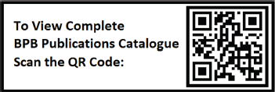

# Copyright

First Edition 2025

Copyright © BPB Publications, India

ISBN: 978-93-65899-177

All Rights Reserved. No part of this publication may be reproduced, distributed or transmitted in any form or by any means or stored in a database or retrieval system, without the prior written permission of the publisher with the exception to the program listings which may be entered, stored and executed in a computer system, but they can not be reproduced by the means of publication, photocopy, recording, or by any electronic and mechanical means.

LIMITS OF LIABILITY AND DISCLAIMER OF WARRANTY

The information contained in this book is true to correct and the best of author’s and publisher’s knowledge. The author has made every effort to ensure the accuracy of these publications, but publisher cannot be held responsible for any loss or damage arising from any information in this book.

All trademarks referred to in the book are acknowledged as properties of their respective owners but BPB Publications cannot guarantee the accuracy of this information.

[www.bpbonline.com](https://www.bpbonline.com)
