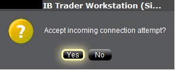
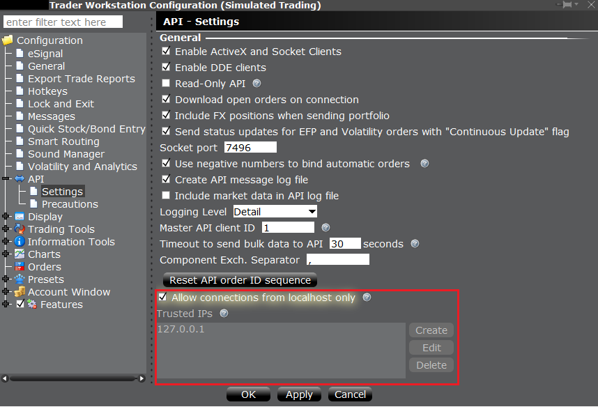

# TWS API Documentation / TWS API 文档

## Connectivity / 连接

A socket connection between the API client application and TWS is established with the IBApi.EClientSocket.eConnect function. TWS acts as a server to receive requests from the API application (the client) and responds by taking appropriate actions. The first step is for the API client to initiate a connection to TWS on a socket port where TWS is already listening. It is possible to have multiple TWS instances running on the same computer if each is configured with a different API socket port number. Also, each TWS session can receive up to 32 different client applications simultaneously. The client ID field specified in the API connection is used to distinguish different API clients.

在 API 客户端应用程序和 TWS 之间通过 IBApi.EClientSocket.eConnect 函数建立套接字连接。TWS 作为服务器接收来自 API 应用程序（客户端）的请求，并通过采取适当的操作进行响应。第一步是 API 客户端在 TWS 已经监听的套接字端口上发起连接。如果每个 TWS 实例都配置了不同的 API 套接字端口号，则可以在同一台计算机上运行多个 TWS 实例。此外，每个 TWS 会话可以同时接收最多 32 个不同的客户端应用程序。API 连接中指定的客户端 ID 字段用于区分不同的 API 客户端。

### Establishing an API connection / 建立 API 连接

Once our two main objects have been created, EWrapper and ESocketClient, the client application can connect via the IBApi.EClientSocket object:

一旦我们的两个主要对象 EWrapper 和 ESocketClient 创建完成，客户端应用程序可以通过 IBApi.EClientSocket 对象连接：

=== "Python"

    ```python
    app.connect("127.0.0.1", args.port, clientId=0)
    ```

eConnect starts by requesting from the operating system that a TCP socket be opened to the specified IP address and socket port. If the socket cannot be opened, the operating system (not TWS) returns an error which is received by the API client as error code 502 to IBApi.EWrapper.error (Note: since this error is not generated by TWS it is not captured in TWS log files). Most commonly error 502 will indicate that TWS is not running with the API enabled, or it is listening for connections on a different socket port. If connecting across a network, the error can also occur if there is a firewall or antivirus program blocking connections, or if the router’s IP address is not listed in the “Trusted IPs” in TWS.

eConnect 函数首先请求操作系统打开一个到指定 IP 地址和端口的 TCP 套接字。如果套接字无法打开，操作系统（而非 TWS）会返回一个错误，API 客户端会将其作为错误代码 502 接收，并传递给 IBApi.EWrapper.error（注意：由于这个错误不是由 TWS 生成的，因此不会记录在 TWS 日志文件中）。通常情况下，错误代码 502 表示 TWS 未启用 API，或者它正在监听不同的套接字端口。如果通过网络连接，如果存在防火墙或杀毒软件阻止连接，或者路由器的 IP 地址未列在 TWS 的“受信任的 IP”中，也可能出现此错误。

After the socket has been opened, there must be an initial handshake in which information is exchanged about the supported version of the TWS and API to ensure each platform can interpret received messages correctly.

套接字打开后，必须进行初始握手，交换有关 TWS 和 API 支持版本的信息，以确保每个平台能够正确解释接收到的消息。

- For this reason it is important that the main EReader object is not created until after a connection has been established. The initial connection results in a negotiated common version between TWS and the API client which will be needed by the EReader thread in interpreting subsequent messages.

    因此，主 EReader 对象必须在建立连接之后才能创建。初始连接会导致 TWS 和 API 客户端之间协商一个公共版本，这个版本将供 EReader 线程解释后续消息时使用。

After the highest version number which can be used for communication is established, TWS will return certain pieces of data that correspond specifically to the logged-in TWS user’s session. This includes (1) the account number(s) accessible in this TWS session, (2) the next valid order identifier (ID), and (3) the time of connection. In the most common mode of operation the EClient.AsyncEConnect field is set to false and the initial handshake is taken to completion immediately after the socket connection is established. TWS will then immediately provides the API client with this information.

在确定可用于通信的最高版本号后，TWS 将返回与登录的 TWS 用户会话相对应的一些数据。这包括 (1) 此 TWS 会话中可访问的账户号码，(2) 下一个有效的订单标识符 (ID)，以及 (3) 连接时间。在最常见的操作模式下，EClient.AsyncEConnect 字段被设置为 false，并且初始握手在套接字连接建立后立即完成。TWS 将立即向 API 客户端提供这些信息。

- Important: The **IBApi.EWrapper.nextValidID** callback is commonly used to indicate that the connection is completed and other messages can be sent from the API client to TWS. There is the possibility that function calls made prior to this time could be dropped by TWS.

    重要提示：**IBApi.EWrapper.nextValidID** 回调通常用于指示连接完成，并且 API 客户端可以向 TWS 发送其他消息。在此时间之前进行的函数调用可能会被 TWS 丢弃。

There is an alternative, deprecated mode of connection used in special cases in which the variable AsyncEconnect is set to true, and the call to startAPI is only called from the connectAck() function. All IB samples use the mode AsyncEconnect = False.

### Verify API Connection / 验证 API 连接

A user can verify whether their API session is connected at any point with the EClient.isConnected() function.

用户可以通过 EClient.isConnected()函数在任何时刻验证其 API 会话是否已连接。

=== "Python"

    ```python
    print(app.isConnected())
    ```

eConnect starts by requesting from the operating system that a TCP socket be opened to the specified IP address and socket port. If the socket cannot be opened, the operating system (not TWS) returns an error which is received by the API client as error code 502 to IBApi.EWrapper.error (Note: since this error is not generated by TWS it is not captured in TWS log files). Most commonly error 502 will indicate that TWS is not running with the API enabled, or it is listening for connections on a different socket port. If connecting across a network, the error can also occur if there is a firewall or antivirus program blocking connections, or if the router’s IP address is not listed in the “Trusted IPs” in TWS.

eConnect 首先请求操作系统打开一个到指定 IP 地址和套接字端口的 TCP 套接字。如果套接字无法打开，操作系统（不是 TWS）会返回一个错误，API 客户端将其作为错误代码 502 接收，传递给 IBApi.EWrapper.error（注意：由于此错误不是由 TWS 生成的，因此不会记录在 TWS 日志文件中）。最常见的情况是，错误 502 表示 TWS 未启用 API 运行，或者它正在监听不同的套接字端口。如果通过网络连接，如果防火墙或杀毒软件阻止连接，或者路由器的 IP 地址未列在 TWS 的“受信任的 IP”中，也可能出现此错误。

After the socket has been opened, there must be an initial handshake in which information is exchanged about the supported version of the TWS and API to ensure each platform can interpret received messages correctly.

在套接字打开后，必须进行初始握手，交换有关 TWS 和 API 支持的版本信息，以确保每个平台能够正确解释接收到的消息。

- For this reason it is important that the main EReader object is not created until after a connection has been established. The initial connection results in a negotiated common version between TWS and the API client which will be needed by the EReader thread in interpreting subsequent messages.

    因此，主 EReader 对象必须在建立连接后才能创建。初始连接将使 TWS 和 API 客户端之间协商一个共同版本，该版本将供 EReader 线程解释后续消息。

After the highest version number which can be used for communication is established, TWS will return certain pieces of data that correspond specifically to the logged-in TWS user’s session. This includes (1) the account number(s) accessible in this TWS session, (2) the next valid order identifier (ID), and (3) the time of connection. In the most common mode of operation the EClient.AsyncEConnect field is set to false and the initial handshake is taken to completion immediately after the socket connection is established. TWS will then immediately provides the API client with this information.

在确定可用于通信的最高版本号后，TWS 将返回与登录的 TWS 用户会话相对应的某些数据。这包括（1）在此 TWS 会话中可访问的账户号码，（2）下一个有效订单标识符（ID），以及（3）连接时间。在最常见的操作模式下，EClient.AsyncEConnect 字段设置为 false，初始握手在套接字连接建立后立即完成。TWS 将立即向 API 客户端提供这些信息。

- Important: The **IBApi.EWrapper.nextValidID** callback is commonly used to indicate that the connection is completed and other messages can be sent from the API client to TWS. There is the possibility that function calls made prior to this time could be dropped by TWS.

    重要提示：**IBApi.EWrapper.nextValidID** 回调通常用于指示连接完成，并且 API 客户端可以向 TWS 发送其他消息。在此之前发起的函数调用可能会被 TWS 丢弃。

### The EReader Thread / EReader 线程

API programs always have at least two threads of execution. One thread is used for sending messages to TWS, and another thread is used for reading returned messages. The second thread uses the API EReader class to read from the socket and add messages to a queue. every time a new message is added to the message queue, a notification flag is triggered to let other threads know that there is a message waiting to be processed. In the two-thread design of an API program, the message queue is also processed by the first thread. In a three-thread design, an additional thread is created to perform this task.
The thread responsible for the message queue will decode messages and invoke the appropriate functions in EWrapper. The two-threaded design is used in the IB Python sample Program.py and the C++ sample TestCppClient, while the ‘Testbed’ samples in the other languages use a three-threaded design. Commonly in a Python asynchronous network application, the asyncio module will be used to create a more sequential looking code design.

API 程序始终至少有两个执行线程。一个线程用于向 TWS 发送消息，另一个线程用于读取返回的消息。第二个线程使用 API 的 EReader 类从套接字读取并添加消息到队列中。每当有新消息添加到消息队列时，会触发一个通知标志，让其他线程知道有消息等待处理。在 API 程序的两线程设计中，消息队列也由第一个线程处理。在三线程设计中，会创建一个额外的线程来执行这个任务。负责消息队列的线程会解码消息并调用 EWrapper 中的适当函数。两线程设计用于 IB Python 示例 Program.py 和 C++ 示例 TestCppClient，而其他语言的“Testbed”示例则使用三线程设计。在 Python 异步网络应用程序中，通常使用 asyncio 模块来创建更顺序化的代码设计。

The class which has functionality for reading and parsing raw messages from TWS is the IBApi.EReader class.

用于读取和解析从 TWS 接收的原始消息的类是 IBApi.EReader 类。

#### C++, C#, and Java Implementations / C++、C# 和 Java 实现

#### Python Implementation / Python 实现

In Python IB API, the EReader logic is handled in the EClient.connect so the EReader thread is automatically started upon connection. There is **no need** for user to start the reader.

在 Python IB API 中，EReader 逻辑在 EClient.connect 中处理，因此 EReader 线程在连接时自动启动。用户**无需**启动读取器。

Once the client is connected, a reader thread will be automatically created to handle incoming messages and put the messages into a message queue for further process. User **is required** to trigger Client::run() below, where the message queue is processed in an infinite loop and the EWrapper call-back functions are automatically triggered.

一旦客户端连接成功，将自动创建一个读取线程来处理接收到的消息，并将消息放入消息队列以供进一步处理。用户**需要**触发 Client::run()，在该函数中，消息队列将在无限循环中处理，并且 EWrapper 回调函数将自动被触发。

Now it is time to revisit the role of IBApi.EReaderSignal initially introduced in The EClientSocket Class. As mentioned in the previous paragraph, after the EReader thread places a message in the queue, a notification is issued to make known that a message is ready for processing. In the Python API, this is handled automatically by the Queue class.

现在，让我们重新审视 IBApi.EReaderSignal 的作用，该作用最初在 EClientSocket 类中介绍。如前所述，在 EReader 线程将消息放入队列后，会发出通知，以告知有消息准备好进行处理。在 Python API 中，这由 Queue 类自动处理。

### Remote TWS API Connections with Trader Workstation / 远程 TWS API 连接与交易工作台

If you want to connect TWS/ IB Gateway from a remote server, uncheck the “Allow connection from localhost only” setting. Under the “Trusted IPs” section, click “Create” and enter the IP Address detected in “Accept incoming connection attempt from ``<IP Address>``” into “Trusted IPs”.

如果您想从远程服务器连接 TWS/IB Gateway，请取消选中“仅允许从本地主机连接”设置。在“受信任的 IP 地址”部分，点击“创建”，并将“接受来自 ``<IP 地址>`` 的入站连接尝试”中检测到的 IP 地址输入到“受信任的 IP 地址”。

“Trusted IPs” does not accept subnet (e.g. /27, /28). It only accepts single IP Addresses. In the following example, there is a remote computing cluster /27 which has 32 IP Addresses and the remote computing cluster will randomly assign one of the computing nodes to connect to TWS in every connection.  To make this happen, every Private IPv4 Address of the subnet are put into the “Trusted IPs” (You can also exclude the first IP Network Address and the last IP Broadcast Address of the subnet).

“受信任的 IP 地址”不接受子网（例如/27、/28）。它只接受单个 IP 地址。在以下示例中，有一个/27 的远程计算集群，该集群有 32 个 IP 地址，每次连接时，远程计算集群会随机分配其中一个计算节点连接到 TWS。为了实现这一点，子网中的每个私有 IPv4 地址都被放入“受信任的 IP 地址”（你也可以排除子网中的第一个 IP 网络地址和最后一个 IP 广播地址）。


### Accepting an API connection from TWS / 接受来自 TWS 的 API 连接

For security reasons, by default the API is not configured to automatically accept connection requests from API applications. After a connection attempt, a dialogue will appear in TWS asking the user to manually confirm that a connection can be made:

出于安全原因，默认情况下 API 不会配置为自动接受来自 API 应用程序的连接请求。连接尝试后，TWS 会弹出一个对话框，要求用户手动确认是否可以建立连接：

Untrusted IPs attempting to make a connection will be denied without prompting.

尝试建立连接的不受信任的 IP 地址将不会收到提示而被拒绝。



To prevent the TWS from asking the end user to accept the connection, it is possible to configure it to automatically accept the connection from a trusted IP address and/or the local machine. This can easily be done via the TWS API settings:

为了阻止 TWS 要求最终用户确认是否接受连接，可以将其配置为自动接受来自受信任的 IP 地址和/或本地计算机的连接。这可以通过 TWS API 设置轻松完成：



### Logging into multiple applications / 登录到多个应用程序

It is not possible to login to multiple trading applications simultaneously with the same username. However, it is possible to create additional usernames for an account that can be used in different trading applications simultaneously, as long as there is not more than a single trading application logged in with a given username at a time. There are some additional cases in which it is also useful to create additional usernames:

使用同一个用户名无法同时登录多个交易应用程序。但是，可以为同一个账户创建多个用户名，这些用户名可以同时用于不同的交易应用程序，只要在任何时候只有一个交易应用程序使用给定的用户名登录即可。在某些其他情况下，创建多个用户名也非常有用：

- If TWS or IBGW is logged in with a username that is used to login to Client Portal during that session, that application will not be able to automatically reconnect to the server after the next disconnection (such as the server reset).

    如果在会话期间使用用于登录 Client Portal 的用户名登录 TWS 或 IBGW，那么在下次断开连接后（例如服务器重置），该应用程序将无法自动重新连接到服务器。

- A TWS or IBGW session logged into a paper trading account will not to receive market data if it is sharing data from a live user which is used to login to Client Portal.

    登录模拟交易账户的 TWS 或 IBGW 会话，如果它正在共享用于登录 Client Portal 的实时用户的数据，则将无法接收市场数据。

If a different username is utilized to login to Client Portal in either of these cases, then it will not affect the TWS/IBGW session.

如果在这两种情况下使用不同的用户名登录 Client Portal，那么它不会影响 TWS/IBGW 会话。

[How to add additional usernames in Account Management](https://www.ibkrguides.com/clientportal/uar/addingauser.htm)

[如何在账户管理中添加其他用户名](https://www.ibkrguides.com/clientportal/uar/addingauser.htm)

- It is important to note that market data subscriptions are setup independently for each live username.

    需要注意的是，市场数据订阅是针对每个实时用户名独立设置的。

### Broken API socket connection / API 套接字连接中断

If there is a problem with the socket connection between TWS and the API client, for instance if TWS suddenly closes, this will trigger an exception in the EReader thread which is reading from the socket. This exception will also occur if an API client attempts to connect with a client ID that is already in use.

如果 TWS 与 API 客户端之间的套接字连接出现问题，例如 TWS 突然关闭，这将触发正在从套接字读取的 EReader 线程中的异常。如果 API 客户端尝试使用一个已经正在使用的客户端 ID 进行连接，也会发生此异常。

The socket EOF is handled slightly differently in different API languages. For instance in Java, it is caught and sent to the client application to IBApi::EWrapper::error with errorCode 507: “Bad Message”. In C# it is caught and sent to IBApi::EWrapper::error with errorCode -1. The client application needs to handle this error message and use it to indicate that an exception has been thrown in the socket connection.

不同 API 语言对套接字 EOF 的处理方式略有不同。例如在 Java 中，它会被捕获并发送到客户端应用程序的 IBApi::EWrapper::error，错误码为 507："Bad Message"。在 C#中，它会被捕获并发送到 IBApi::EWrapper::error，错误码为-1。客户端应用程序需要处理此错误消息，并使用它来指示套接字连接中发生了异常。

Clients can validate a broken connection with the EWrapper.connectionClosed and EClient.isConnected functions.

客户端可以使用 EWrapper.connectionClosed 和 EClient.isConnected 函数来验证连接是否中断。

Once a connection fails for any reason, the EWrapper.connectionClosed function will be called. This function can be used to build reconnection logic or affirm a system disconnect.

一旦连接因任何原因失败，EWrapper.connectionClosed 函数将被调用。此函数可用于构建重连逻辑或确认系统断开连接。

=== "Python"

    ```python
    def connectClosed(self):
        print("API Connection Lost.")
    ```
