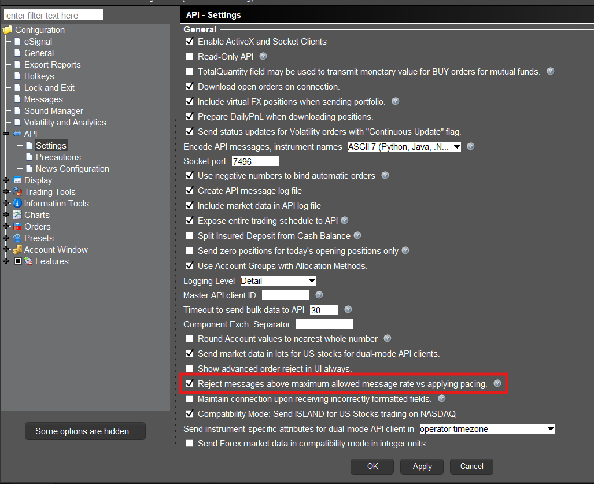

# TWS API Documentation / TWS API 文档

## Pacing Limitations / 节流限制

Pacing Limitations with regards to the TWS API are based on the number of requests submitted by a client connection. A “request” is a user-submitted query to retrieve some form of data.

TWS API 的节流限制基于客户端连接提交的请求数量。"请求"是指用户提交的用于获取某种数据的查询。

An example of a request is a query to retrieve [live watchlist data](https://www.interactivebrokers.com/campus/ibkr-api-page/twsapi-doc/#watchlist-data). While you may make a single request for market data, you will receive market data until the subscription is cancelled or your session is disconnected. Only the original request to begin the flow of data will contribute to the pacing limitation.

一个请求的例子是查询[实时监控列表数据](https://www.interactivebrokers.com/campus/ibkr-api-page/twsapi-doc/#watchlist-data)。虽然你可以对市场数据发起单个请求，但你将一直接收市场数据，直到订阅被取消或会话断开连接。只有开始数据流的原初请求才会计入节流限制。

The maximum number of API requests that can be submitted are equivalent to your Maximum Market Data Lines divided by 2, per second.

每秒可提交的 API 请求最大数量等于您的最大市场数据线路数除以 2。

By default, all users maintain 100 market data lines. Therefore, users have a pacing limitation of (100/2)= 50 requests per second.

默认情况下，所有用户保持 100 条市场数据线路。因此，用户的请求速度限制为（100/2）= 50 次每秒。

Clients that have increased their market data lines to 200, by way of commission or Quote Booster Subscription, would receive (200/2)= 100 requests per second, and this would increment as your market data lines increase or decrease.

通过佣金或报价增强订阅将市场数据线路增加到 200 的用户，将获得（200/2）= 100 次每秒的请求速度，并且随着市场数据线路的增加或减少，这一限制也会相应变化。

In some use cases, if you plan to send more than 50 requests per second, some orders may be queued and delayed. For this scenario, please consider switching to FIX API.

在某些使用场景中，如果您计划每秒发送超过 50 次请求，一些订单可能会排队并延迟。针对这种情况，请考虑切换到 FIX API。

For FIX API users in IB Gateway, the limitation is 250 messages per second.

对于 IB Gateway 中的 FIX API 用户，限制为每秒 250 条消息。

For FIX API users without using IB Gateway or TWS, there is no limitation on messages per second, but less is better.

对于不使用 IB Gateway 或 TWS 的 FIX API 用户，每秒消息数量没有限制，但越少越好。

### Pacing Behavior / 节流行为

The TWS API supports two formats for users who break the pacing limitations. This behavior is set in the Global Configuration of Trader Workstation or IB Gateway. Under “API” and then “Settings” users will see a setting for “Reject messages above maximum allowed message rate vs applying pacing.”

TWS API 支持两种格式供用户突破速率限制。此行为在 TWS 或 IB Gateway 的全局配置中设置。在“API”然后“设置”下，用户将看到“拒绝超出最大允许消息速率的消息”与“应用速率限制”的设置选项。

1. If the setting is checked, TWS will notify the user they surpassed the pacing limit using error code 100. If the pacing limits are broken 3 times, the API session will terminate and the user will receive WinError 10053 on Windows or a BrokenPipe error on MacOS or Linux machines.

    如果该设置被勾选，TWS 将使用错误代码 100 通知用户已超出速率限制。如果速率限制被违反 3 次，API 会话将终止，用户在 Windows 上将收到 WinError 10053，在 MacOS 或 Linux 机器上将收到 BrokenPipe 错误。

1. If the setting is unchecked, TWS will automatically pace the requests submitted by the user. The system will wait to acknowledge requests in the EReader Thread prior to moving on to new requests.

    如果该设置未被勾选，TWS 将自动对用户提交的请求进行速率限制。系统将在处理新的请求前，在 EReader 线程中等待确认请求。

