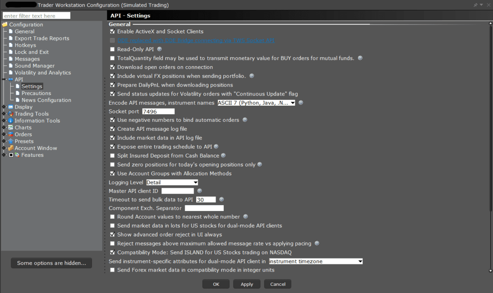
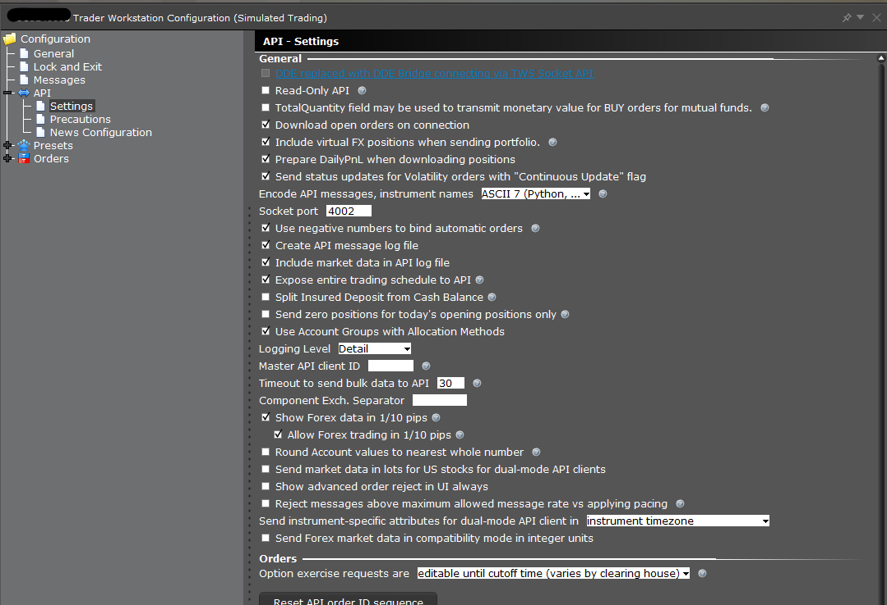

# TWS API DocumentationTWS API 文档

## Troubleshooting & Support / 故障排除与支持

If there are remaining questions about available API functionality after reviewing the content of this documentation, the API Support group is available to help.

在查阅本文档内容后，如果仍有关于可用 API 功能的问题，API 支持小组可以提供帮助。

-> It is important to keep in mind that IB cannot provide programming assistance or give suggestions on how to code custom applications. The API group can review log files which contain a record of communications between API applications and TWS, and give details about what the API can provide.

-> 需要注意的是，IB 不能提供编程协助或给出自定义应用程序的编码建议。API 小组可以审查包含 API 应用程序与 TWS 之间通信记录的日志文件，并说明 API 能提供什么。

General suggestions on starting out with the IB system:

关于开始使用 IB 系统的建议：

- Become familiar with the analogous functionality in TWS before using the API: the TWS API is nothing but a communication channel between your client application and TWS. Each API function has a corresponding tool in TWS. For instance, the market data tick types in the API correspond to watchlist columns in TWS. Any order which can be created in the API can first be created in TWS, and it is recommended to do so. Additionally, if information is not available in TWS, it will not be available in the API. Before using IB Gateway with the API, it is recommended to first become familiar with TWS.
- 在使用 API 之前，先熟悉 TWS 中的类似功能：TWS API 不过是客户端应用程序与 TWS 之间的通信通道。每个 API 函数在 TWS 中都有相应的工具。例如，API 中的市场数据点类型对应 TWS 中的监控列表列。任何可以在 API 中创建的订单都可以先在 TWS 中创建，并且建议这样做。此外，如果 TWS 中不存在信息，API 中也不会有。在使用 API 与 IB Gateway 交互之前，建议先熟悉 TWS。
- Make use of the sample API applications: the sample applications distributed with the API download have examples of essentially every API function in each of the available programming languages. If an issue does not occur in the corresponding sample application, that implies there is a problem with the custom implementation.
- 使用示例 API 应用程序：随 API 下载提供的示例应用程序包含了每种可用编程语言中每个 API 函数的示例。如果在相应的示例应用程序中没有出现问题，那就意味着问题出在自定义实现上。
- Upgrade TWS or IB Gateway periodically: TWS and IB Gateway often have new software releases that have enhancements, and that can sometimes have bug fixes. Because of this, we strongly recommend our users to keep their software as up to date as possible. If you are experiencing a specific problem that is occurring in TWS or IB Gateway and not in the API program, it is likely resolved in the more recent software build.
- 定期升级 TWS 或 IB Gateway：TWS 和 IB Gateway 经常有新的软件版本发布，这些版本通常包含增强功能，有时也会修复一些错误。因此，我们强烈建议用户尽可能保持软件更新。如果你在 TWS 或 IB Gateway 中遇到特定的问题，而 API 程序中没有出现该问题，那么很可能这个问题在更新的软件版本中已经得到解决。

### Log Files / 日志文件

Log files are used by developers and support to unambiguously understand the behavior of a request.

日志文件由开发者和支持人员使用，以明确理解请求的行为。

These files are stored on the clients machine and are only sent to Interactive Brokers by client request.

这些文件存储在客户端机器上，并且只有在客户端请求时才会发送给 Interactive Brokers。

These logs will recycle every 7 days. This would include the current day and the prior 6 days.

这些日志每 7 天会循环一次。这包括当天的日志和之前的 6 天。

#### API Logs / API 日志

TWS and IB Gateway can be configured to create a separate log file which has a record of just communications with API applications. This log is not enabled by default; but needs to be enabled by the Global Configuration setting **“Create API Message Log File”**(picture below).

TWS 和 IB Gateway 可以配置为创建独立的日志文件，该文件仅记录与 API 应用程序的通信。此日志默认情况下未启用；需要通过全局配置设置**“创建 API 消息日志文件”**（下图）来启用。

- API logs contain a record of exchanged messages between API applications and TWS/IB Gateway. Since only API messages are recorded, the API logs are more compact and easier to handle. However they do not contain general diagnostic information about TWS/IBG as the TWS/IBG logs. The TWS/IBG settings folder is by default **C:\Jts** (or IBJts on Mac/Linux). The API logs are named **api.[clientId].[day].log**, where [clientId] corresponds to the Id the client application used to connect to the TWS and [day] to the week day (i.e. api.123.Thu.log).
- API 日志包含 API 应用程序与 TWS/IB Gateway 之间交换消息的记录。由于仅记录 API 消息，因此 API 日志更加紧凑且易于处理。但是，它们不包含 TWS/IBG 日志中的一般诊断信息。默认情况下，TWS/IBG 设置文件夹为 **C:\Jts**（在 Mac/Linux 上为 IBJts）。API 日志的名称为 **api.[clientId].[day].log**，其中 [clientId] 对应客户端应用程序用于连接 TWS 的 ID，[day] 对应星期几（例如 api.123.Thu.log）。
- There is also a setting “Include Market Data in API Log” that will include streaming market data values in the API log file. Historical candlestick data is always recorded in the API log.
- 还有一个设置“在 API 日志中包含市场数据”，它将在 API 日志文件中包含流式市场数据值。历史 K 线数据始终记录在 API 日志中。

**Note**: Both the API and TWS logs are encrypted locally. The API logs can be decrypted for review from the associated TWS or IB Gateway session, just like the TWS logs, as shown in the section describing the Local location of logs.

**注意**：API 和 TWS 日志均本地加密。API 日志可以从关联的 TWS 或 IB Gateway 会话中解密以供查看，就像 TWS 日志一样，正如描述日志本地位置的章节中所示。

**Note**: The TWS/IB Gateway log file setting has to be set to ‘Detail’ level before an issue occurs so that information recorded correctly when it manifests. However due to the high amount of information that will be generated under this level, the resulting logs can grow considerably in size.

**注意**：在问题发生前，TWS/IB Gateway 日志文件设置必须设置为“详细”级别，以便在问题显现时正确记录信息。然而，由于在此级别下将生成大量信息，生成的日志可能会显著增大。

##### Enabling creation of API logs / 启用 API 日志创建

TWS:

1. Navigate to File/Edit → Global Configuration → API → Settings
1. Check the box Create API message log file
1. Set Logging Level to Detail
1. Click Apply and Ok

TWS:

1. 导航至文件/编辑 → 全局配置 → API → 设置
1. 勾选创建 API 消息日志文件
1. 将日志级别设置为详细
1. 点击应用和确定

IB Gateway:

- Navigate to Configure → Settings → API → Settings
- Check the box Create API message log file
- Set Logging Level to Detail
- Click Apply and Ok

IB Gateway:

- 导航至配置 → 设置 → API → 设置
- 勾选创建 API 消息日志文件
- 将日志级别设置为详细
- 点击应用并确定

#### How To Enable Debug Logging / 如何启用调试日志记录

Enabling DEBUG-level logging for the host platform (TWS or IBG, this does not affect API logs):

1. Navigate to the root TWS/IBG installation directory
1. Find jts.ini and open in text editor
1. Put debug=1 under the [Communication] section
1. Reboot TWS/IBG  

为主机平台（TWS 或 IBG，这不会影响 API 日志）启用 DEBUG 级日志记录：

1. 导航至 TWS/IBG 的根安装目录
1. 找到 jts.ini 并在文本编辑器中打开
1. 在[Communication]部分下添加 debug=1
1. 重启 TWS/IBG

Setting debug=1 has added benefits in TWS.

1. Debug=1 also allows you to enter conIds into a watchlist to resolve them into symbols. Type/paste the conId in an empty watchlist row, add |C (vertical bar, capital C) at the end, and press Enter. Example: 265598|C will resolve immediately to AAPL (exchange will be SMART where available, primary otherwise).
1. If the instrument is already present in the watchlist, nothing will happen.
1. Additional detail in the “Description” window for an instrument, normally available by right-clicking on an instrument in a watchlist and selecting Financial Instrument Info >> Description from the context menu. Debug=1 will add the conId, min order sizes, market rules (i.e., min price increments and thresholds), all available order types, and all available exchanges to this interface. Changing the behavior of TWS to bring up that Description window on double-click can make it easier to find.
    1. In TWS, go to Global Configuration >> Display >> Ticker Row
    1. Change “Double-click on Financial Instrument will” dropdown menu to “Open Contract Details”

在 TWS 中设置 debug=1 有额外的优势。

1. debug=1 还允许您将 conIds 输入到观察列表中，以将其解析为符号。在一个空的观察列表行中输入/粘贴 conId，在末尾添加|C（竖线、大写 C），然后按 Enter 键。示例：265598|C 将立即解析为 AAPL（如果可用，交易所将是 SMART，否则是主要交易所）。
1. 如果该工具已存在于观察列表中，则不会发生任何操作。
1. “描述”窗口中关于工具的附加详细信息，通常可通过在观察列表中右键单击工具并从上下文菜单中选择“金融工具信息”>“描述”来获取。Debug=1 将向此界面添加 conId、最小订单大小、市场规则（即最小价格增量阈值）、所有可用订单类型以及所有可用交易所。更改 TWS 的行为，使其在双击时显示该“描述”窗口，可以使其更易于查找。
    1. 在 TWS 中，进入“全局配置”>“显示”>“行情行”
    2. 将“双击金融工具将”下拉菜单更改为“打开合约详细信息”

#### Location of Interactive Brokers Logs / Interactive Brokers 日志位置

Logs are stored in the TWS settings directory, C:\Jts\ and then your user subdirectory by default on a Windows computer (the default can be configured differently on the login screen).

日志默认存储在 TWS 设置目录 C:\Jts\ 下，并在 Windows 计算机的用户子目录中（登录屏幕上可以配置不同的默认路径）。

The path to the log file directory can be found from a TWS or IB Gateway session by using the combination **Ctrl-Alt-U**. This will reveal path such as C:\Jts\detcfsvirl\ (on Windows).

要查找日志文件目录的路径，可以在 TWS 或 IB Gateway 会话中使用 Ctrl-Alt-U 组合键。这会显示类似 C:\Jts\detcfsvirl\ 的路径（在 Windows 上）。

Due to privacy regulations, logs are **encrypted** before they are saved to disk. To review them on your machine, you may need to [Export Your Logs](https://www.interactivebrokers.com/campus/ibkr-api-page/twsapi-doc/#export-logs) from the associated TWS or IB Gateway session.

由于隐私法规，日志在保存到磁盘之前会被加密。要在您的机器上查看它们，您可能需要从相关的 TWS 或 IB Gateway 会话中[导出您的日志](https://www.interactivebrokers.com/campus/ibkr-api-page/twsapi-doc/#export-logs)。

#### How To Delete Logs / 如何删除日志

In some instances, your logs may be too large to export or upload for Client Services to review. In scenarios such as this, the Support team may request that you delete your existing API logs, and then replicate the error before attempting to upload them again.

在某些情况下，您的日志可能太大而无法导出或上传供客户服务团队审核。在这种情况下，支持团队可能会要求您删除现有的 API 日志，然后在尝试再次上传之前重现错误。

To delete your logs:

1. [Locate your Logs](https://www.interactivebrokers.com/campus/ibkr-api-page/twsapi-doc/#log-location).  
1. Exit TWS or IB Gateway session by clicking “File” and “Exit”.
1. In your terminal or window explorer, navigate to your user subdirectory.
1. Once in the directory, select the files labeled like “api.0.20250110.105733.ibgzenc”, “tws.20250110.105733.ibgzenc” or “ibgateway.20250110.105733.ibgzenc” and press the “Delete” key on your keyboard, or type ‘del {filename}’ into your terminal.

要删除您的日志：

1. [定位您的日志](https://www.interactivebrokers.com/campus/ibkr-api-page/twsapi-doc/#log-location)。
1. 通过点击“文件”和“退出”来退出 TWS 或 IB Gateway 会话。
1. 在你的终端或窗口资源管理器中，导航到你的用户子目录。
1. 进入目录后，选择标有“api.0.20250110.105733.ibgzenc”、“tws.20250110.105733.ibgzenc”或“ibgateway.20250110.105733.ibgzenc”的文件，并按下键盘上的“Delete”键，或在终端中输入“del {filename}”。

#### Uploading Logs / 上传日志

If API logging has been enabled with the setting “Create API Message Log” during the time when an issue occurs, it can be uploaded to the API group.

如果在问题发生时启用了 API 日志记录功能（通过“创建 API 消息日志”设置），则可以将日志上传至 API 组。

**Important**: Please be aware that the process of uploading logs does not notify support, nor is a ticket logged. You will need to contact our representatives through a direct call, chat, or secure message center message for our representatives to be aware of the upload.

重要提示：请注意，上传日志的过程不会通知支持团队，也不会创建工单。您需要通过直接电话、聊天或安全消息中心消息联系我们的代表，以便他们知晓日志已上传。

To upload logs as a Windows user:

1. In TWS or IB Gateway, press CTRL+ALT+H to bring up the Upload Diagnostics window.
1. In the “reason” text field, please type the reason for your upload.
    1. Alternatively, type “ATTENTION: ” and then the ticket number you are working with, or the name of your customer service representative.
1. Find the small arrow in the upper right corner, click it and select “Advanced View”
1. Make sure “Full internal state of the application” is checked
1. Make sure “Include previous days logs and settings” is unchecked, unless the error happened on a prior day.
1. Click Submit

作为 Windows 用户上传日志：

1. 在 TWS 或 IB Gateway 中，按下 CTRL+ALT+H 以打开上传诊断窗口。
1. 在“原因”文本框中，请输入您上传的原因。
    1. 或者，输入“注意：”然后是您正在处理的问题编号，或您客服代表的姓名。
1. 在右上角找到小箭头，点击它并选择“高级视图”
1. 确保“应用程序的完整内部状态”已被勾选
1. 确保“包含前几天的日志和设置”未被勾选，除非错误发生在前一天。
1. 点击提交

If logs have been uploaded, please let the API Support group know by **creating a webticket** in the Message Center in Account Management (under Support) indicating the **username** of the associated TWS session. In some cases a TWS log may also be requested at the Detailed logging level. The TWS log can grow quite large and may not be uploadable by the automatic method; in this case an alternative means of upload can be found.

如果已上传日志，请通过在账户管理（支持）中的消息中心创建网络工单，通知 API 支持小组，并注明相关 TWS 会话的用户名。在某些情况下，在详细日志级别下也可能需要 TWS 日志。TWS 日志可能会变得相当大，可能无法通过自动方法上传；在这种情况下，可以找到其他上传方式。

#### Exporting Logs / 导出日志

1. In TWS, navigate to Help menu >> Troubleshooting >> Diagnostics >> “API Logs” or “TWS Logs”.

    在 TWS 中，导航至帮助菜单 >> 故障排除 >> 诊断 >> “API 日志”或“TWS 日志”。

1. In IBG, both “API Logs” and “Gateway Logs” are accessible directly from the File menu.

    在 IBG 中，“API 日志”和“网关日志”可以直接从文件菜单访问。

1. Click “Export Today Logs…” to decrypt the logs and save them in plaintext (logs are stored encrypted on your local machine)

    点击“导出今日日志…”以解密日志并以明文格式保存（日志在您的本地机器上以加密形式存储）

#### Reading Exported Logs / 阅读导出的日志

Each supported API language of the API contains a message file that translates a given number identifier into their corresponding request. The message identifier numbers used in the underlying wire protocol is the core of the TWS API.

每个支持的 API 语言都包含一个消息文件，该文件将给定的数字标识符翻译成相应的请求。底层网络协议中使用的消息标识符数字是 TWS API 的核心。

The information on the right documents where each message reader file is located. The {TWS API} listed is the path to the primary TWS API or JTS folder created from the API installation.

右侧文档中显示了每个消息读取文件的位置信息。列出的{TWS API}是 API 安装创建的主要 TWS API 或 JTS 文件夹的路径。

By default, this will be saved directly on the C: drive.

默认情况下，这将直接保存在 C:驱动器上。

=== "python"

    Both the Incoming and Outgoing message IDs are listed in one file.

    接收和发送消息的 ID 都列在同一个文件中。

    {TWS API}\source\pythonclient\ibapi\messages.py

    In our API logs, the direction of the message is indicated by the arrow at the beginning:

    在我们的 API 日志中，消息的方向由开头的箭头指示：

    -> for incoming messages (TWS to client)

    -> 用于传入消息（TWS 到客户端）

    <- for outgoing messages (client to TWS)

    <- 对于外发消息（客户端到 TWS）

    Thus  <- 3 (outgoing request of type 3) is a placeOrder request, and the subsequent incoming requests are:

    因此 <- 3（类型 3 的外发请求）是一个 placeOrder 请求，后续的入站请求是：

    -> 5 = openOrder response

    -> 5 = 开市订单响应

    -> 11 = executionData response

    -> 11 = 执行数据响应

    -> 59 = commissionReport response

    -> 59 = 佣金报告响应

    Also note that the first openOrder response carries with it an orderStatus response in the same message. If that status were to change later, it would be delivered as a standalone message:

    此外，请注意第一个开市订单响应在同一消息中附带了一个订单状态响应。如果该状态后来发生变化，它将作为独立消息发送：

    -> 3 = orderStatus response

    -> 3 = 订单状态响应

### Unset Values / 未设置值

Developers may often find a super-massive value returned from requests like market data, P&L information, and elsewhere. These are known as Unset values. Unset values are used throughout programming systems to indicate that a value is not available. Unset values are used in place of NULL characters to prevent any unexpected error be thrown in your code. Unset values are also used in place of values like 0 to avoid confusing viewers to believe they have an account balance of 0, or that an equity is worth $0.

开发者经常会在市场数据、盈亏信息等请求中返回一个超级巨大的值。这些值被称为未设置值。未设置值在编程系统中用于表示某个值不可用。未设置值用于替代空字符，以防止代码中抛出任何意外错误。未设置值也用于替代 0 等值，以避免让用户误以为账户余额为 0，或某项资产价值为 0 美元。

An unset value is the maximum value of a given data type. So the Unset Double value will appear like 1.7976931348623157E308, which contains approximately 308 digits to intentionally appear extraneous.

未设置值是给定数据类型的最大值。因此，未设置的双精度浮点值将显示为 1.7976931348623157E308，其中包含约 308 位数字，故意使其看起来不必要。
